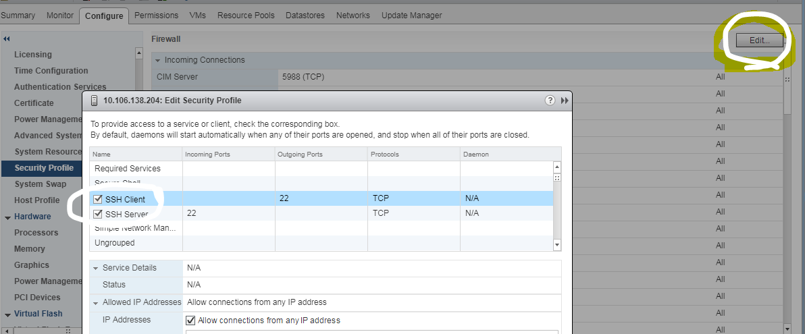

# esxi关闭防火墙

esxi关闭防火墙

Sunday, February 05, 2017

6:43 PM

esxcli network firewall set -e false

或者

esxcli network firewall set --enabled false

**Enable SSH from the vSphere Web Client**

By default, remote command execution is disabled on an ESXi host, and you cannot log in to the host by using a remote shell. You can enable remote command execution from the direct console or from the vSphere Web Client.

Procedure

[Untitled](esxi_disable_firewall/Untitled%20Database%20b4bd1b7fc1784ad6a7ccda47e359bc1d.csv)

