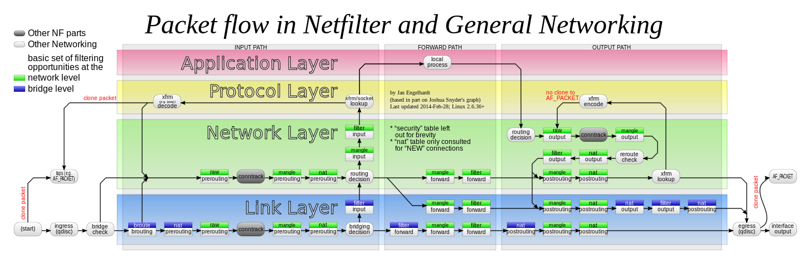

# iptables

iptables

2014年7月25日

10:13

<<数据包进入iptables处理流程图.edx>>

防火墙的简介

防火墙是指设置在不同网络或网络安全域之间的一系列部件的组合，它能增强机构内部网络的安全性。它通过访问控制机制，确定哪些内部服务允许外部访问，以及允许哪些外部请求可以访问内部服务。它可以根据网络传输的类型决定IP包是否可以传进或传出内部网。

防火墙通过审查经过的每一个数据包，判断它是否有相匹配的过滤规则，根据规则的先后顺序进行一一比较，直到满足其中的一条规则为止，然后依据控制机制做出相应的动作。如果都不满足，则将数据包丢弃，从而保护网络的安全。

防火墙可以被认为是这样一对机制：一种机制是拦阻传输流通行，另一种机制是允许传输流通过。一些防火墙偏重拦阻传输流的通行，而另一些防火墙则偏重允许传输流通过。

通过使用防火墙可以实现以下功能：可以保护易受攻击的服务；控制内外网之间网络系统的访问；集中管理内网的安全性，降低管理成本；提高网络的保密性和私有性；记录网络的使用状态，为安全规划和网络维护提供依据。

现在防火墙主要分以下三种类型：包过滤、应用代理、状态检测

包过滤防火墙：现在静态包过滤防火墙市面上已经看不到了，取而代之的是动态包过滤技术的防火墙

代理防火墙：因一些特殊的报文攻击可以轻松突破包过滤防火墙的保护，比如大家知道的SYN攻击、ICMP洪水攻击,所以以代理服务器作为专门为用户保密或者突破访问限制的数据转发通道的应用代理防火墙出现了，其使用了一种应用协议分析的新技术。

状态检测防火墙：其基于动态包过滤技术发展而来，加入了一种状态检测的模块，进一点发展了会话过滤功能，会话状态的保留是有时间限制的，此防火墙还可以对包的内容进行分析，从而避免开放过多的端口。

netfilter/iptables（简称为iptables）组成Linux平台下的包过滤防火墙，与大多数的Linux软件一样，这个包过滤防火墙是免费的，它可以代替昂贵的商业防火墙解决方案，完成封包过滤、封包重定向和网络地址转换（NAT）等功能。

netfilter是Linux核心中的一个通用架构，其提供了一系列的表（tables）,每个表由若干个链（chains）组成，而每条链可以由一条或若干条规则（rules）组成。实际上netfilter是表的容器，表是链的容器，而链又是规则的容器。

规则（rules）其实就是网络管理员预定义的条件，规则一般的定义为“如果数据包头符合这样的条件，就这样处理这个数据包”。规则存储在内核空间的信息包过滤表中，这些规则分别指定了源地址、目的地址、传输协议（如TCP、UDP、ICMP）和服务类型（如HTTP、FTP和SMTP）等。当数据包与规则匹配时，iptables就根据规则所定义的方法来处理这些数据包，如放行（accept）、拒绝（reject）和丢弃（drop）等。配置防火墙的主要工作就是添加、修改和删除这些规则。

链（chains）是数据包传播的路径，每一条链其实就是众多规则中的一个检查清单，每一条链中可以有一条或数条规则。当一个数据包到达一个链时，iptables就会从链中第一条规则开始检查，看该数据包是否满足规则所定义的条件。如果满足，系统就会根据该条规则所定义的方法处理该数据包；否则iptables将继续检查下一条规则，如果该数据包不符合链中任一条规则，iptables就会根据该链预先定义的默认策略来处理数据包。

表（tables）提供特定的功能，iptables内置了4个表，即filter表、nat表、mangle表和raw表，分别用于实现包过滤，网络地址转换、包重构(或叫修改，或叫矫正，用于流控和QoS)和数据跟踪处理。

查看各个表：

raw表：# iptables -t raw -L -n

mangle表：# iptables -t mangle -L -n

nat表： # iptables -t nat -L -n

filter表： # iptables -t filter -L -n

总结iptables基本概念：

匹配（match）：符合指定的条件，比如指定的 IP 地址和端口。

丢弃（drop）：当一个包到达时，简单地丢弃，不做其它任何处理。

接受（accept）：和丢弃相反，接受这个包，让这个包通过。

拒绝（reject）：和丢弃相似，但它还会向发送这个包的源主机发送错误消息。这个错误消息可以指定，也可以自动产生。

目标（target）：指定的动作，说明如何处理一个包，比如：丢弃，接受，或拒绝。

跳转（jump）：和目标类似，不过它指定的不是一个具体的动作，而是另一个链，表示要跳转到那个链上。

规则（rule）：一个或多个匹配及其对应的目标。

链（chain）：每条链都包含有一系列的规则，这些规则会被依次应用到每个遍历该链的数据包上。每个链都有各自专门的用途， 这一点我们下面会详细讨论。

表（table）：每个表包含有若干个不同的链，比如 filter 表默认包含有 INPUT，FORWARD，OUTPUT 三个链。iptables有四个表，分别是：raw，nat，mangle和filter，每个表都有自己专门的用处，比如最常用filter表就是专门用来做包过滤的，而 nat 表是专门用来做NAT的。

策略（police）：我们在这里提到的策略是指，对于 iptables 中某条链，当所有规则都匹配不成功时其默认的处理动作。

连接跟踪（connection track）：又称为动态过滤，可以根据指定连接的状态进行一些适当的过滤，是一个很强大的功能，但同时也比较消耗内存资源。

iptables内置链：

PREROUTING:数据包进入路由表之前

INPUT:通过路由表后目的地为本机

FORWARDING:通过路由表后，目的地不为本机

OUTPUT:由本机产生，向外转发

POSTROUTIONG:发送到网卡接口之前

netfilter五条链相互关系，即iptables数据包转发流程图

经过iptables的数据包的流程介绍

一个数据包到达时,是怎么依次穿过各个链和表的（图）。

raw->mangle->nat->filter

prerouting->input->output->postrouting

prerouting->forward->postrouting

raw: prerouting | output

mangle: prerouting | input | output | forward | postrouting

nat: prerouting | output | postrouting

filter: input | output | forward

小总结：

1 进入iptables的prerouting阶段，要经过raw->mangle->nat三个表

2 然后不论是进入本机的还是被路由的，都要经过mangle和filter表，差别是进入本机的话是进入的是input，而如果是路由的话是进入forward

3 如果是进入本机的话，还要吐给output，所有的表都有output链

4 结尾的postrouting只有mangle和nat表

数据包进入iptables处理流程图见附件

基本步骤如下：

1. 数据包到达网络接口，比如 eth0。

2. 进入 raw 表的 PREROUTING 链，这个链的作用是赶在连接跟踪之前处理数据包。

3. 如果进行了连接跟踪，在此处理。

4. 进入 mangle 表的 PREROUTING 链，在此可以修改数据包，比如 TOS 等。

5. 进入 nat 表的 PREROUTING 链，可以在此做DNAT，但不要做过滤。

6. 决定路由，看是交给本地主机还是转发给其它主机。

到了这里我们就得分两种不同的情况进行讨论了，一种情况就是数据包要转发给其它主机，这时候它会依次经过：

7. 进入 mangle 表的 FORWARD 链，这里也比较特殊，这是在第一次路由决定之后，在进行最后的路由决定之前，我们仍然可以对数据包进行某些修改。

8. 进入 filter 表的 FORWARD 链，在这里我们可以对所有转发的数据包进行过滤。需要注意的是：经过这里的数据包是转发的，方向是双向的。

9. 进入 mangle 表的 POSTROUTING 链，到这里已经做完了所有的路由决定，但数据包仍然在本地主机，我们还可以进行某些修改。

10. 进入 nat 表的 POSTROUTING 链，在这里一般都是用来做 SNAT ，不要在这里进行过滤。

11. 进入出去的网络接口。完毕。

另一种情况是，数据包就是发给本地主机的，那么它会依次穿过：

7. 进入 mangle 表的 INPUT 链，这里是在路由之后，交由本地主机之前，我们也可以进行一些相应的修改。

8. 进入 filter 表的 INPUT 链，在这里我们可以对流入的所有数据包进行过滤，无论它来自哪个网络接口。

9. 交给本地主机的应用程序进行处理。

10. 处理完毕后进行路由决定，看该往那里发出。

11. 进入 raw 表的 OUTPUT 链，这里是在连接跟踪处理本地的数据包之前。

12. 连接跟踪对本地的数据包进行处理。

13. 进入 mangle 表的 OUTPUT 链，在这里我们可以修改数据包，但不要做过滤。

14. 进入 nat 表的 OUTPUT 链，可以对防火墙自己发出的数据做 NAT 。

15. 再次进行路由决定。

16. 进入 filter 表的 OUTPUT 链，可以对本地出去的数据包进行过滤。

17. 进入 mangle 表的 POSTROUTING 链，同上一种情况的第9步。注意，这里不光对经过防火墙的数据包进行处理，还对防火墙自己产生的数据包进行处理。

18. 进入 nat 表的 POSTROUTING 链，同上一种情况的第10步。

19. 进入出去的网络接口。完毕。

关于自定义表

自定义表应该是在filter表之后生效

iptables命令格式

iptables的命令格式较为复杂，一般的格式如下：

iptables [-t table] 命令 [chain] [rules] [-j target]

table——指定表明

命令——对链的操作命令

chain——链名

rules——规则

target——动作如何进行

1．表选项

表选项用于指定命令应用于哪个iptables内置表，iptables内置包括filter表、nat表、mangle表和raw表。

2．命令选项iptables命令格式

命令                     说明

- P或--policy <链名> 定义默认策略
- L或--list <链名> 查看iptables规则列表
- A或--append <链名> 在规则列表的最后增加1条规则
- I或--insert <链名> 在指定的位置插入1条规则
- D或--delete <链名> 从规则列表中删除1条规则
- R或--replace <链名> 替换规则列表中的某条规则
- F或--flush <链名> 删除表中所有规则
- Z或--zero <链名> 将表中数据包计数器和流量计数器归零

3．匹配选项

匹配                                     说明

- i或--in-interface <网络接口名> 指定数据包从哪个网络接口进入，如ppp0、eth0和eth1等
- o或--out-interface <网络接口名> 指定数据包从哪块网络接口输出，如ppp0、eth0和eth1等
- p或--proto协议类型 < 协议类型> 指定数据包匹配的协议，如TCP、UDP和ICMP等
- s或--source <源地址或子网> 指定数据包匹配的源地址
- -sport <源端口号> 指定数据包匹配的源端口号，可以使用“起始端口号:结束端口号”的格式指定一个范围的端口
- d或--destination <目标地址或子网> 指定数据包匹配的目标地址
- -dport目标端口号 指定数据包匹配的目标端口号，可以使用“起始端口号:结束端口号”的格式指定一个范围的端口

4．动作选项

动作        说明

ACCEPT        接受数据包

DROP        丢弃数据包

REDIRECT   与DROP基本一样，区别在于它除了阻塞包之外， 还向发送者返回错误信息。

SNAT        源地址转换，即改变数据包的源地址

DNAT        目标地址转换，即改变数据包的目的地址

MASQUERADE IP伪装，即是常说的NAT技术，MASQUERADE只能用于ADSL等拨号上网的IP伪装，也就是主机的IP是由ISP分配动态的；如果主机的IP地址是静态固定的，就要使用SNAT

LOG        日志功能，将符合规则的数据包的相关信息记录在日志中，以便管理员的分析和排错

iptables命令格式（图5）

iptables过滤条件（图6）

iptables的语法

1．定义默认策略

当数据包不符合链中任一条规则时，iptables将根据该链预先定义的默认策略来处理数据包，默认策略的定义格式如下。

iptables  [-t表名] <-P> <链名> <动作> 参数说明如下。

[-t表名]：指默认策略将应用于哪个表，可以使用filter、nat和mangle，如果没有指定使用哪个表，iptables就默认使用filter表。

<-P>：定义默认策略。

<链名>：指默认策略将应用于哪个链，可以使用INPUT、OUTPUT、FORWARD、PREROUTING、OUTPUT和POSTROUTING。

<动作>：处理数据包的动作，可以使用ACCEPT（接受数据包）和DROP（丢弃数据包）。

2．查看iptables规则

查看iptables规则的命令格式为：

iptables  [-t表名] <-L> [链名]

参数说明如下。

[-t表名]：指查看哪个表的规则列表，表名用可以使用filter、nat和mangle，如果没有指定使用哪个表，iptables就默认查看filter表的规则列表。

<-L>：查看指定表和指定链的规则列表。

[链名]：指查看指定表中哪个链的规则列表，可以使用INPUT、OUTPUT、FORWARD、PREROUTING、OUTPUT和POSTROUTING，如果不指明哪个链，则将查看某个表中所有链的规则列表。

3．增加、插入、删除和替换规则

相关规则定义的格式为：

iptables  [-t表名]  <-A | I | D | R> 链名 [规则编号] [-i | o 网卡名称] [-p 协议类型] [-s 源IP地址 | 源子网] [--sport 源端口号] [-d目标IP地址 | 目标子网] [--dport目标端口号] <-j动作>

参数说明如下。

[-t表名]：定义默认策略将应用于哪个表，可以使用filter、nat和mangle，如果没有指定使用哪个表，iptables就默认使用filter表。

- A：新增加一条规则，该规则将会增加到规则列表的最后一行，该参数不能使用规则编号。
- I：插入一条规则，原本该位置上的规则将会往后顺序移动，如果没有指定规则编号，则在第一条规则前插入。
- D：从规则列表中删除一条规则，可以输入完整规则，或直接指定规则编号加以删除。
- R：替换某条规则，规则被替换并不会改变顺序，必须要指定替换的规则编号。

<链名>：指定查看指定表中哪个链的规则列表，可以使用INPUT、OUTPUT、FORWARD、PREROUTING、OUTPUT和POSTROUTING。

[规则编号]：规则编号用于插入、删除和替换规则时用，编号是按照规则列表的顺序排列，规则列表中第一条规则的编号为1。

[-i | o 网卡名称]：i是指定数据包从哪块网卡进入，o是指定数据包从哪块网卡输出。网卡名称可以使用ppp0、eth0和eth1等。

[-p 协议类型]：可以指定规则应用的协议，包含TCP、UDP和ICMP等。

[-s 源IP地址 | 源子网]：源主机的IP地址或子网地址。

[--sport 源端口号]：数据包的IP的源端口号。

[-d目标IP地址 | 目标子网]：目标主机的IP地址或子网地址。

[--dport目标端口号]：数据包的IP的目标端口号。

<-j动作>：处理数据包的动作，各个动作的详细说明可以参考前面的说明。

4．清除规则和计数器

在新建规则时，往往需要清除原有的、旧的规则，以免它们影响新设定的规则。如果规则比较多，一条条删除就会十分麻烦， ?这时可以使用iptables提供的清除规则参数达到快速删除所有的规则的目的。

定义参数的格式为：

iptables  [-t表名] <-F | Z>

参数说明如下。

[-t表名]：指定默认策略将应用于哪个表，可以使用filter、nat和mangle，如果没有指定使用哪个表，iptables就默认使用filter表。

- F：删除指定表中所有规则。
- Z：将指定表中的数据包计数器和流量计数器归零。

NAT的定义

NAT英文全称是Network Address Translation，称是网络地址转换，它是一个IETF标准，允许一个机构以一个地址出现在Internet上。NAT将每个局域网节点的地址转换成一个IP地址，反之亦然。它也可以应用到防火墙技术里，把个别IP地址隐藏起来不被外界发现，使外界无法直接访问内部网络设备，同时，它还帮助网络可以超越地址的限制，合理地安排网络中的公有Internet 地址和私有IP地址的使用。

NAT的类型

静态NAT(Static NAT)

静态NAT设置起来最为简单和最容易实现的一种，内部网络中的每个主机都被永久映射成外部网络中的某个合法的地址。

动态地址NAT(Pooled NAT)

动态地址NAT是在外部网络中定义了一系列的合法地址，采用动态分配的方法映射到内部网络。

动态地址NAT只是转换IP地址，它为每一个内部的IP地址分配一个临时的外部IP地址，主要应用于拨号，对于频繁的远程联接也可以采用动态NAT。

网络地址端口转换NAPT（Port－Level NAT）

NAPT是把内部地址映射到外部网络的一个IP地址的不同端口上。

最熟悉的一种转换方式。NAPT普遍应用于接入设备中，它可以将中小型的网络隐藏在一个合法的IP地址后面。NAPT与动态地址NAT不同，它将内部连接映射到外部网络中的一个单独的IP地址上，同时在该地址上加上一个由NAT设备选定的TCP端口号。

iptables实例

禁止客户机访问不健康网站

【例1】添加iptables规则禁止用户访问域名为www.sexy.com的网站。

iptables -I FORWARD -d [www.sexy.com](http://www.sexy.com/) -j DROP

【例2】添加iptables规则禁止用户访问IP地址为20.20.20.20的网站。

iptables -I FORWARD -d 20.20.20.20 -j DROP

禁止某些客户机上网

【例1】添加iptables规则禁止IP地址为192.168.1.X的客户机上网。

iptables -I FORWARD -s 192.168.1.X -j DROP

【例2】添加iptables规则禁止192.168.1.0子网里所有的客户机上网。

iptables -I FORWARD -s 192.168.1.0/24 -j DROP

禁止客户机访问某些服务

【例1】禁止192.168.1.0子网里所有的客户机使用FTP协议下载。

iptables -I FORWARD -s 192.168.1.0/24 -p tcp --dport 21 -j DROP

【例2】禁止192.168.1.0子网里所有的客户机使用Telnet协议连接远程计算机。

iptables -I FORWARD -s 192.168.1.0/24 -p tcp --dport 23 -j DROP

强制访问指定的站点

【例】强制所有的客户机访问192.168.1.x这台Web服务器。

iptables -t nat -I PREROUTING -i eth0 -p tcp --dport 80 -j DNAT --to-destination 192.168.1.x:80

禁止使用ICMP协议

【例】禁止Internet上的计算机通过ICMP到NAT服务器的ppp0接口，但允许内网的客户机通过ICMP协议ping的计算机。

iptables -I INPUT -i ppp0 -p icmp -j DROP

发布内部网络服务器

【例1】发布内网10.0.0.3主机的Web服务，Internet用户通过访问防火墙的IP地址即可访问该主机的Web服务。

iptables -t nat -I PREROUTING -p tcp --dport 80 -j DNAT –to-destination 10.0.0.3:80

【例2】发布内网10.0.0.3主机的终端服务（使用的是TCP协议的3389端口），Internet用户通过访问防火墙的IP地址访问该机的终端服务。

iptables -t nat -I PREROUTING -p tcp --dport 3389 -j DNAT –to-destination 10.0.0.3:3389

一些用法和例子

参数 --tcp-flag

匹配指定的TCP标记。有两个参数，它们都是列表，列表内部用英文的逗号作分隔符，这两个列表之间用空格分开。第一个参数指定我们要检查的标记（作用就象掩码），第二个参数指定“在第一个列表中出现过的且必须被设为1（即状态是打开的）的”标记（第一个列表中出现的其他的标记必须置0）。也就是说，第一个参数提供检查范围，第二个参数提供被设置的条件（就是哪些位置1）。这个匹配操作可以识别以下标记：SYN， ACK，FIN，RST ，URG，PSH。另外还有两个词也可使用，就是ALL和NONE。顾名思义，ALL是指选定所有的标记，NONE是指未选定任何标记。这个匹配也可在参数前加英文的感叹号表示取反。例如：

1、iptables -p tcp --tcp-flags SYN,FIN,ACK SYN表示匹配那些SYN标记被设置而FIN和ACK标记没有设置的包，注意各标记之间只有一个逗号而没有空格。 （防止syn flood攻击）

2、--tcp-flags ALL NONE匹配所有标记都未置1的包。

3、iptables -p tcp --tcp-flags ! SYN,FIN,ACK SYN表示匹配那些FIN和ACK标记被设置而SYN标记没有设置的包，注意和例1比较一下。

参数： --syn

iptables -A INPUT ! --syn -j ACCEPT

说明：只允许非syn标志的数据包进入

参数：-m multiport --source-port/--destination-port 22,80,53

iptables -A INPUT -p tcp -m multiport --destination-prot 22,80,53 -j ACCEPT

说明： 对比多个不连续的目的端口号

参数： -m limit --limit

iptables -A INPUT　-m limit --limit 3/hour

说明： 用来对比某段时间内封包的平均数量 每小时3个封包

除了每小时平均次外，也可以每秒钟、每分钟或每天平均一次，默认值为每小时平均一次，参数如后： /second、 /minute、/day。 除了进行封数量的比对外，设定这个参数也会在条件达成时，暂停封包的比对动作，以避免因骇客使用洪水攻击法，导致服务被阻断。

参数：-m limit --limit-burst

iptables -A INPUT　-m limit --limit-burst 5

说明：用来比对瞬间大量封包的数量，上面的例子是用来比对一次同时涌入的封包是否超过 5 个（这是默认值），超过此上限的封将被直接丢弃。使用效果同上。

参数：-m mac --mac-source

iptables -A INPUT　-m mac --mac-source 00:0d:00:0f:0a:01

说明：用来比对封包来源网络接口的硬件地址，这个参数不能用在 OUTPUT 和 Postrouting 规则炼上，这是因为封包要送出到网后，才能由网卡驱动程序透过 ARP 通讯协议查出目的地的 MAC 地址，所以 iptables 在进行封包比对时，并不知道封包会送到

个网络接口去。

参数： -m state --m-state

iptables -A INPUT　 -p tcp -m state --m-state RELEATED,ESTABLISHED -j ACCEPT

说明：对比联机状态

联机状态共有四种：INVALID、ESTABLISHED、NEW 和 RELATED。

INVALID 表示该封包的联机编号（Session ID）无法辨识或编号不正确。

ESTABLISHED 表示该封包属于某个已经建立的联机。

NEW 表示该封包想要起始一个联机（重设联机或将联机重导向）。

RELATED 表示该封包是属于某个已经建立的联机，所建立的新联机。例如：FTP-DATA 联机必定是源自某个 FTP 联机。

参数：-j

说明：用来指定要进行的处理动作，常用的处理动作包括：ACCEPT、REJECT、DROP、REDIRECT、MASQUERADE、LOG、DNAT、SNAT、MIRROR、QUEUE、RETURN、MARK，分别说明如下：

ACCEPT 将封包放行，进行完此处理动作后，将不再比对其它规则，直接跳往下一个规则炼（natostrouting）。

REJECT 拦阻该封包，并传送封包通知对方，可以传送的封包有几个选择：ICMP port-unreachable、ICMP echo-reply 或是 tcp-reset（这个封包会要求对方关闭联机），进行完此处理动作后，将不再比对其它规则，直接 中断过滤程序。 范例如下：

iptables -A FORWARD -p TCP --dport 22 -j REJECT --reject-with tcp-reset

DROP 丢弃封包不予处理，进行完此处理动作后，将不再比对其它规则，直接中断过滤程序。

REDIRECT 将封包重新导向到另一个端口（PNAT），进行完此处理动作后，将 会继续比对其它规则。 这个功能可以用来实作通透式porxy 或用来保护 web 服务器。例如：iptables -t nat -A PREROUTING -p tcp --dport 80 -j REDIRECT --to-ports 8080

MASQUERADE 改写封包来源 IP 为防火墙 NIC IP，可以指定 port 对应的范围，进行完此处理动作后，直接跳往下一个规则（mangleostrouting）。这个功能与 SNAT 略有不同，当进行 IP 伪装时，不需指定要伪装成哪个 IP，IP 会从网卡直接读，当使用拨接连线时，IP 通常是由 ISP 公司的 DHCP 服务器指派的，这个时候 MASQUERADE 特别有用。范例如下：

iptables -t nat -A POSTROUTING -p TCP -j MASQUERADE --to-ports 1024-31000

LOG 将封包相关讯息纪录在 /var/log 中，详细位置请查阅 /etc/syslog.conf 组态档，进行完此处理动作后，将会继续比对其规则。例如：

iptables -A INPUT -p tcp -j LOG --log-prefix "INPUT packets"

SNAT 改写封包来源 IP 为某特定 IP 或 IP 范围，可以指定 port 对应的范围，进行完此处理动作后，将直接跳往下一个规则（mangleostrouting）。范例如下：

iptables -t nat -A POSTROUTING -p tcp-o eth0 -j SNAT --to-source 194.236.50.155-194.236.50.160:1024-32000

DNAT 改写封包目的地 IP 为某特定 IP 或 IP 范围，可以指定 port 对应的范围，进行完此处理动作后，将会直接跳往下一个规炼（filter:input 或 filter:forward）。范例如下：

iptables -t nat -A PREROUTING -p tcp -d 15.45.23.67 --dport 80 -j DNAT --to-destination 192.168.1.1-192.168.1.10:80-100

MIRROR 镜射封包，也就是将来源 IP 与目的地 IP 对调后，将封包送回，进行完此处理动作后，将会中断过滤程序。

QUEUE 中断过滤程序，将封包放入队列，交给其它程序处理。透过自行开发的处理程序，可以进行其它应用，例如：计算联机费.......等。

RETURN 结束在目前规则炼中的过滤程序，返回主规则炼继续过滤，如果把自订规则炼看成是一个子程序，那么这个动作，就相当提早结束子程序并返回到主程序中。

MARK 将封包标上某个代号，以便提供作为后续过滤的条件判断依据，进行完此处理动作后，将会继续比对其它规则。范例如下：

iptables -t mangle -A PREROUTING -p tcp --dport 22 -j MARK --set-mark 2

封堵视频网站的例子：

iptables -A FORWARD  -m string –string “ku6.com” –algo bm -j DROP

iptables -A FORWARD  -m string –string “tudou.com” –algo bm -j DROP

iptables -A FORWARD  -m string –string “ouou.com” –algo bm -j DROP

…

…

其中各项参数的意义如下：

- A FORWARD

增加FORWARD链的规则，由于我启用了路由功能（即：echo 1 >  /proc/sys/net/ipv4/ip_forward），所以所有的包从FORWARD链规则走了，而是直接访问所使用的INPUT或OUTPUT。

- m string

使用string功能，string是iptables的一个module，也就是做字符串匹配的。

–string “xxxx”

定义字符串内容，可以是URL里任意字符，如果是需要block下载某些类型的文件或请求，这个有很大的发挥空间，可自由想象喔。

–algo bm

设置字符匹配的查询算法，一般默认使用bm算法效果就可以了，另外还可以设置kmp算法，那是一种更复杂的算法，详细内容可自行参见高等数学里的资料。（bm = Boyer-Moore, kmp = Knuth-Pratt-Morris）

- j DROP

设置符合此条件的包的处理方式，DROP即是丢弃，也是reject的意思。

其它：我没有设置-p的参数，那么默认就包括所有协议的package处理。如果需要的话，也可以针对性对设置-p tcp或-p udp等等指定协议种类。如果有必要，我想也可以针对这个应用放到对im软件、p2p软件的一些目标的过滤。

优点：这种方式的优点是效率高，几乎不占用多余系统资源，而有些硬件路由器里集成的URL过滤功能经常会造成系统死机。

缺点：设置目标过于单一，对于分散型URL无法处理，不支持对正则表达式的匹配。