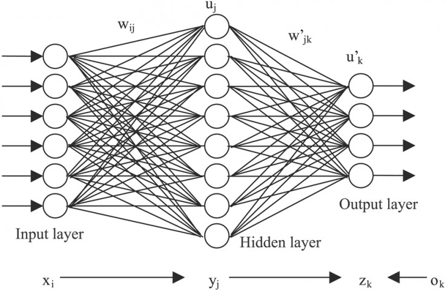

# 入门资料汇总

入门资料汇总

Saturday, March 30, 2019

9:08 PM

作为人工智能领域一个重要的研究分支，深度学习技术几乎出现在当下所有热门的AI应用领域，包括语音识别，语义理解，图像识别，大数据分析等等，甚至有人把当前的人工智能等同于深度学习。面对如此重要的江湖地位，我们相信一定有为数众多的 AI 开发者对深度学习技术充满了好奇心，想要快速着手使用这项强大的技术来解决现实生活中的实际问题。因此，雷锋网将围绕深度学习技术整理一个系列文章，全面覆盖与其相关的各项知识点。

本文针对如何入门深度学习这一话题，整理了若干参考资料，希望对广大开发者有所裨益。

需要提前说明的是，无论教程怎样浅显易懂，如果要深刻理解深度学习的技术原理，一些基础的数学知识还是必不可少的，包括微积分、线性代数和概率论等。这些都是各高校的必修课，大家可以轻松找到丰富的中文教程。这里仅列出三个值得参考的免费的英文教程。

MIT本科线性代数公开课

链接：[https://ocw.mit.edu/courses/mathematics/18-06sc-linear-algebra-fall-2011/index.htm](https://ocw.mit.edu/courses/mathematics/18-06sc-linear-algebra-fall-2011/index.htm)

MIT微积分公开课

链接：[https://www.edx.org/course/calculus-1a-differentiation-mitx-18-01-1x](https://www.edx.org/course/calculus-1a-differentiation-mitx-18-01-1x)

MIT概率论公开课

链接：[https://www.edx.org/course/introduction-probability-science-mitx-6-041x-2](https://www.edx.org/course/introduction-probability-science-mitx-6-041x-2)

当然，大家也可以在 coursera 和各种慕课类网站挑选自己喜欢的数学基础课程，此处不再赘述。

下面进入本文的正题。

要入门深度学习，首选的一个教程是来自台湾大学电机系李宏毅教授的演讲 PPT。该 PPT 共计301页，源于 IEEE DSC 2016 系列活动，当时打出的标题是“一天搞懂深度学习”。该课程非常适合初学者，以最简单易懂的图示和文字阐述了深度学习的基本原理、深度学习模型的各种训练小技巧、递归神经网络和一些常见的深度学习应用。

目前已经有网友针对李教授的PPT进行了视频讲解，视频链接也贴在下面。最后一个链接是李教授整个学期课程的资料，除了深度学习之外，还包括了线性代数的相关内容。

台大李宏毅教授讲义

PPT链接：[http://www.slideshare.net/tw_dsconf/ss-62245351?qid=108adce3-2c3d-4758-a830-95d0a57e46bc&v=&b=&from_search=3](http://www.slideshare.net/tw_dsconf/ss-62245351?qid=108adce3-2c3d-4758-a830-95d0a57e46bc&v=&b=&from_search=3)

视频链接：[http://v.youku.com/v_show/id_XMTc0MDQ3Mzk0NA==.html](http://v.youku.com/v_show/id_XMTc0MDQ3Mzk0NA==.html)

李教授其他课程：[http://speech.ee.ntu.edu.tw/~tlkagk/courses.html](http://speech.ee.ntu.edu.tw/~tlkagk/courses.html)

其次推荐来自斯坦福大学的卷积神经网络课程，即 CS231n: Convolutional Neural Networks（CNN） for Visual Recognition。该课程由著名华人 AI 学者李飞飞担任主讲，虽然课程名称是卷积神经网络和图像识别，但前期进行了大量关于 Python 开发环境搭建、神经网络原理等基础知识的介绍，适合初学者认真研读。目前该课程已经有了中文字幕版，链接如下。

李飞飞CNN课程

英文链接：[http://cs231n.github.io/](http://cs231n.github.io/)

中文链接：[http://study.163.com/course/introduction/1003223001.htm#/courseDetail](http://study.163.com/course/introduction/1003223001.htm#/courseDetail)

说起深度学习的著名学者，则不得不提 Yann LeCun，Yoshua Bengio，Geoffrey Hinton 三人合著的一篇综述：《Deep learning》。三位世界级AI大牛合力编写的这篇文章虽然只有不到 7 页 A4 纸，但参考文献却超过百篇，被引用更是不计其数，含金量可想而知。这是一篇科普类的深度学习综述性文章，并没有介绍特别高深的技术细节，因此比较适合初学者。论文从非常专业的角度深入浅出地讲解了深度学习的基本原理，以及深度卷积网络和递归神经网络等较深入的话题。

Yann LeCun，Yoshua Bengio，Geoffrey Hinton 三人合著论文《Deep learning》

英文链接：[https://www.cs.toronto.edu/~hinton/absps/NatureDeepReview.pdf](https://www.cs.toronto.edu/~hinton/absps/NatureDeepReview.pdf)

中文链接：[http://www.csdn.net/article/2015-06-01/2824811](http://www.csdn.net/article/2015-06-01/2824811)

下面推荐两本适合初学者的免费的书籍。

一本来自上文提到的 Yoshua Bengio，他与另外两位同事合著了一本名为《Deep learning》的教科书。该书主要分为以下三个部分：机器学习和数学基础，深度学习的基础实践，深度学习的进一步研究，内容全面、讲解细致，特别适合深度学习的初学者，完全免费。

Yoshua Bengio教科书《Deep learning》

英文链接：[http://www.deeplearningbook.org/](http://www.deeplearningbook.org/)

中文链接：[https://github.com/exacity/deeplearningbook-chinese](https://github.com/exacity/deeplearningbook-chinese)

另一本是 YC Research 研究员 Michael Nielsen 所著的《Neural Networks and Deep Learning》。该书首先讲述了神经网络的基本原理，然后基于该原理介绍了深度学习中的若干核心概念，同样非常适合于初学者的入门学习，完全免费。值得一提的是，本书现在已经有了中文版。

Neural Networks and Deep Learning

英文链接：[http://neuralnetworksanddeeplearning.com/](http://neuralnetworksanddeeplearning.com/)

中文链接：[http://wiki.jikexueyuan.com/project/neural-networks-and-deep-learning-zh-cn/](http://wiki.jikexueyuan.com/project/neural-networks-and-deep-learning-zh-cn/)

说了这么多英文课程，下面推荐一个中文的：《Deep Learning（深度学习）学习笔记整理系列》。该系列文章从人脑的视觉机理入手，讲述了深度学习的基本思想、深度学习与神经网络之间的关系、深度学习的训练过程和常用模型算法等，几乎囊括了深度学习入门所必备的所有知识，被视为中文版的深度学习白皮书。对英文资料的理解有障碍的读者可以认真阅读本教程。

Deep Learning（深度学习）学习笔记整理系列

链接：[http://blog.csdn.net/zouxy09/article/details/8775360/](http://blog.csdn.net/zouxy09/article/details/8775360/)

到这里，雷锋网相信经过上述教程的学习，各位开发者对深度学习的入门应该不会再有太大的障碍了。下面将推荐三个和深度学习相关的资料大集合，都是来自相关专业人士的权威总结。除了入门知识之外，这几个集合还囊括了其他各种与深度学习相关的内容，包括各种编程语言的总结 、基础的数学知识、高阶的深度学习应用实例等等，可谓“包罗万象”。

集合1：Awesome Deep Learning

链接：[https://github.com/ChristosChristofidis/awesome-deep-learning](https://github.com/ChristosChristofidis/awesome-deep-learning)

集合2：机器学习 (Machine Learning) & 深度学习 (Deep Learning) 资料

第一部分：[https://github.com/ty4z2008/Qix/blob/master/dl.md](https://github.com/ty4z2008/Qix/blob/master/dl.md)

第二部分：[https://github.com/ty4z2008/Qix/blob/master/dl2.md](https://github.com/ty4z2008/Qix/blob/master/dl2.md)

集合3：干货分享 | 深度学习零基础进阶大法！

链接：[http://www.leiphone.com/news/201610/tgtcVePX2kdDlHfL.html](http://www.leiphone.com/news/201610/tgtcVePX2kdDlHfL.html)

大家可以抱着“淘宝”的心态在上述三大资料库中寻找对自己有帮助的内容，再加本文前面提到的几篇入门资料，相信各位开发者会对深度学习的相关技术形成一个基本的认识。

*雷锋网(公众号：雷锋网)相关阅读：*

*[Tensorflow 全网最全学习资料汇总之Tensorflow的迭代更新【1】](http://www.leiphone.com/news/201702/mCdH02cb8MWBaiAs.html)*

*[Tensorflow 全网最全学习资料汇总之Tensorflow 的入门与安装【2】](http://www.leiphone.com/news/201702/I9mcLjB6pKjTf1Or.html)*

*[Tensorflow 全网最全学习资料汇总之框架平台的综合对比【3】](http://www.leiphone.com/news/201702/H164EWZE7w9wu6UM.html)*

*[TensorFlow 全网最全学习资料汇总之TensorFlow的技术应用【4】](http://www.leiphone.com/news/201702/pwAazPPM6idKOeSZ.html)*

雷锋网版权文章，未经授权禁止转载。详情见[转载须知](http://dwz.cn/4ErMxZ)。

From <[https://www.leiphone.com/news/201702/lEzldG25aOk6mEcf.html](https://www.leiphone.com/news/201702/lEzldG25aOk6mEcf.html)>