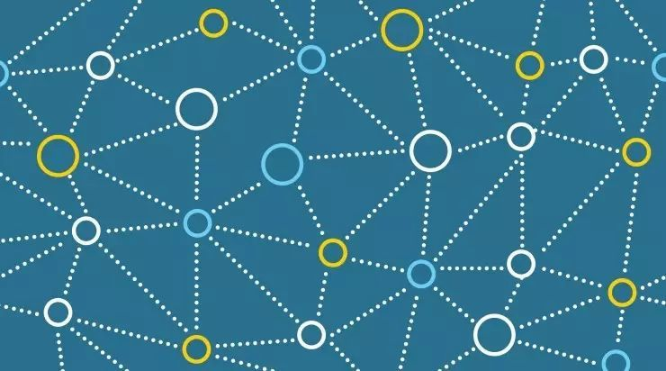

# 深度学习模型汇总

深度学习模型汇总

Saturday, March 30, 2019

9:11 PM

> 【AI研习社】关注AI前沿、开发技巧及技术教程等方面的内容。欢迎技术开发类文章、视频教程等内容投稿，邮件发送至：zhangxian@leiphone.com
> 
> 
> ————————————————————
> 
> 
> 
> 本文旨在加速深度学习新手入门，介绍 CNN、DBN、RNN、RNTN、自动编码器、GAN 等开发者最常用的深度学习模型与架构。AI研习社搜集整理了涉及以上话题的精品文章，供初学者参考。（查看文中链接，点击文末**“阅读原文”**）
> 
> 1
> 
> **卷积神经网络 CNN**
> 
- **深度学习元老Yann Lecun详解卷积神经网络**

> Yann Lecun 的 CNN 话题演讲+ppt。
> 
> 
> 链接：http://www.leiphone.com/news/201608/zaB48AcZ1AFm1TaP.html
> 
- **卷积神经网络（CNN）新手指南**

> 翻译自国外的 CNN 教程，解释详细，浅显易懂。本文分为两部分。
> 
> 
> 链接：http://www.leiphone.com/news/201607/KjXQ1dFpOQfhTEdK.html
> 
> [http://www.leiphone.com/news/201608/GBJqHBnfDhq22qpD.html](http://www.leiphone.com/news/201608/GBJqHBnfDhq22qpD.html)
> 
- **卷积神经网络全面解析**

> 作者自己的博客，归纳总结了关键知识点，深入浅出。
> 
> 
> 链接：http://www.moonshile.com/post/juan-ji-shen-jing-wang-luo-quan-mian-jie-xi
> 
- **卷积神经网络(CNN)学习笔记**

> 同样是博客，重点介绍了 CNN 的网络结构和训练过程。ppt 做得非常用心，分为两个部分。
> 
> 
> 链接：http://www.jeyzhang.com/cnn-learning-notes-1.html
> 
> [http://www.jeyzhang.com/cnn-learning-notes-2.html](http://www.jeyzhang.com/cnn-learning-notes-2.html)
> 
- **卷积神经网络**

> 作者的一些心得体会颇值得参考。
> 
> 
> 链接：http://blog.csdn.net/stdcoutzyx/article/details/41596663
> 
> 2
> 
> **递归神经网络 RNN 及 LSTM**
> 
- **想了解递归神经网络？这里有一份入门教程**

> 零基础认识 RNN，介绍核心知识点。
> 
> 
> 链接：http://www.leiphone.com/news/201608/syAwLNx4bGPuFYI1.html
> 
- **理解LSTM网络**

> 翻译而来，原文是讲解 LSTM 最受欢迎的英语文章之一，非常值得一读。如同标题，它侧重理解而不是算法实现。译者的功底很深，语言清楚明白；当然，原作者对该话题的理解十分深刻，否则不能把原本晦涩的知识点讲解得这么清楚。
> 
> 
> 链接：http://www.jeyzhang.com/understanding-lstm-network.html
> 
- **谷歌大脑科学家亲解 LSTM：一个关于“遗忘”与“记忆”的故事**

> 同样是翻译而来，同样是国外 LSTM 最经典的介绍文章之一，作者是 Google Brain 科学家 Christopher Olah。文中示意图看着有没有很眼熟？因为它们与上文本是同一套。
> 
> 
> 链接：http://www.leiphone.com/news/201701/UIlrDBnwiqoQUbqB.html
> 
- **深度RNN解决语义搜索难题**

> 如何借助 RNN 构造语义搜索引擎，本文介绍了三种实现模式。
> 
> 
> 链接：http://www.leiphone.com/news/201608/qTGP6gqnkefJSgiH.html
> 
- 递归神经网络之父施米德休：他和DeepMind有不解之缘

> 顺便来点八卦内容，看看 RNN 发明者的开挂人生。
> 
> 
> 链接：http://www.leiphone.com/news/201603/xEsltgZe9O1pk1NP.html
> 
- RNN以及LSTM的介绍和公式梳理

> 根据外文教材和论文整理的算法原理和公式。
> 
> 
> 链接：http://blog.csdn.net/Dark_Scope/article/details/47056361
> 
> **3**
> 
> **递归张量神经网络 RNTN**
> 
- RNTN-递归张量神经网络

> 简单介绍 RNTN 的优点和原理。
> 
> 
> 链接：http://blog.csdn.net/star_bob/article/details/47835563
> 
> 国内关于 RNTN 的资料实在太少，在教科书和网上公开课程之外，开发者可以看看 RNTN 之父 Richard Socher, 的论文：《Recursive Deep Models for Semantic Compositionality Over a Sentiment Treebank 》
> 
> 链接：http://nlp.stanford.edu/~socherr/EMNLP2013_RNTN.pdf
> 
> Deeplearning4j 还有一个短文，提到了 RNTN 模型的一些搭建要点。
> 
> 链接：https://deeplearning4j.org/recursiveneuraltensornetwork.html
> 
> **4**
> 
> **自动编码器 Autoencoder**
> 
- 自编码算法与稀疏性

> 这是斯坦福百科论坛里，对稀疏自动编码器的中文介绍，是一篇很好的翻译文章。
> 
> 
> 链接：http://deeplearning.stanford.edu/wiki/index.php/%E8%87%AA%E7%BC%96%E7%A0%81%E7%AE%97%E6%B3%95%E4%B8%8E%E7%A8%80%E7%96%8F%E6%80%A7
> 
- 稀疏自动编码器 （Sparse Autoencoder）

> 对稀疏自动编码器的数学推导。作者表示，吴恩达老师的机器学习课程讲解了这些概念，但受到时间限制不得不略过了推导和数学原理部分。本文是对其的补充。
> 
> 
> 链接：https://my.oschina.net/findbill/blog/541143
> 
- 为什么稀疏自编码器很少见到多层的？

> 这是知乎上的问答，不仅回答了以上问题，还梳理了自动编码器的原理。
> 
> 
> 链接：https://www.zhihu.com/question/41490383
> 
- 深度学习算法实践13---去噪自动编码机（Denosing Autoencoder）

> 对自动编码器（以及去噪自动编码器）原理和应用的介绍，简单易懂，对小白十分友好。
> 
> 
> 链接：http://blog.csdn.net/yt7589/article/details/52368608
> 
- Deep Learning（深度学习）学习笔记整理

> 综合的深度学习笔记，涉及它的原理和训练技巧。但它重点对自动编码器，以及它的两个变种——稀疏自动编码器和去噪自动编码器做了原理介绍。
> 
> 
> 链接：http://www.dataguru.cn/article-3339-2.html
> 
> **5**
> 
> **生成对抗网络 GAN**
> 
- “GANs之父”Goodfellow 38分钟视频亲授：如何完善生成对抗网络？（上）

> 如题，Ian Goodfellow 在 NIPS 大会上的演讲，含部分 ppt。
> 
> 
> 链接：http://www.leiphone.com/news/201612/eAOGpvFl60EgFSwS.html
> 
- “GAN之父”Goodfellow与网友互动：关于GAN的11个问题（附视频）

> Ian Goodfellow NIPS 大会演讲的互动部分，回答了现场嘉宾提问。
> 
> 
> 链接：http://www.leiphone.com/news/201612/JMWZE6BXRZxB1A6d.html
> 
- 深度学习新星：GAN的基本原理、应用和走向 | 硬创公开课

> 新加坡国立大学冯佳时教授对 GAN 的综合讲解。
> 
> 
> 链接：http://www.leiphone.com/news/201701/Kq6FvnjgbKK8Lh8N.html
> 
- 深度解读：GAN模型及其在2016年度的进展

> 中科院博士、计算技术研究所助理教授杨双对 GAN 的讲解。
> 
> 
> 链接：http://www.leiphone.com/news/201701/Hrv1qUS6GYl1vl7O.html
> 
- 生成对抗网络（GANs ）为什么这么火？盘点它诞生以来的主要技术进展

> 回顾生成对抗网络 2014-2016 的四项重大里程碑。
> 
> 
> 链接：http://www.leiphone.com/news/201612/Cdcb1X9tm1zsGSWD.html
> 
- GAN 很复杂？如何用不到 50 行代码训练 GAN（基于 PyTorch）

> 本文作者为前谷歌高级工程师、AI 初创公司 Wavefront 创始人兼 CTO Dev Nag，介绍了他是如何用不到五十行代码，在 PyTorch 平台上完成对 GAN 的训练。全套训练代码发布于 GitHub，链接在文末。
> 
> 
> 链接：http://yingpeng.leiphone.com/article/update?id=161673
> 
- GAN学习指南：从原理入门到制作生成Demo，总共分几步？

> 对 GAN、DCGAN 的原理介绍，对基于 Tensorflow 的 DCGAN 实践作了简要说明。
> 
> 
> 链接：http://www.leiphone.com/news/201701/yZvIqK8VbxoYejLl.html
> 
- 令人拍案叫绝的 Wasserstein GAN

> 原始 GAN 的问题以及 WGAN 的优点。
> 
> 
> 链接：http://www.leiphone.com/news/201702/EU12GVIe2pNGtgEk.html
> 
- LS-GAN作者诠释新型GAN：条条大路通罗马，把GAN建立在Lipschitz密度上

> LS-GAN 以及它与 WGAN、GAN 的不同之处。
> 
> 
> 链接：http://www.leiphone.com/news/201702/QlPJUIqgyw6brWr2.html
> 
- GAN的理解与TensorFlow的实现

> 介绍生成式模型的原理。作者创建了基于 TensorFlow 的 Info-GAN 模型，发布于 GitHub，文中附链接。
> 
> 
> 链接：http://www.leiphone.com/news/201702/GZsIbIb9V9AUGmb6.html
> 
> **6**
> 
> **深度置信网络 DBN 和受限玻尔兹曼机 RBM**
> 
- 受限玻尔兹曼机基础教程

> 如题，deeplearning4j 的教程。
> 
> 
> 链接：https://deeplearning4j.org/cn/archieved/zh-restrictedboltzmannmachine
> 
- 受限玻尔兹曼机（Restricted Boltzmann Machine，RBM）

> 翻译自国外的 RBM 的实践教程。
> 
> 
> 链接：http://www.cnblogs.com/tuhooo/p/5440473.html
> 
- 深度学习方法：受限玻尔兹曼机 RBM 网络模型

> 本文分为四部分，是对 RBM 的较详细讲解，分为四部分。
> 
> 
> 链接：http://blog.csdn.net/xbinworld/article/details/44901865
> 
> [http://blog.csdn.net/xbinworld/article/details/45013825](http://blog.csdn.net/xbinworld/article/details/45013825)
> 
> [http://blog.csdn.net/xbinworld/article/details/45128733](http://blog.csdn.net/xbinworld/article/details/45128733)
> 
> [http://blog.csdn.net/xbinworld/article/details/45274289](http://blog.csdn.net/xbinworld/article/details/45274289)
> 
- Deep Learning（深度学习）学习笔记整理系列之（六）

> 对 RBM 和 DBN 原理知识点的整理。
> 
> 
> 链接：http://blog.csdn.net/zouxy09/article/details/8781396/
> 
- 深度信念网络(Deep Belief Network)

> 另一篇学习笔记整理。
> 
> 
> 链接：http://blog.csdn.net/losteng/article/details/51001247
> 
- 机器学习——DBN深度信念网络详解

> 对 DBN 的简要介绍，文中对 RBM 的图解十分有帮助。
> 
> 
> 链接：http://m.blog.csdn.net/article/details?id=52184189
> 
- 受限玻尔兹曼机(Restricted Boltzmann Machine, RBM) 简介

> 如题，对其算法的简介。
> 
> 
> 链接：http://www.cnblogs.com/kemaswill/p/3203605.html
> 
> **推荐阅读**
> 
> From <[https://cloud.tencent.com/developer/article/1078341](https://cloud.tencent.com/developer/article/1078341)>
>