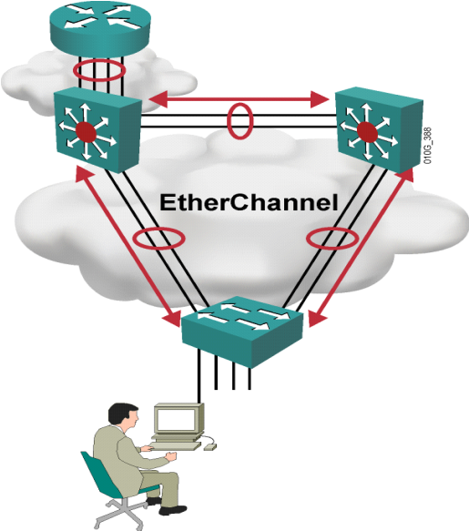

# EtherChannel

EtherChannel

2011年6月29日

16:37

EtherChannel：以太嵌入，以太捆绑

端口聚合也叫做以太通道（ethernet channel），主要用于交换机之间连接。由于两个交换机之间有多条冗余链路的时候，STP会将其中的几条链路关闭，只保留一条，这样可以避免二层的环路产生。但是，失去了路径冗余的优点，因为STP的链路切换会很慢，在50s左右。使用以太通道的话，交换机会把一组物理端口联合起来，做为一个逻辑的通道，也就是channel－group，这样交换机会认为这个逻辑通道为一个端口。

关于以太嵌入的两种协议

1.PAgP：思科私有的

2.LACP：IEEE802.3ad中定义的

华为关于链路捆绑的描述====>

> <<lacp学习笔记.pdf>>
> 

关于以太嵌入的条件

1.端口个数2，4，8

2.相同的双工，速率

3.如果接入模式，必须相同的vlan，如果是trunk，必须要相同的封装

4.端口必须连续 //新设备允许不连续分布，也不必位于相同模块中

5.不支持对10Mbps端口进行通道处理

6.一个端口不能在相同时间内属于多个通道组

关于以太嵌入的配置

1.配置成trunk模式

int range fa1/0 -1

channel-group 1 mode on //使用on，静态配置

no sh

int port-channel 1

sw t e d

sw m t

no sh

查看命令：sh etherchannel summary

2.配置成access模式

int range fa1/0 -1

channel-group 1 mode on //使用on，静态配置

no sh

int port-channel 1

sw m a

sw a v 10

no sh

查看命令：sh etherchannel summary

3.配置成3层接口

int range fa1/0 -1

channel-group 1 mode on //使用on，静态配置

no sw

no sh

int port-channel 1

no sw

ip add 10.1.1.1 255.255.255.0

no sh

注意点：

1.逻辑接口默认都是up的，只有vlan 1除外

2.在配置以太嵌入的时候，以太嵌入必须在1分钟之内配置完成，不然会出现D，如果出现D，删除，重配。

PAgP（Port Aggregation Protocol，端口汇聚协议）

cisco私有的

包含模式：

on ：强制端口Etherchannel，不使用PAgP，两端都必须是on模式

off：防止形成etherchannel

auto：被动协商，若端口接收到PAgP包，形成etherchannel（默认的模式）

desirable：主动协商状态，cisco推荐模式

LACP（Link Aggregation Control Protocol，链路汇聚控制协议）

802.1ad定义

on：同上

off：同上

passive：被动协商，若接收到LACP数据包就形成etherchannel

active：主动LACP协商状态

这两种协议都是一种管理功能，在链路的任一末端检查参数的一致性，并且帮助通道适应链路失效或增加。

cisco设备默认是auto模式（PAgP模式）

channel-group number mode {active | on | auto | desirable | passive}

1.active：属于LACP中的一种模式，如果和active，passive都能形成以太嵌入

2.passive：属于LACP中的一种模式，如果和passive一起不能形成以太嵌入

3.desirable：属于PAgP中的一种模式，如果和desirable，auto都能形成以太嵌入

4.auto：属于PAgP中的一种模式，如果和auto一起不能形成以太嵌入

5.on：不属于LACP，也不属于PAgP，表示静态配置成以太嵌入模式，实际工程中使用这种模式

过去的理论：

过去的以太嵌入是默认是没有负载均衡的，只有一根流量到达50%的时候才会使用下一根。

关于以太嵌入的负载均衡

命令：Switch(config)# port-channel load-balance src-mac/dst-mac/src-ip/dst-ip/src-dst-mac/src-dst-ip

查看命令：sh etherchannel load-balance

注意点：如果以太嵌入已经配置成功了，在配置负载均衡，会warning。

此时将port-channel进行shutdown，在no shutdown就可以了