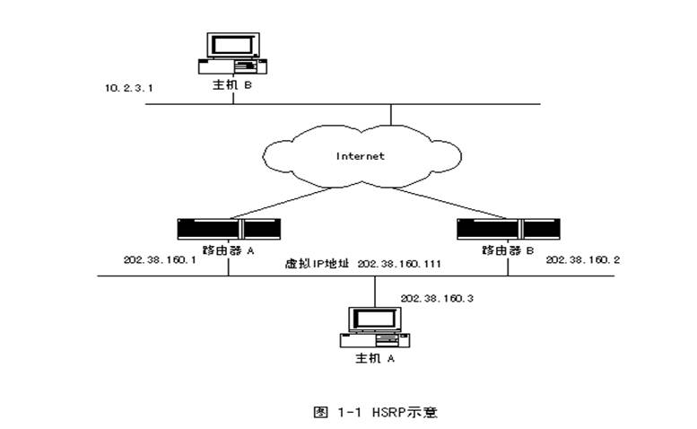

# HSRP

HSRP

2011年6月29日

16:44

高可用性：

1.HSRP（Hot Standby Routing Protocol）：热备份路由协议

2.VRRP（Virtual Router Redundancy Protocol）：虚拟路由器冗余协议

3.GLBP（Gateway load Balancing Protocol）：网关负载均衡协议

这3个协议都是用来保证网关的备份的

HSRP

1.思科私有的

HSRP 消息封装在UDP 数据包中，使用的端口号是 1985

2.一个虚拟IP地址，一个虚拟MAC地址

虚拟IP地址不能和真实IP地址相同

虚拟MAC地址：0000.0c07.acXX，其中XX是组号

3.一主一辅

4.HSRP默认优先级是100，被跟踪的接口不可用后优先级默认降低10

HSRP 选举优先级最高的做主，优先级相同时IP地址高的做主。

5.HSRP的6种状态

（1）Initial：初始状态，修改配置或接口刚启动时处于这个状态

（2）Learn：学习状态，等待活跃路由器发送Hello消息，收到后就进入监听状态

（3）Listen：监听状态，在HSRP组中，除活跃路由器和备用路由器外，其他路由器都处于这种状态。说白了，这个状态就是用来选举的，如果被选举是备用状态或者是活跃状态，就进入speak状态

（4）speak：发言状态，处于发言状态的路由器定期地发送Hello消息，并且积极参加活跃路由器或等待路由器的竞选，如果在speak状态发现了更优秀的Hello包，此时就转化成listen状态

（5）Standby：备用状态，定期发送Hello消息，当主动路由器失效时路由器准备接管包传输功能。

（6）Active：活跃状态，定期发送Hello消息，路由器执行包传输功能

6.配置的时候一定要禁用ICMP重定向 //IOS12.2版本之后可以不禁用重定向

命令是：no ip redirects //当运行HSRP时，防止主机发现备份组中路由器的主MAC地址是非常重要的。因此应该禁用任何可能把路由器的主MAC地址通知给主机的协议。所以，凡HSRP所涉及到的路由器，即使它只有一个端口运行了HSRP，都不能在运行HSRP的端口发送ICMP重定向包

In releases earlier than Cisco IOS Release 12.2(18)SE, ICMP (Internet Control Message Protocol) redirect messages were automatically disabled on interfaces configured with HSRP. ICMP is a network layer Internet protocol that provides message packets to report errors and other information relevant to IP processing. ICMP provides diagnostic functions, such as sending and directing error packets to the host.

When the switch is running HSRP, make sure hosts do not discover the interface (or real) MAC addresses of routers in the HSRP group. If a host is redirected by ICMP to the real MAC address of a router and that router later fails, packets from the host will be lost.

In Cisco IOS Release 12.2(18)SE and later, ICMP redirect messages are automatically enabled on interfaces configured with HSRP. This feature filters outgoing ICMP redirect messages through HSRP, in which the next hop IP address might be changed to an HSRP virtual IP address. For more information, see the Cisco IOS IP Configuration Guide, Release 12.2.

7.关于HSRP的实验

（1）路由器上基本配置

（2）交换机上基本配置

（3）跟踪

（4）负载均衡

8配置

主设备配置3句话

standby 1 ip 虚拟IP地址

standby 1 preempt //让设备支持抢占功能

standby 1 priority 优先级

备份设备配置2句话

standby 1 ip 虚拟IP地址

standby 1 preempt

**什么是HSRP**

> HSRP --- Hot Standby Router Protocol ( 热备份路由器协议 )。
> 
> 
> **它的作用是能够把一台或多台路由器用来做备份，所谓热备份是指当使用的路由器不能正常工作时, 候补的路由器能够实现平滑的替换, 尽量不被察觉**。
> 
> 通常，我们的网络上主机设置一条缺省路由，指向主机所在网段内的一个路由器R，这样，主机发出的目的地址不在本网段的报文将被通过缺省路由发往路由器R，从而实现了主机与外部网络的通信。在这种情况下，当路由器R坏掉时，本网段内所有以R为省缺路由下一跳的主机将断掉与外部的通信。如下图，主机A通过缺省网关 （路由器A）来访问主机B，一旦路由器A不能正常工作，主机A将无法访问主机B。
> 

> HSRP 可以解决上述问题，首先由多台路由器组成备份组（路由器A和路由器B）， 备份组就是一台虚拟的路由器，有独立的虚拟IP地址，主机A使用这台虚拟路由器作为网关（设置虚拟IP地址）。 在备份组内有一台路由器是活动路由器（假设路由器A），它完成虚拟路由器的工作，如负责转发主机送给虚拟路由器的数据包，路由器B作为备份路由器，当活动路由器A出现故障， 备份路由器B会接替活动路由器的工作，负责转发主机送给虚拟路由器的数据包。这对主机A来说是透明的，因为主机A只看到虚拟路由器。
> 
> 
> HSRP协议确定备份组工作的机制，实现上述备份功能。
> 
> HSRP适用于具有多播或广播能力的局域网（如：以太网）。
> 

==============================================================

HSRP的原理：

在没有运行HSRP之前

主机A要跟主机B通信，因为不在同一网段，所以必须先将包交给路由器A（网关）。再有路由器A将这个包交给主机B，如果路由器A无法正常工作，或者链路断掉，那么主机A就没法跟主机B通信。

在运行HSRP后

在网络当中虚拟出一台虚拟路由器作为网关，而真实路由器A和B成为一个组，主机A只知道一个虚拟路由器的存在，它把包交给虚拟路由器。路由器A和B会有一个成为活动路由器（假设是A），这时路由器B会成为一个备份路由器。那么主机A交给虚拟路由器的包将会由路由器A负责转发，如果路由器A无法正常工作，那么路由器B就会负责转发虚拟路由器当中的数据。

**HSRP的用途**

HSRP用于广播或多播局域网上的路由器热备份, 并适于静态的路由配置，实际上HSRP正是解决**设备不能动态适应路由改变的问题**。

HSRP工作实现

> 当采用HSRP, 用户看到的是一台虚拟路由器，该虚拟路由器有自己的虚拟IP地址和虚拟MAC地址，该虚拟路由器是由一组路由器组成的，这组路由器称为备份组。备份组内的有一台活动路由器、一台备份路由器，以及群众路由器构成。一般情况下，一旦活动路由器坏掉，该备份路由器成为活动路由器，然后备份组内选举组内的另一台路由器为备份路由器。
> 
> 
> 组内路由器通过接受来自活动路由器的周期性HELLO报文来判断活动路由器是否工作正常。如果组内备份路由器R在一定时间间隔未收到活动路由器的HELLO报文，就认为活动路由器坏掉了，优先级高的备份路由器最终成为活动路由器。备份路由器也是通过类似过程产生的。这样总能保证备份组中有一台活动路由器，一台备份路由器。
> 

HSRP状态 和 HSRP报文

> 备份组内的路由器处于各自的状态，根据相互间发送HSRP报文来调整新的状态。
> 
> 
> HSRP协议中定义了一个自动状态机，不同的触发事件会产生相应的状态变化和动作。
> 
> HSRP状态：
> 
> （1）INIT
> 
> 所有备份组内组员的初始状态为INIT；当组员配置属性或端口UP是，进入INIT状态；
> 
> （2）LEARN
> 
> 该组员未设定虚拟IP地址，并等待从本组活动路由器发出的认证的HELLO报文中学习得到自己的虚拟IP地址；
> 
> （3）LISTEN
> 
> 该组员已得知或设置了虚拟IP地址，通过监听HELLO报文监视活动/备份路由器，一旦发现活动/备份路由器长时间未发送HELLO报文，则进入SPEAK状态，开始竞选；
> 
> （4）SPEAK
> 
> 参加竞选活动/备份路由器的组员所处的状态，通过发送HELLO报文使竞选者间相互比较，竞争；
> 
> （5）STANDBY
> 
> 组内备份路由器所处的状态；备份组员监视活动路由器，准备随时在活动路由器坏掉时接替活动路由器。备份路由器也周期性发送HELLO报文告诉其他组员自己没有坏掉。
> 
> （6）ACTIVE
> 
> 组内活动路由器，负责虚拟路由器实际路由工作的组员所处的状态。 活动路由器周期性发送HELLO报文告诉其他组员自己没有坏掉。
> 
> **HSRP的配置**
> 
> **R1#conf t**
> 
> **R1(config)#int E0**
> 
> **R1(config-if)#standby 1 ip add 192.168.10.254    //激活HSRP，设置R1连接的内网的虚拟网关**
> 
> **R1(config-if)#standby 1 priority 120     //用于设定端口的HSRP优先级，具有最高备份优先级的HSRP成员将成为激活路由器**
> 
> **R1(config-if)#standby 1 preempt      //表明当本地路由器的备份优先级超过当前激活路由器时，它就将接管控制权，成为激活路由器**
> 
> **R1(config-if)#standby 1 track serial 0 40  //用于设置允许路由器端口根据另一端口的可用性而修改自己的HSRP优先级值（即监视端口状态）**
> 
> **R1(config-if)#standby 2 ip add 192.168.20.254**
> 
> **R1(config-if)#standby 2 prempt**
> 
> **R3#conf t**
> 
> **R3(config)#int E0**
> 
> **R3(config-if)#standby 2 ip add 192.168.20.254    //激活HSRP，设置R3连接的内网的虚拟网关**
> 
> **R3(config-if)#standby 2 priority 120     //用于设定端口的HSRP优先级，具有最高备份优先级的HSRP成员将成为激活路由器**
> 
> **R3(config-if)#standby 2 preempt      //表明当本地路由器的备份优先级超过当前激活路由器时，它就将接管控制权，成为激活路由器**
> 
> **R3(config-if)#standby 2 track serial 0 40  //用于设置允许路由器端口根据另一端口的可用性而修改自己的HSRP优先级值**
> 
> **R3(config-if)#standby 1 ip add 192.168.20.254**
> 
> **R3(config-if)#standby 1 prempt**
>