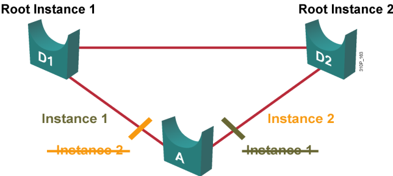
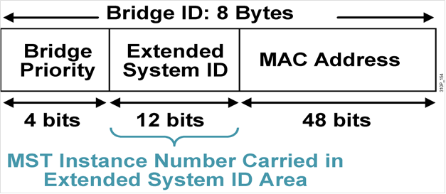
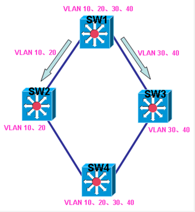
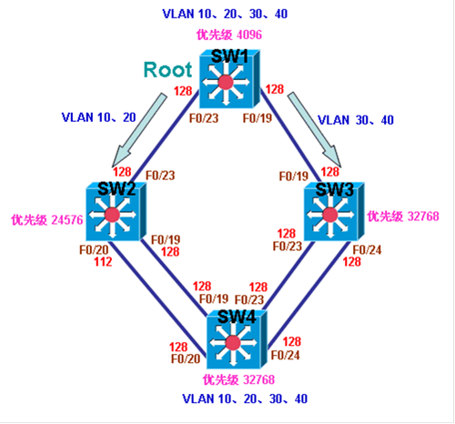

# MSTP

MSTP

2011年6月29日

16:35

MST（Multiple Spanning Tree Protocol，多生成树协议）：多个VLAN使用一个生成树实例

**Instance 1 maps to VLANs 1-500**

**Instance 2 maps to VLANs 501-1000**

关于MST的具体实现

**特别简单，也就是使用的Extended System ID**

**关于MST的配置**

**spanning-tree mode mst //改成mst模式**

**spanning-tree mst configuration**

**name cisco**

**revision 1**

**instance 1 vlan 10,20,30**

**instance 2 vlan 40,50,60**

**instance 3 vlan 70-80**

**最佳简写：**

**sp mo m**

**sp ms c**

**na cisco**

**r 1**

**i 1 vlan 10,20,30**

MSTP的协议号为IEEE 802.1s，因为在交换机存在多个VLAN时，STP会将所有流量放在单条路径中传输，而PVST+则可以通过为每个VLAN运行一个STP实例，从而将不同VLAN的流量放在不同的路径上传输。但正是由于PVST+为每个VLAN都运行了一个STP实例，可能会多达128个STP实例，所以PVST+会极其消耗系统资源。比如交换机上有20个VLAN，而PVST+会维护20个STP实例，但是这20个VLAN的流量也许只需要被分担到几条不同路径上，那就只需要维护几个STP实例即可，而并不需要维护20个STP实例。MSTP正因为这个原因，将需要进行相同STP计算的VLAN映射到同一个STP实例中，即无论有多少个VLAN，只要实际需要多少条不同的路径，就根据需要的路径维护相同的STP实例数，从而大大节省系统资源，如下图：

还是以此图为例，因为各台交换机上都有VLAN 10，VLAN 20，VLAN 30，VLAN 40，为了能够在SW1上让不同VLAN的流量从不同的路径到达SW4，所以可以运行PVST+，将流量分担到不同的路径上，即SW1通过PVST+将VLAN10和VLAN20的流量从连接SW2的接口到达SW4，将VLAN 30和VLAN 40的流量从连接SW3的接口到达SW4，但PVST+维护了4个STP 实例，才达到此效果，不难看出，其实网络中只有两个不同的路径，VLAN 10和VLAN 20的路径完全是相同的，VLAN 30和VLAN 40的路径也是完全相同的，此时，MSTP就可以通过将相同的VLAN映射到同一个STP实例，如将VLAN 10和VLAN 20映射到一个实例，再将VLAN 30和VLAN 40映射到另外一个实例，总共只有两个STP实例，既像PVST+那样实现了负载均衡的效果，也节省了系统资源。

**MSTP是在RSTP的基础之上运行的**，所以具有快速收敛的功能，但不能不运行RSTP时运行MSTP，RSTP是随着开启MSTP时自动开启的。MSTP最多支持65个STP实例，但是映射到实例的VLAN数量是没有限制的。默认所有VLAN都在实例0。

MSTP还需要通过分区域管理，即region，交换机要在同一region进行相同的STP计算，必须region name和revision number一致，最重要的是VLAN和实例的映射也要一致，否则STP计算出来的网络，将不是你想要的网络，一个VLAN只能被映射到一个实例，一个网络可以有多个MSTP revision，便于各自独立。

**配置MSTP**

**1.配置MSTP**

**（1）改变所有交换机的STP模式为MSTP**

Sw1(config)#spanning-tree mode mst

Sw2(config)#spanning-tree mode mst

Sw3(config)#spanning-tree mode mst

Sw4(config)#spanning-tree mode mst

**（2）映射VLAN到实例**

sw1(config)#spanning-tree mst configuration

sw1(config-mst)#name ccie

sw1(config-mst)#revision 1

sw1(config-mst)#instance 1 vlan 10,20

sw1(config-mst)#instance 2 vlan 30,40

**说明：**其它交换机配置和SW1配置完全相同，必须region name和revision number完全相同，否则属于不同的region。

**2.控制VLAN 10和VLAN 20（实例1）的路径为 SW1—SW2—SW4，VLAN 30和VLAN 40（实例2）的路径为SW1—SW3—SW4。**

**(1)配置SW1为实例1和实例2的根交换机**

sw1(config)#spanning-tree mst 1 root primary

sw1(config)#spanning-tree mst 2 root primary

**（2）控制SW4在实例1连SW2的端口Path Cost值为10**

sw4(config)#int range f0/19-20

sw4(config-if-range)#spanning-tree mst 1 cost 10

**（3）控制SW4在实例2连SW3的端口Path Cost值为10**

sw4(config)#int ran f0/23-24

sw4(config-if-range)#spanning-tree mst 2 cost 10

**3.查看STP状态**

**（1）查看根交换机**

sw1#sh spanning-tree

（输出被省略）

MST1

Spanning tree enabled protocol mstp

Root ID    Priority    24577

Address     001a.6c6f.fb00

This bridge is the root

Hello Time   2 sec  Max Age 20 sec  Forward Delay 15 sec

Bridge ID  Priority    24577  (priority 24576 sys-id-ext 1)

Address     001a.6c6f.fb00

Hello Time   2 sec  Max Age 20 sec  Forward Delay 15 sec

Interface        Role Sts Cost      Prio.Nbr Type

- --------------- ---- --- --------- -------- --------------------------------

Fa0/19           Desg FWD 200000    128.21   P2p

Fa0/23           Desg FWD 200000    128.25   P2p

MST2

Spanning tree enabled protocol mstp

Root ID    Priority    24578

Address     001a.6c6f.fb00

This bridge is the root

Hello Time   2 sec  Max Age 20 sec  Forward Delay 15 sec

Bridge ID  Priority    24578  (priority 24576 sys-id-ext 2)

Address     001a.6c6f.fb00

Hello Time   2 sec  Max Age 20 sec  Forward Delay 15 sec

Interface        Role Sts Cost      Prio.Nbr Type

- --------------- ---- --- --------- -------- --------------------------------

Fa0/19           Desg FWD 200000    128.21   P2p

Fa0/23           Desg FWD 200000    128.25   P2p

sw1#

**说明：**可以看到SW1已经成为实例1和实例2的根交换机。

**（2）查看SW4的路径**

sw4#sh spanning-tree

（输出被省略）

MST1

Spanning tree enabled protocol mstp

Root ID    Priority    24577

Address     001a.6c6f.fb00

Cost        200010

Port        21 (FastEthernet0/19)

Hello Time   2 sec  Max Age 20 sec  Forward Delay 15 sec

Bridge ID  Priority    32769  (priority 32768 sys-id-ext 1)

Address     001e.14cf.0980

Hello Time   2 sec  Max Age 20 sec  Forward Delay 15 sec

Interface        Role Sts Cost      Prio.Nbr Type

- --------------- ---- --- --------- -------- --------------------------------

Fa0/19           Root FWD 10        128.21   P2p

Fa0/20           Altn BLK 10        128.22   P2p

Fa0/23           Altn BLK 200000    128.25   P2p

Fa0/24           Altn BLK 200000    128.26   P2p

MST2

Spanning tree enabled protocol mstp

Root ID    Priority    24578

Address     001a.6c6f.fb00

Cost        200010

Port        25 (FastEthernet0/23)

Hello Time   2 sec  Max Age 20 sec  Forward Delay 15 sec

Bridge ID  Priority    32770  (priority 32768 sys-id-ext 2)

Address     001e.14cf.0980

Hello Time   2 sec  Max Age 20 sec  Forward Delay 15 sec

Interface        Role Sts Cost      Prio.Nbr Type

- --------------- ---- --- --------- -------- --------------------------------

Fa0/19           Altn BLK 200000    128.21   P2p

Fa0/20           Altn BLK 200000    128.22   P2p

Fa0/23           Root FWD 10        128.25   P2p

Fa0/24           Altn BLK 10        128.26   P2p

sw4#

**说明：**可以看到，实例1与实例2的流量已经分担到两条不同的路径上，既实现了与PVST+相同的负载效果，也节省了系统资源，因为只有两个STP实例，而PVST+要4个STP实例。