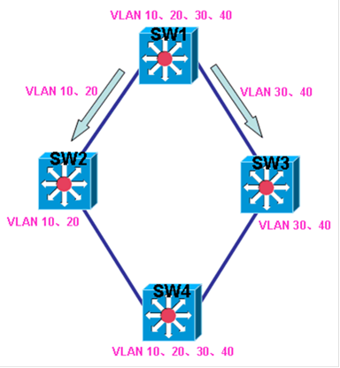

# PVST+

PVST+

2011年6月29日

> PVST+是思科自己的协议，在之前有一个PVST，但由于PVST只能支持ISL Trunk，所以思科为了扩展PVST支持IEEE 802.1Q，诞生了PVST+，在多数三层交换机，如3550、3560及以上型号，默认运行的STP版本为PVST+。PVST+是基于CST（common spanning tree）（IEEE 802.1D）运行的，但运行了PVST+的交换机并不像CST那样只进行一次STP计算，PVST+会在每个VLAN进行一次STP计算，也就是会根据VLAN数的不同，计算STP的次数也不同，并且每个VLAN的STP信息是单独保存的。请看下图：
> 

在上图的网络中，各台交换机上都有VLAN 10，VLAN 20，VLAN 30，VLAN 40，在运行CST的情况下，因为只进行一次STP计算，所以SW1到SW4的流量要么从SW2走，要么从SW3走，在这种情况下，流量只能走同一条路径，而另一条路径完全被空闲而得不到利用。

当在上图的网络中运行PVST+后，因为PVST+会在每个VLAN进行不同的STP计算，称为STP实例（instance），所以可以控制每个VLAN流量的路径走向。上图中，就可以通过PVST+控制SW1的VLAN10和VLAN20从连接SW2的接口到达SW4，控制SW1的VLAN 30和VLAN 40从连接SW3的接口到达SW4，这样之后，将不同的VLAN流量分担到不同的路径，即实现了负载均衡，也通过STP避免了环路。