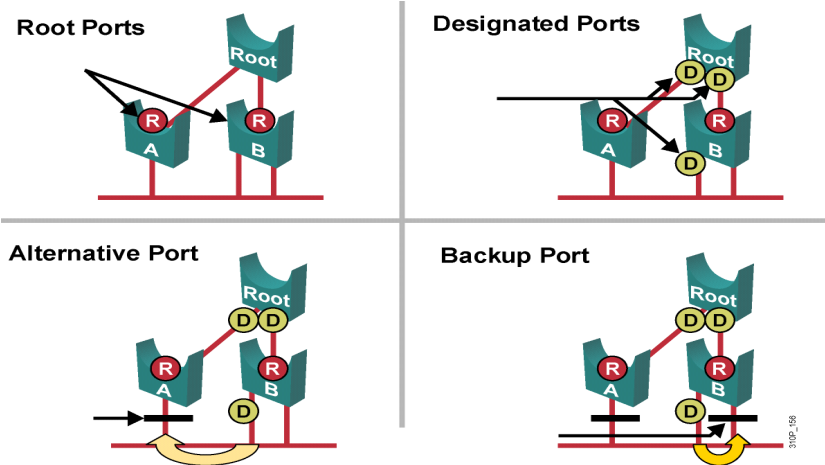

# RSTP

RSTP

2011年6月29日

16:32

Cisco的新特性UplinkFast、BackboneFast和PortFast增强了原有802.1D的收敛速度，但是缺点是：

1.这些机制是思科专有的

2.需要额外的配置

802.1D STP

802.1W RSTP （wori）

802.1S MST （SM）

关于RSTP

1.RSTP是在802.1w中定义的

2.RSTP是在原有的802.1D的基础上进行改进的，其中大部分东西都是一样的

3.在多数情况下，RSTP能够比Cisco专有的对802.1D的增强特性要执行的更好，并且不需要做出额外配置

4.802.1w可以和802.1D保持兼容性，但是所有的新的特性也会丢失

5.在思科的路由器上是PVST+

可以这么理解：

**RSTP=STP+portfast+uplinkfast+backbonefast+一些小特性**

关于RSTP的5端口3状态

RSTP的5个端口是：根端口，指定端口，替代端口，备份端口，禁用端口（shutdown）

RSTP的3个状态：丢弃状态（Discarding），学习状态（Learning），转发状态（Forwarding）

RSTP中的备份端口+替换端口=STP中的非指定端口

RSTP中的discarding=STP中的disabled+blocking+listening

替代端口：也叫做替代根端口，替代端口是从其他网桥接收到根BPDU的端口（即如上图中，A根端口出现故障，这个替代端口就成为根端口，即为该交换机到根交换机提供一条替代路径，即替代根端口）

备份端口：也叫做备份指定端口，如果一个端口收到同一个网桥的更好的BPDU，那么这个端口成为备份端口（如上图，如果原来的指定端口出现了问题，这个备份端口就生效变成了备份端口，所以也叫备份指定端口。）

替代端口和备份端口如果在STP中就是非指定端口，但是在RSTP中将替代端口和备份端口从非指定端口中分离出来了

替代端口和备份端口在稳定状态都是处于discarding状态

禁用端口：在快速生成树网络中不担当任何角色，说白了就是shutdown的端口

关于RSTP运行原理的改变

1.BPDU发送的不同：

在802.1D中，非根交换机只有收到BPDU的时候，才产生BPDU------被动产生

在802.1W中，即使交换机没有收到BPDU，它也会每隔Hello时间周期（默认是2s）发送包含当前信息的BPDU

2.故障检测能力的不同：

在802.1D中，如果非指定端口在20s没有收到根网桥发送过来的BPDU，那么就会产生拓扑变化，变成listening状态

在802.1W中，如果端口在3个连续的hello时间间隔内没有收到BPDU，那么就认为与邻接网桥的连接丢失

3.快速过渡到转发状态机制：

在802.1D中，网络的收敛依赖于计时器，生成树算法被动的等待网络收敛

在802.1W中，网络的收敛不依赖于计时器，新的RSTP能够主动的确认端口是否已经处于转发状态

当RSTP检测到了一个拓扑变化，做2件事：

（1）开启TC While计时器（默认是2倍的hello时间），在这个时间内从根端口发出TCN BPDU。

（2）清除所有与这些端口联系的MAC地址

沿途的交换机也做两件事情：

（1）清除所有的除收到拓扑变化的端口以外的 所有端口的MAC地址

（2）开启TC While计时器，从根端口和指定端口发出TCN BPDU

关于RSTP的配置

超级霹雳无敌简单：全局下：spanning-tree mode rapid-pvst

关于与RSTP的兼容性

如果端口在2倍的hello时间之内所持续收到的BPDU都不能对应到当前的工作模式，那么它就自动切换到STP模式

总结：

RSTP是快速STP，协议号为IEEE 802.1w，在运行STP时，端口状态blocking、listening、disabled都不发送数据，RSTP将这三个状态归为一个状态，discarding状态。其次之外就是learning和forwarding状态，所以RSTP端口状态为discarding、learning和forwarding。

当运行STP时，如果根交换机失效了，那么需要等待10个hello时间，也就是20秒收不到根交换机BPDU才能发现，再将block的端口过渡到forwarding状态，还需要经过两个forward delay时间共计30秒，所以STP在网络出现故障时，要经过50秒才能启用block端口，而RSTP则只需要在3个hello时间，即6秒收不到根交换机BPDU，便认为根交换机已经失去连接，就立刻启用discarding状态的接口，RSTP在根交换机失效后，并不会进行完整的STP计算，会在该启用备用端口时立即启用，因此网络收敛速度快，RSTP会在低于1秒的时间内恢复网络。