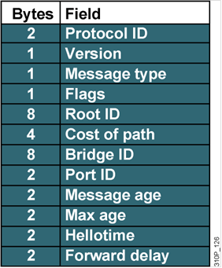
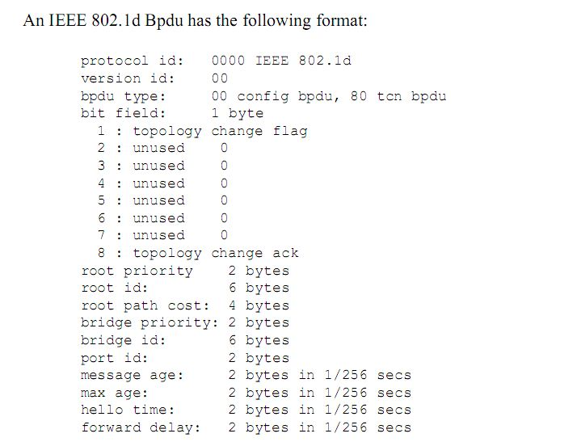
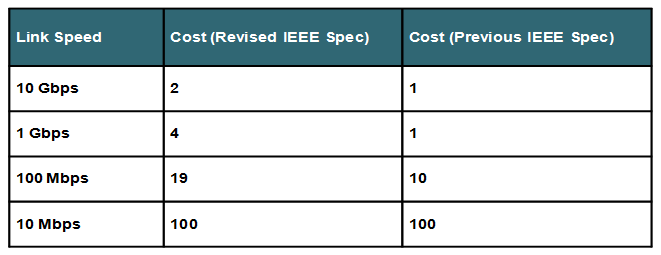
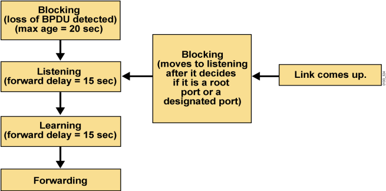
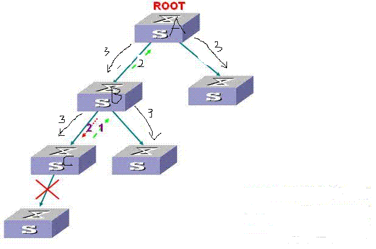
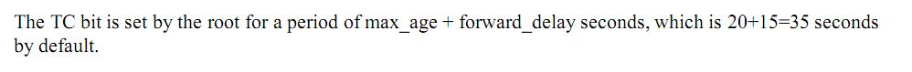
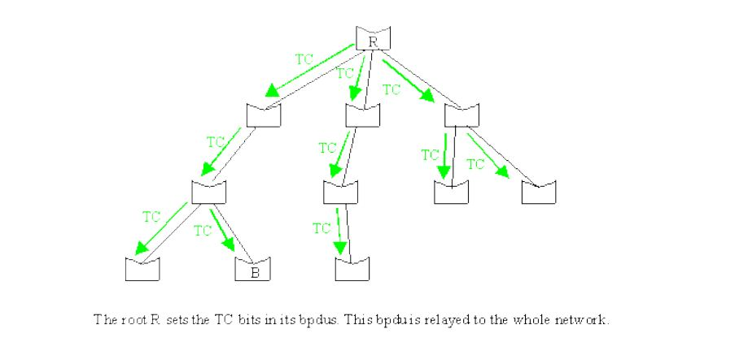
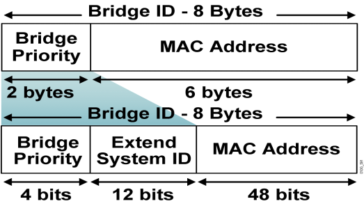

# STP

STP

2011年6月29日

16:26

关于生成树协议的整体概述

1.生成树协议包括：STP(802.1D)，RSTP(802.1w)，MST(802.1s)

2.生成树协议：物理上有环，逻辑上无环

3.生成树协议中使用的包：BPDU（Bridge Protocol Data Unit，桥协议数据单元）

关于STP（Spanning-tree protocol）协议

1.STP在802.1D中定义的

2.STP协议的工作原理：3步走

（1）选举根交换机

（2）每个非根交换机选举一个根端口

（3）每个网段选举出一个指定端口

根端口：每个非根交换机交换机离根交换机最近的端口，叫做根端口

指定端口：每个网段离根交换机最近的端口，就叫做指定端口

最后剩下的那个端口就处于阻塞状态（非指定端口（阻塞端口））

关于STP中的选举机制：

1.如何选举根交换机

（2）比MAC地址（谁低选谁）

说白了就是比BID

2.如何选择根端口

（1）比较Cost of Path（谁低选谁）

（2）比较BID（交换机优先级）（谁低选谁）

（3）比较PID（端口优先级）（谁低选谁）

3.如何选择指定端口：

（1）比较Cost of Path（谁小选谁）

（2）比较BID（交换机优先级）（谁小选谁）

关于802.1D中定义的BPDU

口诀：2秒，2类型，组播

1.BPDU每两秒发送一次

2.BPDU使用的组播地址是01-80-c2-00-00-00

3.BPDU分为两种类型：配置BPDU，TCN BPDU

（1）配置BPDU：刚开始的时候每台交换机都认为自己是根，发送配置BPDU，当网络稳定的时候只有根交换机才发送配置BPDU

配置BPDU的特点是Root ID=BID

（2）TCN BPDU（Topology Change Notification BPDU，拓扑变更通告BPDU）：这种BPDU是当交换机检测到拓扑变更时向根网桥发送的

4.BPDU的帧格式：35个字节12个字段

Protocol ID（协议ID）：该值总为0

Version（版本）：802.1D的版本是0

Message type（消息类型）：配置BPDU是0x00，TCN BPDU是0x80

Flags（标志）：//附件中

<<BPDU format.pdf>>

Root ID（根ID）：根网桥的网桥ID，在网络刚开始的时候，Root ID=Bridge ID

Cost of path（路径开销）：到达根网桥的STP开销

Bridge ID（BID，桥ID）：每个交换机都会有一个BID，在802.1D中，开始的时候每个网桥都发配置BPDU，当一台交换机发现收到的BPDU中的BID比自己更适合做根网桥，此时，此交换机就不在发送BPDU了

Port ID（端口ID）：Port Priority+Port Number

Message age（消息寿命）：开始的时候表示从根网桥发出以后所经过的秒数，现在演变为每经过一个网桥都会加1，有点像TTL值

Max age（最大寿命）：网桥在将根网桥看作不可用之前保留根网桥ID的最大时间，有点像hold time（保持时间），默认是20秒

Hellotime（Hello时间）：根网桥发送BPDU的时间间隔，默认是2秒

Forward delay（转发延迟）：网桥在侦听和学习状态所停留的时间间隔，默认是15秒。

关于BID

BID（Bridge ID,桥ID）= 桥优先级 + MAC地址

8字节 2字节 6字节

桥优先级默认是32768

注意：经典的STP协议桥优先级不一定非要是4096的倍数，因为当时没有提出PVST的概念，但是现在思科的交换机上默认启用的是PVST+，所以设置优先级必须是4096的倍数，因为这时桥优先级字段被细分为两个字段，即桥优先级 +扩展系统ID，在交换机上设置的实际上是前面4个比特的bridge priority，而最后在交换机上的得到的总共的桥优先级是这个bridge priority与后面vlan号之和。

MAC地址默认从交换机的地址池中取一个

//Because each VLAN is considered as a different logical bridege with PVST+ and rapid PVST+,the same switch must have a different bridge IDs for each configured VLAN.

关于Port ID

Port ID = port priority + Port number

2字节 1字节 1字节

Port priority：默认是128

Port number：是根据自己的端口取得的

关于Cost of path

关于STP的3端口5状态

1.STP有3种端口：Root port（根端口），Designated port（指定端口），（Nondesignated port（非指定端口，阻塞端口）

2.STP的5种状态：blocking（阻塞），listening（监听），learning（学习），forwarding（转发），禁用（disabled）

（1）blocking（阻塞）：监听BPDU，不学习MAC，不转发数据帧

（2）listening（监听）：在此状态，交换机能够决定根，并且可以选择根端口，指定端口，非指定端口，不学习MAC，不转发数据帧

补充：如果端口被选择是根端口或者是指定端口，那么端口的状态会接着变化成为learning状态，最终变成forwarding状态，如果端口被选择是非指定端口，那么端口状态会退化成为blocking状态

（3）learning（学习）：学习MAC，但不能转发数据帧 ------注意了，直到learning状态才开始学习MAC地址（**用来创建CAM表，防止下一步收到的数据包泛洪**）

（4）forwarding（转发）：学习MAC，转发数据帧 ------注意了，直到forwarding状态才开始转发数据帧

（5）禁用（disabled）：其实就是端口是shutdown的时候

思考：为什么要有Learing状态？没有不也行吗？

答：首先，要从listening状态说起，listening状态是不能学习MAC的，因为此时网络中有环路，如果此时就学习MAC，那么就会出现桥接表不稳定

再次，如果在设计STP的时候，不设计Learning状态也是可以的，但是交换机的工作原理是未知单播泛洪，如果listening状态直接过渡到forwaring状态进行数据帧的转发，此时会有大量的数据帧被泛洪，因为此时交换机的CAM表是空的，所有帧都会被泛洪

关于STP的计时器

STP中使用3种计时器：

1.hello时间：2s，可以手工配置在1-10s之间

2.转发延迟：15s，可以手工配置在4-30s之间

3.最大寿命：20s，可以手工配置在6-40s之间

Listening状态和Learning状态持续的时间就是转发延迟，默认15s

> 除了hello时间和max-age时间外，还有一个forward delay时间，默认为15秒，接口在经过Listening 和Learning状态时，都会分别停留一个 forward delay时间，也就是说接口从Listening状态到Learning状态，最后变成转发状态，需要经过两个forward delay时间共计30秒。
> 
> 
> **网络刚开始的时候，一个端口要过渡到转发状态需要30s**
> 

**网络收敛以后，一个非指定端口要过渡到转发状态需要50s（20（在20s内收不到配置BPDU的时候开始执行STP操作）+30）**

在网络收敛以后：

1.根交换机定期发送（默认2s）配置BPDU

2.非根交换机会在根端口收到根交换机发送的配置BPDU，并从指定端口中发送出去

3.非指定端口会不断收到指定端口发送来的配置BPDU，这个BPDU会使非指定端口一直处于blocking状态

思路：研究任何一种生成树协议，只要考虑2方面的内容

1.网络刚开始收敛的时候生成树协议干了哪些事情？ ----上面已经讲过了

2.网络收敛以后，如果网络拓扑发生变化了生成树协议又干了哪些事情？

关于网络拓扑变化时，STP的处理

<<Understanding spanning-tree protocol topology changes.pdf>>

1.第一种情况：根交换机失效

此时非指定端口会在20s内不能收到配置BPDU，此时非指定端口的端口状态会转化会listening状态，并且发送BPDU，这将引起全网重新选举根交换机

2.第二种情况：链路断掉或是非根交换机挂了

当此种情况发生的时候会经历以下步骤

（1）交换机C察觉到链路的故障，此时会向交换机B发送一个TCN BPDU，交换机C将每隔一个hello时间就向B发送一次，直到收到了来自交换机B的TCA BPDU

（2）交换机B收到C发送来的TCN BPDU后将做两件事情：

第一件：向交换机C发送TCA BPDU

第二件：从根端口发出TCN BPDU

（3）步骤（2）不断的重复，直到根交换机收到TCN BPDU

当根交换机收到TCN BPDU后，将向全网泛洪TCN BPDU，持续时间是转发延迟+最大寿命计时器（15+20=35s） //官方文档附件

（4）当全网的交换机收到从根交换机发送的TCN BPDU后，它们做一件事情：把CAM表中记录的保持时间(aging time)改成转发延迟计时器（15s）

默认情况下，CAM表中记录的保持时间是300s

3.第三种情况：新交换机加入

当有新交换机加入的时候，新交换机会认为自己是根，此时会发出配置BPDU，这种情况会导致全网的根网桥的重新选举，会经过30s的时间网络才会收敛

**综上所述：当网络拓扑发生变化的时候，要么不会有收敛时间，要么收敛时间会持续30-50s**

补充：什么时间交换机会发送TCN BPDU？

答：处于一下2种情况的时候：

（1）对于处于转发或者监听状态的端口，它过渡到阻塞状态（链路故障的情况）

（2）非根网桥在它的指定端口接收TCN：这种情况是指交换机在传输TCN，当收到TCN的时候会向将此TCN从自己的根端口发送出去

什么时候交换机会发送配置BPDU

1、在网络收敛以前，每台交换机都会发送配置BPDU，它的作用是用来选举根网桥

2、当网络收敛以后，只有根交换机才发送配置BPDU

关于PVST+（Per VLAN Spanning Tree Plus，增强的按VLAN的生成树）

1.PVST+是思科私有的

2.PVST+就是为了解决802.1D的问题的（负载）

3.PVST+为每个VLAN维护一个单独的生成树实例

4.PVST+中的“+”号表示思科对STP 802.1D的增强，其实说白了就是可以与PortFast，UplinkFast，BackboneFast连用

5.默认情况下，思科的交换机是使用的PVST+

单生成树缺陷：

1 由于整个网络只有一颗生成树，网络规模较大时收敛时间长。

2 不能做二层负载。

6.实现方法很简单：

在实际当中其实这个Extend System ID并没有使用，具体是怎么实现的呢？在dot1q中的4个字节已经携带了Vlan ID，所以System ID并没有使用，这个通过抓包可以看到

关于PVST+的配置

1.修改网桥的优先级

spanning-tree vlan 20 priority xxx

2.设置根交换机

spanning-tree vlan 10 root primary

=spanning-tree vlan 10 priority 8192

并且在show run中看到的就是后者

3.设置备份跟交换机

spanning-tree vlan 10 root secondary

=spanning-tree vlan 10 priority 16384

关于PortFast

1.PortFast能够使得被配置为2层接入端口的接口立即进入转发状态，避免了监听和学习状态

2.PortFast应用到连接工作站和服务器的端口上，思科建议使用

3.配置命令：

全局下的：spanning-tree portfast default

接口下的：spanning-tree portfast

4.详细解释：把一个port设置了portfast，就是让那个port不再使用STP的算法。

在STP中，port有5个状态：disable、blocking、listening、learning、forwarding。

只有forwarding状态，port才能发送用户数据。如果一个port一开始是没有接pc，一旦pc接上，就会经历blocking->listening->learing->forwarding，每个状态的变化要经历一段时间，这样总共会有3个阶段时间，缺省的配置要50秒钟。这样从pc接上网线，到能发送用户数据，需要等50秒的时间，但如果设置了portfast，那就不需要等待这50秒了。

关于思科对802.1D特性的增强

1.为了增强802.1D的操作，思科开发了3种新特性：PortFast，UplinkFast，BackboneFast

这3种技术都能加快802.1D的收敛速度

2.关于PortFast：

（1）PortFast能够使得被配置为2层接入端口的接口立即进入转发状态，避免了监听和学习状态`

（2）PortFast应用到连接工作站和服务器的端口上（终端端口），思科建议使用

（3）配置命令：

全局下的：spanning-tree portfast default

接口下的：spanning-tree portfast

（4）一般情况下，会在启用PortFast的端口上启用BPDU Guard特性，在启用了BPDU Guard的端口上收到BPDU后，端口会进入“err-disable”状态，“err-disable”状态一直会持续到配置超时或手工干预。

3.关于UplinkFast

交换机A（根）--------------交换机B 汇聚层

\ /

\ /

\ /

\ /

\ /

\ /

\ /

RP *

交换机C 接入层

（1）UplinkFast的使用场景：如上图

（2）UplinkFast的原理：当交换机C的根端口断的时候，交换机C的非指定端口立刻变成根端口，而抑制通常发到根网桥的TCN BPDU，这个切换时间5s就可完成

（3）UplinkFast应用在接入层

（4）UplinkFast特性将网桥优先级增加到49152，将所有端口的链路开销增加3000

（5）UplinkFast中有个伪多播帧的概念，伪多播帧的作用是通知上游交换机将MAC地址表从发生故障的链路立即移动到新的端口，如上图，说白了，就是交换机C下面连了很多的PC机，这些PC机的MAC地址在交换机A，B中都是指到交换机C的那个RP端口的，当RP端口挂了以后，伪多播帧将这些MAC地址切换到新的RP端口

（6）UplinkFast的配置命令：

spanning-tree uplinkfast

spanning-tree uplinkfast max-update-rate xxx 默认是150 -----设置伪多播的发包频率

4.关于BackboneFast

（1）应用场景

交换机A（根）------------RP交换机B 汇聚层

\ /

\ /

\ /

\ /

\ /

\ /

\ /

RP *

交换机C 接入层

（2）BackboneFast特性是对UplinkFast特性的一个补充，UplinkFast能够对分布层交换机的链路起作用，BackboneFast能够对汇聚层的链路起作用。 对汇聚层起作用

（3）BackboneFast的原理：当交换机A与交换机B之间的链路故障的时候，会出现，交换机C的非指定端口在20s内收不到根网桥发出的配置BPDU，此时会进入listening状态，并且发送BPDU，此时全网将重新选举根网桥，并且重新收敛，如果使用了BackboneFast特性，那么交换机B会向交换机C发送配置BPDU，此时交换机C就收到了次级BPDU，此时交换机C会产生疑惑，到底A挂了没有，所以C会向A查询，询问它是否挂了，结果是A没有挂，所以交换机C和交换机B之间的网段要经过30s的listening和learning状态才能收敛

（4）收敛时间能从50s减低到30s

（5）配置命令：spanning-tree backbonefast

（6）要在全网的交换机都配置这条命令

补充知识点：

1.思科交换机与华为交换机互联的时候，最好使用MST

虽然可以让思科的使用PVST+，华为的使用MST，因为PVST+和MST可以互通，但是不建议这么使用

2.思科交换机默认开启生成树，华为交换机默认不开启生成树

3.PVST+是思科私有的，MST是公有的