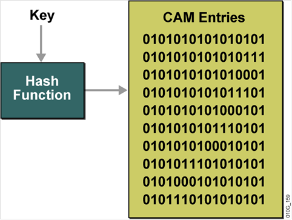
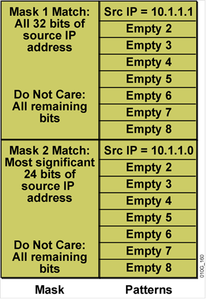
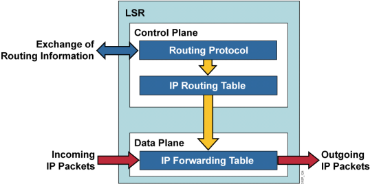
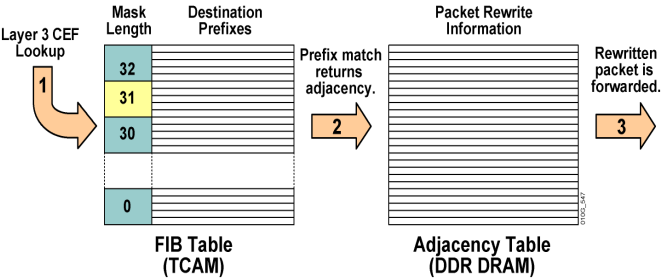
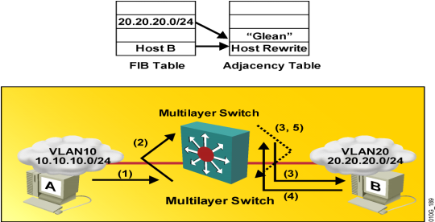

# VLAN间路由及多层交换

VLAN间路由及多层交换

2011年6月29日

16:38

**VLAN间路由有两种方式：**

**1.单臂路由**

**2.使用SVI接口**

**交换机中有2种3层接口：**

**1.路由接口：在接口打no sw，然后就可以配置IP地址了**

**2.SVI接口：SVI接口是一个虚拟的接口，在int vlan xxx下配置的接口就是SVI接口。主要功能就是用于完成VLAN间路由器选择**

**关于二层交换**

**1.不修改帧**

**关于三层交换**

**1.查表**

**2.改帧**

**关于三层交换**

**1.过程交换：也叫做进程交换**

**2.快速交换：一次路由，多次交换**

**3.拓扑交换：也叫做CEF交换，口诀：不需路由，次次交换**

**4.基于流的交换：思科不支持**

**关于CAM（Content Addressable Memory，内容可寻址内存）**

**1.CAM表只提供两种结果：0（真）和1（假）**

**2.CAM对于构建需要准确查找的表很有用**

**3.CAM一般用于MAC地址表，说白了就是二层交换的时候使用**

**4.CAM表中放的其实是Hash值**

**5.交换机查找CAM表时使用的信息叫做key（关键字）。**

**key=MAC地址+VLAN ID，将key做hash，然后在CAM中查找**

**6.**

**关于TCAM（Ternary Content Addressable Memory，三重内容可寻址内存）**

**1.TCAM提供三种结果：0，1和无关紧要（don't care）**

**2.TCAM对于构建需要最长匹配方式查找的表最有用**

**3.TCAM一般用于硬件ACL和CEF的FIB表中**

**4.**

**5.CEF中的FIB用的就是TCAM表**

FIB：转发信息库（cef） sh ip cef

CEF

cisco快速转发（高端设备，新设备默认）基于拓扑转发方式，cef是根据路由表形成的，所以说cef可由硬件来实现。cef也会在版块中开辟一块空间保存表项，cef使用的内存称为cache，快速转发的内存称为buffer，CEF也只对经过的流量起作用。

cef两张表：

1、FIB表，2、adjacency（邻接关系表）表

FIB表中保存三层信息：目的地址和递归查找后的下一跳或出口绑定，但fib表中还是存在最长匹配，但不存在递归查找

adjacency表保存二层信息：查了FIB表中下一跳信息后，然后查相应的二层信息，如ARP表后放进adjcency表中。保存了下一跳相应的二层信息。

命令

ip cef

show ip cef summary

sh ip inter s0/0

no ip route-cache cef //no ip cef

sh ip cef

sh adjacency

以上三种转发方式都是基于目的地址进行的，传统的转发在每台路由器上都要进行一次分类，代表每个路由器都要进行一次查找。

**关于CEF**

**口诀：两个平面两张表**

**1.控制平面（Control Plane）：3层，一般放路由协议等**

**数据平面（Data Plane）：2层，主要用来实现包转发**

**2.两张表：**

**（1）FIB：转发信息库，是RIB的映射**

**（2）邻居表**

**FIB和邻居表都在数据平面(转发层面)，RIB在控制平面**

RIB：路由信息库 sh ip route

LIB：标签信息库 sh mpls ldp binding

FIB：转发信息库（cef） sh ip cef

LFIB：标签转发信息库 sh mpls forwardeding-table

**3.CEF的查找过程：**

**关于ARP抑制**

**1.ARP throttling是基于CEF的一项重要的特性**

**2.ARP抑制的工作原理：**

**（1）Glean其实就是将几个数据包发给3层引擎，让3层引擎发送ARP来取得目标地址的重写信息**

**（2）此时将后续的数据包都丢弃，直到收到ARP响应为止**

**（3）如果2s内没有收到ARP回包，就再放过几个数据包给3层引擎，再发送ARP**

**（4）如果收到了，将回复信息写进邻居表，那么后续的包就可以根据邻居表进行转发了**

**R0#sh adjacency detail**

**Protocol Interface Address**

**IP FastEthernet0/0 12.1.1.2(5)**

**0 packets, 0 bytes**

**CC0102380000CC00023800000800**

**ARP 04:02:30**

**Epoch: 0**

**目标MAC地址：CC0102380000**

**源MAC地址：CC0002380000**

**类型：0800**

**查看命令：**

**sh ip cef：用来看FIB表**

**sh adjacency detail ：用来看邻居表**

**多层交换补充：**

**路由器可看做两个层面：控制层面和转发层面**

**控制层面：运行路由协议，分发路由信息，构建路由表--------路由协议**

**转发层面：根据入向数据包的目的部分进行转发**

**一、传统的数据转发方式（IP）**

**1、进程转发**

**每个数据包都要经过路由表的查找，递归查询，最长匹配，通过CPU运算。**

**2、快速转发（route-cache）**

**基于流的转发方式 ----------flow跟traffic的区别？**

**cisco低端设备和老的IOS默认的转发方式，相当于在内存中开辟一块空间（buffer），第一个数据包还是会查路由表，然后将（存储在buffer内，属于数据层面）目的地址、出接口、下一跳以及二层的封装的绑定关系放进这块内存中。后面来的相同目的地的数据包就不查路由表了，直接走转发层面了。**

**本路由器发起的包为进程转发，快速转发只对经过的流量起作用**

**3、CEF**

**cisco快速转发（高端设备，新设备默认）基于拓扑转发方式，cef是根据路由表形成的，所以说cef可由硬件来实现。cef也会在版块中开辟一块空间保存表项，CEF使用的内存称为cache，快速转发的内存称为buffer，CEF也只对经过的流量起作用。**

**cef两张表：**

**1、FIB表，2、adjacency（邻接关系表）表**

FIB：转发信息库（cef） sh ip cef

**FIB表中保存三层信息：目的地址和递归查找后的下一跳或出口绑定，但fib表中还是存在最长匹配，但不存在递归查找**

**adjacency表保存二层信息：查了FIB表中下一跳信息后，然后查相应的二层信息，如ARP表后放进adjcency表中。保存了下一跳相应的二层信息。**

**命令**

**ip cef**

**show ip cef summary**

**sh ip inter s0/0**

**no ip route-cache cef //no ip cef**

**sh ip cef**

**sh adjacency**

**以上三种转发方式都是基于目的地址进行的，传统的转发在每台路由器上都要进行一次分类，代表每个路由器都要进行一次查找。**