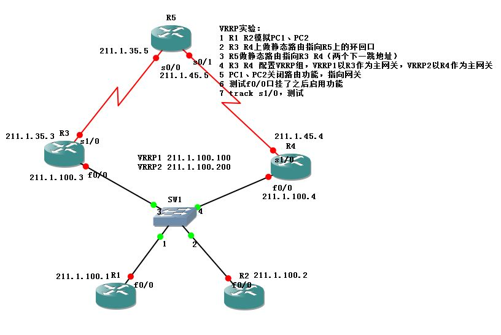

# VRRP配置

VRRP配置

2011年6月29日

16:50

VRRP

[VRRP技术白皮书.pdf](VRRP配置/VRRP技术白皮书.pdf)

1.公有的

2.一个虚拟IP地址，一个虚拟MAC地址

虚拟IP地址可以和真实IP地址相同

虚拟MAC地址：0000.5e00.01XX，其中XX是组号

3.一主多辅

4.VRRP默认优先级是100

5.协议号112，组播地址224.0.0.18，默认通告间隔1s

6.VRRP默认有抢占机制

HSRP与VRRP之间的区别：

1.HSRP是私有的，VRRP是公有的

2.HSRP是一主一辅，VRRP是一主多辅

3.HSRP的虚拟IP地址不能和真实IP地址相同，VRRP的虚拟IP地址和真实的IP地址相同

4.HSRP中主、辅设备都发送Hello包，VRRP中只有主设备发送Hello包

VRRP (Virtual Router Redundancy Protocol)

初始状态(Initialize)、主状态(Master)、备份状态(Backup)

R1(config)# track 1 int e0/1 line-protocol

定义跟踪组1，跟踪int e0/1状态

R1(config-if)# vrrp 1 ip 192.168.1.254

加入备份组1

R1(config-if)# vrrp 1 timers advertise 2

设置通告时间

R1(config-if)# vrrp 1 timers learn

设置向master learn timer set

R1(config-if)# vrrp 1 priority 200

设置优先级200

R1(config-if)# vrrp 1 authentication md5 key-string cisco

设置认证md5类型

R1(config-if)# vrrp 1 track 1 decrement 100

跟踪接口

R2(config)# track 1 int e0/1 line-protocol

R2(config-if)# vrrp 1 ip 192.168.1.254

R2(config-if)# vrrp 1 timers advertise 2

R2(config-if)# vrrp 1 timers learn //配置使backup设备能从master设备学习到master配置过的时间

R2(config-if)# vrrp 1 priority 150

R2(config-if)# vrrp 1 authentication md5 key-string cisco

R1(config-if)# vrrp 1 track 1 decrement 10

实验：

<<VRRP.net>>

