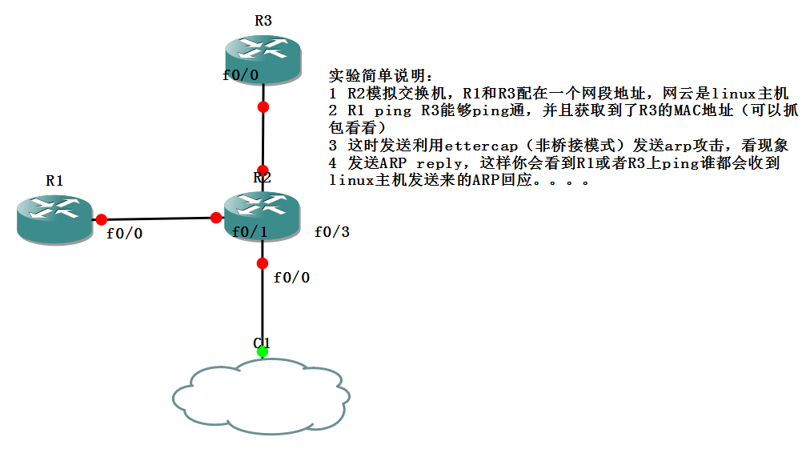
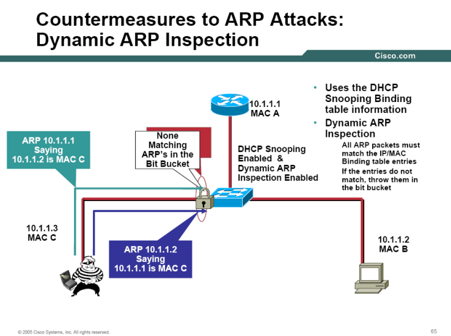
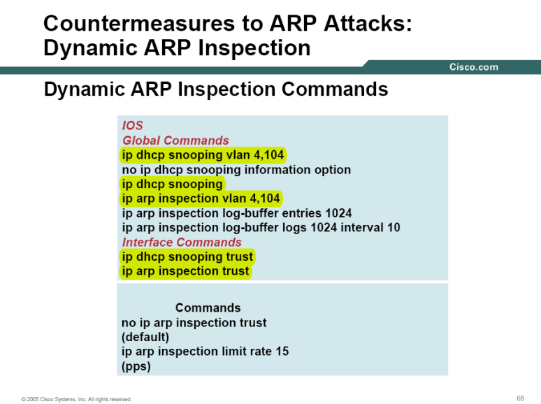
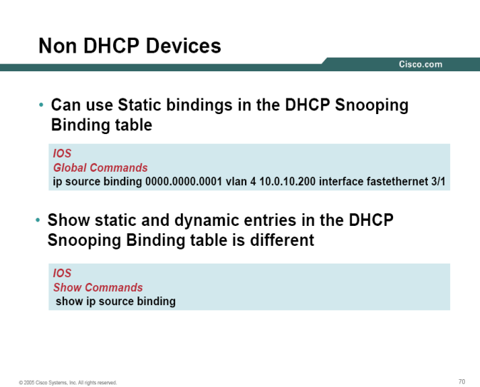

# ARP以及针对于ARP的攻击

ARP以及针对于ARP的攻击

2011年7月7日

15:13

> 关于ARP以及针对于ARP的攻击
> 
> 
> ARP分为4种：
> 
> 1 ARP：将IP地址解析为MAC地址，使用Request和Reply两种包，Request是广播，Reply是单播
> 
> 2 RARP（反向ARP）：将MAC地址解析为IP地址。一般用在网吧的无盘网络中。在NBMA环境中，你所面临的问题通常并不是已知IP地址而想要知道MAC地址（或其他数据链路层地址）；而恰巧相反。例如，在帧中继中，早已知道我们用来与邻居进行通信的物理地址（DLCI），因此，我们首先必须使用该物理地址来建立连接。但是，并不是我们邻居的IP地址。
> 
> 3 无故ARP：无故ARP在主机启动的时候发送，以及在重新配置IP地址的时候发送。当电脑加入网络之后
> 
> 每隔一段时候也会产生无故ARP
> 
> 主机有时会使用自己的IP地址作为目标地址发送ARP请求。这种ARP请求称为无故ARP，主要有两个用途：
> 
> （1）检查重复地址（如果收到ARP响应表明存在重复地址）。
> 
> （2）用于通告一个新的数据链路标识。当一个设备收到一个arp请求时，发现arp缓冲区中已有发送者的IP地址，则更新此IP地址的MAC地址条目。 因为它不是经过其他主机的ARP请求广播后发出的ARP广播，所以叫无故ARP
> 
> 4 代理ARP：一般用在路由器或者3层交换机上。如果路由器或者3层交换机在打开代理ARP的情况下，如果收到ARP的请求包的请求地址不是自己的，但是在自己的路由表中可以到达，那么路由器或者3层交换机会伪装目标地址，以自己的MAC地址作为回复。
> 
> 2.ARP的攻击
> 
> 原理
> 
> 
> 
> 3.解决方法：动态ARP检测（Dynamic ARP Inspection）
> 

> 动态ARP检测（DAI）会检查DHCP Snooping表中的IP地址和MAC地址字段，如果从这个接口流入的帧的源MAC地址和源IP地址符合这个绑定表中的数据，就转发，如果不符合，就丢弃并记录违规行为，而且这个违规端口将进入err-disable状态。
> 
> 
> 4.配置：
> 
> 在配置DAI之前，需要配置DHCP监听。
> 

> 还可以静态的绑定，如果没有配置DHCP监听特性的话。
> 
> 
> 
> 
> DAI将丢弃任何具有无效MAC地址/IP地址绑定的ARP数据包。
> 
> DAI也可以限定入站ARP数据包的速率，如果超速，端口进入err-disable状态
> 
> ip arp inspection limit rate *value*
> 
> 5.使用ARP检测的注意点：
> 
> （1）动态ARP检测通过检查ARP的request和response消息来阻止ARP的攻击
> 
> （2）必须要先配置DHCP Snooping，当DHCP Snooping配置了一段时间后，也就是DHCP Snooping的表已经形成了，再开启DAI
> 
> （3）DHCP Snooping表是由DHCP request消息构成的，也可以使用静态配置条目
>