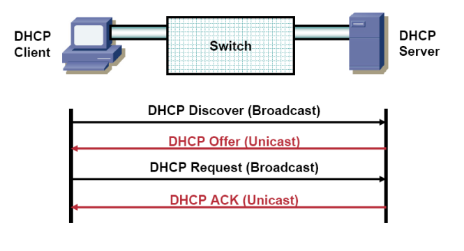
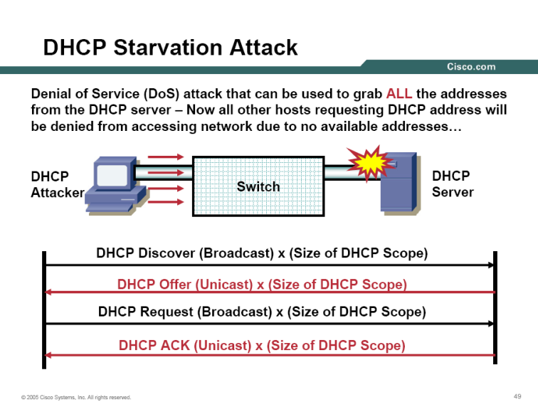
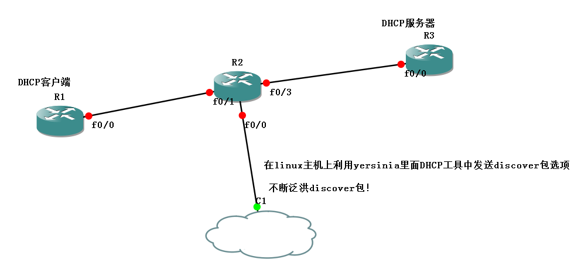
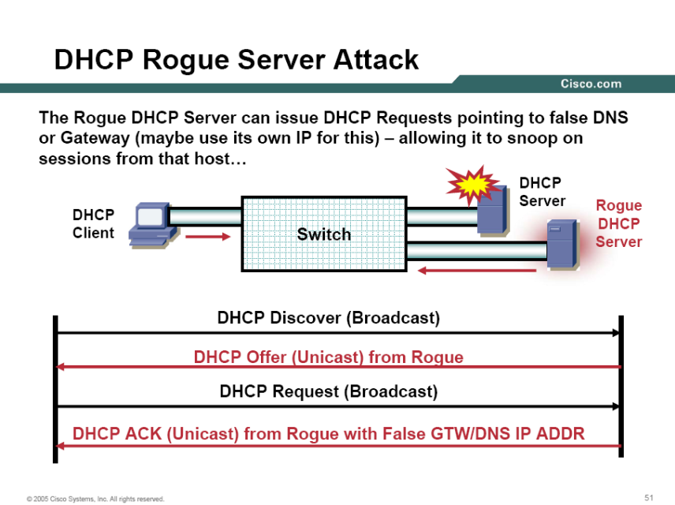
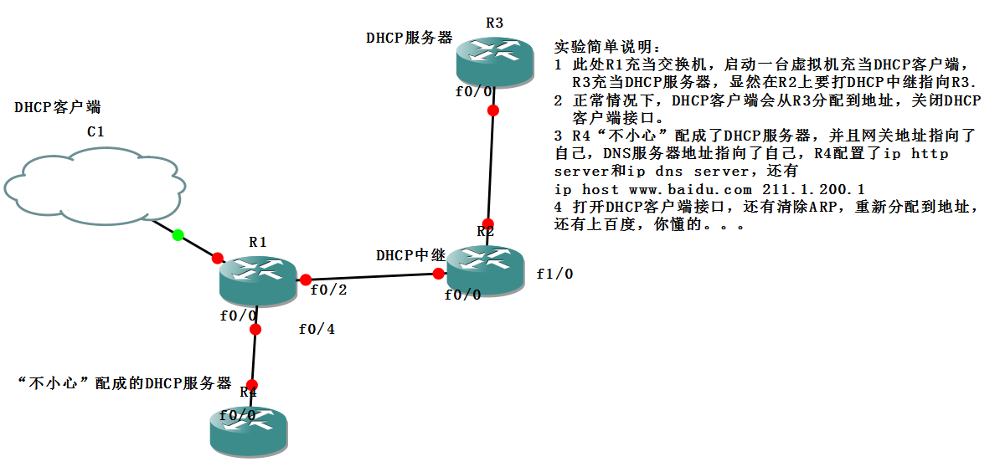
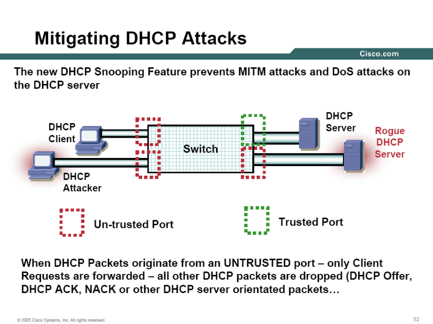
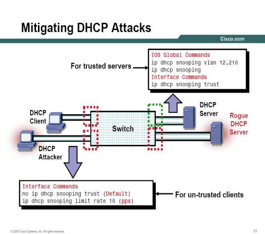
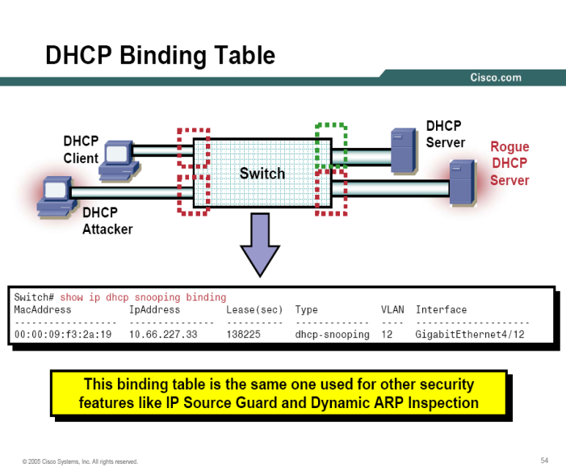

# DHCP的攻击

DHCP的攻击

2011年7月7日

15:07

> 关于DHCP的攻击
> 
> 
> **server dhcp**
> 
> **no ip dhcp conflict logging**
> 
> **ip dhcp excluded-address 10.1.1.1**
> 
> **ip dhcp pool DHCP**
> 
> **network 10.1.1.0 /24**
> 
> **default-router 10.1.1.1**
> 
> **dns-server 8.8.8.8**
> 
> **lease 2**
> 
> **domain-name cisco.com**
> 
> **import all**
> 
> **DHCP工作原理：**
> 

> 攻击方法：2种
> 
> 
> **（1）DHCP饿死攻击：说白了，很简单，就是攻击者发送很多DHCP discover包耗尽DHCP服务器的IP地址**
> 

> 模拟DHCP饿死攻击
> 
> 
> 
> 
> **（2）DHCP的哄骗攻击**
> 
> 
> 
> **DHCP欺骗攻击**
> 
> 
> 
> **解决方法：**
> 
> **（1）对于DHCP饿死攻击的解决方法是使用端口安全**
> 
> **（2）对于DHCP哄骗攻击的解决方法是使用DHCP snooping**
> 
> 
> 
> **说白了，很简单，就是将交换机的端口分为信任端口和非信任端口，只有信任端口才可以回复offer包，管理员只需要将连接DHCP服务器的端口指定为信任端口就可以了。终端用户端口（非信任端口）只能够发送DHCP请求。**
> 
> 
> 
> **建议在合法DHCP服务器端口以及接入层交换机和分布层交换机之间的互联端口（能够提供达到DHCP服务器的路径）上启用信任端口。还建议将接入交换机上的终端用户工作站端口保持为非信任端口状态。**
> 
> **配置**
> 
> **ip dhcp snooping //开启dhcp snooping ，交换机上所有的端口都被设置为不信任端口**
> 
> **ip dhcp snooping vlan 10**
> 
> **int fa 0/0 //f0/0是连接dhcp服务器的接口**
> 
> **ip dhcp snooping trust**
> 
> **ip dhcp snooping limit rate 100 //配置DHCP请求限速，避免DHCP DoS攻击**
> 
> **关于DHCP的绑定表**
> 
> 
> 
> **1.这张表是由DHCP snooping产生的**
> 
> **2.这张表有以下要素：MAC地址，IP地址，VLAN号，端口号，租用和绑定类型等信息。**
> 
> **3.这张表是解决ARP攻击，哄骗攻击的前提**
> 
> **查看命令：show ip dhcp snooping binding**
>