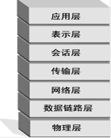

# 目前的安全形势

目前的安全形势

2011年7月7日

14:55

目前的网络安全状态

·2001年5月,中美黑客网络大战，中美撞机事件发生后，中美

黑客之间发生的网络大战愈演愈烈。自4月4日以来，美国黑

客组织PoizonBOx不断袭击中国网站。对此，我国的网络安全

人员积极防备美方黑客的攻击。中国一些黑客组织则在“五一”

期间打响了“黑客反击战”!

· 2002年11月，伦敦黑客Gary McKinnon在英国被指控侵入美国军

方90多个电脑系统。他现在正接受英国法院就“快速引渡”去美

国一事的审理。

·2006年10月16日，中国骇客whboy（李俊）发布熊猫烧香木马.

并在短短时间内，致使中国数百万用户受到感染，并波及到周

边国家，比如日本。他于2007年2月12日被捕。

·2007年，中国一名网名为The Silent's(折羽鸿鹄)的黑客在6月至11

月成功侵入包括CCTV、163、TOM等中国大型门户服务器。（据

说其成功过入侵微软中国的服务器，另外相传是微软中国的内部

工作人员给他的权限。）

·2008年，一个全球性的黑客组织，利用ATM 欺诈程序在一夜之间

从世界49个城市的银行中盗走了900w美元。黑客们攻破的是一种

名为RBS WorldPay 的银行系统，用各种奇技淫巧取得了数据库内

的银行卡信息，并在11月8日午夜，利用团伙作案从世界49个城

市总计超过130台ATM机上提取了900w美元。最关键的是，目前

FBI 还没破案，甚至据说连一个嫌疑人都没找到。

·2009年7月7日，韩国遭受有史以来最猛烈的一次攻击。韩国总

统府、国会、国情院和国防部等国家机关，以及金融界、媒体

和防火墙企业网站进行了攻击。9日韩国国家情报院和国民银行

网站无法被访问。韩国国会、国防部、外交通商部等机构的网站

一度无法打开！这是韩国遭遇的有史以来最强的一次黑客攻击。

·2010年1月12日上午7点钟开始，全球最大中文搜索引擎“百度”

遭到黑客攻击，长时间无法正常访问。主要表现为跳转到一雅虎

出错页面、伊朗网军图片，出现“天外符号”等，范围涉及四川

、福建、江苏、吉林、浙江、北京、广东等国内绝大部分省市。

这次攻击百度的黑客疑似来自境外，利用了DNS记录篡改的方式。

这是自百度建立以来，所遭遇的持续时间最长、影响最严重的

黑客攻击，网民访问百度时，会被定向到一个位于荷兰的IP地址，

百度旗下所有子域名均无法正常访问。

