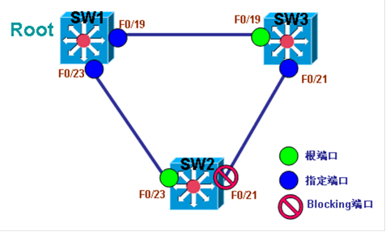

# BackboneFast

BackboneFast

2011年7月7日

14:31

> 以下图为例来解释BackboneFast的功能与作用：
> 

还是与UplinkFast同样的网络环境， 当SW2上直连的活动链路F0/23断掉之后，SW2可以立刻检测出来，并且通过UplinkFast功能可以立即启用Blocking的端口F0/21，提供网络快速收敛和恢复的功能。

交换机SW3无论去往根交换机SW1还是去往SW2，都只能从F0/19走，如果SW3上的F0/19中断了，那么SW3去往SW1和SW2的唯一出口也就断掉了，此时的SW3不能与外界通信，正常情况下，需要等待SW2将自己的端口F0/21从Blocking状态过渡到转发状态后，才能为SW3提供一条新的通路。然而，即使是开启了UplinkFast功能的SW2，也并不能在SW3的F0/19中断后立刻检测到，因为UplinkFast只能检测到自己直连的链路中断，并不能检测到远程链路中断。要在SW3的F0/19中断时，让其它所有交换机都检测到，从而为中断链路的交换机打开一条新的通路，需要在网络中所有交换机上开启BackboneFast功能。

因为正常网络中，除了根交换机，其它交换机不能发出BPDU，所以SW3不能发送BPDU，如果网络中出现了除根交换机发出的configuration BPDU之外的其它优先级更低的BPDU，则称为Inferior BPDU，当交换机收到Inferior BPDU时，默认是丢弃处理。

如果SW3上开启了BackboneFast功能，则当自己使用中的链路中断时，并且自己又没有Blocking状态的端口可以立即启用来代替活动链路，在这种情况下，就可以以自己为根交换机，向网络中发出Inferior BPDU，inferior BPDU表示一台交换机即是根交换机，又是普通交换机，inferior BPDU用来宣靠自己的链路中断，已经与网络失去联系。当其它非根交换机，当SW2在Blocking端口收到Inferior BPDU后，如果自己也开启了BackboneFast功能，就会将Blocking端口变成转发状态，还会向根交换机发出一个root link query (RLQ)根链路查询，并且开启了BackboneFast功能的根交换机会做出回应，时此SW2就可以立刻启用自己Blocking状态的端口F0/21，为SW3连接网络提供一条新的通路。

从上述可以看出，要网络中所有的交换机都能理解Inferior BPDU，要全部配合工作，为链路中断的交换机开劈一条新通路，就必须在网络中所有交换机上都开启BackboneFast功能。

所以在开启BackboneFast功能时，需要在网络中所有交换机上开启，不能针对VLAN单独开启，也不支持MSTP模式。BackboneFast是对UplinkFast的强化与补充。

**配置**

**1.在非根交换机上开启BackboneFast**

**(1)在交换机SW1上开启BackboneFast**

sw1(config)#spanning-tree backbonefast

**(2) 在交换机SW2上开启BackboneFast**

sw2(config)#spanning-tree backbonefast

**(3) 在交换机SW3上开启BackboneFast**

sw3(config)#spanning-tree backbonefast

**2.查看BackboneFast**

**(1)查看交换机SW1的BackboneFast**

sw1#sh spanning-tree backbonefast

BackboneFast is enabled

BackboneFast statistics

- ----------------------

Number of transition via backboneFast (all VLANs)           : 0

Number of inferior BPDUs received (all VLANs)               : 0

Number of RLQ request PDUs received (all VLANs)             : 0

Number of RLQ response PDUs received (all VLANs)            : 0

Number of RLQ request PDUs sent (all VLANs)                 : 0

Number of RLQ response PDUs sent (all VLANs)                : 0

sw1#

**(2)查看交换机SW2的BackboneFast**

sw2#sh spanning-tree backbonefast

BackboneFast is enabled

BackboneFast statistics

- ----------------------

Number of transition via backboneFast (all VLANs)           : 0

Number of inferior BPDUs received (all VLANs)               : 0

Number of RLQ request PDUs received (all VLANs)             : 0

Number of RLQ response PDUs received (all VLANs)            : 0

Number of RLQ request PDUs sent (all VLANs)                 : 0

Number of RLQ response PDUs sent (all VLANs)                : 0

sw2#

**(3)查看交换机SW3的BackboneFast**

sw3#sh spanning-tree backbonefast

BackboneFast is enabled

BackboneFast statistics

- ----------------------

Number of transition via backboneFast (all VLANs)           : 0

Number of inferior BPDUs received (all VLANs)               : 0

Number of RLQ request PDUs received (all VLANs)             : 0

Number of RLQ response PDUs received (all VLANs)            : 0

Number of RLQ request PDUs sent (all VLANs)                 : 0

Number of RLQ response PDUs sent (all VLANs)                : 0

sw3#