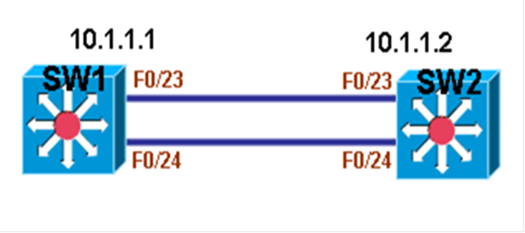

# EtherChannel

EtherChannel

2011年7月7日

14:16

> 当在两台交换机之间连接多条线路来增加带宽时，由于STP的原因，最终会阻断其它多余的线路而只留下一条活动链路来转发数据，因此，在两台交换机之间连接多条线路，并不能起到增加带宽的作用。为了能够让两台交换机之间连接的多条线路同时提供数据转发以达到增加带宽的效果，可以通过EtherChannel来实现。
> 
> 
> EtherChannel将交换机上的多条线路捆绑成一个组，相当于逻辑链路，组中活动的物理链路同时提供数据转发，可以提高链路带宽。**当组中有物理链路断掉后，那么流量将被转移到剩下的活动链路中去，只要组中还有活动链路，用户的流量就不会中断。**
> 
> EtherChannel只支持对Fast Ethernet接口或Gigabit Ethernet接口的捆绑，对于10M的接口还不支持。一个EtherChannel组中，最多只能有8个接口为用户转发数据。
> 
> 在两台交换机之间连接多条链路时，如果只有一边交换机做了EtherChannel捆绑，而另一边不做捆绑，那么接口会工作在异常状态，而不能正常转发流量。所以，必须同时在两边交换机都做EtherChanne捆绑。
> 
> 为了让两边交换机的接口都工作在EtherChannel组中，可以通过手工强制指定接口工作在组中，也可以通过协议自动协商。如果是手工强制指定，则不需要协议，自动协议的协议有以下两种：
> 
> **Port Aggregation Protocol (PAgP)**
> 
> **Link Aggregation Control Protocol (LACP)**
> 
> 无论是手工指定，还是通过协议协商，交换机双方都必须采取相同的方式和协议，否则将导致接口异常。
> 
> EtherChannel自动协商协议PAgP为思科专有，只有在双方交换机都为思科交换机时，才可以使用，而LACP为IEEE协议，任何交换机，只要支持EtherChannel的都可以使用该协议。
> 
> 当将接口使用PAgP作为协商协议时，有以下两种模式可供选择：
> 
> **Auto**
> 
> 只接收PAgP协商消息，并做出回应同意工作在EtherChannel下，并不主动发出PAgP协商，属于被动状态。
> 
> **Desirable**
> 
> 主动发送PAGP协商消息，主动要求对方工作在EtherChannel下，属于主动模式。
> 
> 如果两边交换机都是Desirable模式，则可以协商成功，如果两边都是Auto模式，则不能工作在EtherChannel。
> 
> 当将接口使用LACP作为协商协议时，有以下两种模式可供选择：
> 
> **Passive**
> 
> 只接收LACP协商消息，并做出回应同意工作在EtherChannel下，并不主动发出LACP协商，属于被动状态。
> 
> **Active**
> 
> 主动发送LACP协商消息，主动要求对方工作在EtherChannel下，属于主动模式。
> 
> 如果两边交换机都是Active模式，则可以协商成功，如果两边都是Passive模式，则不能工作在EtherChannel。
> 
> 在配置EtherChannel时，除了在接口上配置以上两种协议来自动协商外，**还可以强制让接口工作在EtherChannel而不需要协商，配置为ON模式即可，如果配置ON，则两边都必须配置为ON，否则不能转发数据。**
> 
> 下表为配置EtherChannel的模式总结：
> 

[Untitled](EtherChannel/Untitled%20Database%20000bc3aa32514ba49e797855b3222eb9.csv)

> 
> 
> 
> 当配置PAGP时，可以使用关键字non-silent，如果不指定non-silent，默认为silent。
> 
> Silent表示即使不能从对端设备收到PAGP协商数据，也使物理接口工作在EtherChannel组中，思科建议接口连接服务器或分析仪时使用。
> 
> non-silent表示只有在和对方协商成功之后，才使物理接口工作在EtherChannel组中。也就是说只有双方都支持PAGP的情况下，才才使物理接口工作在EtherChannel组中。
> 
> 因为三层交换机的接口即可以工作在二层模式，也可以工作在三层模式，所以EtherChannel捆绑后的逻辑接口也有二层和三层之分。
> 
> 当将接口EtherChannel捆绑后，会自动生成逻辑接口，称为port-channel接口，port-channel接口与EtherChannel组的号码相同，但范围是1-48。当使用二层接口时，在物理接口下配置参数后，port-channel接口将读取物理接口下的参数，但必须组成的所有接口都做相同的配置；在port-channel接口下做的配置也会自动在物理接口下生效。当使用三层接口时，必须先将物理接口变成三层接口后，再做捆绑，因为port-channel接口是不能在二层与三层之间转换的，配置三层接口，应该到port-channel接口下做的配置，而不应该直接配置物理接口。
> 
> 如果是使用2层EtherChannel，那么组中第一个正常工作的口接口的MAC地址就是port-channel接口接口的MAC地址。
> 
> **注：**
> 
> ★在配置EtherChannel组时，需要定义组号码，但不要配置超过48个组。
> 
> ★两边交换机的EtherChannel组号码可以采用不同号码。
> 
> ★PAGP组中不能配超过8个接口。
> 
> ★LACP中不能超过16个接口，但只有8个活动接口。
> 
> ★两个协议可以配置在同台交换机上，但不能配置在同一个组中。
> 
> ★组中的接口不能是SPAN的目标接口和安全接口以及802.1x端口。
> 
> ★将接口配置为2层时，全部必须在相同VLAN，如果是trunk，native vlan必须相同。
> 
> ★配好EtherChannel组后后，在port-channel下配的参数会对所有物理接口生效，但对单个物理接口配置的只对单物理接口生效。
> 
> ★多个接口捆绑成单条EtherChannel后，在STP中，被当作单条链路来计算，同时Path Cost值会和原物理链路有所不同。
> 
> **EtherChannel Load Balancing**
> 
> 当将多个接口捆绑成EtherChannel组之后，流量将同时从多个接口上被发出去，称为Load Balancing,即负载均衡，对于流量以什么样的负载均衡方式从EtherChannel组中的多个接口上发出去，可以有以下几种方式：
> 
> **Souce-MAC**
> 
> 基于源MAC，默认为此模式，不同源主机，流量可能从不同的接口被发出去，但相同源主机肯定走相同接口。
> 
> **Source-and-Destination MAC**
> 
> 同时基于源和目标MAC，流量从主机A到主机B，从主机A到主机C以及从主机C到主机B都可能走不同的接口。
> 
> **Source-IP**
> 
> 基于源IP，不能源IP的流量可能走不同接口，相同IP则走相同接口。
> 
> **Destination-IP**
> 
> 基于目的IP，到不同目标IP的流量，会走不同接口，不同主机发往相同IP的流量会走相同接口。
> 
> **Source-and-Destination IP**
> 
> 同时基于源和目标IP，流量从主机A到主机B，从主机A到主机C以及从主机C到主机B都可能走不同的接口。
> 
> **注：**并不是所有型号的交换机所有IOS都支持所有负载方式，需要视IOS版本而定。
> 
> 在交换机之间通过EtherChannel捆绑了多条链路后，默认执行基于源MAC的负载均衡，而每条链路的流量比例却是固定的，也就是说，你只能改变EtherChannel负载均衡方式，但却改不了每条物理链路上的流量比例。
> 
> **配置**
> 

> 
> 
> 
> **1.配置2层EtherChannel**
> 
> **(1)配置SW1**
> 
> sw1(config)#int range f0/23 - 24
> 
> sw1(config-if-range)#channel-group 12 mode desirable
> 
> **说明：**在接口F0/23-24下选用PAGP配置EtherChannel
> 
> **（2）配置SW2**
> 
> sw2(config)#int range f0/23-24
> 
> sw2(config-if-range)#channel-group 12 mode desirable
> 
> **说明：**在接口F0/23-24下选用PAGP配置EtherChannel
> 
> **（3）查看EtherChannel**
> 
> sw1#show etherchannel summary
> 
> Flags:  D - down        P - in port-channel
> 
> I - stand-alone s - suspended
> 
> H - Hot-standby (LACP only)
> 
> R - Layer3      S - Layer2
> 
> U - in use      f - failed to allocate aggregator
> 
> u - unsuitable for bundling
> 
> w - waiting to be aggregated
> 
> d - default port
> 
> Number of channel-groups in use: 1
> 
> Number of aggregators:           1
> 
> Group  Port-channel  Protocol    Ports
> 
> - -----+-------------+-----------+-----------------------------------------------
> 
> 12     Po12(SU)        PAgP      Fa0/23(P)   Fa0/24(P)
> 
> sw1#
> 
> **说明：**可以看到，已捆绑的接口为2层接口，并且所有物理接口都工作在EtherChannel下。
> 
> **（4）在port-channel接口下配置接口**
> 
> sw1(config)#int port-channel 12
> 
> sw1(config-if)#switchport mode access
> 
> sw1(config-if)#switchport access vlan 10
> 
> 说明：port-channel接口下将接口划入VLAN。
> 
> **（5）查看port-channel接口MAC地址**
> 
> F0/23：
> 
> sw1#sh int f0/23
> 
> FastEthernet0/23 is up, line protocol is up (connected)
> 
> Hardware is Fast Ethernet, address is 007d.618d.0317 (bia 007d.618d.0317)
> 
> （输出被省略）
> 
> sw1#
> 
> F0/24
> 
> sw1#sh int f0/24
> 
> FastEthernet0/24 is up, line protocol is up (connected)
> 
> Hardware is Fast Ethernet, address is 007d.618d.0318 (bia 007d.618d.0318)
> 
> （输出被省略）
> 
> sw1#
> 
> port-channel：
> 
> sw1#sh int port-channel 12
> 
> Port-channel12 is up, line protocol is up (connected)
> 
> Hardware is EtherChannel, address is 007d.618d.0318 (bia 007d.618d.0318)
> 
> （输出被省略）
> 
> sw1#
> 
> **说明：**port-channel使用了接口F0/24下的MAC地址，说明接口F0/24先工作正常。
> 
> **2.配置3层EtherChannel**
> 
> **(1)配置SW1**
> 
> sw1(config)#int range f0/23 - 24
> 
> sw1(config-if-range)#no switchport
> 
> sw1(config-if-range)#channel-group 12 mode active
> 
> sw1(config)#int port-channel 12
> 
> sw1(config-if)#ip address 10.1.1.1 255.255.255.0
> 
> **说明：**配置3层EtherChannel，需要先将物理接口变成3层接口后，才能正常配置，IP地址必须在port-channel下配置。
> 
> **（2）配置SW2**
> 
> sw2(config)#int range f0/23 - 24
> 
> sw2(config-if-range)#no switchport
> 
> sw2(config-if-range)#channel-group 12 mo active
> 
> sw2(config)#int port-channel 12
> 
> sw2(config-if)#ip address 10.1.1.2 255.255.255.0
> 
> **说明：**配置3层EtherChannel，需要先将物理接口变成3层接口后，才能正常配置，IP地址必须在port-channel下配置。
> 
> **（3）查看EtherChannel**
> 
> sw1#sh eth summary
> 
> Flags:  D - down        P - in port-channel
> 
> I - stand-alone s - suspended
> 
> H - Hot-standby (LACP only)
> 
> R - Layer3      S - Layer2
> 
> U - in use      f - failed to allocate aggregator
> 
> u - unsuitable for bundling
> 
> w - waiting to be aggregated
> 
> d - default port
> 
> Number of channel-groups in use: 1
> 
> Number of aggregators:           1
> 
> Group  Port-channel  Protocol    Ports
> 
> - -----+-------------+-----------+-----------------------------------------------
> 
> 12     Po12(RU)        LACP      Fa0/23(P)   Fa0/24(P)
> 
> sw1#
> 
> **说明：**可以看到，已捆绑的接口为3层接口，并且所有物理接口都工作在EtherChannel下。
> 
> **（4）测试port-channel连通性**
> 
> sw1#ping 10.1.1.2
> 
> Type escape sequence to abort.
> 
> Sending 5, 100-byte ICMP Echos to 10.1.1.2, timeout is 2 seconds:
> 
> !!!!!
> 
> Success rate is 100 percent (5/5), round-trip min/avg/max = 1/2/4 ms
> 
> sw1#
> 
> **说明：**port-channel正常工作在3层。
> 
> **3.配置Load Balancing**
> 
> **（1）配置基于目标MAC的负载均衡**
> 
> sw1(config)#port-channel load-balance dst-mac
> 
> **说明：**开启了基于目标MAC的负载均衡，默认为基于源MAC，其它负载方式，可自行配置。
> 
> **（2）查看EtherChannel Load Balancing**
> 
> sw1#sh etherchannel load-balance
> 
> EtherChannel Load-Balancing Configuration:
> 
> dst-mac
> 
> EtherChannel Load-Balancing Addresses Used Per-Protocol:
> 
> Non-IP: Destination MAC address
> 
> IPv4: Destination MAC address
> 
> sw1#
> 
> **说明：**可以看到，EtherChannel已经基于MAC的负载均衡。
> 
> **附：**当配置PAGP时，可以选择配置non-silent，默认为silent，配置如下：
> 
> sw1(config)#int range f0/23 - 24
> 
> sw1(config-if-range)#channel-group 12 mode desirable non-silent
> 

> 
>