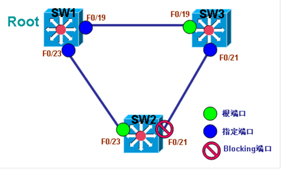

# UplinkFast

UplinkFast

2011年7月7日

14:29

> 以下图为例来解释UplinkFast的功能与作用：
> 

在如上图一个运行STP的网络环境中，SW1被选为根交换机，SW2与SW3为普通交换机，其中SW3上的两个端口都为转发状态；SW2上的端口F0/23为转发状态，而F0/21却为Blocking状态，因此无论SW2去往根交换机SW1还是去往SW3，都只能从F0/23走。

当SW2的端口F0/23失效后，那么SW2去往SW1和SW3的唯一出口也就断掉了，如果SW2要启用Blocking的端口F0/21，在CST下必须等待一个max-age时间（20秒），再加两个forward delay（共30秒），总共50秒的时间后，才能启用Blocking端口，即使是RSTP，也有可能要等待6秒才能启用Blocking端口。

对于SW2来说，自己的端口F0/23断掉后，完全可以立刻检测出来，并且完全可以立刻启用Blocking的端口F0/21，从而缩短网络的故障恢复时间。开启了UplinkFast交换机就能够在检测到交换机上直连的转发状态的接口失效后，立即启用Blocking的端口，提供网络快速收敛和恢复的功能。

很明显，UplinkFast要真正起到作用，交换机上必须有Blocking的端口存在才行，因为根交换机上所有的接口最终都会变成指定端口，所以UplinkFast在根交换机上开启是毫无意义的，UplinkFast只适合在非根交换机，即普通交换机上开启，普通交换机有时又称接入交换机。

★UplinkFast只能在交换机上全局开启，不能针对VLAN单独开启，也不支持MSTP模式。

★UplinkFast恢复网络的时间大约在1到5秒。

**配置**

**1 在非根交换机上开启UplinkFast**

**(1)在交换机SW2上开启UplinkFast**

Sw2(config)#spanning-tree uplinkfast

**(2) 在交换机SW3上开启UplinkFast**

sw3(config)#spanning-tree uplinkfast

**2 查看UplinkFast**

**(1)查看交换机SW2的UplinkFast**

sw2#sh spanning-tree uplinkfast

UplinkFast is enabled

Station update rate set to 150 packets/sec.

UplinkFast statistics

- ----------------------

Number of transitions via uplinkFast (all VLANs)            : 3

Number of proxy multicast addresses transmitted (all VLANs) : 0

Name                 Interface List

- ------------------- ------------------------------------

VLAN0001             Fa0/23(fwd), Fa0/21

sw2#

**说明：**SW2在直连活动链路F0/23失效后，可将F0/21恢复。

**(2)查看交换机SW3的UplinkFast**

sw3#sh spanning-tree uplinkfast

UplinkFast is enabled

Station update rate set to 150 packets/sec.

UplinkFast statistics

- ----------------------

Number of transitions via uplinkFast (all VLANs)            : 0

Number of proxy multicast addresses transmitted (all VLANs) : 0

Name                 Interface List

- ------------------- ------------------------------------

VLAN0001             Fa0/19(fwd)

sw3#

**说明：**SW3在直连活动链路F0/19失效后，没有可恢复的端口。