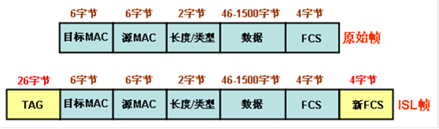
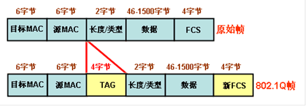
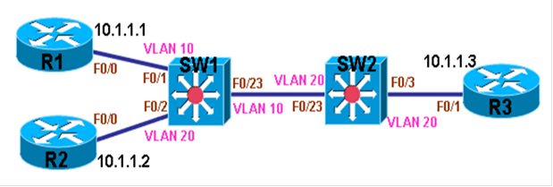
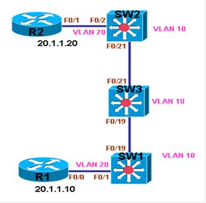

# trunk

trunk

2011年7月7日

14:13

> 在交换机上，可以将access接口划入各个VLAN中，不同VLAN的流量是不被交换机转发的。如果要让两个access接口互相通信，就必须将这两个接口划入相同的VLAN中。
> 
> 
> 当需要在交换机与交换机之间通信时，连接交换机的链路就可能需要为多个VLAN提供数据传输，这样在一条链路上提供多个VLAN数据传输的链路，就是Trunk，**进入Trunk的数据包被打上标记，写上相应的VLAN号，当传输到对端时，则被去掉标记，并且根据VLAN号将数据包转发到相应的VLAN中。**需要说明，在access接口上的数据包，是没有VLAN号标记的，并且也不允许VLAN标记，如果一个access接口收到一个带有VLAN标记的数据包，是要将数据包丢弃的。
> 
> 在Trunk上为数据包打标记是通过协议来完成的，目前有两种协议可以完成VLAN标记工作，分别是Inter-Switch Link (ISL)和IEEE 802.1Q，其中ISL为思科私有协议。
> 
> 当Trunk使用ISL封装时，将对进入Trunk的每个VLAN的数据包打上标记，当ISL收到一个没有标记的数据帧，直接丢弃。ISL在原始以太网数据帧的基础上，额外加上26字节的标记，但最多只支持1000个VLAN，除此之外，ISL还将对整个数据帧重新计算FCS，在帧的最后插入4字节的新FCS，也就是说，ISL会在原始数据帧的基础上再加30字节，数据包结构如下：
> 

可以看出，原始以太网帧的大小范围为64-1518字节，而ISL帧的大小范围为94-1548字节。当ISL Trunk收到数据帧后，直接去掉ISL标记和新FCS后，就可马上转发。

当Trunk使用IEEE 802.1Q封装时，将对除了Native VLAN之外的所有VLAN打上标记，如果802.1Q收到一个没有VLAN标记的数据帧，将其在Native VLAN内转发，所以请确保Trunk两头的Native VLAN号是一致的。802.1Q在原始以太网帧中插入4字节的标记，支持4096个VLAN，

数据包结构如下：

可以看出，原始以太网帧的大小范围为64-1518字节，而802.1Q帧的大小范围为68-1522字节。当802.1Q Trunk收到数据帧后，去掉802.1Q标记之外，还要重新计算FCS才有转发。

**配置**

<<vlan_trunk.net>>

**说明：**只有数据帧经过Trunk时，才会打上VLAN标记，而经过access接口的数据帧是没有标记的，当一个access接口属于某个VLAN，那么从此接口收到的数据帧都被认为是此VLAN的数据，因此就可与该接口相同VLAN的主机通信。下面以上图配置。

**1.在交换机上将access接口划入相应VLAN**

**（1）在SW1上做相应配置**

sw1(config)#vlan 10

sw1(config-vlan)#exit

sw1(config)#vlan 20

sw1(config-vlan)#exit

sw1(config)#int f0/1

sw1(config-if)#switchport mode access

sw1(config-if)#switchport access vlan 10

sw1(config-if)#no shutdown

sw1(config-if)#exit

sw1(config)#int f0/2

sw1(config-if)#switchport mode access

sw1(config-if)#switchport access vlan 20

sw1(config-if)#no shutdown

sw1(config-if)#exit

sw1(config)#int f0/23

sw1(config-if)#switchport mode access

sw1(config-if)#switchport access vlan 10

sw1(config-if)#no shutdown

**（2）在SW2上做相应配置**

sw2(config)#vlan 20

sw2(config-vlan)#exit

sw2(config)#int range f0/3 , f0/23

sw2(config-if-range)#switchport mode access

sw2(config-if-range)#switchport access vlan 20

sw2(config-if-range)#no shutdown

sw2(config-if-range)#exit

**2.配置各路由器**

**（1）配置R1**

r1(config)#int f0/0

r1(config-if)#ip add 10.1.1.1 255.255.255.0

r1(config-if)#no sh

**（2）配置R2**

r2(config)#int f0/0

r2(config-if)#ip add 10.1.1.2 255.255.255.0

r2(config-if)#no sh

**（3）配置R3**

r3(config)#int f0/1

r3(config-if)#ip add 10.1.1.3 255.255.255.0

r3(config-if)#no sh

**3.测试结果**

**（1）测试从R1到R2的连通性**

r1#ping 10.1.1.2 repeat 10

Type escape sequence to abort.

Sending 10, 100-byte ICMP Echos to 10.1.1.2, timeout is 2 seconds:

..........

Success rate is 0 percent (0/10)

r1#

**说明：**因为从R1发送数据包到10.1.1.2时，数据包从SW1的接口F0/1进入，因为F0/1属于VLAN 10，而F0/2属于VLAN 20，所以SW1并不会将去往10.1.1.2的数据包从接口F0/2发出去，所以R1到R2的通信失败。

**（2）测试从R1到R3的连通性**

r1#ping 10.1.1.3 repeat 10

Type escape sequence to abort.

Sending 10, 100-byte ICMP Echos to 10.1.1.3, timeout is 2 seconds:

!!!!!!!!!!

Success rate is 100 percent (10/10), round-trip min/avg/max = 1/2/4 ms

r1#

**说明：**因为从R1发送数据包到10.1.1.3时，数据包从SW1的接口F0/1进入，由于F0/1属于VLAN 10，而F0/23也属于VLAN 10，所以SW1将去往10.1.1.3的数据包从接口F0/23发出去，当SW2从F0/23收到数据包后，因为没有VLAN标记，所以认为数据包是属于VLAN 20，便将数据包从F0/3发出去，最后R3收到数据包后，向R1回包，最终虽然R1和R3属于不同的VLAN，**但由于access接口没有VLAN标记**，交换机并不认为是不同VLAN，所以R1与R3的通信成功。

**Trunk重点实验**

<<vlan_tongbu.net>>

**说明：以上图为例，配置实验，本实验在于说明，当一台交换机上的VLAN与另外一台交换机的相同VLAN通信时，如果中间还有交换机，当中间交换机上没有配置一个相同VLAN时，并且无论Trunk是否允许该VLAN通过，两边的交换机流量无法通过此VLAN进行通信，**

**1.配置交换机**

**（1）配置SW1的VLAN与Trunk**

sw1(config)#vlan

sw1(config)#vlan 10

sw1(config-vlan)#exit

sw1(config)#vlan 20

sw1(config-vlan)#exit

sw1(config)#int f0/19

sw1(config-if)#switchport trunk encapsulation dot1q

sw1(config-if)#switchport mode trunk

sw1(config-if)#no shutdown

sw1(config-if)#exit

sw1(config)#int f0/1

sw1(config-if)#switchport mode access

sw1(config-if)#switchport access vlan 20

sw1(config-if)#no shutdown

sw1(config-if)#exit

**（2）配置SW2的VLAN与Trunk**

sw2(config)#vlan 10

sw2(config-vlan)#exit

sw2(config)#vlan 20

sw2(config-vlan)#exit

sw2(config)#int f0/21

sw2(config-if)#switchport trunk encapsulation dot1q

sw2(config-if)#switchport mode trunk

sw2(config-if)#no shutdown

sw2(config-if)#exit

sw2(config)#int f0/2

sw2(config-if)#switchport mode access

sw2(config-if)#switchport access vlan 20

sw2(config-if)#no shutdown

sw2(config-if)#exit

**（3）配置SW3的VLAN与Trunk**

sw3(config)#vlan 10

sw3(config-vlan)#exit

sw3(config)#

sw3(config)#int range f0/19 , f0/21

sw3(config-if-range)#switchport trunk encapsulation dot1q

sw3(config-if-range)#switchport mode trunk

sw3(config-if-range)#no shutdown

**2.配置IP**

**（1）配置各设备的IP地址**

**SW1：**

sw1(config)#int vlan 10

sw1(config-if)#ip address 10.1.1.1 255.255.255.0

sw1(config-if)#exit

sw1(config)#int vlan 20

sw1(config-if)#ip address 20.1.1.1 255.255.255.0

sw1(config-if)#exit

**SW2：**

sw2(config)#int vlan 10

sw2(config-if)#ip add 10.1.1.2 255.255.255.0

sw2(config-if)#exit

sw2(config)#int vlan 20

sw2(config-if)#ip add 20.1.1.2 255.255.255.0

sw2(config-if)#exi

**R1：**

r1(config)#int f0/0

r1(config-if)#ip add 20.1.1.10 255.255.255.0

r1(config-if)#no sh

**R2：**

r2(config)#int f0/1

r2(config-if)#ip add 20.1.1.20 255.255.255.0

r2(config-if)#no sh

**3.测试通信**

**（1）测试SW1的VLAN 10到SW2的VLAN 10的连通性**

**SW1：**

sw1#ping 10.1.1.2

Type escape sequence to abort.

Sending 5, 100-byte ICMP Echos to 10.1.1.2, timeout is 2 seconds:

!!!!!

Success rate is 100 percent (5/5), round-trip min/avg/max = 1/2/4 ms

sw1#

**说明：**因为SW1，SW2，SW3都有VLAN 10，所以VLAN 10从SW1到SW2是畅通的。

**（2）测试SW1的VLAN 20到SW2的VLAN 20的连通性**

sw1#ping 20.1.1.2

Type escape sequence to abort.

Sending 5, 100-byte ICMP Echos to 20.1.1.2, timeout is 2 seconds:

.....

Success rate is 0 percent (0/5)

sw1#

**说明：**虽然SW1，SW2有VLAN 20，但是SW1与SW2的VLAN 20通信需要穿越SW3，而SW3却没有VLAN 20，因此SW3在自身没有VLAN 20的情况下，是不允许VLAN 20的流量从自己经过的，所以SW1的VLAN 20到SW2的VLAN 20不通。

**（3）测试R1到R2的连通性**

r1#ping 20.1.1.20

Type escape sequence to abort.

Sending 5, 100-byte ICMP Echos to 20.1.1.20, timeout is 2 seconds:

.....

Success rate is 0 percent (0/5)

r1#

**说明：**虽然R1与R2都属于VLAN 20，SW1与SW2都有VLAN 20，但是SW3却没有VLAN 20，因此SW3在自身没有VLAN 20的情况下，是不允许VLAN 20的流量从自己经过的，所以R1到R2不通。

**4.解决VLAN 20通信**

**说明：**因为SW1与SW2中间的交换机SW3没有VLAN 20，所以穿越SW3的VLAN 20的流量不能通过，解决方法为在SW3上创建VLAN 20即可。

**（1）在SW3上创建VLAN 20**

sw3(config)#vlan 20

sw3(config-vlan)#exit

sw3(config)#exi

**（2）测试SW1的VLAN 20到SW2的VLAN 20的连通性**

sw1#ping 20.1.1.2

Type escape sequence to abort.

Sending 5, 100-byte ICMP Echos to 20.1.1.2, timeout is 2 seconds:

!!!!!

Success rate is 100 percent (5/5), round-trip min/avg/max = 1/1/1 ms

sw1#

**说明：**因为SW1与SW2中间的交换机SW3已经创建VLAN 20，所以能够放行VLAN 20的流量，最终SW1的VLAN 20到SW2的VLAN 20通信正常。

**（3）测试R1到R2的连通性**

r1#ping 20.1.1.20

Type escape sequence to abort.

Sending 5, 100-byte ICMP Echos to 20.1.1.20, timeout is 2 seconds:

!!!!!

Success rate is 100 percent (5/5), round-trip min/avg/max = 1/2/4 ms

r1#

**说明：**因为SW1与SW2中间的交换机SW3已经创建VLAN 20，所以能够放行VLAN 20的流量，最终R1到R2的通信正常.

**说明：**所以基于以上结论，在多台交换机相连时，需要在跨交换机实现VLAN通信，即使是同VLAN，也要解决好连通性问题。