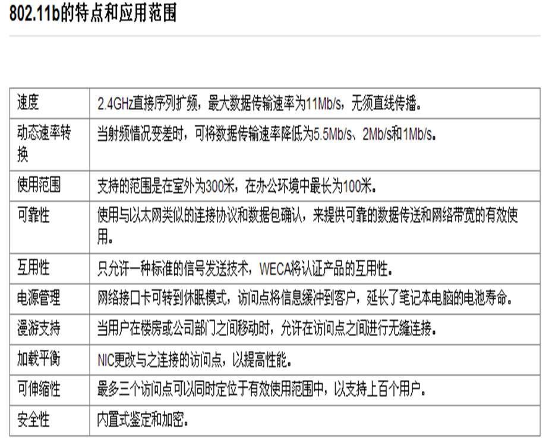
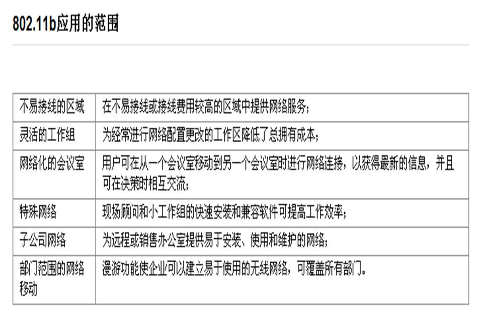
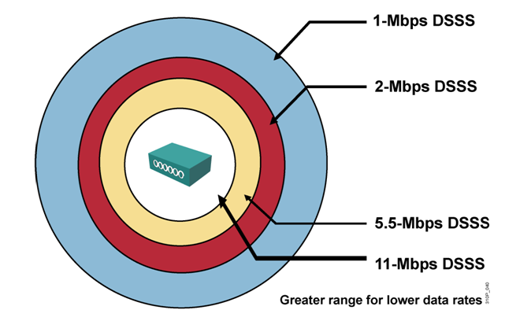

# 无线介绍

无线介绍

2011年7月7日

9:55

[无线讲座.ppt](无线介绍/无线讲座.ppt)

关于3G

第三代移动通信技术（3rd-generation，3G），是指支持高速数据传输的蜂窝移动通讯技术。3G服务能够同时传送声音及数据信息，速率一般在几百kbps以上。目前3G存在四种标准：CDMA2000，WCDMA，TD-SCDMA，WiMAX。

“3G”（英语 3rd-generation）或“三代”是第三代移动通信技术的简称是指支持高速数据传输的蜂窝移动通讯技术。3G服务能够同时传送声音(通话)及数据信息(电子邮件、即时通信等)。**代表特征是提供高速数据业务。** 相对第一代模拟制式手机(1G)和第二代GSM、CDMA等数字手机 (2G)，第三代手机（3G）一般地讲，是指将无线通信与国际互联网等多媒体通信结合的新一代移动通信系统,未来的3G必将与社区网站进行结合，WAP与web的结合是一种趋势，如时下流行的微博客网站：大围脖、新浪微博等就已经将此应用加入进来。

3G与2G的主要区别是在传输声音和数据的速度上的提升，它能够在全球范围内更好地实现无线漫游，并处理图像、音乐、视频流等多种媒体形式，提供包括网页浏览、电话会议、电子商务等多种信息服务，同时也要考虑与已有第二代系统的良好兼容性。为了提供这种服务，无线网络必须能够支持不同的数据传输速度，也就是说在室内、室外和行车的环境中能够分别支持至少2Mbps(兆比特/每秒)、384kbps(千比特/每秒)以及144kbps的传输速度（此数值根据网络环境会发生变化)。

3G是第三代通信网络，目前国内支持国际电联确定三个无线接口标准，分别是中国电信的CDMA2000，中国联通的WCDMA，中国移动的TD-SCDMA，GSM设备采用的是时分多址，而CDMA使用码分扩频技术，先进功率和话音激活至少可提供大于3倍GSM网络容量，业界将CDMA技术作为3G的主流技术，国际电联确定三个无线接口标准，分别是CDMA2000，WCDMA，TD-SCDMA。原中国联通的CDMA现在卖给中国电信，中国电信已经将CDMA升级到3G网络，3G主要特征是可提供移动宽带多媒体业务。

1995年问世的第一代模拟制式手机（1G）只能进行语音通话； 1996到1997年出现的第二代GSM、CDMA等数字制式手机（2G）便增加了接收数据的功能，如接收电子邮件或网页；

其实，3G并不是2009年诞生的，早在2007年国外就已经产生3G了，而中国也于2008年成功开发出中国3G，下行速度峰值理论可达3.6Mbit/s（一说2.8Mbit/s），上行速度峰值也可达384kbit/s。不可能像网上说的每秒2G，当然，下一部电影也不可能瞬间完成。

关于802.11标准

802.11是IEEE最初制定的一个无线局域网标准，主要用于解决办公室局域网和校园网中用户与用户终端的无线接入，业务主要限于数据存取，速率最高只能达到2Mbps。由于它在速率和传输距离上都不能满足人们的需要，现在这类设备已很少见。因此，IEEE小组又相继推出了802.11b和802.11a等新标准。

关于802.11b

以往，无线局域网发展缓慢，推广应用困难，主要是由于传输速率低、成本高、产品系列有限，且很多产品不能相互兼容。如以前无线局域网的速率只有1～2Mb/s，而许多应用也是根据10Mb/s以太网速率设计的，限制了无线产品的应用种类。针对现在高速增长的数据业务和多媒体业务，无线局域网取得进展的关键就在于高速新标准的制定，以及基于该标准的10Mb/s甚至更高速率产品的出现。IEEE 802.11b从根本上改变了无线局域网的设计和应用现状，满足了人们在一定区域内实现不间断移动办公的需求，为我们创造了一个自由的空间。

一、802.11b标准简介

IEEE 802.11b无线局域网的带宽最高可达11Mbps，比两年前刚批准的IEEE 802.11标准快5倍，扩大了无线局域网的应用领域。另外，也可根据实际情况采用5.5Mbps、2 Mbps和1 Mbps带宽，实际的工作速度在5Mb/s左右，与普通的10Base-T规格有线局域网几乎是处于同一水平。作为公司内部的设施，可以基本满足使用要求。IEEE 802.11b使用的是开放的2.4Ghz频段，不需要申请就可使用。既可作为对有线网络的补充，也可独立组网，从而使网络用户摆脱网线的束缚，实现真正意义上的移动应用。

IEEE 802.11b无线局域网与我们熟悉的IEEE 802.3以太网的原理很类似，都是采用载波侦听的方式来控制网络中信息的传送。不同之处是以太网采用的是CSMA/CD（载波侦听/冲突检测）技术，网络上所有工作站都侦听网络中有无信息发送，当发现网络空闲时即发出自己的信息，如同抢答一样，只能有一台工作站抢到发言权，而其余工作站需要继续等待。如果一旦有两台以上的工作站同时发出信息，则网络中会发生冲突，冲突后这些冲突信息都会丢失，各工作站则将继续抢夺发言权。而802.11b无线局域网则引进了冲突避免技术，从而避免了网络中冲突的发生，可以大幅度提高网络效率。

802.11b与蓝牙技术的比较

对标准的支持 802.11b有无线以太网兼容性联盟 (WECA)的支持，蓝牙有蓝牙特殊利益集团（SIG）的支持。

工作频段 802.11b和蓝牙都工作在2.4GHz频段上。

在技术上 802.11只规定了开放式系统互联参考模型（OSI/RM）的物理层和MAC层，其MAC层利用载波监听多重访问/冲突避免（CSMA/CA）协议，而在物理层，802.11定义了三种不同的物理介质：红外线、跳频扩谱方式（FHSS）以及直扩方式（DSSS）。802.11支持1～11Mb/s的数据速率，但是它只支持数据通信，要进行无线数据通信，数据设备先要安装有无线网卡。

蓝牙技术具有一整套全新的协议，可以应用于更多的场合。蓝牙技术中的跳频更快，因而更加稳定，同时它还具有低功耗、低代价和比较灵活等特点。

802.11b实现的是有形的、特定的网络，而由蓝牙形成的网络是无形的、看不见的，蓝牙技术是ad hoc网中的一个主流技术。

在应用上 802.11b的传输距离长、速度快，可以满足用户运行大量占用带宽的网络操作，就像在有线局域网上一样。而蓝牙技术面向的却是移动设备间的小范围连接，因而本质上说，它是一种代替电缆的技术。 蓝牙，适合用在手机、掌上型电脑等简易数据传递；而速率在11Mb/s的802.11b则较适合用在影像等高速无线传输，有效距离长达100米。

802.11b比较适于办公室中的企业无线网络，较适合用在影像等高速无线传输，有效距离长达100米；而速率小于1Mb/s的蓝牙技术则可以应用于任何可以用无线方式替代线缆的场合，适合用在手机、掌上型电脑等简易数据传递。

IEEE 802.11b优点

功能　　　　　　　　　　　　　优点

**速度**2.4ghz直接序列扩频无线电提供最大为11mbps的数据传输速率，无须直线传播

**动态速率转换**当射频情况变差时，降低数据传输速率为5.5mbps、2mbps和1mbps

**使用范围**802.11b支持以百米为单位的范围（在室外为300米；在办公环境中最长为100米）

**可靠性**与以太网类似的连接协议和数据包确认提供可靠的数据传送和网络带宽的有效使用

**互用性**与以前的标准不同的是，802.11b只允许一种标准的信号发送技术。weca将认证产品的互用性

**电源管理**802.11b网络接口卡可转到休眠模式，访问点将信息缓冲到客户，延长了笔记本电脑的电池寿命

**漫游支持**当用户在楼房或公司部门之间移动时，允许在访问点之间进行无缝连接

**加载平衡**802.11b nic更改与之连接的访问点，以提高性能（例如，当前的访问点流量较拥挤，或发出低质量的信号时）

**可伸缩性**最多三个访问点可以同时定位于有效使用范围中，以支持上百个用户同时语音和数据支持

**安全性**内置式鉴定和加密

802.11b采用2.4GHz直接序列扩频，IEEE 802.11b使用的是开放的2.4GB频段，不需要申请就可使用。既可作为对有线网络的补充，也可独立组网，从而使网络用户摆脱网线的束缚，实现真正意义上的移动应用。最大数据传输速率为11Mb/s，比IEEE 802.11标准快5倍。

动态速率转换当射频情况变差时，可将数据传输速率降低为5.5Mb/s、2Mb/s和1Mb/s。实际的工作速度在5Mb/s左右，与普通的10Base-T规格有线局域网几乎是处于同一水平。作为家庭或公司内部的网络通讯设施，其可以基本满足使用要求。其支持的使用范围是在室外为最大300米，室内为最大100米。

除此而外，市场上还可见802.11b+的标准，其是802.11b的拓展标准，具备双倍于802.11b标准的速度，其速度可以达到22Mbps或更高。

常见的802.11b设备有D-Link DWL-510（100元）、SMC 2635W（88元）、TP-LINK TL-WN250/TL-WN210（90元）、清华同方 TFW1000（85元）、趋势 TEW-221PC（99元）、 神州数码 DCWL-340PC（80元）等，此类产品具备价格低廉的特点。

关于802.11a

IEEE 无线网络标准，指定最大 54Mbps 的数据传输速率和 5GHz 的工作频段。

802.11a标准是已在办公室、家庭、宾馆、机场等众多场合得到广泛应用的802.11b无线联网标准的后续标准。它工作在5GHzU-NII频带，物理层速率可达54Mb/s，传输层可达25Mbps。可提供25Mbps的无线ATM接口和10Mbps的以太网无线帧结构接口，以及TDD/TDMA的空中接口；支持语音、数据、图像业务；一个扇区可接入多个用户，每个用户可带多个用户终端。

802.11的第二个分支被指定为802.11a。承受着风险将802.11带入了不同的频带——5.2GHzU-NII频带，并被指定高达54Mbps的数据速率。与单个载波系统802.11b不同，802.11a运用了提高频率信道利用率的正交频率划分多路复用(OFDM)的多载波调制技术。由于802.11a运用5.2GHz射频频谱，因此它与802.11b或最初的802.11WLAN标准均不能进行互操作。

但其与802.11b或802.11g标准不兼容，影视了其推广，目前消费级市场上很少能见到此类的产品。如有也是双频（兼容802.11b）或三频（兼容802.11b/802.11g）的产品，如3Com 3CRUSB10075（590元）等。

关于802.11g

802.11g其实是一种混合标准，它既能适应传统的802.11b标准，在2.4GHz频率下提供每秒11Mbit/s数据传输率，也符合802.11a标准在5GHz频率下提供54Mbps数据传输率。

目前802.11g已成为消费级市场上的主流产品，此类设备很多，如D-Link DWL-G650+（230元）、SMC 2835W（180元）、TP-LINK TL-WN350G（160元）、昂科 AK2400-G30（150元）等等。

802.11g+

当802.11g 54Mbps正在市场上如火如荼推广时代时，以Netgear为首的品牌无线设备生产商推出了一种名为Super G型的无线网络产品，其传输速率可达108Mbps，正好是802.11g标准的两倍。

Super G

Super G基于802.11g标准，它仍是基于2.4GHz频段工作并沿用OFDM模块设计的。但是相比标准的802.11g，Super G拥有多项提升性能的技术手段，包括“双频捆绑（双频捆绑模式是使用两个无线频道，绑定后的双频看上去象在一个单独的信道里接收和发送，其不仅可获得两倍于802.11g标准54M的数据速率，同时它也增加了你网络的有效覆盖范围）”、“动态包突发机制（在标准的传输中，每个数据包发送后有一个暂停，以允许其他设备有竞争网络的机会， 动态包突发机制通过不停顿地发送来增加发送的数据包数量并查看是否有其他节点要使用无线LAN，可以增加吞吐量）”、“动态调速（能从108M自动调速到802.11g或802.11b，使所有节点在网络中都高速运行）”、“硬件压缩加密”等。技术的创新使得802.11g得以超越54Mbps，达到108Mbps的速度。

目前，802.11g+虽然没有被IEEE确定为正式标准，但其得到了无线厂商的广泛认同，目前市场上常见的此类产品有TP-LINK TL-WN620G/WN610G/WN650G（190-250元）、NETGEAR WG511T（550元）等等。