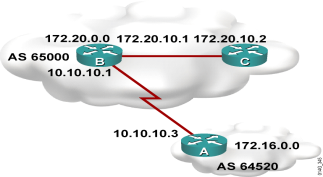

# BGP

BGP

2011年6月27日

13:54

BGP的整体概览

BGP：Border Gateway Protocol

IGP,EGP

IGP:RIP,OSPf,EIGRP….共8种

EGP：EGP，BGP

关于BGP的基础知识

BGP有4个版本，现在的版本是BGPv4，比BGPv3最大的改进是

从有类到无类，支持CIDR

基本点：

1.BGP属于EGP

2.路径矢量路由协议（path-vector protocol）

3.使用TCP 179端口

4.BGP分为IBGP和EBGP：

IBGP的管理距离是200

EBGP的管理距离是20

5.一般情况下不要将BGP重分发到IGP中

6.第一次做完整更新，以后就只增量更新

7.运行在AS之间，是一个AS-by-AS的路由协议，

而不是router-by-router的路由协议

注意：负载均衡只能在EBGP中存在，IBGP没有负载均衡

keepalive默认60s，hold time 180s

BGP的其他特性：

1 丰富的metric值，也叫属性

2 被设计用于特大的网络，例如internet

3 BGP的目地是提供一种域间路由选择系统，确保自主系统能够无环路的交换路由选择信息。BGP路由器交换有关前往目标网络的路径的信息。

距离矢量路由协议---------口诀：以讹传讹（道听途说）

链路状态路由协议---------口诀：运筹帷幄

路径矢量路由协议---------口诀：条条大路通罗马

RIP：UDP520 --------两端都是520

OSPF：协议号89

EIGRP：协议号88

BGP：TCP179 -------两端IP地址大的是179，小的是随机：

IP地址大的源端口是TCP 179， 目的端口随机

IP地址小的源端口随机，目的端口TCP 179

以上是错误的

实际上是

Hi,

Ok, let me put it in another phrase, any TCP session relies on a Client Server like ideology, were one end initiates the TCP session to the other end, in the case of BGP each router though of itself as a client and try to initiate a TCP session to the other router to port 179 as destination and random high port number as source.

The whole idea here is, it could happen that both routers has initiated TCP sessions to each other, and since two routers should have only one BGP session between them, and since the "router-ID" value is exchanged when establishing BGP, if two parallel sessions are detected only the session initiated by the router having the higher router ID will be retained, and the other will be dropped.

HTH, please do rate all helpful replies,

Mohammed Mahmoud.

来自 <[https://supportforums.cisco.com/discussion/10091006/how-identify-bgp-server-and-client-while-initiating-tcp-session](https://supportforums.cisco.com/discussion/10091006/how-identify-bgp-server-and-client-while-initiating-tcp-session)>

关于自治系统（AS，Autonomous System）

一组被统一管理的路由器

它们使用相同的内部网关协议和统一的度量值在AS内部路由分组，并使用外部网关协议将分组路由到其他AS。

关于AS号

范围是：1-65535

其中1-64511是属于公有的

64512-65535属于私有的

AS号是由internet地址授权委员会（IANA）统一负责分配

注：电信的AS号是4134，网通的号是9929和4837

网站bgp.potaroo.net ：可以看到关于AS号的信息

Telnet route-server.ip.att.net可以看公网的路由条目数

为什么要使用BGP？

IGP支持的路由条目有限

最主要的原因是IGP的那些路由协议不能满足选路的需求。

而BGP天生就是用来选路的，一个运营商或者国家，其路由条目拥有量是惊人的，而且是不连续的情况非常多，所以为了协调全世界的路由条目，有效管理，所以需要BGP

口诀：BGP=选路

题外话：别说世界了，就是全国你也不能指望布一个OSPF就全搞定啊。。。

什么时候使用BGP？

1.作为传输区域，AS允许数据包通过自已到达其它AS.例如：ISP

2.多宿主，AS有多条到其它自治系统的连接.例如：企业网有到多个ISP的连接

3.需要选路的时候，例如：企业网到一个ISP有多个连接

BGP的三张表：

·Neighbor table ：手工指定 不能自动发现

List of BGP neighbors //BGP的邻居关系需要显示的配置

·BGP forwarding table/database BGP转发数据库

List of all networks learned from each neighbor

Can contain multiple pathways to destination networks

Database contains BGP attributes for each pathway

·IP routing table 最优路径放入路由表

List of best paths to destination networks

**BGP表和路由表是独立的，同样遵循AD小的进入路由表。**

关于BGP的术语

peer=neighbor(对等体=邻居)

学习BGP要抓住：4，6，10

即4个消息，6个接口状态机，10个属性

关于BGP使用的消息

1.Open：包含BGP版本号，AS号，holdtime和BGP router-id //holdtime时间是可以协商的，取两个BGP邻居中较小的保持时间

2.Update：网络层可达信息（NLRI），路径属性，撤销路由

3.Keepalive：每60s发送一次，或者是达成一致的最小保持时间的三分之一,//Holdtime 180s

4.Notification：当发生错误的时候用来关闭BGP连接

口诀：ounk（我要耐克）

注意：

1.BGP中的open和keeplive消息相当于IGP中的hello

open用来发现和建立邻居，Keepalive用来保持邻居关系

2.一个Update消息一次可以只通告一条路由，但它可以携带多个属性

一个Update消息一次也可通告多条路由，但它们的属性必须相同

一个Update消息可以同时撤销多条路由

关于BGP的有限状态机

1.Idle：查看路由表中是否有到目标的路由,查找是否有去往邻居的路由

2.Connect：建立TCP连接，完成TCP3次握手。

3.Active：协商还未成功,当其中任何一个状态出现问题，会转到active状态

4.Opensent：发送open消息

5.Openconfirm接收open消息

6.Established：建立firm：邻居关系

关于EBGP和IBGP

EBGP：位于当前AS之外的，属于其它AS的邻居，通常要求直连

IBGP：位于同一个AS之内的邻居，无需彼此相连 ，只要它们能够彼此到达对方，完成TCP握手即可，也就是说IGP要是通的

注意：

1.运行BGP的前提是IGP是通的

2.建议EBGP之间用直连接口来建邻居

建议IBGP之间用环回口建邻居

关于EBGP建立邻居的方法：

方法一：使用物理接口建邻居（推荐）

router bgp 64512

bgp router-id 1.1.1.1 ----选举原则也和OSPF一样

no auto-summary ----关闭自动汇总

//auto-summary作用的对象:重分布进bgp的igp或直连或静态路由.如果这些路由是子网路由,在进bgp表时将被自动汇总成有类路由条目

no synchronization ------关闭同步

neighbor 12.1.1.2 remote-as 64513

//neighbor命令的解释：

a.允许邻居用这个地址来访问我的179端口，但没有指明访问本路由器的哪个地址，所以只要源于neighbor后面地址访问本地任何地址都可，但必须是179端口

b.本路由器以更新源地址去访问 neighbor 后面这个地址的 179端口，是否可以建立 TCP链接要看对方是否允许我的更新源来访问它。如果没有指定更新源地址，就是用neighbor后面地址路由表中出接口的地址作为更新源地址。

几种邻居关系建立情况的可能讨论：

R1:

neighbor 2.2.2.2 remot 1 //允许2.2.2.2 访问本端的179端口

由于没有指定更新源地址，所以用 211.1.12.1 访问 2.2.2.2 的179端口

R2：

neighbor 1.1.1.1 remot 1 //允许1.1.1.1 访问本端的179端口

neighbor 1.1.1.1 up lo 0 //用2.2.2.2 访问1.1.1.1 的179端口

所以在这时只有R2用2.2.2.2访问R1的179端口这条能通过，所以现实情况是R2发送的BGP消息目的端口是179，源端口随机（只要定下来，以后就不变）

- ---------------------------------------------------------

R1：

neighbor 2.2.2.2 remot 1 //允许2.2.2.2访问本端179

neighbor 2.2.2.2 up lo 0 //用1.1.1.1 访问2.2.2.2的179

R2:

neighbor 1.1.1.1 remot 1 //允许1.1.1.1 访问本端179

neighbor 1.1.1.1 up lo 0 //用2.2.2.2 访问1.1.1.1的179

这时由于两条路都能走通，所以就比较IP地址大的源端口使用179，另一端口随机

- ----------------------------------------------------------

R1:

neighbor 2.2.2.2 remot 1 //允许2.2.2.2 访问本端的179端口

由于没有指定更新源地址，所以用 211.1.12.1 访问 2.2.2.2 的179端口

R2：

neighbor 1.1.1.1 remot 1 //允许1.1.1.1 访问本端的179端口

由于没有指定更新源地址，所以使用211.1.12.2访问1.1.1.1的179端口

由于两条路都不通，所以邻居关系建立不起来

方法二：使用环回口建邻居

router bgp 64512

bgp router-id 1.1.1.1

no auto-summary

no synchronization

neighbor 2.2.2.2 remot-as 64513

neighbor 2.2.2.2 update-source loopback0

neighbor 2.2.2.2 ebgp-multihop 255（这句别忘了）--修改TTL值

关于IBGP建立邻居的方法：

方法一：使用环回口建邻居（推荐）

router bgp 64512

bgp router-id 1.1.1.1

no auto-summary

no synchronization

neighbor 2.2.2.2 remot-as 64512

neighbor 2.2.2.2 update-source loopback0

注意：IBGP建邻居默认TTL值就是255，所以不需要修改，而EBGP需要修改

方法二：使用物理接口建邻居

router bgp 64512

bgp router-id 1.1.1.1

no auto-summary

no synchronization

neighbor 12.1.1.2 remote-as 64512

部署BGP的前提是IGP通

关于BGP的router-id

BGP中的router-id和OSPF中的router-id是一样的

作用是用来表示每台路由器

选举方法也是和OSPF中的router-id一样的

即：

1.手工指定（推荐）

2.最大的环回接口

3.最大的物理接口

路由器id改变后，邻居关心重新建立。

关于命令no auto-summary

注意：此命令和rip和eigrp中的no auto-summary的作用不一样，在BGP中此命令是和重分发联系在一起的

关于同步

同步的定义：从IBGP学习到得路由条目不会写入路由表，除非这条路由条目也从IGP中学习到

理解：同步其实是一种预防措施，用来预防路由黑洞，如下图：

需求：在R1上起一个环回口loopback100（100.1.1.1/24），宣告进BGP，问，在R3上能ping通吗？为什么？

分析：这道题的问题的根源是路由黑洞，而造成的原因是R2和R4上没有运行BGP，或者说即使运行了BGP而不与R1建立邻居关系，那么也通不了，原因就出在R2和R4上需要路由条目。这道题的解决方法有个：一个是将100宣告近IGP中，另一个是全网全运行BGP，并且全互联（其实也就是保证R2和R4能有这条路由条目）。

第一种方法就被BGP协议借鉴了，也就是同步。

只有IGP中有，才能写进路由表，其实同步是一个预防措施

对第二种方法而言，同步就没有用了，所以口诀：全互联，关同步

思考：同步打开了，如果IGP中有这个路由条目了，BGP的条目能写进路由表吗？

同步：从IBGP学习到的路由，如果没有出现在IGP中，那么不会写进路由表（言外之意就是不会看到大于号）。

注意：只有IBGP中才会谈同步，但一个设计良好的IBGP网络，一般需要全互联，所以此时同步就没有用了，这就是为什么BGP的标配中会将同步关闭

关于network命令

解释：用来向BGP中宣告路由，这个命令与IGP中的network不同。

在IGP中使用该命令有两个作用，一是在该命令所宣告的接口下发送各种协议包，一般是hello包，二是将该网段宣告进IGP中。

但是在BGP中，发包建邻居是使用neighbor命令，而network命令仅仅是将此路由条目宣告进BGP中

关于BGP的防环

BGP的防环分为两部分

1.EBGP的防环：EBGP使用AS­_PATH属性进行防环

在AS_PATH中加入额外的AS号的过程被称为AS通路附加

2.IBGP的防环：IBGP中使用水平分割（即从一个IBGP邻居学来的路由不发给另一个IBGP 邻居）切断两台路由器之间的环路，IBGP的路由条目只传一跳的特性切断了IBGP网络中的环路

IBGP的水平分割

此处以上图为例做小实验，复习IGP选路原则：

1 下一跳可达（若下一跳不可达，无法写入路由表）

2 最长的掩码匹配

3 最小的AD值

4 最优的Metric值

测试最长掩码匹配小拓扑

关于下一跳的行为：

A将网段172.16.0.0宣告给B，下一跳为10.10.10.3

B将网段172.16.0.0宣告给C时，下一跳还是10.10.10.3

解决下一跳不可达的方法：

a．静态路由

b．在 IBGP邻居所处的 IGP 中宣告

c．将与 EBGP 直连的网络重分布进 IGP

d．neighbor x.x.x.x next-hop-self（将指向 EBGP 邻居更新源的地址变为自己的更新源地址）

在B上使用命令neighbor xxx.xxx.xxx.xxx next-hop-self可以更改

总结：通过EBGP学习到的路由传给IBGP时，保持下一跳不变

通过IBGP学习到的路由传给EBGP时，下一跳要改变

但是，上述的特性在广播多路访问网络中就不适用了//产生第三方下一跳问题

C将网段172.30.0.0宣告给B的时候，下一跳是10.10.10.2

B将网段172.30.0.0宣告给A的时候，下一跳应该是10.10.10.1，但是由于是多路访问网络，所以下一跳还是保持10.10.10.2，这个可以看出BGP非常的智能，可以防止不必要的包的传输，这个特性可以当成是一个特例

第三方下一跳：收到路由更新的源地址与将要发出去的接口地址在同一网段的时候，路由的

下一跳不改变，为原来路由更新的源地址。

关于对等体组

对于拥有相同路由策略的一组路由器------相同的邻居等

可以使用对等体组.

BGP 的对等体组，是将出站策略相同的对等体，放在一起定义。用于减少命令行用的。

所有对等体组员只能维护同一个出站策略，可以有不同的入站策略。

作用减少命令行，减少占用 buffer。

相关命令：

show ip bgp peer-group //查看对等体组

Nei internal peer-group //新建一个名为internal的对等体组

Neighbor internal remot 1 //给对等体组制定AS

Neighbor 1.1.1.1 peer-group internal //把1.1.1.1加入对等体组

Neighbor 3.3.3.3 peer-group internal

Neighbor internal up lo1 //给对等体组指定更新源

关于BGP的认证

1.BGP仅支持MD5认证

2.进程下下一句话，使用命令neighbor xxx.xxx.xxx.xxx password xxx

关于BGP的10个属性

BGP拥有10个属性，用来做选路

这10个属性分为4类（两个大类，每个大类又有两个小类）：

Well-known mandatory：公认必选 3

Well-known discretionary：公认自选 2

Optional transitive：任选可传输 2

Optional nontransitive：任选非可传输 3

公认必选：ORIGIN，AS_PATH，NEXT_HOP------口诀：oan

公认自选：LOCAL_PREF,ATOMIC_AGGREGATE-----口诀：la

任选可路由：AGGREGATOR,COMMUNITY------口诀：ac

任选非可路由：MULTI_EXIT_DISC(MED),ORIGINATOR_ID,CLUSTER_LIST------口诀：moc

1.区分well-know和Optional：well-know是指所有路由器必须要全部支持这个属性，Optional是指路由器不必全部支持这个属性

2.区分mandatory和discretionary：mandatory是指这个属性必须包含在Update包中，discretionary是指这个属性可以包含在update包中，也可以不包含

3.区分transitive和nontransitive：transitive指如果一台路由器收到的update包中包含了不认识的属性即使自己处理不了，也会把它传给别的路由器，nontransitive是指一台路由器收到的update包中有不认识的属性会把这个update包丢弃。

关于属性AS_PATH

作用：

BGP选路的第4条

用来EBGP防环

关于属性next-hop

作用：指示下一跳

关于local preference属性

本AS内部有效

用来判断如何从本AS出去

默认是100

选路的第二条

show ip bgp 100.1.1.0

关于属性ATOMIC_AGGREGATE（原子聚合）

当一条路由条目携带此属性的时候，意味着AS_PATH属性有丢失

关于属性AGGREGATOR

表示有汇总

关于属性community

此属性有点像tag值，用来给路由条目打标记，更确切的说是

升级版的tag值

有几个保留的community值：

no-export：不传给EBGP邻居，作用范围整个AS内部

local-AS：不传给EBGP邻居，包括联邦，作用范围是本

联邦内部

no-advertise：不传给任何邻居

小实验：关于no-advertise的小实验

注意点： 默认情况下，community属性是不会传给邻居的，

此时需要手工设置，命令是：neighbor xxx send-community

Neighbor 2.2.2.2 send-community

关于属性MED

解释：相当于IGP中的Metric值，在BGP中作为选路的第6条

//MED 关心的是别人如何到达我，在出去的方向设置,Local preference关心的是我如何到达别人，在入得方向设置

MED一般是用于AS之间的一种属性，影响其他AS数据流入本地AS，用于EBGP邻居之间。设置在其中一方的出方向上，这样MED属性传递给另一个EBGP邻居，这样对方会判断如何到达我。

而local preference是直接在本地设置，并且是出方向的，本地主观用于指明我去哪里的值是多大。

关于属性ORIGINATOR_ID和CLUSTER_LIST

这两个属性是用在路由反射器中的，用来防环的

ORIGINATOR_ID 标识始发路由器

CLUSTER_LIST 标识簇

关于Weight属性

解释:

思科私有的

BGP选路原则的第一条

本路由器有效

BGP的选路原则

11条选路原则：

1. 最大的Weight值：cisco私有，本地路由器有效，默认值为0

Clear ip BGP * soft

（1） neighbor 211.1.13.3 weight 100 //使从该邻居学习到的所有路由条目weight值都改为100

（2）使用route-map

access-list 10 permit 100.1.1.0 0.0.0.255 //匹配感兴趣流

route-map WEI permit 10

match ip address 10

set weight 1000 //设置weight值为1000

route-map WEI permit 20

router bgp 1

neighbor 211.1.13.3 route-map WEI in //应用于neighbor后面

2. 最大的Local_pref(本地优先级)：本自治系统（AS）内有效，关心出业务

注意：local_preference值只在IBGP邻居传来的路由中做比较有意义，因为EBGP邻居传来的路由没有该值所以不做比较，默认情况下该值为100（是指的从IBGP邻居学习到的路由条目，如果是从EBGP邻居学习到的路由条目这个值为空，可以在in方向上添加这个值）

access-list 10 permit 100.1.1.0 0.0.0.255

route-map LOC permit 10

match ip address 10

set local-preference 1000

route-map LOC permit 20

router bgp 1

neighbor 211.1.13.3 route-map LOC in //或者再另一路由器上使用out方向也可以，但是注意必须在同一AS内

3.本地产生的（next-hop是0.0.0.0）

4. 最近的AS_PATH

例子：

ip prefix-list 10 seq 5 permit 100.1.1.0/24

route-map AS permit 10

match ip address prefix-list 10

set as-path prepend 4 5 6 7 8 9

route-map AS permit 20

router bgp 3

neighbor 211.1.13.1 route-map AS out

注意：只在传给EBGP邻居时可以用out方向，或者in方向也是在EBGP邻居时才生效，在IBGP邻居之间增加AS号是不生效的。

- **********************************************

R1(config-router)#bgp bestpath as-path ignore //隐藏命令：使路由器忽略AS-PATH这条属性

- **********************************************

5.最低的起源代码（origin code）

关于属性origin（起源代码）

作用：BGP选路的第5条

origin包含3种：

1.IGP：用i表示，其实就是network进去的

2.EGP：用e表示，由于EGP现在已经被淘汰了，所以见不到了

3.incomplete：用？表示，其实就是重分发进去的

IGP<EGP<incomplete

注意：数值上IGP<EGP<incomplete，但是对于选路来讲是选择最低的起源代码，所以IGP优于EGP，优于incomplete

6.最低的MED值：关心的是进来的业务

bgp always-compare-med //强制来自不同AS的路由条目也比较MED值

7.EBGP优于IBGP

8.最近的IGP邻居

9.最老的EBGP路由条目

10.最低的router-id

11.最低的邻居IP地址

Nei 1.1.1.1 shutdown

如上图所示，由于都是EBGP邻居关系，假如在R1上看见的100.1.1.0优选了R3这条路径的话，则不会将从R2这边走的100.1.1.0网段路由发回给R3，因为R1认为R3更优，但是R1会将从R3的100.1.1.0的路由传递给次优邻居R2，相反的情况也存在。

No logging console //全局命令，关闭提示

如何设计BGP？

其实BGP根据用途一般有两种

1.在ISP中

IBGP全互联就可以了

2.在企业网中

关于路由反射器的实验：

一台被配置为路由反射器的路由器一旦收到一条路由信息，它就会将这条路由信息传递给所有跟它建立客户关系的路由器，从而消除了对全互联环境的要求。

**路由传递规则：**

**(1)从EBGP学到的一条路由，会传给client和非client端**

**(2)从client端学到的路由，会传给其它client和非client端**

**(3)从非客户端收到路由，会转发给客户端以及EBGP邻居，但不会转发给非客户端。**

**注意点：**

**路由反射器和他的客户称为簇**

**路由反射器不更改从客户中学习到的属性。**

**在路由反射器上做---**

**R2(config-router)#neighbor 1.1.1.1 route-reflector-client //这一条命令全搞定（1.1.1.1为R1的客户端）**

重分发实验

过滤实验：

第一种：挂access-list实现过滤

第二种：挂as-path-list实现过滤

第三种：挂prefix-list实现过滤

1.分发列表是BGP过滤中最为简单的一种，可以应用到所有对等体上，也可以应用到特定对等体上，如在BGP进程下：

(1)ditribute-list 1 in/out(对所有对等体均有效)

(2)nei 1.1.1.1 ditribute-list 1 in/out (只对某个对等体有效)

在R2上，过滤前缀2.2.2.0，操作如下：

r2(config)#access-list 1 deny 2.2.2.0

r2(config)#access-list 1 permit an

r2(config-router)#nei 10.1.1.1 distribute-list 1 out

distribute-list,灵活性较差，可分为标准和扩展两种。要注意的是扩展访问列表用于接口分组过滤时，它有源地址和目的地址，但当与BGP分发列表一起使用时，源地址变成了网络号，目的地址变成网络掩码。而标准没有此功能。

例如：access-list 101 permit ip 10.10.0.0 0.0.255.255 255.255.0.0 0.0.0.0

网络部分：10.10.0.0 0.0.255.255，表示允许10.10.x.x,x为0-255任意值

掩码部分：255.255.0.0 0.0.0.0，表示在通配符中全使用了O,只能匹配16位掩码。分发列表，前缀列表，过滤列表后面都有一个隐藏命令deny any.

2.前缀列表是一种更简单的过滤方法

r2(config)#ip prefix-list 1 deny 2.2.2.0/24

r2(config)#ip prefix-list 1 permit 0.0.0.0/0 le 32

r2(config-router)#nei 10.1.1.1 prefix-list 1 out

注意：前缀列表和分发列表不能同时应用于一个邻居后面

3.AS路径列表一般和正则表达式，filter-list一起应用，是使用AS路径属性来过滤BGP路由，IOS的常规表达式和UNIX上的相同，在R1上过滤来自AS2的路由条目：

<<正则表达式.doc>>

r1(config)#ip as-path access-list 1 deny _2$

r1(config)#ip as-path access-list 1 permit .*

r1(config-router)#nei 10.1.1.2 filter-list 1 in

提供一种查看AS路径序列号的方法：show ip bgp regexp .按照AS-PATHS进行过滤，提供了较好的灵活性。

4 与route-map连用时

聚合实验

BGP 的汇总有 2 种：

A．汇总：summary

静态路由手工汇总指向null 0，再network引入BGP。

如果明细路由断了，汇总仍然会被引入，且缺乏灵活性。

B．聚合：aggregate

聚合路由在本路由器上生成一条聚合路由，下一跳为0.0.0.0

aggregate-address 命令发布聚合路由，

选项：

advertise-map 通告聚合路由和advertise-map中指定的部分具体路由，默认时也会将所有明细路由也发布出去，这个列表的意义在于以下红字部分

**//只对 advertise-map 里面匹配的路由进行聚合。当 advertise-map 里面匹配的明细路由全部消失后，即使聚合路由范围内还有其他明细路由，聚合路由也将消失。当与 as－set 合用时，只继承 advertise-map 里面匹配的明细路由的属性。如果用summary-only，会将所有的明细包括没有在 advertise-map 里面匹配的路由一起抑制。**

//the advertise-map is only used to compose the aggregate attributes such as AS_SET. You have to use the suppress-map with deny statement in your route-map in order to unsuppress some prefixes.

//Using the advertise-map keyword selects specific routes that will be used to build different components of the aggregate route, such as AS_SET or community. This form of the aggregate-address command is useful when the components of an aggregate are in separate autonomous systems and you want to create an aggregate with AS_SET, and advertise it back to some of the same autonomous systems. You must remember to omit the specific autonomous system numbers from the AS_SET to prevent the aggregate from being dropped by the BGP loop detection mechanism at the receiving router. IP access lists and autonomous system path access lists match clauses are supported.

as-set 把被聚合路由的AS-Path中不同的部分加到AS-Set里面去

attribute-map 向其相邻体通告路由时，按照map的要求设置聚合路由的属性

summary-only 只通告聚合后的路由

suppress-map 通告聚合路由，同时还通告suppress-map中不匹配的部分**具体**路由，suppress-map拒绝被抑制，就是允许的意思。

<cr> 通告所有具体的

至少路由表中有一条属于上述网段之内的路由的时候，BGP才会发布该聚合路由。

此处的路由表是指BGP路由表

show ip bgp 100.1.1.0 255.255.255.0 //可以查看ATOMIC_AGGREGATE和AGGREGATOR 属性，出现了信息的丢失，加as-set选项可以解决这个问题

**community属性：**

community 被一组共享相同的特性的前缀所定义。多个团体属性可以应用到一条前缀上，

每个团体属性有 4个字节。团体属性有 2种类型：

Well－known communities（熟知团体）――――当接收到这些带有团体属性的前缀时，对等体会自动地根据预先定义的团体属性的意义来采取操作。不需要额外的配置。在RFC1997 中，熟知的团体属性落在保留值的范围内，即 0xFFFF0000-0xFFFFFFFF。

Private communities（私有团体）――――由网络管理员定义的团体，并且在不同自治系统的对等体之间，这些团体必须相互协调。必须明确地配置所采取的行为。私有团体的值在保留范围之外。

当前，cisco IOS 软件支持 4 种熟知团体属性：

internet――――带有这个属性的前缀被通告到 internet。这些前缀是没有限制的。这个熟知团体属性在 RFC1997 没有被明确的定义。在 cisco IOS 软件中，每一条前缀都属于这个 internet 团体（值为 0）

no_export――――带有这个团体属性的前缀可以在大联盟内传递。这个团体的值为0XFFFFFF01。

Local_AS――――带有这个团体属性的前缀只能在本地的小 AS 内传递，甚至不能通告到其他联盟的子 AS 中去。值为（0XFFFFFF03）。

No_advertise――――带有这个团体属性的前缀不会被通告给任何对等体，包括 IBGP邻居。改属性的值为 0XFFFFFF02。

友好的（user－friendly）格式可以在全局配置模式下由

ip bgp-community new-format命令来启用。

当 community 写成是 aa：nn，这时候必须打这句话显示出来

团体属性在 route-map 里面添加，最后要添一个 neighbor 1.1.1.1 send-community。

在 neighbor和 network时候可以给路由设置团体属性，必须 send 出去。

Route-map AA

Match ip address prefix 1

Set community [none | internet | no-export | local-AS | no-advertise] [aa:nn]

[additive]

route-map AA

match match community 1

来匹配 community列表

ip community-list 1 [permit | deny] ?

<1-4294967295> community number

aa:nn community number

internet Internet (well-known community)

local-AS Do not send outside local AS (well-known community)

no-advertise Do not advertise to any peer (well-known community)

no-export Do not export to next AS (well-known community)

配置一条到BGP邻居的缺省路由

1.IP route 0.0.0.0 0.0.0.0 null0

2.network 0.0.0.0

配置一条到指定BGP邻居的缺省路由

1.neighbor 192.168.1.1 default-originate