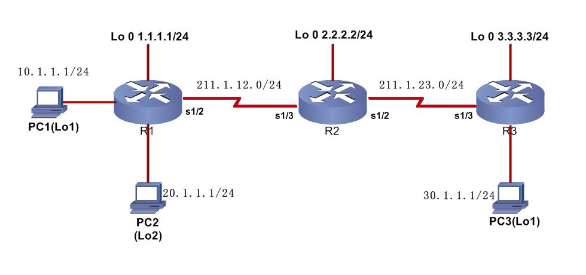
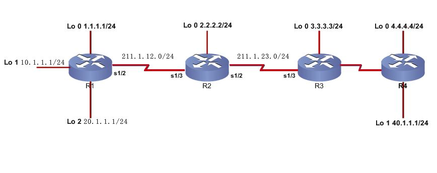

# ACL

ACL

2009年7月26日

9:01

[IP访问控制列表_ACL.ppt](ACL/IP访问控制列表_ACL.ppt)

**访问控制列表简称为ACL，它使用包过滤技术，在路由器上读取第三层及第四层包头中的信息如源地址、目的地址、源端口、目的端口等，根据预先定义好的规则对包进行过滤，从而达到访问控制的目的。ACL分很多种，不同场合应用不同种类的ACL。**

**1. 标准ACL**

**标准ACL最简单，是通过使用IP包中的源IP地址进行过滤，表号范围1-99或**

**1300-1999；**

**2. 扩展ACL**

**扩展ACL比标准ACL具有更多的匹配项， 功能更加强大和细化， 可以针对包括协议类型、源地址、目的地址、源端口、目的端口、TCP连接建立等进行过滤，表号范围100-199或2000-2699；**

**3. 命名ACL**

**以列表名称代替列表编号来定义ACL，同样包括标准和扩展两种列表。**

**在访问控制列表的学习中，要特别注意以下两个术语。**

**1. 通配符掩码：一个32比特位的数字字符串,它规定了当一个IP地址与其他的IP地址进行比较时，该IP地址中哪些位应该被忽略。通配符掩码中的“1”表示忽略IP地址中对应的位，而“0”则表示该位必须匹配。两种特殊的通配符掩码是“255.255.255.255”和“0.0.0.0” ，前者等价于关键字“any” ，而后者等价于关键字“host” ；**

**2. Inbound和 outbound：当在接口上应用访问控制列表时，用户要指明访问控制列表是应用于流入数据还是流出数据。**

**总之，ACL的应用非常广泛，它可以实现如下的功能：**

**1. 拒绝或允许流入（或流出）的数据流通过特定的接口；**

**2. 过滤路由更新的内容；**

**3. 控制对虚拟终端的访问；**

**4. 提供流量控制。**

**通配符举例**

匹配一个网络里面奇数IP的主机或者偶数IP的主机（或者的路由过滤中需要奇数网络）

192.168.1.1

192.168.1.2

192.168.1.3

192.168.1.4

192.168.1.5

192.168.1.6

192.168.1.7

192.168.1.8

192.168.1.9

写成二进制形式

00000001

00000010

00000011

00000100

00000101

00000110

00000111

…………

192.168.1.1 0.0.0.254

192.168.1.2 0.0.0.254

奇数IP的最后一位都是1，而偶数IP的最后一位都是0

奇数IP的：192.168.1.1 0.0.0.254 ；偶数IP的：192.168.1.0 0.0.0.254

通配符的计算：

已知子网，求通配符掩码。

例：允许

199.172.5.0/24

199.172.10.0/24

199.172.13.0/24

199.172.14.0/24

网段访问路由器。要求写出ACL来，但只能用两条ACL代替。

1.

先将这四个数换成二进制：

5.0 0 1 0 1

10.0 1 0 1 0

13.0 1 1 0 1

14.0 1 1 1 0

5.0和13.0

10.0和14.0有共同点。

0000 0101 0000 1000

0000 1010 0000 0100

最后得出：

access-list 10 permit 199.172.5.0 0.0.8.0

access-list 11 permit 199.172.10.0 0.0.4.0

**ACL注意点：**

**（1）ACL定义好，可以在很多地方应用，接口上应用只是其中之一，其它的常用应用包括在route map中的match应用和在vty下用“access-class”命令调用，来控制telnet的访问；**

**（2）访问控制列表表项的检查按自上而下的顺序进行，并且从第一个表项开始，所以必须考虑在访问控制列表中定义语句的次序；**

**（3）路由器不对自身产生的IP数据包进行过滤；**

**（4）访问控制列表最后一条是隐含的拒绝所有；**

**（5）每一个路由器接口的每一个方向，每一种协议只能创建一个ACL；**

**（6） “access-class”命令只对标准ACL有效。**

**命名ACL允许在标准ACL和扩展ACL中， 使用字符串代替前面所使用的数字来表示ACL。**

**命名ACL还可以被用来从某一特定的ACL中删除个别的控制条目， 这样可以让网络管理员方便地修改ACL。**

**实验一 标准ACL**

**需求：拒绝PC2所在网段访问路由器R2,同时只允许主机PC3访问路由器R2的TELNET服务。整个网络配置EIGRP保持的连通性**

**R2上关键配置**

access-list 10 deny 20.1.1.0 0.0.0.255

access-list 10 permit any

access-list 20 permit 211.1.23.0 0.0.0.255

interface Serial1/3

ip address 211.1.12.2 255.255.255.0

ip access-group 10 in

line vty 0 4

password cisco

login

access-class 20 in

show ip access-lists

show ip interface

**实验二 扩展ACL**

**要求只允许R1上的Lo 2接口访问路由器R2的WWW和TELNET服务，并拒绝R4上的Lo 1接口PING路由器R2**

**思考：（1）本地产生的数据包不会被过滤**

**（2）ICMP数据包的源目地址问题**

**尽量考虑将扩展的访问控制列表放在靠近过滤源的位置上，这样创建的过滤器就不会反过来影响其它接口上的数据流。另外，尽量使标准的访问控制列表靠近目的，由于标准访问控制列表只使用源地址，如果将其靠近源会阻止数据包流向其他端口。**

**扩展访问控制列表尽量靠近源位置，标准访问控制列表尽量靠近目的位置**

**==========================================**

背景描述：管理主机在周一到周五的每天的9：00-17:00访问路由器的telnet服务。

route(config)#time-range //定义时间范围

route(config-time-range)#periodic weekdays 8:00 to 18:00

route(config)#access-list 101 permit tcp host 172.16.1.1 host 172.16.1.254 eq telnet time-range time //在访问控制列表中调用

route(config)#interface g0/0

route(config-if)#ip access-group 101 in

引用网友：

**【背景描述】**

某公司经理最近发现，有些员工在上班时间经常上网浏览与工作无关的网站，影响了工作，因此他通知网络管理员，在网络上进行设置，在上班时间只允许浏览与工作相关的几个网站，禁止访问其它网站。

**第一步：在路由器上定义基于时间的访问控制列表**

Router(config)#access-list 100 permit ip any host 160.16.1.1      ！定义扩展访问列表，允许访问主机160.16.1.1

Router(config)#access-list 100 permit ip any any time-range t1 ! 关联time-range接口t1，允许在规定时间段访问任何网络

Router(config)#time-range t1     ！定义time-range接口t1 ，即定义时间段

Router(config- time-range)#absolute start 8:00 1 oct 2004 end 18:00 30 dec 2020     ！定义绝对时间

Router(config- time-range)#periodic daily 0:00 to 8:00    ! 定义周期性时间段（非上班时间）

Router(config- time-range)#periodic daily 17:00 to 23:59

验证测试：验证访问列表和time-range接口配置

Router# show access-lists          ！显示所有访问列表配置

Extended IP access list 100

permit ip any host 160.16.1.1

permit ip any any

Router#show time-range      ! 显示time-range接口配置

time-range entry:t1

absolute start 08:00 1 October 2004 end 18:00 30 December 2020

periodic daily 00:00 to 08:00

periodic daily 17:00 to 23:59

第二步：在接口上应用访问列表

Router(config)# interface fastethernet 1     ! 进入接口F1配置模式

Router(config-if)# ip access-group 100 out    ! 在接口F1的出方向上应用访问列表100

验证测试：验证接口上应用的访问列表

Router#show ip interface fastEthernet 1

FastEthernet1 is up, line protocol is up

Internet address is 160.16.1.2/24

Broadcast address is 255.255.255.255

Address determined by setup command

MTU is 1500 bytes

Helper address is not set

Directed broadcast forwarding is disabled

Outgoing access list is 100          ！显示在出口上应用了访问列表100

Inbound access list is not set

Proxy ARP is enabled

Security level is default

Split horizon is enabled

ICMP redirects are always sent

ICMP unreachables are always sent

ICMP mask replies are never sent

IP fast switching is enabled

IP fast switching on the same interface is disabled

IP multicast fast switching is enabled

Router Discovery is disabled

IP output packet accounting is disabled

IP access violation accounting is disabled

TCP/IP header compression is disabled

Policy routing is disabled

第三步：测试访问列表的效果

C:\>ping 160.16.1.1     ！验证在工作时间可以访问服务器160.16.1.1

现在改变服务器的IP地址为160.16.1.5（或用另一台服务器），再进行测试：

C:\>ping 160.16.1.5    ！验证在工作时间不能访问服务器160.16.1.5

以上结果显示目的不可访问

现在改变路由器的时钟到非工作时间22:00，再进行测试：

C:\>ping 160.16.1.5    ！验证在非工作时间可以访问服务器160.16.1.5

【注意事项】

> l 在定义时间接口前须先校正系统时钟；
> 
> 
> l Time-range接口上允许配置多条periodic规则（周期时间段），在ACL进行匹配时，只要能匹配任一条periodic规则即认为匹配成功，而不是要求必须同时匹配多条periodic规则；
> 
> l 设置periodic规则时可以按以下日期段进行设置：day-of-the-week（星期几）、Weekdays（工作日）、Weekdays（周末，即周六和周日）、Daily（每天）；
> 
> l Time-range接口上只允许配置一条absolute规则（绝对时间段）；
> 
> l Time-range允许absolute规则与periodic规则共存，此时，ACL必须首先匹配absolute规则，然后再匹配periodic规则。
>