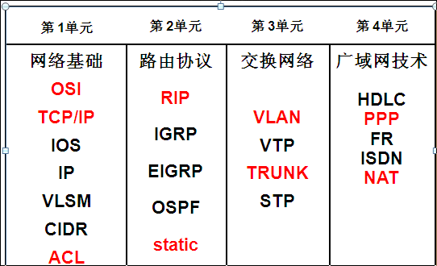
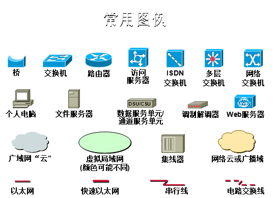
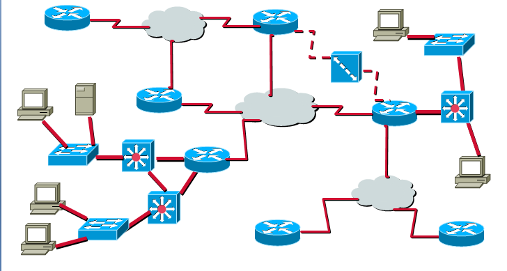

# CCNA概要

CCNA概要

2009年9月4日

20:37

**Part 1**

**Part 2**

通过CCNA+课程的学习，您可以完成如下任务：

- 在什么情况下应用集线器、交换机和路由器
- 利用Cisco软件确认端口、协议、地址和可连接性 SDM
- 根据要求互连交换机和路由器
- 配置交换机和路由器，以支持LAN和WAN 服务
- 设置IP子网以便于有效地管理网络
- 通过配置访问列表来控制对网络段或网络资源的访问
- 确认交换机、路由器及其配置的网络服务是按我们的预期在运作
- 判断网络故障的原因并解决之。
- 对一些实际工程案例有一定的分析和解决能力

**Part 3**

**示例**

