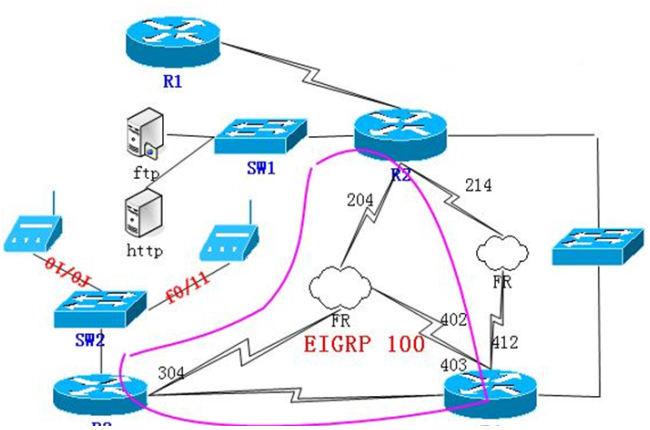

# CCNA练习题

CCNA练习题

2009年10月14日

0:29

需求：

part1：桥接

1、R1 R2使用串行口s1/2 s1/3，地址为58.218.185.0/26

R2 R3 R4为帧中继HUB SOPKE模型（R4为HUB端），使用多点子接口，172.16.234.0/29

R2 R4使用s1/1接口，帧中继（PPP OVER FR），172.16.24.0/24

R3 R4使用串行口s1/2 s1/3 172.16.34.0/24

2、 SW1和SW2运行VTP协议：SW1为server模式，SW2为client

SW1 SW2用f0/14,f0/15连接 ，域名cisco，密码ccna

R2 的e0/1和R4的 E0/0属于VLAN 24，R4 的e0/0接口地址为172.16.42.4 。R2的e0/1接口地址由DHCP获得，后面需求提到。

服务器连接SW1 f0/8、f0/9处于VLAN 100，地址分别为200.1.1.8 200.1.1.9，其中R2 的e0/0用于管理这些服务器，IP地址为：200.1.1.1/24

part2:IGP

1、所有路由器都起loopback 0接口，R2、R3、R4运行EIGRP 100

R2 Lo 0、E0/0、S1/0、S1/1

R3 Lo 0、S1/2、S1/0

R4 所有接口

2、R3创建Lo 1-Lo 4 地址分别为：10.1.4.1 10.1.5.1 10.1.6.1 10.1.7.1，R2和R4上可以看见一条Lo 1-Lo 4的汇总路由（要求在R3的S1/2做，精确汇总）。并且10.1.7.1在R4上显示为S，出接口为S1/3

3、R3 R4 的S1/2和S1/3接口 做eigrp MD5验证

part3：PPP

R3 R4的S1/2和S1/3接口之间封装PPP，启用 CHAP验证，debug看到相关验证成功信息，密钥cisco

R2 R4之间使用ppp over FR

不允许/32主机路由存在

part4:DHCP

R3作为server，R2 e0/1获得分配地址为172.16.42.2地址，地址池范围172.16.42.0/24。DNS server地址为 172.16.42.4 租期无限

part5：WLAN

R3有两个无线用户，分别属于VLAN 30 ，VLAN 31。设置管理地址100.1.1.0/24 和100.1.2.0/24

部门一：192.168.1.0/24 dns为10.1.30.1 域名为www.ccna.com

部门二：192.168.2.0/24 dns为10.1.31.1 域名为www.ccnp.com

租期 100days，分别连接SW1 f0/10 f0/11

Part 6 ACL

必须确保服务器安全

Part7 feature

开机显示warning信息

+---------------------------------------------+

| |

| ********** W A R N I N G ********** |

| |

| This system is private and is RESTRICTED |

| to authorized users only. Unauthorized |

| attempts CAN BE TRACED, and those |

| responsible will be PROSECUTED. |

| If you are not authorized, DISCONNECT NOW! |

| |

+---------------------------------------------+

Part8 NAT

1．ISP服务提供商为公司提供了58.218.185.0/26的地址范围

2、合理分配IP地址，尽量节省地址空间

R1#sh run

Building configuration...

Current configuration : 1066 bytes

!

version 12.4

service timestamps debug datetime msec

service timestamps log datetime msec

no service password-encryption

!

hostname R1

!

boot-start-marker

boot-end-marker

!

!

no aaa new-model

memory-size iomem 5

!

!

ip cef

no ip domain lookup

!

!

!

!

!

!

!

!

!

!

!

!

!

!

!

!

!

!

!

!

!

!

!

!

interface Loopback0

ip address 1.1.1.1 255.255.255.0

!

interface Ethernet0/0

no ip address

shutdown

half-duplex

!

interface Ethernet0/1

no ip address

shutdown

half-duplex

!

interface Ethernet0/2

no ip address

shutdown

half-duplex

!

interface Ethernet0/3

no ip address

shutdown

half-duplex

!

interface Serial1/0

no ip address

shutdown

serial restart-delay 0

!

interface Serial1/1

no ip address

shutdown

serial restart-delay 0

!

interface Serial1/2

ip address 58.218.185.1 255.255.255.192

serial restart-delay 0

!

interface Serial1/3

no ip address

shutdown

serial restart-delay 0

!

ip http server

no ip http secure-server

!

!

!

!

!

!

control-plane

!

!

!

!

!

!

!

!

!

!

line con 0

exec-timeout 0 0

logging synchronous

line aux 0

line vty 0 4

!

!

end

=========================================

R2#sh run

Building configuration...

Current configuration : 3019 bytes

!

version 12.4

service timestamps debug datetime msec

service timestamps log datetime msec

no service password-encryption

!

hostname R2

!

boot-start-marker

boot-end-marker

!

!

no aaa new-model

memory-size iomem 5

!

!

ip cef

no ip domain lookup

!

!

!

!

!

!

!

!

!

!

!

!

!

!

!

!

!

!

!

!

!

!

!

!

interface Loopback0

ip address 2.2.2.2 255.255.255.0

ip nat inside

ip virtual-reassembly

!

interface Ethernet0/0

description connected to ftp http

ip address 200.1.1.1 255.255.255.0

ip access-group server out

ip nat inside

ip virtual-reassembly

full-duplex

!

interface Ethernet0/1

ip address dhcp

ip nat inside

ip virtual-reassembly

full-duplex

!

interface Ethernet0/2

no ip address

shutdown

half-duplex

!

interface Ethernet0/3

no ip address

shutdown

half-duplex

!

interface Serial1/0

ip address 172.16.234.2 255.255.255.0

ip nat inside

ip virtual-reassembly

encapsulation frame-relay

serial restart-delay 0

frame-relay map ip 172.16.234.2 204 broadcast

frame-relay map ip 172.16.234.3 204 broadcast

frame-relay map ip 172.16.234.4 204 broadcast

no frame-relay inverse-arp

!

interface Serial1/1

no ip address

encapsulation frame-relay

serial restart-delay 0

frame-relay interface-dlci 214 ppp Virtual-Template1

no frame-relay inverse-arp

!

interface Serial1/2

no ip address

shutdown

serial restart-delay 0

!

interface Serial1/3

ip address 58.218.185.2 255.255.255.192

ip nat outside

ip virtual-reassembly

serial restart-delay 0

!

interface Virtual-Template1

ip address 172.16.24.2 255.255.255.0

ip nat inside

ip virtual-reassembly

no peer neighbor-route

!

router eigrp 100

redistribute static metric 1000 100 255 1 1500

network 2.2.2.0 0.0.0.255

network 20.1.0.0 0.0.3.255

network 172.16.24.0 0.0.0.255

network 172.16.234.0 0.0.0.255

network 200.1.1.0

no auto-summary

!

ip http server

no ip http secure-server

ip route 0.0.0.0 0.0.0.0 Serial1/3

!

!

ip nat pool NAT 58.218.185.5 58.218.185.62 prefix-length 26

ip nat inside source list 1 pool NAT

ip nat inside source static 200.1.1.8 58.218.185.3

ip nat inside source static 200.1.1.9 58.218.185.4

!

!

ip access-list extended server

permit icmp any host 200.1.1.8 echo-reply

permit icmp any host 200.1.1.9 echo-reply

access-list 1 permit any

!

!

!

control-plane

!

!

!

!

!

!

!

!

!

banner motd ^C

+---------------------------------------------+

| |

| ********** W A R N I N G ********** |

| |

| This system is private and is RESTRICTED |

| to authorized users only. Unauthorized |

| attempts CAN BE TRACED, and those |

| responsible will be PROSECUTED. |

| If you are not authorized, DISCONNECT NOW! |

| |

+---------------------------------------------+

^C

!

line con 0

exec-timeout 0 0

logging synchronous

line aux 0

line vty 0 4

!

!

end

======================================================================

R3#sh run

Building configuration...

Current configuration : 3501 bytes

!

version 12.4

service timestamps debug datetime msec

service timestamps log datetime msec

no service password-encryption

!

hostname R3

!

boot-start-marker

boot-end-marker

!

!

no aaa new-model

memory-size iomem 5

!

!

ip cef

no ip domain lookup

no ip dhcp use vrf connected

no ip dhcp conflict logging

ip dhcp excluded-address 172.16.42.4

ip dhcp excluded-address 192.168.1.1

ip dhcp excluded-address 192.168.2.1

!

ip dhcp pool fuck

network 172.16.42.0 255.255.255.0

dns-server 172.16.42.4

default-router 172.16.42.4

domain-name cisco.com

lease infinite

!

ip dhcp pool part1

network 192.168.1.0 255.255.255.0

dns-server 10.1.30.1

default-router 192.168.1.1

domain-name [www.wntc.edu.cn](http://www.wntc.edu.cn/)

lease 100

!

ip dhcp pool part2

network 192.168.2.0 255.255.255.0

default-router 192.168.2.1

dns-server 10.1.31.1

domain-name [www.cumt.edu.cn](http://www.cumt.edu.cn/)

lease 100

!

!

!

!

!

key chain R3

key 1

key-string cisco

!

!

!

!

!

!

!

!

!

!

!

!

!

username R4 password 0 cisco

!

!

!

!

!

!

!

interface Loopback0

ip address 3.3.3.3 255.255.255.0

!

interface Loopback1

ip address 10.1.5.1 255.255.255.0

!

interface Loopback2

ip address 10.1.6.1 255.255.255.0

!

interface Loopback3

ip address 10.1.7.1 255.255.255.0

!

interface Loopback4

ip address 10.1.4.1 255.255.255.0

!

interface Ethernet0/0

no ip address

shutdown

half-duplex

!

interface Ethernet0/1

no ip address

full-duplex

!

interface Ethernet0/1.30

encapsulation dot1Q 30

ip address 100.1.1.1 255.255.255.0 secondary

ip address 192.168.1.1 255.255.255.0

!

interface Ethernet0/1.31

encapsulation dot1Q 31

ip address 100.1.2.1 255.255.255.0 secondary

ip address 192.168.2.1 255.255.255.0

!

interface Ethernet0/2

no ip address

shutdown

half-duplex

!

interface Ethernet0/3

no ip address

shutdown

half-duplex

!

interface Serial1/0

ip address 172.16.234.3 255.255.255.0

encapsulation frame-relay

serial restart-delay 0

frame-relay map ip 172.16.234.2 304 broadcast

frame-relay map ip 172.16.234.3 304 broadcast

frame-relay map ip 172.16.234.4 304 broadcast

no frame-relay inverse-arp

!

interface Serial1/1

no ip address

shutdown

serial restart-delay 0

!

interface Serial1/2

ip address 172.16.34.3 255.255.255.0

ip authentication mode eigrp 100 md5

ip authentication key-chain eigrp 100 R3

encapsulation ppp

ip summary-address eigrp 100 10.1.4.0 255.255.252.0 5

no peer neighbor-route

serial restart-delay 0

ppp authentication chap

!

interface Serial1/3

no ip address

shutdown

serial restart-delay 0

!

router eigrp 100

network 3.3.3.0 0.0.0.255

network 10.1.4.0 0.0.3.255

network 172.16.34.0 0.0.0.255

network 172.16.234.0 0.0.0.255

network 192.168.1.0

network 192.168.2.0

no auto-summary

!

ip http server

no ip http secure-server

!

!

!

!

!

!

control-plane

!

!

!

!

!

!

!

!

!

banner motd ^C

+---------------------------------------------+

| |

| ********** W A R N I N G ********** |

| |

| This system is private and is RESTRICTED |

| to authorized users only. Unauthorized |

| attempts CAN BE TRACED, and those |

| responsible will be PROSECUTED. |

| If you are not authorized, DISCONNECT NOW! |

| |

+---------------------------------------------+

^C

!

line con 0

exec-timeout 0 0

logging synchronous

line aux 0

line vty 0 4

!

!

end

=================================================================

R4#sh run

Building configuration...

Current configuration : 2695 bytes

!

version 12.4

service timestamps debug datetime msec

service timestamps log datetime msec

no service password-encryption

!

hostname R4

!

boot-start-marker

boot-end-marker

!

!

no aaa new-model

memory-size iomem 5

!

!

ip cef

no ip domain lookup

!

!

!

!

!

key chain R4

key 1

key-string cisco

!

!

!

!

!

!

!

!

!

!

!

!

!

username R3 password 0 cisco

!

!

!

!

!

!

!

interface Loopback0

ip address 4.4.4.4 255.255.255.0

!

interface Ethernet0/0

ip address 172.16.42.4 255.255.255.0

ip helper-address 172.16.43.3

full-duplex

!

interface Ethernet0/1

no ip address

shutdown

half-duplex

!

interface Ethernet0/2

no ip address

shutdown

half-duplex

!

interface Ethernet0/3

no ip address

shutdown

half-duplex

!

interface Serial1/0

no ip address

encapsulation frame-relay

serial restart-delay 0

no frame-relay inverse-arp

!

interface Serial1/0.234 multipoint

ip address 172.16.234.4 255.255.255.0

no ip split-horizon eigrp 100

frame-relay map ip 172.16.234.2 402 broadcast

frame-relay map ip 172.16.234.3 403 broadcast

frame-relay map ip 172.16.234.4 402 broadcast

no frame-relay inverse-arp

!

interface Serial1/1

no ip address

encapsulation frame-relay

serial restart-delay 0

frame-relay interface-dlci 412 ppp Virtual-Template1

no frame-relay inverse-arp

!

interface Serial1/2

no ip address

shutdown

serial restart-delay 0

!

interface Serial1/3

ip address 172.16.34.4 255.255.255.0

ip authentication mode eigrp 100 md5

ip authentication key-chain eigrp 100 R4

encapsulation ppp

no peer neighbor-route

serial restart-delay 0

ppp authentication chap

!

interface Virtual-Template1

ip address 172.16.24.4 255.255.255.0

no peer neighbor-route

!

router eigrp 100

network 4.4.4.0 0.0.0.255

network 172.16.24.0 0.0.0.255

network 172.16.34.0 0.0.0.255

network 172.16.42.0 0.0.0.255

network 172.16.234.0 0.0.0.255

no auto-summary

!

ip http server

no ip http secure-server

ip route 10.1.7.0 255.255.255.0 Serial1/3

!

!

!

!

!

!

control-plane

!

!

!

!

!

!

!

!

!

banner motd ^C

+---------------------------------------------+

| |

| ********** W A R N I N G ********** |

| |

| This system is private and is RESTRICTED |

| to authorized users only. Unauthorized |

| attempts CAN BE TRACED, and those |

| responsible will be PROSECUTED. |

| If you are not authorized, DISCONNECT NOW! |

| |

+---------------------------------------------+

^C

!

line con 0

exec-timeout 0 0

logging synchronous

line aux 0

line vty 0 4

!

!

end

=======================================================

SW1(config-if)#do sh run

Building configuration...

Current configuration : 1734 bytes

!

version 12.4

service timestamps debug datetime msec

service timestamps log datetime msec

no service password-encryption

!

hostname SW1

!

boot-start-marker

boot-end-marker

!

!

no aaa new-model

memory-size iomem 5

!

!

ip cef

no ip domain lookup

!

!

!

!

!

!

!

!

!

!

!

!

!

!

!

!

!

!

!

!

!

!

!

!

interface FastEthernet0/0

!

interface FastEthernet0/1

!

interface FastEthernet0/2

switchport access vlan 100

!

interface FastEthernet0/3

!

interface FastEthernet0/4

switchport access vlan 24

!

interface FastEthernet0/5

!

interface FastEthernet0/6

!

interface FastEthernet0/7

!

interface FastEthernet0/8

switchport access vlan 100

!

interface FastEthernet0/9

switchport access vlan 100

!

interface FastEthernet0/10

!

interface FastEthernet0/11

!

interface FastEthernet0/12

!

interface FastEthernet0/13

!

interface FastEthernet0/14

switchport mode trunk

!

interface FastEthernet0/15

switchport mode trunk

!

interface Vlan1

no ip address

!

ip http server

no ip http secure-server

!

!

!

!

!

!

control-plane

!

!

!

!

!

!

!

!

!

banner motd ^C

+---------------------------------------------+

| |

| ********** W A R N I N G ********** |

| |

| This system is private and is RESTRICTED |

| to authorized users only. Unauthorized |

| attempts CAN BE TRACED, and those |

| responsible will be PROSECUTED. |

| If you are not authorized, DISCONNECT NOW! |

| |

+---------------------------------------------+

^C

!

line con 0

exec-timeout 0 0

logging synchronous

line aux 0

line vty 0 4

!

!

end

==========================================================================

SW2(config-if)#do sh run

Building configuration...

Current configuration : 1826 bytes

!

version 12.4

service timestamps debug datetime msec

service timestamps log datetime msec

no service password-encryption

!

hostname SW2

!

boot-start-marker

boot-end-marker

!

!

no aaa new-model

memory-size iomem 5

!

!

ip cef

no ip domain lookup

!

!

!

!

!

!

!

!

!

!

!

!

!

!

!

!

!

!

!

!

!

!

!

!

interface FastEthernet0/0

!

interface FastEthernet0/1

!

interface FastEthernet0/2

switchport access vlan 24

!

interface FastEthernet0/3

switchport trunk allowed vlan 1,30,31,1002-1005

switchport mode trunk

!

interface FastEthernet0/4

!

interface FastEthernet0/5

!

interface FastEthernet0/6

!

interface FastEthernet0/7

!

interface FastEthernet0/8

!

interface FastEthernet0/9

!

interface FastEthernet0/10

description duplex half

switchport access vlan 30

!

interface FastEthernet0/11

description duplex half

switchport access vlan 31

!

interface FastEthernet0/12

!

interface FastEthernet0/13

!

interface FastEthernet0/14

switchport mode trunk

!

interface FastEthernet0/15

switchport mode trunk

!

interface Vlan1

no ip address

!

ip http server

no ip http secure-server

!

!

!

!

!

!

control-plane

!

!

!

!

!

!

!

!

!

banner motd ^C

+---------------------------------------------+

| |

| ********** W A R N I N G ********** |

| |

| This system is private and is RESTRICTED |

| to authorized users only. Unauthorized |

| attempts CAN BE TRACED, and those |

| responsible will be PROSECUTED. |

| If you are not authorized, DISCONNECT NOW! |

| |

+---------------------------------------------+

^C

!

line con 0

exec-timeout 0 0

logging synchronous

line aux 0

line vty 0 4

!

!

end

=============================================================================

sl/2

sy了

伙e。/1

S W 」

e卟

e。10