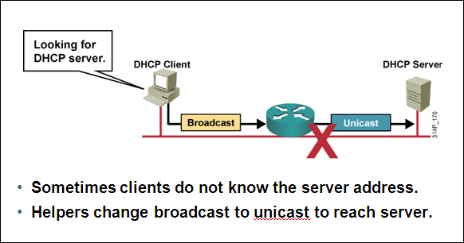

# DHCP

DHCP

2009年9月30日

13:14

> Bootp简介
> 
> 
> Bootstrap Protocol 自举协议
> 
> 注解：该协议是一个基于TCP/IP协议的协议，它可以让无盘站从一个中心服务器上获得IP地址，为局域网中的无盘工作站分配动态IP地址，并不需要每个用户去设置静态IP地址。使用BOOTP协议的时候，一般包括Bootstrap Protocol Server（自举协议服务端）和Bootstrap Protocol Client（自举协议客户端）两部分。
> 
> 应 用：该协议主要用于有无盘工作站的局域网中，客户端获取IP地址的过程如下：
> 
> 首先：由BOOTP启动代码启动客户端，这个时候客户端还没有IP地址，使用广播形式以IP地址0.0.0.0向网络中发出IP地址查询要求。
> 
> 其次：运行BOOTP协议的服务器接收到这个请求，会根据请求中提供的MAC地址找到客户端，并发送一个含有IP地址、服务器IP地址、网关等信息的FOUND帧。
> 
> 最后：客户端会根据该FOUND帧来通过专用TFTP服务器下载启动镜像文件，模拟成磁盘启动。
> 
> Dynamic host configuration protocol
> 
> 动态主机配置协议
> 
> 1、优点
> 
> 统一管理 ip 地址
> 
> 可有效避免 ip 地址冲突，简化网络管理人员设定 ip 时的困扰
> 
> 易于维护和客户使用
> 
> 节省实际使用的 ip
> 
> 2、原理
> 
> 
> 
> DHCP的工作过程如下：
> 
> 1．DHCP 客户机启动时，客户机在当前的子网中广播 DHCPDISCOVER 报文向 DHCP服务器申请一个 IP地址。
> 
> 2．DHCP服务器收到 DHCPDISCOVER 报文后，它将从针对那台主机的地址区间中为它提供一个尚未被分配出去的 IP 地址，并把提供的 IP 地址暂时标记为不可用。服务器以DHCPOFFER 报文送回给主机。如果网络里包含有不止一个的 DHCP 服务器，则客户机可能收到好几个 DHCPOFFER 报文，客户机通常只承认第一个 DHCPOFFER。
> 
> 3．客户端收到 DHCPOFFER 后，向服务器发送一个含有有关 DHCP 服务器提供的 IP地址的 DHCPREQUEST 报文。 如果客户端没有收到 DHCPOFFER 报文并且还记得以前的网络配置，此时使用以前的网络配置（如果该配置仍然在有效期限内） 。
> 
> 4． DHCP 服务器向客户机发回一个含有原先被发出的 IP地址及其分配方案的一个应答报文(DHCPACK)。
> 
> 5．客户端接受到包含了配置参数的 DHCPACK 报文，利用 ARP 检查网络上是否有相同的 IP地址。如果检查通过，则客户机接受这个 IP地址及其参数，如果发现有问题，客户机向服务器发送 DHCPDECLINE 信息，并重新开始新的配置过程。服务器收到DHCPDECLINE 信息，将该地址标为不可用。
> 
> 6．DHCP 服务器只能将那个 IP地址分配给 DHCP 客户一定时间，DHCP 客户必须在该次租用过期前对它进行更新。客户机在 50%租借时间过去以后，每隔一段时间就开始请求DHCP 服务器更新当前借，如果 DHCP 服务器应答则租用延期。如果 DHCP 服务器始终没有应答，在有效租借期的 87.5%，客户应该与任何一个其他的DHCP 服务器通信，并请求更新它的配置信息。如果客户机不能和所有的 DHCP 服务器取得联系，租借时间到后，它必须放弃当前的 IP 地址并重新发送一个 DHCPDISCOVER 报文开始上述的 IP 地址获得过程。
> 
> 7．客户端可以主动向服务器发出 DHCPRELEASE 报文，将当前的 IP地址释放。
> 
> <<DHCP工作原理.doc>>
> 
> 3、三种地址分配方式
> 
> l          自动分配，DHCP服务器给首次连接到网络的某些客户端分配固定IP地址，该地址由用户长期使用；
> 
> l          动态分配，DHCP服务器给客户端分配有时间限制的IP地址，使用期限到期后，客户端需要重新申请地址，客户端也可以主动释放该地址。绝大多数客户端主机得到的是这种动态分配的地址；
> 
> l          手动分配，由网络管理员为客户端指定固定的IP地址。
> 
> 注：关于DNS代理解析的问题
> 
> 可以将dns服务器地址设置为网关路由器的地址，由网关路由器代理dns服务器功能，以下三句话少不了。
> 
> Ip dns server //开启dns服务器功能
> 
> Ip name-server 8.8.8.8 //设置本地查询的真实dns服务器地址
> 
> Ip domain-lookup //开启域名解析系统
> 
> 4、服务器端配置
> 
> 启关排名网默域域租
> 
> service dhcp //开启DHCP服务
> 
> no ip dhcp conflict logging //关闭冲突
> 
> ip dhcp excluded-address 100.1.1.1 //排除不可被分配的地址
> 
> ip dhcp excluded-address 100.1.1.2
> 
> !
> 
1. ip dhcp pool **cisco**

> network 100.1.1.0 255.255.255.0 //
> 
> 
> default-router 100.1.1.1
> 
> domain-name cisco.com
> 
> dns-server 100.1.1.2
> 
> lease 【infinite | 100】
> 
> 客户端配置
> 
> ip address dhcp
> 
> R2#sh ip int br
> 
> Interface IP-Address OK? Method Status Protocol
> 
> FastEthernet0/0 100.1.1.2 YES DHCP up up
> 
> R1 ----E---- R2
> 
> 5、DHCP中继
> 
> 
> 
> 配置：
> 
> R1 (S2/0)==========(S2/0)R2(F1/0)==========(f1/0（PC）R3
> 
> Server client
> 
> R1#sh run
> 
> !
> 
> hostname R1
> 
> ！
> 
> no ip dhcp conflict logging
> 
> ip dhcp excluded-address 100.1.1.1
> 
> !
> 
> ip dhcp pool dhcp
> 
> network 100.1.1.0 255.255.255.0
> 
> default-router 100.1.1.1
> 
> dns-server 100.1.1.100
> 
> domain-name surpasslab.com
> 
> lease infinite
> 
> !
> 
> interface Serial2/0
> 
> ip address 12.1.1.1 255.255.255.0
> 
> !
> 
> router rip
> 
> version 2
> 
> network 0.0.0.0
> 
> no auto-summary
> 
> ===================================================R2#sh run
> 
> !
> 
> hostname R2
> 
> !
> 
> ip forward-protocol udp 67 68
> 
> ！
> 
> interface FastEthernet1/0
> 
> ip address 100.1.1.1 255.255.255.0
> 
> ip helper-address 12.1.1.1
> 
> !
> 
> interface Serial2/0
> 
> ip address 12.1.1.2 255.255.255.0
> 
> !
> 
> router rip
> 
> version 2
> 
> network 0.0.0.0
> 
> no auto-summary
> 
> ===================================================R3
> 
> interface FastEthernet1/0
> 
> ip address dhcp
> 
> duplex auto
> 
> speed auto
> 
> ==================================================
> 
> R1#sh ip dhcp binding
> 
> Bindings from all pools not associated with VRF:
> 
> IP address Client-ID/ Lease expiration Type
> 
> Hardware address/
> 
> User name
> 
> 100.1.1.3 0063.6973.636f.2d63. Oct 01 2009 03:12 PM Automatic
> 
> 6130.302e.3034.3330.
> 
> 2e30.3031.632d.4661.
> 
> 312f.30
>