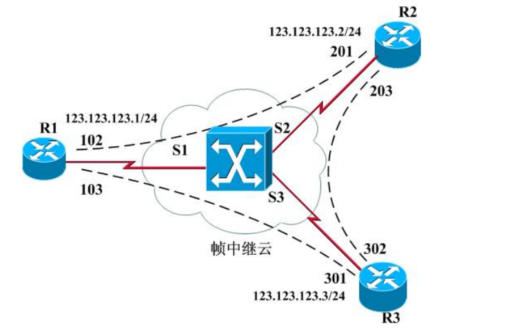
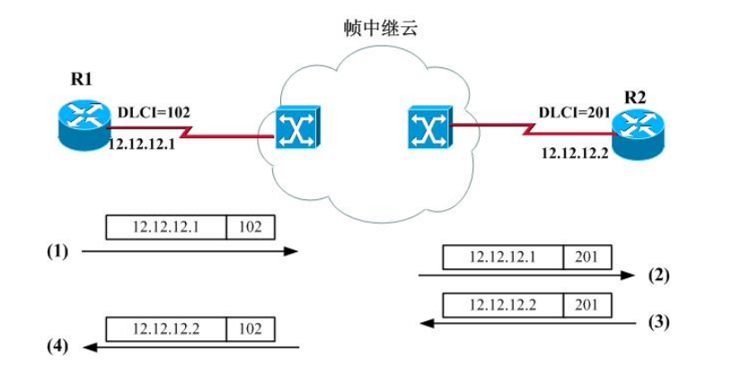
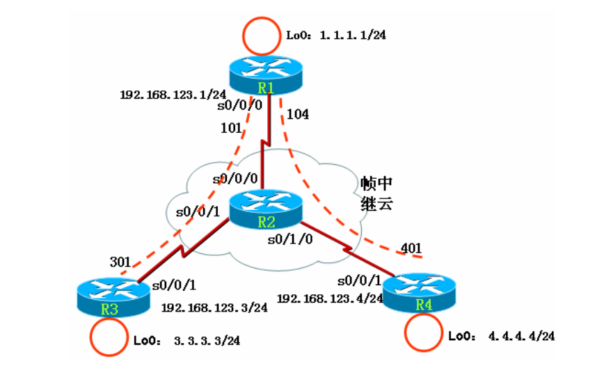

# Frame-Relay

Frame-Relay

2009年7月25日

17:36

frame-relay 帧中继

[帧中继.ppt](Frame-Relay/帧中继.ppt)

什么是帧中继?

帧中继（Frame Relay, FR）是面向连接的第二层传输协议，帧中继是典型的包交换技术。相比而言，同样带宽的帧中继通信费用比 DDN 专线要低，而且允许用户在帧中继交换网络比较空闲的时候以高于 ISP 所承诺的速率进行传输。

(1) 永久虚电路（PVC） ：虚电路是永久建立的链路，由 ISP 在其帧中继交换机静态配置交换表实现。不管电路两端的设备是否连接上，它总是为它保留相应的带宽。

(2) 数据链路连接标识符（DLCI） ：一个在路由器和帧中继交换机之间标识 PVC 或者 SVC的数值。

(3) 本地管理接口（LMI） ：是路由器和帧中继交换机之间的一种信令标准，负责管理设备之间的连接及维护其连接状态。

“encapsulation frame-relay [ cisco | ietf ]” 。路由器从帧中继交换机收到 LMI 信息后，可以得知PVC 状态。三种 PVC 状态是：

@激活状态（Active） ：本地路由器与帧中继交换机的连接是启动且激活的。可以与帧中继交换机交换数据。

@非激活状态（Inactive） ：本地路由器与帧中继交换机的连接是启动且激活的，但 PVC另一端的路由器未能与它的帧中继交换机通信。

@删除状态（Deleted） ：本地路由器没有从帧中继交换机上收到任何 LMI，可能线路或网络有问题，或者配置了不存在的 PVC。

(4) 承诺信息速率（CIR，Committed Information Rate） ：也叫保证速率，是服务提供商承诺将要提供的有保证的速率，一般为一段时间内（承诺速率测量间隔 T）的平均值，其单位为 bps。

(5) 超量突发（EB，Excess Brust） ：在承诺信息速率之外，帧中继交换机试图发送而未被准许的最大额外数据量，单位为 bit。超量突发依赖于服务提供商提供的服务状况，但它通常受到本地接入环路端口速率的限制。

DLCI（Data Link Circiut Identification，数据链路连接标识符）实际上就是帧中继网络中的第 2 层地址。 如图, 当路由器 R1 要把数据发向路由器 R2 （IP为123.123.123.2）时，路由器 R1 可以用 DLCI=102 来对 IP 数据包进行第 2 层的封装。数据帧到了帧中继交换机，帧中继交换机根据帧中继交换表进行交换：从 S1 接口收到一个 DLCI 为102 的帧时，交换机将把帧从 S2 接口发送出去，并且发送出去的帧的 DLCI 改为 201。这样路由器 R2 就会接收到 R1 发来的数据包。而当路由器 R2 要发送数据给 R1（IP 为 123.123.123.1）时，路由器 R2 可以用 DLCI=201 来对 IP 数据包进行第 2 层的封装，数据帧到了帧中继交换机，帧中继交换机同样根据帧中继交换表进行交换：从 S2 接口收到一个 DLCI为 201 的帧时，交换机将把帧从 S1 接口发送出去，并且发送出去的帧的 DLCI 改为 102。这样路由器 R1 就会接收到 R2 发来的数据包。 通过以上分析可以知道DLCI实际上就是IP数据包在帧中继链路上进行封装时所需的第2 层地址。图中各路由器中的第 3 层地址和第 2 层地址映射如下：

R1： 123.123.123.2→102

123.123.123.3→103

R2： 123.123.123.1→201

123.123.123.3→203

R3： 123.123.123.1→301

123.123.123.2→302

帧中继的一个非常重要特性是 NBMA （非广播多路访问） 。 图中， 如果路由器在 DLCI为 102 的 PVC 上发送一个广播，R2 路由器可以收到，然而 R3 是无法收到的。如果 R1 想发送的广播让 R2 和 R3 都收到，必须分别在 DLCI 为 102 和 103 的 PVC 上各发送一次，这就是非广播的含义。多路访问的意思是帧中继网络是多个设备接在同一网络介质上，以太网也是多路访问网络。

inverse ARP(IARP)用于将已知DLCI映射到IP地址

帧中继映射两种方式：

1 静态映射

管理员手工输入的映射就为静态映射，其命令为：

frame-relay map ip protocol *address dlci* [ broadcast ]

其中：

protocol：协议类型

address：网络地址

dlci：为所需要交换逆向 ARP 信息的本地接口的 DLCI号

broadcast：参数表示允许在帧中继线路上传送路由广播或组播信息

例子：R1(config-if)#frame map ip 123.123.123.2 102 broadcast

**2 动态映射**

IARP（Inverse ARP，逆向 ARP）允许路由器自动建立帧中继映射，其工作原理如图

所示：

(1) R1路由器从DLCI=102的PVC上发送IARP包， IARP包中有R1的IP地址12.12.12.1 ；

(2) 帧中继云对数据包进行交换，最终把 IARP 包通过 DLCI=201的 PVC 发送给 R2；

(3) 由于 R2 是从201 的PVC 上接收到该 IARP 包，R2 就自动建立一个映射：

12.12.12.1—→201

(4) 同样 R2 也发送 IARP 数据包，R1 收到该 IARP 包，也会自动建立一个映射：

12.12.12.2—→102

**默认时路由器帧中继接口是开启动态映射的**

**推荐配置是关闭动态映射（即反向ARP解析）**

子接口是一种逻辑接口

分两种类型

**点到点子接口:**

每一个子接口用来连接一条 PVC，每条 PVC 的另一端连接到另一路由器的一个子接口或物理接口。 这种子接口的连接与通过物理接口连接的点对点连接效果是一样的。每一对点对点的连接都是在不同的子网。

**点到多点子接口：**

一个点到多点子接口被用来建立多条 PVC，这些PVC 连接到远端路由器的多个子接口或物理接口。这时，所有加入连接的接口（不管是物理接口还是子接口）都应该在同一个子网上。点到多点子接口和一个没有配置子接口的物理主接口相同，路由更新要受到水平分割的限制。默认时多点子接口水平分割是开启的。

协商过程

信令协商

请求DLCI号

获取全部DLCI号

逆向解析

keepalive

10s发送一次，60s发送完整的DLCI列表号

实验一 将路由器配置成帧中继交换机

(1) 步骤 1：开启帧中继交换功能

R2(config)#frame-relay switching //注：把该路由器当成帧中继交换机

(2) 步骤 2：配置接口封装

R2(config)#int s0/0/0

R2(config-if)#no shutdown

R2(config-if)#clock rate 64000 //注：该接口为 DCE，要配置时钟

R2(config-if)#encapsulation frame-relay

//“encapsulation frame-relay [ ietf ]”命令用来配置接口封装成帧中继，如果不加ietf 参数，帧类型为 cisco；如果加ietf 参数，则帧类型为 ietf。

R2(config)#int s0/0/1

R2(config-if)#no shutdown

R2(config-if)#clock rate 64000

R2(config-if)#encapsulation frame-relay

R2(config)#int s0/1/0

R2(config-if)#no shutdown

R2(config-if)#clock rate 64000

R2(config-if)#encapsulation frame-relay

(3) 步骤3：配置LMI 类型

R2(config)#int s0/0/0

R2(config-if)#frame-relay lmi-type cisco

//命令“frame-relay lmi-type { ansi | cisco | q933a }用来配置 LMI的类型，默认时是 cisco 。

R2(config-if)#frame-relay intf-type dce

//命令“frame-relay intf-type { dce | dte }”用来配置接口是帧中继的 DCE 还是 DTE，要注意的是：这里的帧中继接口 DCE 和 s0/0/0 接口是 DCE 还是 DTE 无关，也就是说即使s0/0/0是 DTE，也可以把它配置成帧中继的 DCE。

R2(config)#int s0/0/1

R2(config-if)#frame-relay lmi-type cisco

R2(config-if)#frame-relay intf-type dce

R2(config)#int s0/1/0

R2(config-if)#frame-relay lmi-type cisco

R2(config-if)#frame-relay intf-type dce

(4) 步骤 4：配置帧中继交换表

R2(config)#int s0/0/0

R2(config-if)#frame-relay route 103 interface s0/0/1 301

R2(config-if)#frame-relay route 104 interface s0/1/0 401

//命令“frame-relay route 103 interface s0/0/1 301”是配置帧中继交换表的，告诉路由器如果从该接口收到 DLCI=103的帧，要从 s0/0/1 交换出去，并且 DLCI 改为301。

R2(config)#int Serial0/0/1

R2(config-if)#frame-relay route 301 interface Serial0/0/0 103

R2(config)#int Serial0/1/0

R2(config-if)#frame-relay route 401 interface Serial0/0/0 104

4. 实验调试

可以使用“show frame-relay route” 、 “show frame pvc” 、 “show frame lmi”等命令检查帧中继交换机是否正常。

实验二 基本配置

Int s1/0

Encapsulation frame-relay

No frame-relay inverse-arp

Ip add 12.1.1.1 255.255.255.0

frame-relay map ip 12.1.1.1 102 broadcast

frame-relay map ip 12.1.1.2 102 broadcast

No shutdown

show frame pvc 显示帧中继 PVC 状态

show frame lmi 显示帧中继 LMI 信息

show frame-relay map 查看帧中继映射

帧中继中，如果不关闭CEF，则只要在本地帧中继接口下映射地址，就会使用该DLCI发包！！

实验三 RIP运行于帧中继

不映射本地，直接ping远端过不去，加source lo 0 能过去

解决办法：映射本地DLCI

Show ip int s1/0 可以看到水平分割默认被关闭，开启水平分割（ip split-horizon），发现另两端学不到路由

实验四 点到多点子接口

(1) 对主接口进行配置

R1(config)#interface serial0/0/0

R1(config-if)#no ip address //注：主接口下不需要 IP地址

R1(config-if)#encap frame-relay //注：封装帧中继

R1(config-if)#no frame-relay inverse-arp //注：通常需要关闭主接口下的 IARP

R1(config-if)#no shutdown

(2) 创建点到多点子接口

R1(config)#int s0/0/0.1 multipoint //注：创建点到多点子接口

//这里命令“interface serial slot-number/interface-number.subinterface-number

{ multipoint | point-to-point }”用来创建子接口，其中：

slot-number/interface-number：即本物理接口的号码

subinterface-number：是子接口号，用户可以根据自己喜好来确定

multipoint 和 point-to-point：属于必须选择的项，是子接口的类型，要么是点

到多点，要么是点到点。

R1(config-subif)#ip address 192.168.123.1 255.255.255.0

R1(config-subif)#frame-relay map ip 192.168.123.3 103 broadcast

R1(config-subif)#frame-relay map ip 192.168.123.4 104 broadcast

//以上是配置帧中继映射

此时点到多点子接口默认是开启水平分割的，关闭掉以学习路由

实验五 点到点子接口

(1) 对主接口进行配置

R1(config)#interface serial0/0/0

R1(config-if)#no ip address

R1(config-if)#encap frame-relay

R1(config-if)#no frame-relay inverse-arp

R1(config-if)#no shutdown

(2) 创建两个点到点子接口

R1(config)#int s0/0/0.3 point-to-point //注：创建点到点子接口

R1(config-subif)#ip address 192.168.13.1 255.255.255.0

R1(config-subif)#frame-relay interface-dlci 103 //在接口下不能使用“frame-relay map ip”命令来配置帧中继的映射，而是改用命令

“frame-relay interface-dlci 103” 。

R1(config)#int s0/0/0.4 point-to-point

R1(config-subif)#ip address 192.168.14.1 255.255.255.0

R1(config-subif)#frame-relay interface-dlci 104