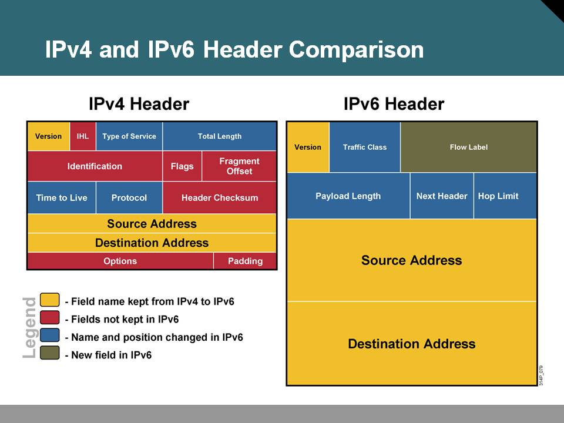
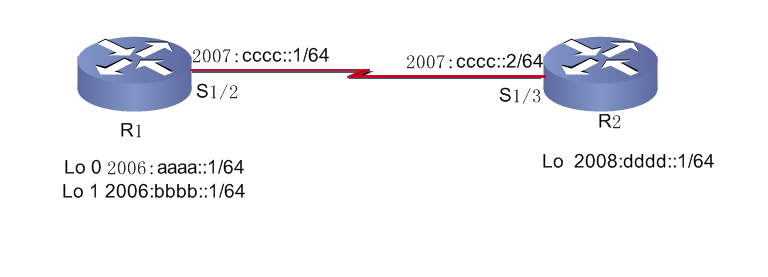
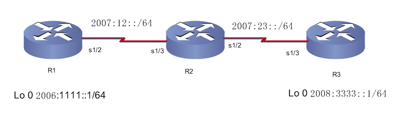

# IPV6

IPV6

2009年9月30日

13:14

> 1、为什么要用IPV6
> 
> 
> IPv6 的特点如下：
> 
> 1. 128 比特的地址方案，为将来数十年提供了足够的地址空间；
> 
> 2. 充足的地址空间将极大地满足那些伴随着网络智能设备的出现而对地址增长的需
> 
> 求，例如个人数据助理、移动电话、家庭网络接入设备等；
> 
> 3. 多等级编址层次有助于路由聚合，提高了路由选择的效率和可扩展性；
> 
> 4. 自动配置使得在 Internet 上大规模布置新设备成为可能；
> 
> 5. ARP 广播被本地链路多播代替；
> 
> 6. IPv6 对数据包头作了简化，以减少处理器开销并节省网络带宽；
> 
> 7. IPv6 中流标签字段可以提供流量区分；
> 
> 8. IPv6 的组播可以区分永久性与临时性地址，更有利于组播功能的实现；
> 
> 9. IPv6 地址本身的分层体系更加支持了域名解析体系中的地址集聚和地址更改；
> 
> 10. IPv6 协议内置安全机制，并已经标准化；
> 
> 11. IPv6 协议更好地支持移动性；
> 
> 12. IPv6 提供了更加优秀的 QOS 保障；
> 
> 13. IPv6 中没有广播地址，它的功能正在被组播地址所代替。
> 
> 
> 
> 2、关于IPv6地址
> 
> IPv6地址占128位，口诀：8个16位
> 
> 例如：
> 
> 3ffe：1944：0100：000a：0000：00bc：2500：0d0b
> 
> ff02：0000：0000：0000：0000：0000：0000：0005
> 
> 有两种规则可以简写IPv6地址：
> 
> **1.在每个16位的段中如果开头是0，可以省去**
> 
> 即上面的例子可以缩写为：
> 
> 3ffe：1944：100：a：0：bc：2500：d0b
> 
> ff02：0：0：0：0：0：0：5
> 
> **2.如果有一个或者是多个16位的段是全0，则可以用：：表示**
> 
> 即上面的例子可以进一步缩写为：
> 
> 3ffe：1944：100：a：：bc：2500：d0b
> 
> ff02：：5
> 
> 注意点：
> 
> （1）每个16位的段尾部的0不能省去，防止混淆
> 
> （2）每个缩写的IPv6地址中最多出现一次：：，防止混淆
> 
> 例子：2001：0d02：0000：0000：0014：0000：0000：0095
> 
> 则下面两种缩写都是正确的：
> 
> 2001：d02：：14：0：0：95
> 
> 2001：d02：0：0：14：：95
> 
> 但是如果写成下面的就是错的
> 
> 2001：d02：：14：：95
> 
> 原因是计算机无法还原出源地址，计算机会误认为下面几种地址：
> 
> 2001：0d02：0000：0000：0014：0000：0000：0095
> 
> 2001：0d02：0000：0000：0000：0014：0000：0095
> 
> 2001：0d02：0000：0014：0000：0000：0000：0095
> 
> 一个64位的网络前缀和一个64位的主机地址
> 
> 关于IPv6的掩码
> 
> IPv6不使用“全1表示网络位，全0表示主机位”的方法表示掩码
> 
> 而是使用“/xx”的方法
> 
> 即3ffe：1944：100：a：：bc：2500：d0b/64
> 
> 如果表示路由条目的话就是：
> 
> 3ffe：1944：100：a：：/64
> 
> 记几种特别的：
> 
> ：：/0 表示缺省路由
> 
> ：：/128 表示未指定地址，一般用在NDP（Neighbor Discovery Protocol）协议中
> 
> ：：1/128 表示回环地址，相当于IPv4中的127.0.0.1
> 
> /32 分配给ISP
> 
> /48 分配给客户的
> 
> /64 用于划分子网的
> 
> /128 主机位
> 
> **IPv6 uses:**
> 
- **Unicast**
    - **Address is for a single interface.**
    - **IPv6 has several types (for example, global and IPv4 mapped).**
- **Multicast**
    - **One-to-many**
    - **Enables more efficient use of the network**
    - **Uses a larger address range**
- **Anycast**
    - **One-to-nearest (allocated from unicast address space).**
    - **Multiple devices share the same address.**
    - **All anycast nodes should provide uniform service.**
    - **Source devices send packets to anycast address.**
    - **Routers decide on closest device to reach that destination.**
    - **Suitable for load balancing and content delivery services.**

> 
> 
> 
> IPv6 地址有三种类型：单播、任意播和组播，在每种地址中又有一种或者多种类型的
> 
> 地址，如单播有本地链路地址、本地站点地址、可聚合全球地址、回环地址和未指定地址；任意播有本地链路地址、 本地站点地址和可聚合全球地址； 多播有指定地址和请求节点地址。
> 
> 下面主要介绍几个常用地址类型：
> 
> 1. 本地链路地址 （link-local address）
> 
> 当在一个节点上启用 IPv6 协议栈， 启动时节点的每个接口自动配置一个本地链路地址，前缀为FE80::/10。
> 
> 2. 本地站点地址 (local scope address)
> 
> 本地站点地址与 RFC1918 所定义的私有 IPv4 地址空间类似，因此本地站点地址不能在全球 IPv6 因特网上路由, 前缀为 FEC0::/10。
> 
> 3. 可聚合全球单播地址 (aggregated global unicast address)
> 
> IANA 分配 IPv6 寻址空间中的一个 IPv6 地址前缀作为可聚合全球单播地址。
> 
> 4. IPv4 兼容地址
> 
> IPv4 兼容的 IPv6 地址是由过渡机制使用的特殊单播 IPv6 地址，目的是在主机和路由器上自动创建 IPv4 隧道以在 IPv4 网络上传送 IPv6 数据包。
> 
> 5. 回环地址
> 
> 单播地址 0:0:0:0:0:0:0:1 称为回环地址。节点用它来向自身发送 IPv6 包。它不能分配给任何物理接口。
> 
> 6. 不确定地址
> 
> 单播地址 0:0:0:0:0:0:0:0 称为不确定地址。它不能分配给任何节点。
> 
> 7. 多播指定地址
> 
> RFC2373 在多播范围内为 IPv6 协议的操作定义和保留了几个 IPv6 地址，这些保留地址称为多播指定地址。
> 
> 8. 请求节点地址
> 
> 对于节点或路由器的接口上配置的每个单播和任意播地址， 都自动启动一个对应的被请求节点地址。被请求节点地址受限于本地链路。
> 
> 3、实验
> 
> 1）、基本配置，配置IPV6地址
> 
> Int s1/2
> 
> Ipv6 address 1200::1/64
> 
> Show ipv6 interface brief
> 
> Serial1/2
> 
> FE80::CE00:AFF:FE7C:0 管理地址
> 
> 1200::1 全球单播地址
> 
> 2) 静态路由
> 
> 
> 
> R1(config)#ipv6 unicast-routing //启用 IPv6 流量转发
> 
> R1(config)#ipv6 route 2008:DDDD::/64 Serial1/2 //配置 IPv6 静态路由
> 
> R2(config)#ipv6 route ::/0 Serial1/3 //配置 IPv6 默认路由
> 
> R1#show ipv6 interface s1/2
> 
> R1#show ipv6 route
> 
> 3）、RIPng
> 
> 
> 
> R1(config)#ipv6 unicast-routing
> 
> R1(config)#ipv6 router rip cisco //启动IPv6 RIPng进程
> 
> R1(config-rtr)#split-horizon //启用水平分割
> 
> R1(config-rtr)#poison-reverse //启用毒化反转
> 
> R1(config)#interface Loopback0
> 
> R1(config-if)#ipv6 address 2006:1111::1/64
> 
> R1(config-if)#ipv6 rip cisco enable //在接口上启用 RIPng
> 
> R1(config)#interface Serial0/0/0
> 
> R1(config-if)#ipv6 address 2007:12::1/64
> 
> R1(config-if)#ipv6 rip cisco enable
> 
> show ipv6 rip database
> 
> 4）、Ospfv3
> 
> 
> 
> R1(config)#ipv6 unicast-routing
> 
> R1(config)#ipv6 router ospf 1 //启动OSPFv3 路由进程
> 
> R1(config-rtr)#router-id 1.1.1.1 //定义路由器ID
> 
> R1(config)#interface Serial1/2
> 
> R1(config-if)#ipv6 address 2007:12::1/64
> 
> R1(config-if)#ipv6 ospf 1 area 0 //在接口上启用 OSPFv3，并声明接口所在区域
> 
> 5) EIGRP v6
> 
> 
> 
> R1(config)#ipv6 unicast-routing
> 
> R1(config)#ipv6 router eigrp 1 //配置 IPv6 EIGRP
> 
> R1(config-rtr)#router-id 1.1.1.1 //配置路由器ID
> 
> R1(config-rtr)#no shutdown //启动IPv6 EIGRP 进程
> 
> R1(config)#interface Loopback0
> 
> R1(config-if)#ipv6 address 2006:1111::1/64
> 
> R1(config)#interface Serial1/2
> 
> R1(config-if)#ipv6 address 2007:12::1/64
> 
> R1(config-if)#ipv6 eigrp 1 //在接口上启用 IPv6 EIGRP
> 
> R1(config-if)#no shutdown
> 
> 6）、Tunnel
> 
- **Different transition mechanisms are available:**
    - **Smooth integration of IPv4 and IPv6.**
    - **Use of dual stack or 6to4 tunnels.**
- **Different compatibility mechanisms:**

> IPv4 and IPv6 nodes can communicate
> 
> 
> R1(ipv6)========(ipv6)R2(ipv4)========(ipv4)R3(ipv4)========(ipv4)R4(ipv6)========(ipv6)R5
> 
> Lo 0 IPv6 Lo 0 IPv6
> 
> R1:
> 
> ========================================================
> 
> en
> 
> conf t
> 
> host r1
> 
> no ip domain-loo
> 
> line con 0
> 
> no exec-t
> 
> logg syn
> 
> exi
> 
> !
> 
> ipv6 un
> 
> int lo0
> 
> ipv6 add 2001:1::1/64
> 
> int s1/2
> 
> no sh
> 
> ipv6 add 2001:12::1/64
> 
> exi
> 
> !
> 
> ipv6 router os 100
> 
> router-id 1.1.1.1
> 
> exi
> 
> int lo0
> 
> ipv6 os 100 area 0
> 
> ipv6 os net point-to-p
> 
> int s1/2
> 
> ipv6 os 100 area 0
> 
> exi
> 
> !
> 
> R2:
> 
> ================================================
> 
> en
> 
> conf t
> 
> host r2
> 
> no ip domain-loo
> 
> line con 0
> 
> no exec-t
> 
> logg syn
> 
> exi
> 
> !
> 
> ipv6 un
> 
> int s1/3
> 
> no sh
> 
> ipv6 add 2001:12::2/64
> 
> exi
> 
> !
> 
> int s1/2
> 
> no sh
> 
> ip add 211.1.23.1 255.255.255.0
> 
> exi
> 
> !
> 
> ip route 211.1.34.0 255.255.255.0 211.1.23.2
> 
> !
> 
> int tu10
> 
> ipv6 unnumbered s1/3
> 
> tun sou s1/2
> 
> tun destination 211.1.34.2
> 
> tun mode ipv6ip
> 
> exi
> 
> !
> 
> ipv6 router os 100
> 
> router-id 2.2.2.2
> 
> exi
> 
> int s1/3
> 
> ipv6 os 100 area 0
> 
> int tu10
> 
> ipv6 os 100 area 0
> 
> exi
> 
> !
> 
> R3:
> 
> ==========================================================
> 
> en
> 
> conf t
> 
> host r3
> 
> no ip domain-loo
> 
> line con 0
> 
> no exec-t
> 
> logg syn
> 
> exi
> 
> !
> 
> int s1/3
> 
> no sh
> 
> ip add 211.1.23.2 255.255.255.0
> 
> int s1/2
> 
> no sh
> 
> ip add 211.1.34.1 255.255.255.0
> 
> exi
> 
> !
> 
> R4:
> 
> =====================================================
> 
> en
> 
> conf t
> 
> host r4
> 
> no ip domain-loo
> 
> line con 0
> 
> no exec-t
> 
> logg syn
> 
> exi
> 
> !
> 
> int s1/3
> 
> no sh
> 
> ip add 211.1.34.2 255.255.255.0
> 
> exi
> 
> ipv6 un
> 
> int s1/2
> 
> no sh
> 
> ipv6 add 2001:45::4/64
> 
> exi
> 
> !
> 
> ip route 211.1.23.0 255.255.255.0 211.1.34.1
> 
> !
> 
> int tu10
> 
> ipv6 unnumbered s1/2
> 
> tun sou s1/3
> 
> tun destination 211.1.23.1
> 
> tun mode ipv6ip
> 
> exi
> 
> !
> 
> ipv6 router os 100
> 
> router-id 4.4.4.4
> 
> exi
> 
> int s1/2
> 
> ipv6 os 100 area 0
> 
> int tu10
> 
> ipv6 os 100 area 0
> 
> exi
> 
> !
> 
> R5:
> 
> ========================================================
> 
> en
> 
> conf t
> 
> host r5
> 
> no ip domain-loo
> 
> line con 0
> 
> no exec-t
> 
> logg syn
> 
> exi
> 
> !
> 
> ipv6 un
> 
> int lo0
> 
> ipv6 add 2001:5::5/64
> 
> int s1/3
> 
> no sh
> 
> ipv6 add 2001:45::5/64
> 
> exi
> 
> !
> 
> ipv6 router os 100
> 
> router-id 5.5.5.5
> 
> exi
> 
> int lo0
> 
> ipv6 os 100 area 0
> 
> ipv6 os net point-to-p
> 
> int s1/3
> 
> ipv6 os 100 area 0
> 
> exi
> 
> !
>