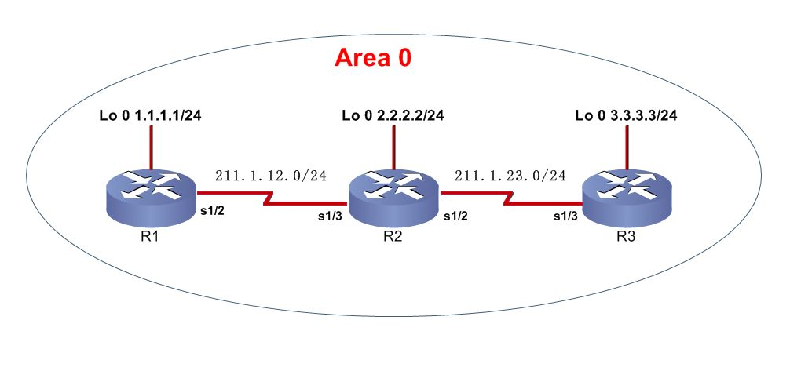
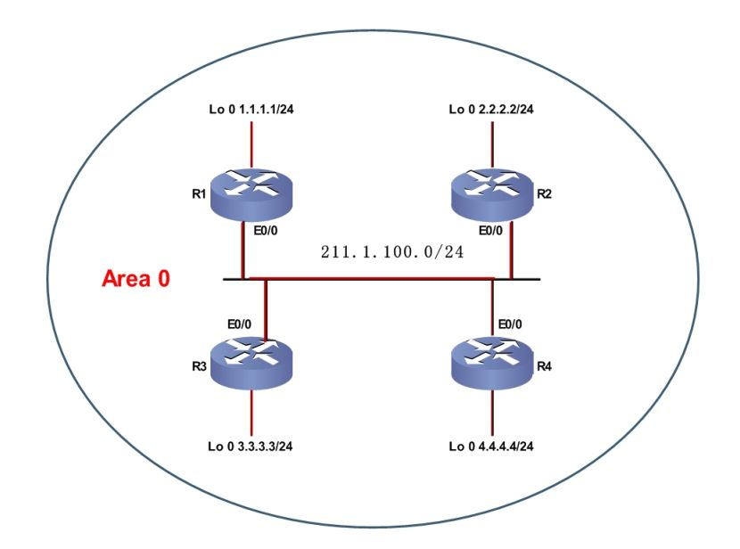
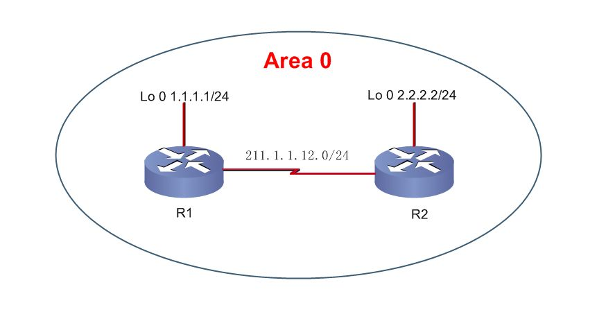

# OSPF实验

OSPF实验

2009年9月19日

23:58

实验一：基本配置

Router(config)#router ospf 100

Router(config-router)#router-id 1.1.1.1

Router(config-router)#network 1.1.1.1 0.0.0.0 area 0

Router(config-router)#network 211.1.12.1 0.0.0.0 area 0

1 ospf进程ID范围

2 区域ID为0或0.0.0.0时为骨干区域

3 宣告后可跟掩码或反掩码

4 Router-ID的选举原则

查看路由表show ip route

以O开头的路由是OSPF路由，其中环回口是32位的，解决办法：

**Router(config)#interface loopback 0**

**Router(config-if)#ip ospf network point-to-point //将环回口网络类型改为点到点类型**

cost值的计算：

**计算cost值，cost的计算公式为10的8次幂/带宽（bps） ，然后取整，而且是所有链路路由入向的cost之和，环回接口的cost为1。**

计算3.3.3.3 的路由cost值

show ip route //查看路由表

show ip protocols //查看已运行的路由协议

show ip ospf 100 //查看ospf状态

show ip ospf interface s1/2 //查看运行ospf状态的接口信息

show ip ospf neighbor //查看邻居表

show ip ospf database //查看拓扑表

实验二：多路访问环境下DR的选举

1 为了避免路由器之间建立完全邻接关系而引起的大量开销，OSPF要求在多路访问的网络中选举一个DR，每个路由器都与之建立邻接关系。选举DR的同时也选举出一个BDR，在DR失效的时候，BDR担负起DR的职责而且所有其它路由器只与DR和BDR建立邻接关系；

2 DR和BDR有它们自己的组播地址

3 DR和BDR的选举是以各个网络为基础的，也就是说DR和BDR选举是一个路由器的接口特性，而不是整个路由器的特性

4 DR 的选举原则

clear ip ospf process //清除OSPF进程，即重新计算OSPF

show ip ospf interface e0/0 //查看接口OSPF状态

debug ip ospf adj //查看OSPF运行情况

实验三 验证

接口验证: 明文验证

密文验证

区域验证：明文验证

密文验证

简单口令认证

基于区域的简单口令认证

R1(config-router)#area 0 authentication //区域0启用简单口令认证

R1(config)#interface s1/2

R1(config-if)#ip ospf authentication-key cisco //配置认证密码

show ip ospf interface

show ip ospf

基于区域的OSPF MD5认证

R1(config-router)#area 0 authentication message-digest //区域0启用MD5认证

R1(config)#interface s1/2

R1(config-if)#ip ospf message-digest-key 1 md5 cisco//配置认证key ID及密匙

基于链路的简单口令认证

R1(config-if)#ip ospf authentication //链路启用简单口令认证

R1(config-if)#ip ospf authentication-key cisco //配置认证密码

基于链路的OSPF MD5认证

R1(config)#interface s1/2

R1(config-if)#ip ospf authentication message-digest//接口 启用MD5认证

R1(config-if)#ip ospf message-digest-key 1 md5 cisco //配置key ID及密匙

- 1. OSPF链路认证优于区域认证；

<<OSPF总结小实验拓扑.jpg>>

<<OSPF总结小实验需求.txt>>

<<参考配置.txt>>

<<OSPF总结小实验拓扑.edx>>