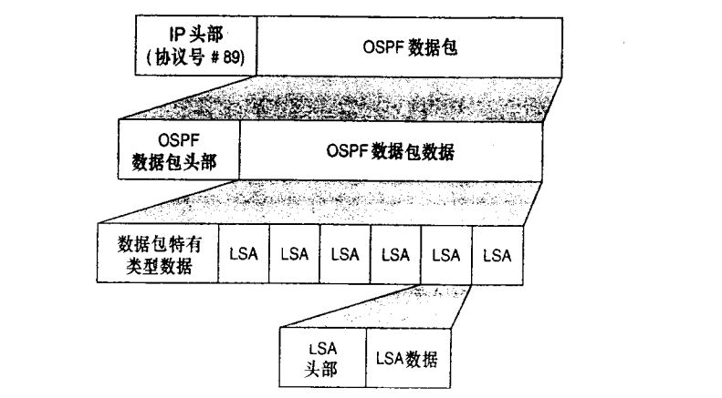

# OSPF理论

OSPF理论

2009年9月19日

23:58

> 
> 
> 
> 链路状态路由协议介绍
> 
> 距离矢量路由器所使用的信息可以比拟为由路标捉供的信息。链路状态路由选择协议像是一张公路线路图。链路状态路由器是不容易被欺骗而作出错误的路由决策的,因为它有一张完整的网络图。链路状态不间于距离矢量依照传闻进行路由选择的工作方式,原因是链路状态路由器从对等路由器那里获取第一手信息。每台路由器会产生一些关于自已、 本地直连链路、这些链路的状态 (以此而得名)和 所有直接相连邻居的信息。这些信息从一台路由器传送到另一台路由器,每 台路由器都做一份信息拷贝,但是决不改动信息。最终目的是每台路由器都有一个相同的有关网络的信息,并且每台路由器可以独立地计算各自的最优路径。链路状态协议也叫最短路径优先协议或分布式数据库协议。
> 
> 步骤1:每台路由器与它的邻居之间建立联系,这种联系叫做**邻接关系**。
> 
> 步骤2: 每台路由器向每个邻居发送被称为链路状态通告(**LSA**)的数据单元。对每台路由器链路都会生成一个LSA,LSA用于标识这条链路、链路状态、路由器接口到链路的代价度量值以及链路所连接的所有邻居。每个邻居在收到通告之后将依次向它的邻居转发(泛洪)这些通告。
> 
> 步骤3: 每台路由器要在数据库中保存一份它所收到的LSA的备份,如果所有步骤正常,所有路由器的数据库应该相同。
> 
> 步骤4:完整的拓扑数据库,也叫链路状态库,Dijkstra算法使用它对网络图进行计算得出到每台路由器的最短路径。接着链路状态协议对链路状态数据库进行查询找到每台路由器所连接的子网,并把这些信息输入到路由表中。
> 
> 1、OSPF特性 open short path first
> 
> 开放的最短路径优先协议
> 
> SPF算法：根据COST值计算到目的地的最短开销，无环的树状结构
> 
> Cost=10^8/接口带宽
> 
> 它是链路状态路由协议，协议号89，管理距离110。
> 
> 仅支持等价负载均衡
> 
> 快速响应网络变化，收敛快
> 
> 触发式更新
> 
> 适应大规模更新
> 
> 支持CIDR VLSM
> 
> 支持区域分割
> 
> 支持验证 实现明文和密文验证
> 
> 支持组播地址发送协议报文
> 
> 在MA网络环境中：
> 
> ·DRother发送LSA给DR/BDR用224.0.0.6
> 
> ·DR发送LSA给DRother用224.0.0.5
> 
> ·在非MA网络（没有DR/BDR）：
> 
> 路由器都用224.0.0.5
> 
> **OSPF预备知识**
> 
> OSPF将网络划分为四种类型： **广播多路访问型 （BMA） 、 非广播多路访问型 （NBMA） 、点到点型（Point-to-Point） 、点到多点型（Point-to-MultiPoint） 。不同的二层链路的类型需要OSPF不同的网络类型来适应**。
> 
> 几个术语：
> 
> 1. **链路**：链路就是路由器用来连接网络的接口；
> 
> 2. **链路状态**：用来描述路由器接口及其与邻居路由器的关系。所有链路状态信息构成
> 
> 链路状态数据库；
> 
> 3. **区域**：有相同的区域标志的一组路由器和网络的集合。在同一个区域内的路由器有
> 
> 相同的链路状态数据库；
> 
> 4. **自治系统**： 采用同一种路由协议交换路由信息的路由器及其网络构成一个自治系统；
> 
> 5. **链路状态通告（LSA）** ：LSA用来描述路由器的本地状态，LSA包括的信息有关于路由
> 
> 器接口的状态和所形成的邻接状态；
> 
> 6. **最短路经优先 （SPF） 算法**： 是OSPF路由协议的基础。 SPF算法有时也被称为Dijkstra算法，这是因为最短路径优先算法(SPF)是Dijkstra发明的。OSPF路由器利用 SPF，独立地计算出到达任意目的地的最佳路由。
> 
> 
> 
> 2、OSPF包头
> 
> 
> 
- Version is the OSPF version number. The OSPF version number is 2. There is an OSPF version 3, created for routing IPv6
- Type specifies the packet type following the header
- 

[Untitled](OSPF理论/Untitled%20Database%20d5af69d15c8941dfa5a68230002c070f.csv)

> 
> 
- Packet length is the length of the OSPF packet, in octets, including the header.
- Router ID is the ID of the originating router.
- Area ID is the area from which the packet originated. If the packet is sent over a virtual link, the Area ID will be 0.0.0.0, the backbone Area ID, because virtual links are considered part of the backbone.
- Area ID是数据包起源的区域ID，如果数据包是在虚链路上传输的，因为虚链路被认为属于骨干区域（backbone 区域），那么Area ID为0.0.0.0，也就是骨干区域（backbone）ID。
- Checksum is a standard IP checksum of the entire packet, including the header.
- AuType is the authentication mode being used.（0 空，1 简单，2密文）

> 
> 
> 
> 3、OSPF包类型
> 
> 各个包的作用：
> 
> Hello :发现，建立，维护邻居关系，确保双向通信，选择DR 、BDR
> 
> 链路类型 hello时间 死亡时间
> 
> 广播多路访问 10 40
> 
> 非广播多路访问 30 120
> 
> 点到点 10 40
> 
> 点到多点 30 120
> 
> 1）Hello：发现并建立邻接关系。
> 
> 2）DBD：包含路由的摘要信息。
> 
> 3）LSR：向另一台路由器请求特定路由的完整信息。
> 
> 4）LSU：回应LSR该条路由的完整信息。在OSPF中，只有LSU需要显示确认
> 
> 5）LSAck：对LSU做确认。
> 
> **LSDB和LSA操作**
> 
> 
> 
> 4、OSPF三张表
> 
> 邻居表: 邻居路由器的信息
> 
> 拓扑表: 也叫链路状态数据库，存储LSA
> 
> 路由表:到达目标网络的最佳路径
> 
> 5、DR和BDR、Drother
> 
> 为了避免路由器之间建立完全邻接关系而引起的大量开销，OSPF要求在**多路访问**的网络中选举一个DR，每个路由器都与之建立邻接关系。选举DR的同时也选举出一个BDR，在DR失效的时候，BDR担负起DR的职责，而且所有其它路由器只与DR和BDR建立邻接关系；
> 
> DR和BDR的选举是以各个网络为基础的，也就是说DR和BDR选举是一个**路由器的接口特性**，而不是整个路由器的特性；
> 
> DR选举的原则：
> 
> ① 首要因素是时间，最优先启动的路由器被选举成DR；
> 
> ② 如果同时启动，或者重新选举，则看接口优先级（范围为0-255） ，优先级最高的被选举成DR，默认情况下，多路访问网络的接口优先级为1，点到点网络接口优先级为0，修改接口优先级的命令是“ ip ospf priority” ，如果接口的优先级被设置为 0，那么该接口将不参与 DR 选举；
> 
> ③ 如果前两者相同，最后看路由器ID（Router-ID），路由器ID最高的被选举成DR；
> 
> 注意：DR选举是非抢占的，除非人为地重新选举。重新选举DR的方法有两种，一是路由器重新启动，二是执行“clear ip ospf process”命令。
> 
> 6、OSPF区
> 
> 骨干区（area 0 ）和常规区域
> 
> 
> 
> 7、router-id选举
> 
> 标示网络中唯一一台设备
> 
> 确定Router ID遵循如下顺序：
> 
> ① 最优先的是在OSPF进程中用命令“router-id”指定了路由器ID；
> 
> ② 如果没有在OSPF进程中指定路由器ID，那么选择IP地址最大的环回接口的IP地址为Router ID；
> 
> ③ 如果没有环回接口，就选择最大的活动的物理接口的IP地址为Router ID。
> 
> 8、OSPF建立邻居过程
> 
> <<OSPF邻接关系的建立过程.pptx>>
> 
> 
> 
> neighbor State Machine
> 
> ◊ **Down** The initial state of a neighbor conversation indicates that no Hellos have been heard from the neighbor in the last RouterDeadInterval.
> 
> ◊ **Attempt** This state applies only to neighbors on NBMA networks, where neighbors are manually configured.
> 
> ◊ **Init** This state indicates that a Hello packet has been seen from the neighbor in the last RouterDeadInterval, but two-way communication has not yet been established.
> 
> ◊ **2-Way** This state indicates that the router has seen its own Router ID in the Neighbor field of the neighbor's Hello packets, which means that a bidirectional conversation has been established. On multi-access networks, neighbors must be in this state or higher to be eligible to be elected as the DR or BDR.
> 
> ◊ **ExStart** In this state, the router and its neighbor establish a master/slave relationship . The neighbor with the highest Router ID becomes the master。
> 
> ◊ **Exchange** The router sends Database Description packets describing its entire link-state database to neighbors that are in the Exchange state. The router may also send Link State Request packets, requesting more recent LSAs, to neighbors in this state。
> 
> ◊ **Loading** The router sends Link State Request packets to neighbors that are in the Loading state, requesting more recent LSAs that have been discovered in the Exchange state but have not yet been received.
> 
> ◊ **Full** Neighbors in this state are fully adjacent, and the adjacencies appear in Router LSAs and Network LSAs。
>