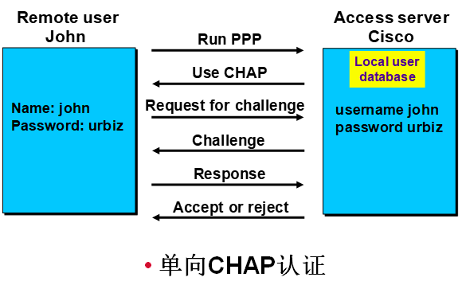

# PPP和HDLC

PPP和HDLC

2009年9月24日

17:11

[广域网基础.ppt](PPP和HDLC/广域网基础.ppt)

用户驻地设备(Customer premises equipment,**CPE**) 用户驻地设备是用户方拥有的设 各,位于用户驻地一侧。

分界点(Demarcation Point) 分界点是服务提供商最后负责点,也是 CPE的 开始。通 常是最靠近电信的设备,并且由电信公司拥有和安装。客户负责从此盒子到CPE的

布线(扩展分界).

本地回路(Local Loop) 本地回路连接分界到称为中心局的最近交换局。

中心局(Co,Central office) 这个点连接用户到提供商的交换网络。中心局有时指呈现点 (POP)。

长途网络(Toll network) 这些是WAN提供商网络中的中继线路。长途网络是属于ISP的交换机和设备的集合。

**租用线路(Leased lines)** 租用线路典型地指点到点连接或专线连接,租用线路是从本 地CPE经过DCE交换机到远程CPE的一条预先建立的WAN通 信路径。允许 DTE网 络 在任何时候不用设置就可以传输数据进行通信。当不考虑使用成本时,它是最好的选择类 型。它使用同步串行线路。租用线路通常使用 HDLC和 PPP封装 类型,我马上就会讲到这两种封装类型。

**电路交换(Circuit switching)** 它最大的优势是成本低 —— 只需为真正占用的时间付费。在建立端到端连接之前,不能传输数据。电路交换使用拨号调制解调器或ISDN,用 于低带宽数据传输。在一些广域网的新技术上同样可以使用电路交换。

**包交换(Packet switching)** 这是一种 WAN交换方法,允许和其他公司共享带宽以节省资金。可以将包交换想像为一种看起来像租用线路,但费用更像电路交换的一种网络。

不利因素是,如果需要经常传输数据,则不要考虑这种类型,应当使用租用线路。如果是偶然的突发性的数据传输,那么包交换可以满足需要。帧中继和X.25是 包交换技术,速率从56Kb/s到 T3(45Mb/s)。

ISDN 综合业务数字网(Integrated Services Digital Network,ISDN)是在现有电话线

路上传输声音和数据的一套数字服务。ISDN为 那些需要提供比模拟拨号线路更高速连接的远程用户提供了更划算的解决方案。作为其他连接类型的备份链路,ISDN也 是一种好的选择方案。

**基本速率接口(BRI)**

**主速率接口(PRI)**

HDLC

HDLC是点到点串行线路上（同步电路）的帧封装格式，其帧格式和以太网帧格式有很

大的差别， HDLC帧没有源MAC地址和目的MAC地址。 Cisco公司对HDLC进行了专有化， Cisco的HDLC封装和标准的HDLC不兼容。如果链路的两端都是Cisco设备，使用HDLC封装没有问题，但如果Cisco设备与非Cisco设备进行连接，应使用PPP协议。HDLC不能提供验证，缺少了对链路的安全保护。默认时，Cisco路由器的串口是采用Cisco HDLC封装的。如果串口的封装不是HDLC，要把封装改为HDLC使用命令“encapsulation hdlc” 。

PPP

<<PPP协议解析.doc>>

1、特性

PPP协议是在SLIP(Serial Line Internet Protocol )的基础上发展起来的。

PPP协议是数据链路层协议，位于第二层

Point-to-Point协议作为一种提供在点到点链路上的封装、传输网络层数据包的数据链路层协议，主要被设计用来在支持全双工的异步链路上进行点到点之间的数据传输。

支持点到点的连接（不同于X.25，Frame Relay等数据链路层协议）；

具有各种NCP协议，如IPCP、IPXCP更好的支持了网络层协议；

具有验证协议PAP/CHAP，更好的保证了网络的安全性。

2、主要组成部分

1）LCP主要用于建立，拆除和监控PPP数据链路

2）NCP主要用于协商在数据链路上所传输的数据包的格式与类型

3）PPP提供了用于网络安全方面的验证协议族(PAP和CHAP)。

3、协商过程

PPP协商分为几个阶段：Dead阶段、Establish阶段、Authenticate阶段、Network阶段和Terminate阶段，在不同的阶段进行不同协议的协商

1)当物理层不可用时，PPP链路处于Dead阶段，链路必须从这个阶段开始和结束。当物理层可用时，PPP在建立链路之前先进行LCP协商。

2)LCP协商过后就进入Establish阶段，此时LCP状态为Opened，表示链路已经建立。

3)如果配置了验证就进入Authenticate阶段，开始CHAP或PAP验证。

4)如果验证失败进入Terminate阶段，拆除链路，LCP状态转为Down，如果验证成功就进入Network协商阶段（NCP），此时LCP状态仍为Opened，而状态从Initial转到Request。

1、LCP协商 opened

2、验证阶段 opened 如果验证失败进入down（LCP）

3、NCP （协商数据格式） 协商成功发包传输数据

4、PAP验证 Password Authentication Protocol

第一步：被验证方发送用户名和口令到验证方：

第二步：验证方根据用户配置信息查看是否有此用户和口令，并验证其是否正确，然后返回不同的响应（Acknowledge or Not Acknowledge）。

如正确则会给对端发送ACK报文，通告对端已被允许进入下一阶段协商；

否则发送NCK报文，通告对端验证失败。当验证不通过次数达到4次时关闭链路

特点：

1）以明文的方式传递用户名及口令

2）它适用于对网络安全要求相对**较低**的环境。

5、CHAP验证

第一步 拨号者发起CHAP呼叫

第二步 访问服务器向拨号者发送挑战信息

第三步 拨号者处理挑战消息

第四步 拨号者向访问服务器发送挑战应答

第五步 访问服务器检查拨号者发过来的应答数据包

第六步 访问服务器向拨号者发送认证通过/失败的消息

实验一 基本配置

R1(config-if)#encapsulation ppp

R2(config-if)#encapsulation hdlc

两端如果封装不一致，则ping不通

Show ip interface brief

实验二、PAP验证

首先配置路由器R1（远程路由器，被认证方）在路由器R2（中心路由器，认证方）取得验证：

(1) 两端路由器上的串口采用PPP封装，用“encapsulation”命令：

R1(config)#int s1/2

R1(config-if)#encapsulation ppp

(2) 在远程路由器R1上，配置在中心路由器上登录的用户名和密码，使用“ppp pap

sent-username 用户名 password 密码”命令：

R1(config-if)#ppp pap sent-username R1 password 123456

(3) 在中心路由器上的串口采用PPP封装，用“encapsulation”命令：

R2(config)#int s1/3

R2(config-if)#encapsulation ppp

(4) 在中心路由器上，配置PAP验证，使用“ppp authentication pap”命令：

R2(config-if)#ppp authentication pap

(5) 中心路由器上为远程路由器设置用户名和密码，使用“username 用户名 password 密码”命令：

R2(config)#username R1 password 123456

以上的步骤只是配置了R1（远程路由器）在R2（中心路由器）取得验证，即单向验证。

然而在实际应用中通常是采用双向验证，即：R2要验证R1，而R1也要验证R2。我们要采

用类似的步骤进行配置R1对R2进行验证，这时R1为中心路由器，R2为远程路由器了：

(6) 在中心路由器R1上，配置PAP验证，使用“ppp authentication pap”命令：

R1(config-if)#ppp authentication pap

(7) 在中心路由器R1上为远程路由器R2设置用户名和密码，使用“username 用户名

password 密码”命令：

R1(config)#username R2 password 654321

(8) 在远程路由器R2上，配置以什么用户和密码在远程路由器上登录，使用“ppp pap

sent-username 用户名 password 密码”命令：

R2(config-if)#ppp pap sent-username R2 password 654321

【提示】在ISDN拨号上网时，却通常只是电信对用户进行验证（要根据用户名来收费） ，用户不能对电信进行验证，即验证是单向的。

R1#debug ppp authentication

将接口关闭后打开以查看验证的过程

实验三、CHAP验证

(1) 使用“username 用户名 password 密码” 命令为对方配置用户名和密码，需要注意的是两方的密码要相同：

R1(config)#username R2 password hello

R2(config)#username R1 password hello

(2) 路由器的两端串口采用PPP封装，并采用配置CHAP验证：

R1(config)#int s1/2

R1(config-if)#encapsulation ppp

R1(config-if)#ppp authentication chap

R2(config)#int s1/3

R2(config-if)#encapsulation ppp

R2(config-if)#ppp authentication chap

上面是CHAP验证的最简单配置，也是实际应用中最常用的配置方式。配置时要求用户

名为对方路由器名，而双方密码必须一致。原因是：由于CHAP默认使用本地路由器的名字做为建立PPP连接时的识别符。路由器在收到对方发送过来的询问消息后，将本地路由器的名字作为身份标识发送给对方；而在收到对方发过来的身份标识之后，默认使用本地验证方法，即在配置文件中寻找，看看有没有用户身份标识和密码；如果有，计算加密值，结果正确则验证通过；否则验证失败，连接无法建立。

【提示】在配置验证时也可以选择同时使用PAP和CHAP，如：

R2(config-if)#ppp authentication chap pap 或

R2(config-if)#ppp authentication pap chap

如果同时使用两种验证方式，那么在链路协商阶段将先用第一种验证方式进行验证。如果对方建议使用第二种验证方式或者只是简单拒绝使用第一种方式，那么将采用第二种方式。