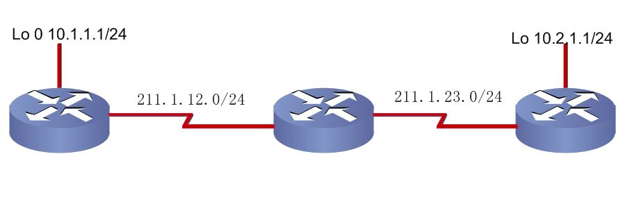

# RIP实验

RIP实验

2009年9月19日

22:47

实验一：基本实验

（1）基本配置

全局模式下

V1（版本一）

**R1(config)#router rip //开启RIP进程**

**R1(config-router)#version 1 //强制为版本1**

**R1(config-router)#network 1.0.0.0 //主类宣告需加进RIP进程的网段**

**R1(config-router)#network 211.1.12.0**

@1查看运行协议

Show ip protocols （注意查看计时器）

Show ip route

Clear ip route * //清除路由表

基本的Debug命令:debug ip rip

@2调整计时器命令：

R1(config-router)#timers basic *update invalid holddown flushed*

@3

修改RIP路由协议支持等价路径的条数：

R1(config-router)#maximum-paths *number-paths*

//查看支持等价路径条数：show ip protocols

V2（版本二）

R1(config)#router rip **//开启RIP进程**

R1(config-router)#no auto-summary // 关闭自动汇总,以实现对不连续子网的支持

R1(config-router)#version 2 //强制为版本2

R1(config-router)#network 1.0.0.0 //以主类形式宣告需加进RIP进程的网段

R1(config-router)#network 211.1.12.0

默认情况下，RIP会在网络边界将不同网段自动汇总为主类路由，解决办法：RIPv1使用第二地址，RIPv2可以直接关闭掉自动汇总。

（2）RIPv1路由更新可以携带子网信息需要满足条件的验证

> 
> 

补1：改S口地址掩码为/25，查看实验现象

<<RIPv1收发更新规则.exe>>

结论：

**RIPv1路由更新可以携带子网信息必须同时满足两个条件：**

**（1）整个网络所有地址在同一个主类网络；**

**（2）子网掩码长度必须相同。**

补2：

R1(config-if)#ip rip send version 2

R1(config-if)#ip rip receive version 1 2

//接口特性是优于进程特性的,所以即使在RIP进程中配置了版本号为2，因为在接口下打入了接收版本一的消息，所以可以接收

实验二 RIP v2手工汇总

R4(config)#interface s1/3

R4(config-if)#ip summary-address rip 4.4.0.0 255.255.252.0

1 汇总成/22 位的

2 补充

将路由器R4上四个环回接口lo0-lo4的地址分别修改为192.168.96.4/24, 192.168.97.4/24, 192.168.98.4/24, 192.168.99.4/24,在s1/3接口下还能够实现路由

汇总吗？

R4(config-if)#ip summary-address rip 192.168.96.0 255.255.252.0

路由器会提示如下信息：

“Summary mask must be greater or equal to major net”

RIPv2不支持CIDR汇总，但是可以传递CIDR汇总

解决方案如下：

（1）用静态路由发布被汇总的路由

R4(config)#ip route 192.168.96.0 255.255.252.0 null0

（2）将静态路由重分布到RIP网络中

R4(config)#router rip

R4(config-router)#redistribute static //将静态路由重分布到RIP路由协议中

R4(config-router)#no network 192.168.96.0

R4(config-router)#no network 192.168.97.0

R4(config-router)#no network 192.168.98.0

R4(config-router)#no network 192.168.99.0

（3）在路由器R1上查看路由表

实验三 RIPv2验证（RIPv1不支持验证）

全局模式

key chain ____ （钥匙链）

key __1__ （钥匙）

key-string ____ （钥匙的锯齿）

接口下

int ____

密文认证 ip rip au m m

明文认证 ip rip au m text //默认认证模式就是明文，所以也可以不用指定

ip rip au key-chain _____

**触发更新命令：**

接口下 Ip rip triggered

**（1）在以太网接口下，不支持触发更新；**

**（2）触发更新需要协商，链路的两端都需要配置；**

**（3）在认证的过程中，如果定义多个key ID，明文认证和MD5认证的匹配原则是不一样的：**

**① 明文认证的匹配原则是：**

**A. 发送方发送最小Key ID的密钥**

**B. 不携带Key ID号码**

**C. 接收方会和所有Key Chain中的密钥匹配，如果匹配成功，则通过认证。**

【实例1】

路由器R1有一个Key ID,key1=cisco；

路由器R2有两个Key ID,key1=ccie，key2=cisco

根据上面的原则，R1认证失败，R2认证成功，所以在RIP中，出现单边路由并不稀奇。

**② MD5认证的匹配原则是：**

**A. 发送方发送最小Key ID的密钥**

**B. 携带Key ID号码**

**C. 接收方首先会查找是否有相同的Key ID，如果有，只匹配一次，决定认证是否成功。如果没有该Key ID，只向下查找下一条，匹配，认证成功；不匹配，认证失败。**

【实例2】

路由器R1有三个Key ID,key1=cisco，key3=ccie,key5=cisco ；

路由器R2有一个Key ID,key2=cisco

根据上面的原则，R1认证失败，R2认证成功。

实验四 浮动静态路由

通过修改静态路由的管理距离为130，使得路由器选路的时候优先选择RIP，而静态路由作为备份。

（1）只将211.1.22.0网段加进RIP

（2）

R1(config)#ip route 2.2.2.0 255.255.255.0 211.1.11.2 130

R2(config)#ip route 1.1.1.0 255.255.255.0 211.1.11.1 130

（3）将E0/0口shutdown，看路由表

练习题：

<<RIP总结小实验.jpg>>

<<RIP总结小实验配置.txt>>

<<RIP总结小实验.edx>>