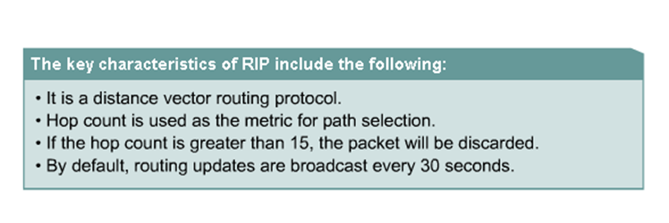
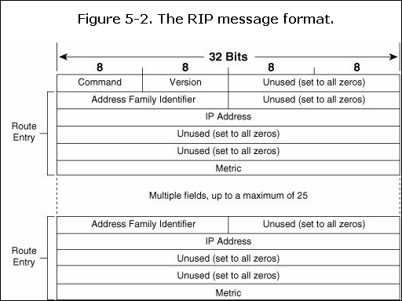
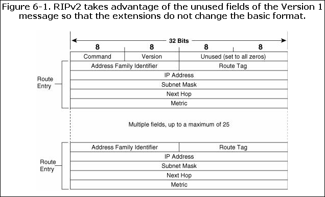
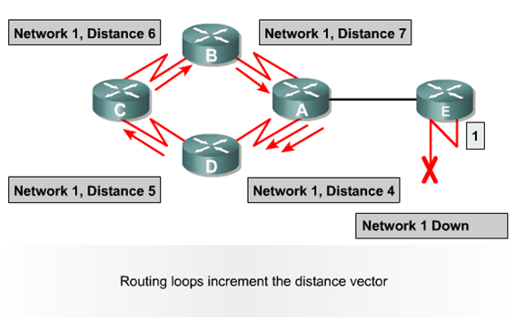
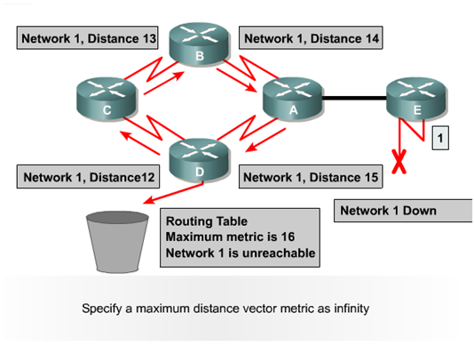

# RIP理论

RIP理论

2009年9月19日

22:47

> RIP理论
> 
> 
> [RIP理论.pptx](RIP理论/RIP理论.pptx)
> 
> 1、特性：
> 
> （1）DV（Distance Vector Protocol）协议的特点：
> 
> 1）周期性以广（组）播向邻居发送更新。
> 
> 2）将整个路由表的信息传递给邻居。
> 
> 3）Metric（度量值）只跟跳数有关。
> 
- （2）收敛时间 （convergence time):从网络拓扑发生变化到网络中所有路由器都知道这个表化的时间就叫 收敛时间

> 
> 
> 
> （3）RIP 的特点
> 
> 
> 
> 距离矢量路由协议
> 
> 跳数用来作为选路的度量值
> 
> 如果跳数大于15，丢包
> 
> 默认状态下，路由每30s进行一次广播更新
> 
> （4）使用UDP端口 520 、 RIPng UDP 521
> 
> RIP 管理距离 120
> 
> 2、报文
> 
> 请求 request
> 
> 响应 response
> 
> 3、消息格式
> 
> VERSION 1
> 
> 
> 
> 携带路由条目 25
> 
> Version 2
> 
> 
> 
> 携带路由条目做明文验证24条，做了密文验证23条
> 
> 说明：
> 
> 命令：1 请求 2 响应
> 
> AFI：置2，表IP网络
> 
> 4、计时器
> 
> Update timer（30S）
> 
> 随机变量是更新周期的15%，即4.5S　（25.5S-30S)
> 
> version 1 broadcast 、version 2 组播地址224.0.0.9
> 
> invalid timer（180s）：当有一条新的路由被建立，超时计时器就会被初始化为180s，而每当接收到这条路由的更新消息时，超时计时器又将被重置成计时器的初始化值即180s，如果一条路由的更新在180s（6个更新周期）内还没收到，那么这条路由的跳数变成16，也就是标记为不可达的路由。
> 
> flush timer（240s）：从路由条目建立开始计时即与invalid timer同时开使计时，时间为240s。如果flush timer也超时了，则该路由将被通告为一条度量值不可达的路由，同时从路由表中删除。
> 
> holddown timer（180s）：在RFC文档中没有定义，在运行RIP的Cisco设备上启用了该计时器，路由器如果在相同的接口上收到某个路由条目的距离比原先收到的距离大，那么将会引起路由进入180s的抑制状态阶段（invalid timer超时后路由跳数为16跳，所以当invalid timer超时后该计时器立即启动）。 在抑制计时器的时间内该目的标记为不可到达，并且向外发送毒性路由，直到计时器超时，路由器才可以接受有关此路由的更新信息。
> 
> Holddown timer的原理是引用一个怀疑量，不管是真的还是假的路由消息，路由器先认为是假消息来避免路由环路。如果在抑制计时器超时后还接受到该消息，那么这时路由器就认为该消息时真的。RIP中认为假的消息总是真不了，不长久。hold down 的存在理由就是为了使得全网的毒化路由接收一致,防止路由环路 (holddown time 要保证毒化路由传遍整个网络）
> 
> 5、防环
> 
- **Routing loops can occur when inconsistent routing tables are not updated due to slow convergence in a changing network.**
- 
    
    
    

> 
> 
> 
> 
> 
> 解决办法：
> 
> 1）Defining a Maximum：16跳。
> 
> 2）Split Horizon：从某接口发送的更新消息不能包含从该接口收到的更新所包含的网络。
> 
> 3）Route Poisoning：当更新信息被发送出某接口时，信息中将指定从该接口收到的更新信息中获取的网络是不可达的。
> 
> 4）Holddown Timers：所有邻居都将此路由“冻结”，
> 
> 如在“冻结”期内该路由恢复，继续采纳该路由
> 
> 如在“冻结”期收到更好的路由，将采纳更好的路由
> 
> 如在“冻结”期收到更差的路由，不采纳该路由
> 
> 5）Triggered Updates：
> 
> 避免周期性更新占用带宽，只有当拓扑变化时才发送更新。
> 
> **6、V1 V2区别**
> 
> V1 V2
> 
> A 、广播形式发送更新 组播的形式发送更新
> 
> B 、没有下一跳IP address
> 
> 没有子网掩码 有
> 
> 没有route tag
> 
> C 、不支持CIDR VLSM 支持（传递但本地不产生CIDR路由）
> 
> D 、不支持验证 支持明文和密文验证
> 
> E 、不支持手工汇总 支持手工汇总
> 
> 7、负载均衡 默认4 最大16
> 
> 8、关于管理距离
> 
> 概念：a、又称之为协议优先级
> 
> b、适用于不同路由协议之间选择最佳路径
> 
> RIP的为120
> 
> 其中组播发送的意义：
> 
> 以太网具有广播属性，一个节点发送的数据包会被以太网泛洪，导致每一个以太网网卡接口都会收到这个数据包。接口收到数据包后，并不马上交给节点CPU处理，而是进行MAC地址比较，如果数据包的目的MAC地址和接口的MAC地址一样，它才接受，把数据包交给计算机，否则就把数据包丢弃。组群成员的网卡接口除了硬件MAC地址 (unicast MAC)，还有组播MAC地址 (multicast MAC)。接口收到组播包，会把此包的目的MAC地址 （是个组播MAC）和自己的MAC地址比较，如果组播地址相同，就会接受此包。这样，局网内这个组群的所有成员，都会收到送往该组群的组播包。
> 
> 总结：
> 
> RIP 的特性：
> 
> 1. 是距离矢量路由协议；
> 
> 2. 使用跳数（Hop Count）作为度量值
> 
> 3．默认路由更新周期为30秒；
> 
> 4. 管理距离（AD）为120；
> 
> 5. 支持触发更新；
> 
> 6. 最大跳数为15跳；
> 
> 7. 支持等价路径,默认4条,最大16条
> 
> 8. 使用UDP520端口进行路由更新。
> 
> VLSM划分子网，将原来分类IP地址中的主机位按照需要划出一部分作为网络位使用
> 
> CIDR聚合地址，是将原来分类IP地址中的网络位划出一部分作为主机位使用。
>