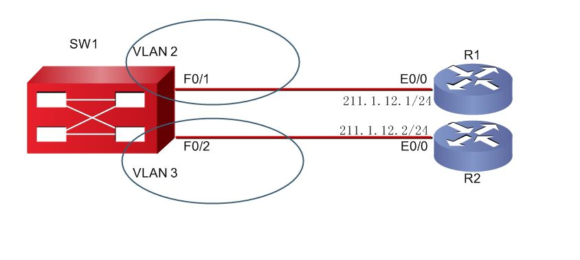
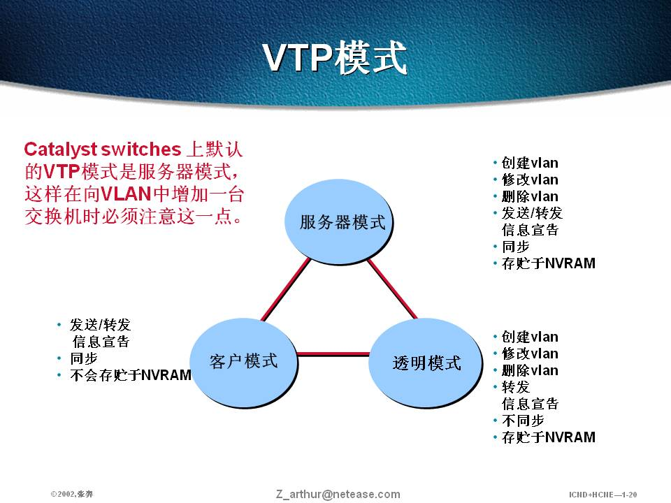
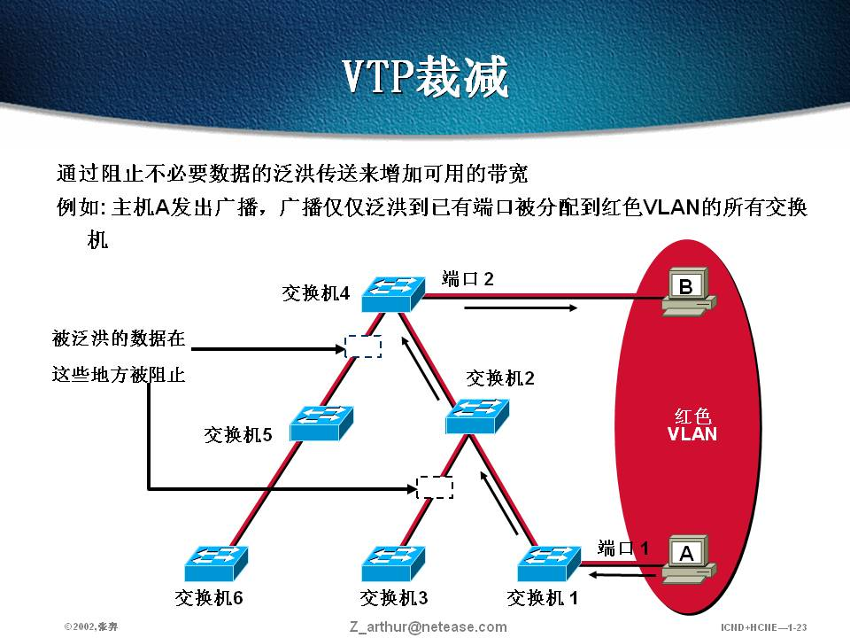
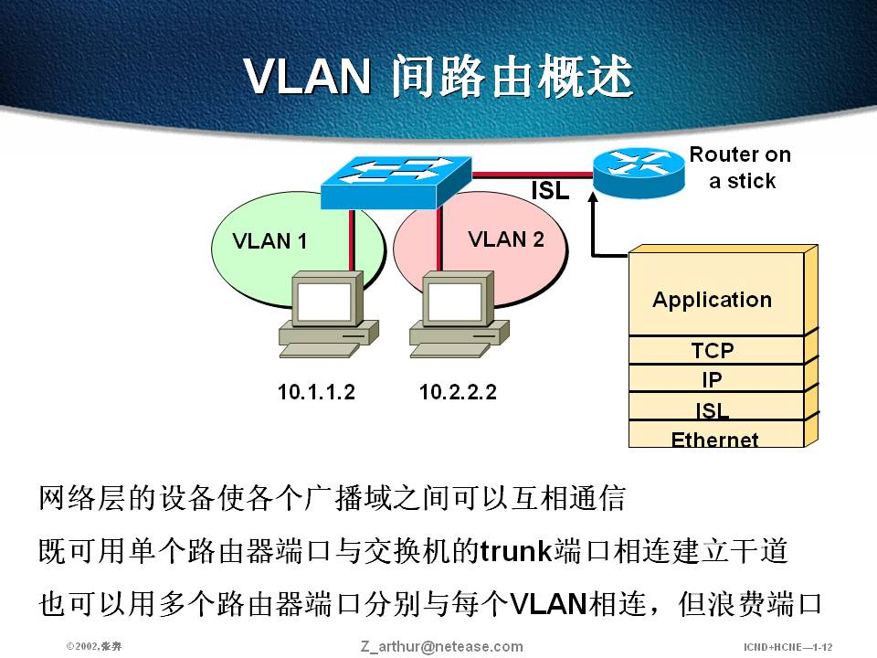
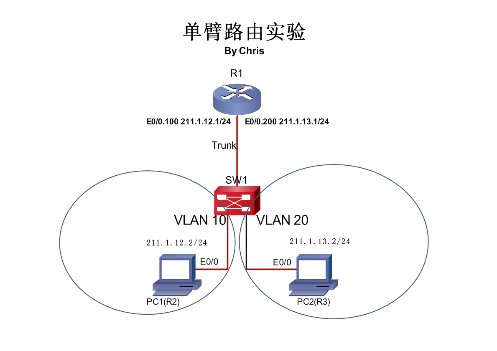

# 二层交换

二层交换

2009年9月24日

13:28

> 1 二层交换
> 
> 
> [二层交换机通讯过程.doc](二层交换/二层交换机通讯过程.doc)
> 
> [二层交换技术.ppt](二层交换/二层交换技术.ppt)
> 
> [关于主机发包与代理ARP解析_Chris.doc](二层交换/关于主机发包与代理ARP解析_Chris.doc)
> 
> **交换机的工作原理：**
> 
> 第一次收到一个去往目的地的帧，会首先记录其MAC地址和端口，而后将帧广播，目的接口返回数据帧，交换机记录其MAC地址和端口，并且之后只在源和目的之间转发而不广播，集线器的工作过程就是“广播”，所以会造成冲突。
> 
> 交换机功能：
> 
> 1 地址学习
> 
> 2 转发、过滤数据帧（查看目的地址，找到转发接口）
> 
> 3 避免环路
> 
> **STP**
> 
> STP基本术语
> 
> ·避免单点失效的方法就是构造冗余网络。
> 
> ·冗余网络导致的问题：
> 
> 1.多帧复制(浪费带宽) 在组播中是个大问题
> 
> 2.MAC地址表的翻动
> 
> 3.广播风暴
> 
> 阻止冗余网络就是建立block
> 
> ·STP是为克服冗余网络中透明桥接的环路问题而创建的。
> 
> STP通过判断网络中存在环路的地方，并阻断冗余链路来实现无环网络。
> 
> ·STP采用STA（Spanning Tree Arithmetic）算法。
> 
> STA会在冗余链路中选择一个参考点（生成树的根），将选择到达要的单条路径，同时阻断其他冗余路径。一旦已选路径失效，将启用其他路径。
> 
> 术语：
> 
> 根桥（Root bridge）
> 
> BPDU（桥协议数据单元）
> 
> 桥ID（Bridge ID）
> 
> 非根桥（Nonroot bridge）
> 
> 端口开销（Port cost）
> 
> 根端口（Root port）
> 
> 指定端口（Designated port）
> 
> 非指定端口（Nondesignated port）
> 
> 转发端口（Forwarding port）
> 
> 阻塞端口（Blocked port）
> 
> STP的各种选举是通过交换BPDU报文来实现的，BPDU是直接封装在以太网帧中的。
> 
> BPDU（Bridge Protocol Data Unit）：BPDU每2S由根桥发送一次。
> 
> 最初的网络，每个SW都认为自己是根桥，都会发送BPDU，比较Lowest BID，选举出一个根桥，此时就只有根桥发送BPDU。非根桥只进行转发。
> 
> BPDU有两种类型：
> 
> 配置BPDU：所有根桥上的端口周期性发出。
> 
> TCN(topology change notification ，拓扑变更通告)：当交换机检测到拓扑变化时产生的
> 
> BPDU的功能：
> 
> 1.选举根桥
> 
> 2.确定冗余路径的位置
> 
> 3.通过阻塞特定端口来避免环路
> 
> 4.通告网络的拓扑变更
> 
> 5.监控生成树的状态
> 
> STP基本思路是阻断一些交换机接口，构建一棵没有环路的转发树。STP利用BPDU(Bridge Protocol Data Unit)和其他交换机进行通信，从而确定哪个交换机该阻断哪个接口。在BPDU中有几个关键的字段，例如：根桥ID、路径代价、端口ID等。 为了在网络中形成一个没有环路的拓扑，网络中的交换机要进行以下**三个步骤：**
> 
> **（1）选举1个根桥**
> 
> **（2）选择所有非根桥的根端口**
> 
> **（3）选择各个网段的指定端口**
> 
> 这些步骤中，哪个交换机能获胜将取决于以下因素（按顺序进行） ：
> 
- **前提：**
- **每个网络只能有一个根桥，根桥具有最低的桥ID，根桥上的所有端口都是指定端口**
- **每个非根桥有且只能有一个根端口，根端口到达根桥所花代价最低**
- **每段链路只能有一个指定端口**

> 
> 
> 
> **（1） Lowest RID（最小的RID，最低的根桥ID;）**
> 
> **（2） Lowest path cost to root bridge（到达根的最小路径开销）**
> 
> **（3） lowest sender BID (最小的发送BID)**
> 
> **（4） Lowest sender port ID （最低发送者端口ID，当两台交换机之间有两条线路直连时会用到这一项来选。）Port ID是由端口优先级+端口号组成**
> 
> 修改端口优先级：默认情况下是128
> 
> Sw1(config-if)#spanning-tree port-priority 16
> 
> 交换机的端口要经过几种状态：
> 
> **禁用（Disable） 、阻塞（Blocking） 、监听状态(Listening)、学习状态（Learning） 、最后是转发状态(Forwarding)**
> 
> **show spanning-tree vlan ___**
> 
> 每个交换机都具有一个唯一的桥ID，这个ID由两部分组成：网桥优先级+MAC地址。网桥优先级是一个2个字节的数，交换机的默认优先级为32768；MAC地址就是交换机的MAC地址。具有最低桥ID的交换机就是根桥。根桥上的接口都是指定口，会转发数据包。
> 
> 选举了根桥后， 其他的交换机就成为非根桥了。 每台非根桥要选举一条到根桥的根路径。STP使用路径Cost来决定到达根桥的最佳路径（Cost是累加的，带宽大的链路Cost低） ，最低Cost值的路径就是根路径，该接口就是根口；如果Cost值一样，就根据选举顺序选举根口。根口是转发数据包的。
> 
> 交换机的其他接口还要决定是指定口还是阻断接口， 交换机之间将进一步根据上面的四个因素来竞争。指定口是转发数据帧的。剩下的其它的接口将被阻断，不转发数据包。这样网络就构建出一棵没有环路的转发树。
> 
> 当网络的拓扑发生变化时，网络会从一个状态向另一个状态过渡，重新打开或阻断某些接口。
> 
> *2.* VLAN
> 
> 多层交换简介
> 
> 硬件交换与软件交换
> 
> 硬件交换表示通过专门的硬件组ASIC(Application-Specific Integrated Circuit)在任何层（2-7层）处理数据包的行为。ASIC能够达到线速（所有端口同时发送信息流，全双工，接口的最高速率），而不会因为高级特性而降低性能等级。
> 
> MLS（multiple switching，多层交换）和硬件交换都表示以**硬件**方式对数据包和数据帧进行高速的交换和路由处理。
> 
> 硬件交换比软件交换速度更快。如3层路由选择使用的ASIC使用名为TCAM（ternary content address memory，三重内容寻址内存）的准用内存，ASIC不受内存限制。
> 
> 多层交换简介
> 
> 第2层交换：本质上是多端口的透明桥接，但比传统桥接增加了存储转发外的两种转发交换方式。2层交换机比桥增加了VLAN功能，同一交换机可以当作多个独立的桥使用，在分割冲突域的同时，分隔广播域。
> 
> 第3层交换：类似于路由，根据目的IP来转发帧，同时改变帧中的MAC地址，减少生存期TTL域，执行一次帧检测。但3层交换机使用ASIC来实现，传统路由器使用通用微处理器和软件来实现。Cisco实现了“路由一次，交换多次”的快捷交换方式。
> 
> 第4层交换：即交换机的ASIC硬件可以识别第4层的传输控制协议TCP和用户数据报协议UDP，并且使用不同的服务层次来区分应用。也就是说，可以一次完成基于MAC地址、IP地址和上层应用端口号在内的复杂路由与交换功能。
> 
> **VLAN**
> 
> <<VLAN 设计的必要性.doc>>
> 
> <<VLAN.ppt>>
> 
> 传统2层交换在整个广播域中扩散未知的单播、组播和广播流量，在同一个广播域中，同一个子网中。
> 
> VLAN将通信流量分段为单独的广播域，也就是划分为单独的子网，克服了传统二层网络的限制。
> 
> 思科的所有三层交换机包括3560、3750、4500、4900、6500系列都支持4层交换特性，并且能够执行3层路由选择。
> 
> 很多交换机支持2层的QoS标记（CoS字段）和3层QoS标记（DSCP）。
> 
> 思科catalyst交换机产品系列：
> 
> catalyst 6500系列
> 
> catalyst 4500和4900系列
> 
> catalyst 3560系列
> 
> catalyst 2960系列
> 
> A VLAN=广播域=逻辑子网 ，VLAN之间通信，数据包必须经过路由器或3层设备。
> 
> 通常单个端口只能承载单个VLAN流量，如果希望将VLAN扩展到多台交换机中，那么需要使用trunk。
> 
> 实施VLAN的好处：
> 
> 有效利用带宽
> 
> 安全性
> 
> 多路径负载均衡
> 
> 隔离故障域
> 
> VLAN范围
> 
> 最多支持4096个VLAN
> 
> 0，4095 保留，仅限系统使用，用户不能查看和使用这些VLAN
> 
> 1 用户不可删除的VLAN，是cisco设备默认的native VLAN
> 
> 2-1001 用于以太网的VLAN
> 
> 1002-1005 用于FDDI和令牌环的cisco默认VLAN，用户不能删除
> 
> VLAN的配置
> 
> 全局模式下配置：
> 
> configure terminal //进入全局模式
> 
> vlan __ //vlan-id
> 
> name __ //vlan-name
> 
> exit //推出全局模式
> 
> vlan数据库配置模式
> 
> （vlan数据库命令模式是面向会话的，当用户增加、删除或修改vlan参数的时候，除非用户通过apply或exit命令退出会话，否则交换机将不会应用这些改变，当交换机将更改应用到vlan数据库中的时候，vtp配置版本会递增，通过使用abort命令，可以不把所作的更改应用到vtp数据库中）
> 
> vlan database //进入vlan 数据库
> 
> vlan __ //vlan-id
> 
> vlan __ //vlan-id// name // vlan-name
> 
> exit //退出vlan 数据库 或apply
> 
> Show vlan-switch //查看vlan信息
> 
> 推荐全局配置模式
> 
> 删掉vlan：no vlan __ //vlan-id
> 
> 将交换机端口划分进vlan
> 
> interface f0/0
> 
> switchport mode access
> 
> switchport access vlan __ //vlan-id
> 
> 验证vlan 配置
> 
> show vlan
> 
> Show vlan brief
> 
> show vlan-switch
> 
> show vlan __
> 
> show mac-address-table interface __
> 
> 
> 
> 交换机中的VLAN信息存放在单独的文件中flash:vlan.dat，因此如果要完全清除交换机的配置，除了使用“erase starting-config”命令外，还要使用“delete flash:vlan.dat”命令把VLAN数据删除。
> 
> 默认时,所有交换机接口都在VLAN 1上，VLAN 1是不能删除的。如果有多个接口需要划分到同一VLAN下，也可以采用如下方式以节约时间,注意破折号前后的空格：
> 
> S1(config)#interface range f0/2 -3
> 
> S1(config-if)#switch mode access
> 
> S1(config-if)#switch access vlan 2
> 
> 如果要删除VLAN，使用 “no vlan 2”命令即可。删除某一VLAN后，要记得把该VLAN上的端口重新划分到别的VLAN上，否则将导致端口的“消失”
> 
> Trunk
> 
> trunk 能够在单条物理链路中承载多个vlan的流量。例如通过单条trunk链路，vlan2中的主机能够与其他交换机中vlan2的主机进行通信，同理vlan1中的主机也能够与其他交换机上vlan1中的主机进行通信。
> 
> 两种封装方法:ISL和802.1Q
> 
> 802.1q 封装为转发未被标记的帧定义了native vlan，交换机能够从未被标记的trunk上的native vlan转发2层帧，接收方交换机将把所有未标记的数据包转发到native vlan中。
> 
> 主要的目的是不丢弃非标记帧.接收方交换机把所有接收到的未标记的数据包转发到NATIVE VLAN中,而不是丢弃.默认是VLAN1. 801.q的TRUNK中可以存在多个VLAN。各个VLAN都被加上一个头，并在该头部说明VLAN号码,但是有一个VLAN，不加头，不进行封装。就是native vlan。交换机在发送数据时候会使用vlan的标记来标记该数据属于哪个vlan，802.1Q允许一个不打标记的vlan，凡在这个segement上没有打标记，对端交换机读数据时候没有读到802.1Q的标记则认为是native vlan
> 
> ISL和802.1qtrunk 配置
> 
> interface f0/0 //进入接口模式
> 
> switchport trunk encapsulation isl | dot1q //封装trunk模式
> 
> switchport mode trunk //指定trunk模式
> 
> switchport trunk native vlan __ //指定native vlan
> 
> switchport trunk allowed vlan __ //配置trunk所允许的vlan
> 
> VTP 是一种2层消息协议，通过管理vtp域中的vlan 增加、删除或重命名，vtp能够维护vlan配置的一致性。vtp能够在整个交换网络中分发和同步vlan相关信息。
> 
> vtp3种工作模式
> 
> 客户模式（client）、服务器模式（server）、透明模式（transparent）
> 
> 
> 
> 配置VTP
> 
> 1.全局配置模式下,定义VTP模式:
> 
> Switch(config)#vtp mode {server|client|transparent}
> 
> 2.定义VTP域名,在同一VLAN管理域的交换机的VTP域名必须相同.该域名长度为1到32字符:
> 
> Switch(config)#vtp domain {domain-name}
> 
> 3.设置VTP域的密码,同一VTP域里的交换机的VTP域的密码必须一致,密码长度为8到64字符.可选:
> 
> Switch(config)#vtp password {password}
> 
> Switch(config)#vtp pruning //启用vtp修剪
> 
> 
> 
> show vtp domain //查看VTP域名
> 
> show vtp counters //查看VTP计数
> 
> show vtp status //查看VTP状态
> 
> show vlan membership //查看VTP关系
> 
> show interface trunk //查看接口trunk状态
> 
> 模拟器中配置方法
> 
> 
> 
> 
> 
> 第一步：配置R1,PC1,PC2的接口地址，保证直连网段的连通性。
> 
> Router>en
> 
> Router#conf t
> 
> Router(config)#host R1
> 
> R1(config)#no ip domain-loo
> 
> R1(config)#line con 0
> 
> R1(config-line)#no exec-t
> 
> R1(config-line)#logg syn
> 
> R1(config-line)#exi
> 
> R1(config)#int e0/0
> 
> R1(config-if)#no sh
> 
> R1(config-if)#int e0/0.100
> 
> R1(config-subif)#en dot1q 10
> 
> R1(config-subif)#ip add 211.1.12.1 255.255.255.0
> 
> R1(config-subif)#int e0/0.200
> 
> R1(config-subif)#en dot1q 20
> 
> R1(config-subif)#ip add 211.1.13.1 255.255.255.0
> 
> R1(config-subif)#exi
> 
> Router>en
> 
> Router#conf t
> 
> Router(config)#host PC1
> 
> PC1(config)#no ip domain-loo
> 
> PC1(config)#line con 0
> 
> PC1(config-line)#no exec-t
> 
> PC1(config-line)#logg syn
> 
> PC1(config-line)#exi
> 
> PC1(config)#int e0/0
> 
> PC1(config-if)#no sh
> 
> PC1(config-if)#ip add 211.1.12.2 255.255.255.0
> 
> PC1(config-if)#exi
> 
> Router>en
> 
> Router#conf t
> 
> Router(config)#host PC2
> 
> PC2(config)#no ip domain-loo
> 
> PC2(config)#line con 0
> 
> PC2(config-line)#no exec-t
> 
> PC2(config-line)#logg syn
> 
> PC2(config-line)#exi
> 
> PC2(config)#int e0/0
> 
> PC2(config-if)#no sh
> 
> PC2(config-if)#ip add 211.1.13.2 255.255.255.0
> 
> PC2(config-if)#exi
> 
> 第二步：在交换机上添加vlan，将接口f0/2,f0/3分配到vlan下面。并且在f0/1启用truck路线。
> 
> Router>en
> 
> Router#conf t
> 
> Router(config)#host SW1
> 
> SW1(config)#no ip domain-loo
> 
> SW1(config)#line con 0
> 
> SW1(config-line)#no exec-t
> 
> SW1(config-line)#logg syn
> 
> SW1(config-line)#exi
> 
> SW1(config)#exi
> 
> SW1#vlan da
> 
> SW1(vlan)#vlan 10 name PC1
> 
> SW1(vlan)#vlan 20 name PC2
> 
> SW1(vlan)#exi
> 
> SW1#conf t
> 
> SW1(config)#int f0/1
> 
> SW1(config-if)#sw mo tr
> 
> SW1(config-if)#int f0/2
> 
> SW1(config-if)#sw mo acc
> 
> SW1(config-if)#sw acc vlan 10
> 
> SW1(config-if)#int f0/3
> 
> SW1(config-if)#sw mo acc
> 
> SW1(config-if)#sw acc vlan 20
> 
> SW1(config-if)#exi
> 
> 第三步：在PC1,PC2上面各写一条默认路由。
> 
> PC1(config)#ip route 0.0.0.0 0.0.0.0 211.1.12.1
> 
> PC1(config)#exi
> 
> PC2(config)#ip route 0.0.0.0 0.0.0.0 211.1.13.1
> 
> PC2(config)#exi
>