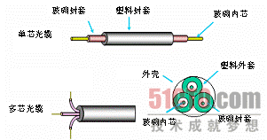

# 常见设备

常见设备

2009年9月19日

23:25

以太网是相对令牌环而言的，定义了网络中信息传输的模式。局域网是相对广域网而言的，定义了网络的规模和范围

**T表示采用双绞线**

**10表示带宽**

**base表示基带传输**

**t表示的是物理层介质,这里是双绞线(一根)**

**非屏蔽双绞线(UTP—Unshielded Twisted Pair)**

**屏蔽的五类双绞线外面包有一层屏蔽用的金属膜，它的抗干扰性能好些。**

**屏蔽双绞线要求整个系统全部是屏蔽器件,难以施工。**

100Base-TX、100Base-T2和100Base-T4。其中：100Base-T4标准要求使用全部的4对线进行信号传输，另外两个标准只要求2对线。而在快速以太网中最普及的是100Base-TX标准。美国线缆标准(AWG)中对3类、4类、五类和超五类双绞线都定义为4对，在千兆位以太网中更是要求使用全部的4对线进行通信。所以，标准五类线缆中应该有4对线。

TIA/EIA 568是ANSI于1996年制定的布线标准，该标准指出网络布线有关基础设施，包括线缆、连接设备等的内容。字母“A”表示为IBM的布线标准，而AT&T公司用字母“B”表示。

标准568A：

绿白——1，绿——2，橙白——3，蓝——4，蓝白——5，

橙——6，棕白——7，棕——8

**TIA/EIA标准568B：**

**橙白——1，橙——2，绿白——3，蓝——4，蓝白——5，**

**绿——6，棕白——7，棕——8**

参考资料：

1 TX+（传输） 白橙

2 TX-（传输） 橙

3 RX+（接收） 白绿

4 没有使用 蓝

5 没有使用 白蓝

6 RX-（接收） 绿

7 没有使用 白棕

8 没有使用 棕

（EIA/TIA568B标准）

> 直通电缆接：
> 
> 
> **●交换机到路由器**
> 
> **●交换机到PC或服务器**
> 
> **●集线器到PC或服务器**
> 
> **交叉电缆接：**
> 
> **●交换机到交换机**
> 
> **●交换机到集线器**
> 
> **●集线器到集线器**
> 
> **●路由器到路由器**
> 
> **●PC到PC**
> 
> **●路由器到PC**
> 
> 在实践中，一般可以这么理解：
> 
> 1、同种类型设备之间使用交叉线连接，不同类型设备之间使用直通线连接；
> 
> 2、路由器和PC属于DTE类型设备，交换机和HUB属于DCE类型设备；
> 
- 

> DTE：
"DataTerminalEquipment(数据终端设备)"的首字母缩略词。DTE提供或接收数据。联接到调制解调器上的计算机就是一种DTE。
DTE,DCE的含义和判断方法
DTE是数据终端设备，如终端，是广义的概念，PC也可以是终端。(一般广域网常用DTE设备有：路由器，终端主机)
DCE是数据通信设备，如MODEM，连接DTE设备的通信设备。(一般广域网常用DCE设备有：CSU/DSU，广域网交换机，MODEM)
> 
- 

参考资料：

> 物理层媒体包括架空明线、平衡电缆、光纤、无线信道等。在计算机网络中应用的物理电缆主要有同轴电缆、双绞线和光纤，而无线信道则主要是自由空间。这两种媒体通常称之为“导向媒体”和“非导向媒体”两类，具体这方面的知识在本章后面将具体介绍，在此不再赘述。
> 

计算机数据通信用的信道不仅需要传输媒体，还需要互联的设备。互联设备指DTE和DCE间的互联设备。DTE即数据终端设备，又称物理设备，如计算机、终端等都包括在内。DCE是数据通信设备或电路连接设备，如调制解调器等。数据传输通常是经过DTE→DCE，再经过DCE→DTE的路径。互联设备指将DTE、DCE连接起来的装置，如各种插头、插座。LAN中的各种粗细同轴电缆、T型接头、插头、接收器、发送器、中继器等都属物理层的媒体和连接器。

DCE（数据通信设备或者数据电路终端设备）：该设备和其与通信网络的连接构成了网络终端的用户网络接口。它提供了到网络的一条物理连接、转发业务量，并且提供了一个用于同步DCE设备和DTE设备之间数据传输的时钟信号。调制解调器和接口卡都是DCE设备的例子。

DTE（数据终端设备）：指的是位于用户网络接口用户端的设备，它能够作为信源、信宿或同时为二者。数据终端设备通过数据通信设备（例如，调制解调器）连接到一个数据网络上，并且通常使用数据通信设备产生的时钟信号。数据终端设备包括计算机、协议翻译器以及多路分解器等设备。

> 
> 
> 
> **3．物理层的一些重要标准**
> 
> 物理层的一些标准和协议早在OSI/TC97/C16分技术委员会成立之前就已制定并投入使用，OSI后来也制定了一些标准，并采用了原来标准中的一些已有的成果。下面是一些重要的物理层标准，以便查阅。
> 
> ISO 2110：称为“数据通信——25芯DTE/DCE接口连接器和插针分配”。它与EIA（美国电子工业会）的“RS-232-C”基本兼容。
> 
> ISO 2593：称为“数据通信——34芯DTE/DCE接口连接器和插针分配”。
> 
> ISO 4092：称为“数据通信——37芯DTE/DEC接口连接器和插针分配”。与EIA的“RS-449”兼容。
> 
> CCITT V.24：称为“数据终端设备（DTE）和数据电路终接设备之间的接口电路定义表”。其功能与EIA的RS-232-C及RS-449兼容于100序列线上。
> 
> **4.物理层接口**
> 
> 数据通信是在各种类型的用户终端和计算机之间，或者同一型号或不同型号的计算机之间进行的，因此计算机、终端和数据通信设备之间的连接需要标准的接口，即在插接方式、引线分配、电气特性及应答关系上均应符合统一的标准和规范。
> 
> DTE和DCE之间有很多个同类型的接口，目前最通用的类型如下。
> 
> 美国电子工业协会EIA的RS-232C接口。
> 
> ITU-T的V系列接口和X系列接口。
> 
> 国际标准化组织ISO和ISO 2110、ISO 1177等。
> 

**双绞线**

> 双绞线的主要特性
> 
> 
> 双绞线（Twisted Pair）在计算机网络，特别是局域网连接中应用最为广泛，主要得益于它的廉价性和非常不错的可用性。由两根互相绝缘的铜导线（线芯一般为1mm）并排放在一起，然后用规定的方法以螺旋状的形式绞合（Twist）起来就构成双绞线。不同标准的双绞线绞合密度不一样，越采用新标准的双绞线绞合密度越高，如图3-1上、下图分别是4类和5类双绞线。
> 

---

图3-1 双绞线

---

> 之所以要绞合在一起，是因为两根平行的导线会形成一个很好的天线，信号会随之发散出去，绞在一起后，两根导线产生的干扰波会相互抵消，所以导线的辐射波会显著地被削弱，使信号只顺着线路传输。
> 
> 
> 双绞线最早应用于电话系统，由于普通话音信号要求不高，所以电话线中的信号可以在无须任何放大的情况下传输到几千米之外。从用户电话机到交换机的这段双绞线称为用户线或用户环路（Subscriber Loop）。模拟传输和数字传输都可使用双绞线。其带宽决定于铜线的粗细和传输距离。双绞线价格便宜、性能良好及使用广泛。
> 
> 在计算机网络中使用的双绞线可分为“屏蔽双绞线”（STP，Shielded Twisted Pair）和“非屏蔽双绞线”（UTP，Unshielded Twisted Pair）两大类。STP双绞线是以金属箔进行屏蔽包裹的，以减少芯线间的干扰和串音；而UTP双绞线则没有这一层屏蔽用的金属箔，分别如图3-2左、右图所示。
> 

---

图3-2 屏蔽和非屏蔽双绞线

---

> 
> 
> 
> 除此之处，根据EIA/TIA-568标准规定的双绞线电气性能，计算机网络所用的双绞线还有多种不同的划分，如3类线、4类线、5类线、超5类线、6类线、超6类线，一直到最新的7类线。
> 
> **双绞线的主要特性如下。**
> 
> **1、物理特性**：双绞线芯一般是铜质的，能提供良好的传导率。
> 
> 2、**传输特性**：双绞线既可以用于传输模拟信号，也可以用于传输数字信号。**双绞线上直接传送的数字信号，使用T1线路的总数据传输速率可达1.544Mb/s，**达到更高数据传输率也是可能的，但与距离有关。如在电话线上传输的ADSL数据信号传输速率就可达到8Mb/s，而在专门的局域网双绞线中，目前最高的传输速率可达1 000Mb/s。
> 
> 3、 **连通性：双绞线普遍用于点到点的连接，也可以用于多点的连接。**
> 
> 4、 **地理范围：双绞线可以很容易地在15km或更大范围内提供数据传输**。局域网的双绞线主要用于一个建筑物内或几个建筑物间的通信，**在10Mb/s和100Mb/s传输速率的10BASE-T和100BASE-T总线网络中的传输距离均不超过100m。**
> 
> **5、抗干扰性**：在低频传输时，双绞线的抗干扰性相当于同轴电缆；但在超过10dB～100dB时，同轴电缆就比双绞线明显优越。
> 
> **双绞线的分类：**
> 
> 除了在前面介绍的双绞线可分为屏蔽双绞线（STP）和非屏蔽双绞线（UTP）两大类以外，双绞线还随着网络技术的发展，经历了不同的历史发展时期，产生了不同的类型。
> 
> 按电气性能划分的话，双绞线可以分为：1类、2类、3类、4类、5类、超5类、6类、超6类、7类共9种双绞线类型。类型数字越大，版本越新、技术越先进、带宽也越宽，当然价格也越贵。这些**不同类型的双绞线标注方法是这样规定的**：**如果是标准类型则按“catx”方式标注，如常用的5类线，则在线的外包皮上标注为“cat5”，注意字母通常是小写，而不是大写。而如果是改进版，就按“xe”进行标注，如超5类线就标注为“5e”，同样字母是小写，而不是大写。**
> 
> 双绞线技术标准都是由美国通信工业协会（TIA）制定的，其标准是EIA/TIA-568B，具体如下。
> 

1类（Category 1）线

是ANSI/EIA/TIA-568A标准中最原始的非屏蔽双绞铜线电缆，但它开发之初的目的不是用于计算机网络数据通信的，而是用于电话语音通信的。

n 2类（Category 2）线

是ANSI/EIA/TIA-568A和ISO 2类/A级标准中第一个可用于计算机网络数据传输的非屏蔽双绞线电缆，传输频率为1MHz，传输速率达4Mb/s，主要用于旧的令牌网。

n 3类（Category 3）线

是ANSI/EIA/TIA-568A和ISO 3类/B级标准中专用于l0BASE-T以太网络的非屏蔽双绞线电缆，传输频率为16MHz，传输速率可达l0Mb/s。

n 4类（Category 4）线

是ANSI/EIA/TIA-568A和ISO 4类/C级标准中用于令牌环网络的非屏蔽双绞线电缆，传输频率为20MHz，传输速率达16Mb/s。主要用于基于令牌的局域网和10BASE-T/100BASE-T。

n 5类（Category 5）线

是ANSI/EIA/TIA-568A和ISO 5类/D级标准中用于运行CDDI（CDDI是基于双绞铜线的FDDI网络）和快速以太网的非屏蔽双绞线电缆，传输频率为100MHz，传输速率达l00Mb/s。

n 超5类（Category excess 5）线

是ANSI/EIA/TIA-568B.1和ISO 5类/D级标准中用于运行快速以太网的非屏蔽双绞线电缆，传输频率也为100MHz，传输速率也可达到100Mb/s。与5类线缆相比，超5类在近端串扰、串扰总和、衰减和信噪比四个主要指标上都有较大的改进。

n 6类（Category 6）线

是ANSI/EIA/TIA-568B.2和ISO 6类/E级标准中规定的一种非屏蔽双绞线电缆，它主要应用于百兆位快速以太网和千兆位以太网中。因为它的传输频率可达200～250MHz，是超5类线带宽的2倍，最大速率可达到1 000Mb/s，满足千兆位以太网需求。

n 超6类（Category excess 6）线

是6类线的改进版，同样是ANSI/EIA/TIA-568B.2和ISO 6类/E级标准中规定的一种非屏蔽双绞线电缆，主要应用于千兆网络中。在传输频率方面与6类线一样，也是200～250MHz，最大传输速率也可达到1 000Mb/s，只是在串扰、衰减和信噪比等方面有较大改善。

n 7类（Category 7）线

是ISO 7类/F级标准中最新的一种双绞线，主要为了适应万兆位以太网技术的应用和发展。但它不再是一种非屏蔽双绞线了，而是一种屏蔽双绞线，所以它的传输频率至少可达500MHz，又是6类线和超6类线的2倍以上，传输速率可达10Gb/s。

两种RJ-45线缆（T568A和T568B），如下图：

**以太网 LAN 接口可使用两种类型的电缆：**

直通电缆（或称为跳线电缆），这种电缆两端的彩色引脚的顺序完全一致

交叉电缆，这种电缆的引脚 1 与引脚 3 连接，引脚 2 与引脚 6 连接

**直通电缆用于**：

交换机至路由器 交换机至 PC 集线器至 PC 集线器至服务器

**交叉电缆用于：** 交换机至交换机 PC 至 PC 交换机至集线器 集线器至集线器

路由器至路由器 路由器至服务器

**如果PC配置中有千兆位的以太网卡，那么可以用直通线连接**

**结论：如果两端设备使用同一针脚（也就是线序）传输，那么要用交叉线连接，否则，使用直连线**。

**同轴电缆**

> 同轴电缆的主要特性
> 
> 
> 同轴电缆（Coaxial Cable）最早应用于有线电视网络中。它比双绞线具有更好的屏蔽性，所以它可以以很高的速率传输很长的距离。它用来传递信息的一对导体是按照一层圆筒式的外导体套在内导体（一根细芯）外面，两个导体间用绝缘材料互相隔离的结构制造的。外层导体和中心轴芯线的圆心在同一个轴心上，所以叫做同轴电缆，如图3-3所示，其剖面如图3-4所示。
> 
> 同轴电缆也像双绞线一样由一对导体组成，但它们是按“同轴”形式构成线对。最里层是内芯，向外依次为绝缘层、屏蔽层，最外层则是起保护作用的塑料外套，内芯和屏蔽层构成一对导体。**同轴电缆分为基带同轴电缆（阻抗为500Ω）和宽带同轴电缆（阻抗为750Ω）**。基带同轴电缆又可分为粗缆和细缆两种，都用于直接传输数字信号；宽带同轴电缆用于频分多路复用的模拟信号传输，也可用于不使用频分多路复用的高速数字信号和模拟信号传输。闭路电视所使用的CATV电缆就是宽带同轴电缆。同轴电缆以单根铜导线为内芯，外裹一层绝缘材料，外覆密集网状导体，最外面是一层保护性塑料。金属屏蔽层能将磁场反射回中心导体，同时也使中心导体免受外界干扰，故同轴电缆比双绞线具有更高的带宽和更好的噪声抑制特性。
> 

---

图3-3 同轴电缆

---

---

图3-4 同轴电缆剖面图

---

以太网同轴电缆的接法有两种：（1）直径为0.4cm的RG-11粗缆，采用凿孔接头接法；（2）直径为0.2cm的RG-58细缆，采用T型头接法。这两种接头分别如图3-5左、右图所示。

---

图3-5 粗/细同轴电缆接头

---

> 粗同轴电缆符合10BASE-5介质标准，使用时需要一个外接收发器和收发器电缆，单根最大标准长度为500m，可靠性强，最多可接100台计算机，两台计算机的最小间距为2.5m。细同轴电缆按10BASE-2介质标准直接连到网卡的T型头连接器（即BNC连接器）上，单段最大长度为185m，最多可接30个工作站，最小站间距为0.5m。
> 
> 
> **同轴电缆的主要特性如下。**
> 
> n 1、物理特性：单根同轴电缆的直径约为1.02～2.54cm，可在较宽的频率范围内工作。
> 
> n 2、传输特性：基带同轴电缆仅用于数字传输，并使用曼彻斯特编码，数据传输速率最高为10Mb/s。宽带同轴电缆既可用于模拟信号传输又可用于数字信号传输。
> 
> n 3、连通性：同轴电缆适用于点到点和多点连接。基带500W电缆每段可支持几百台设备，在大系统中还可以用转接器将各段连接起来；宽带750W电缆可以支持数千台设备，但在高数据传输率下（50Mb/s）使用宽带电缆时，设备数目限制在20～30台。
> 
> n 4、地理范围：同轴电缆的传输距离取决于传输的信号形式和传输的速率，典型基带电缆的最大距离限制在几千米以内。但在同样数据速率条件下，粗缆的传输距离较细缆的长。宽带电缆的传输距离可达几十千米。
> 
> n 5、抗干扰性：同轴电缆的抗干扰性能比双绞线强。
> 

**光纤**

> 光纤的主要特性
> 
> 
> 光纤的完整名称叫做“光导纤维”（Optical Fiber），由能传导光波的石英玻璃纤维外加保护层构成。石英玻璃纤维是用纯石英经特别的工艺拉成的细丝，其直径比头发丝还要细 （50～100μm）。相对于金属导线来说具有重量轻、线径细的特点。用光纤传输电信号时，在发送端先要将其转换成光信号，而在接收端又要由光检测器还原成电信号。在目前来说，已经实现一根光纤的传输速率在100Gb/s以上。而且这个速率还远远不是光纤的传输速率的极限。
> 
> 光纤有单芯（单模）和多芯（多模）之分，如图3-6的上、下图所示。
> 

---

图3-6 单芯和多芯光缆

---

> 光纤通信利用光导纤维传递光脉冲来进行通信。习惯上，有光脉冲表示比特1，而无光脉冲则表示比特0。光传输系统由3部分组成，即：光源、传输介质和检测器。光纤通信的原理是光的全反射特性。当光照到检测器时，它产生一个电脉冲。在光纤的一端放上光源，另一端放上检测器，就有了一个单向传输系统，它接收一个电信号，转换成光脉冲并传输出去，然后接收端再把光脉冲转换为电信号。
> 
> 
> **光纤作为传输介质具有以下几个主要特点:**
> 
> 通信容量大. 传输损耗小，中继距离长，远距离传输经济。 抗雷电和电磁干扰性能好。这在有大电流脉冲干扰的环境下尤为重要。 无串音干扰，保密性好，也不易被窃听或截取数据。 体积小，重量轻。 光纤对接需专用设备，光电接口也较贵。
> 

**光纤的主要特性如下:**

> 1、物理特性：在计算机网络中均采用两根光纤（作用于不同传输方向）组成传输系统。按波长范围（近红外范围内）可分为3种：0.85μm短波长区（0.8μm～0.9μm）、1.3μm长波长区（1.25μm～1.35μm）和1.55μm长波长区（1.53μm～1.58μm）。不同的波长范围光纤损耗特性也不同，其中0.85μm波长区为多模光纤通信方式，1.55μm波长区为单模光纤通信方式，1.3μm波长区有多模和单模两种方式。
> 
> 
> 2、传输特性：光纤通过内部的全反射来传输一束经过编码的光信号，内部的全反射可以在任何折射指数高于包层媒体折射指数的透明媒体中进行。光纤的数据传输率可达Gb/s级，信号损耗和衰减非常小，传输距离可达数十千米，是长距离传输的理想传输介质。
> 
> n 3 、连通性：光纤普遍用于点到点的链路。由于光纤功率损失和衰减小的特性，以及有较大的带宽潜力，因此一段光纤能够支持的分接头数比双绞线或同轴电缆多得多。
> 
> n 4、 地理范围：从目前的技术来看，光纤可以在6～8km的距离内不用中继器传输，因此光纤适合于在几个建筑物之间通过点到点的链路连接局域网络。
> 
> n 5、 抗干扰性：光纤具有不受电磁干扰或噪声影响的独有特征，适宜在长距离内保持高数据传输率，而且能够提供很好的安全性。
> 
> 由于光纤通信具有损耗低、频带宽、数据传输率高、抗电磁干扰强等特点，对高速率、距离较远的局域网也是很适用的。目前采用波分复用（Wavelength Division Multiplexing，WDM）技术可以在一条光纤上复用多路传输，每路使用不同的波长。
> 

**光纤的分类**

**根据光纤中传输模式的多少，可分为“单模光纤”和“多模光纤”两类**。

> 单模光纤只传输一种模式，纤芯直径较细，通常在8～10μm范围内。而多模光纤可传输多种模式，纤芯直径较粗，典型尺寸为50μm左右，相当于一根头发丝那么精细。
> 

（1）单模光纤（Single-Mode Fiber，SMF）

> 单模光纤只传输主模，也就是说光线只沿光纤的内芯进行传输。单模光纤携带单个频率的光将数据从光缆的一端传输到另一端，如图3-12左图所示。
> 

---

图3-12 单/双模光纤的信号传输

---

> SMF光纤细径较细，约10μm。单模光纤使用的光波长为1.31μm或1.55μm。目前在有线电视和光通信中，是应用最广的一种光纤。
> 
> 
> 由于SMF光纤完全避免了模式散射，使得单模光纤的传输频带很宽因而适用于大容量、长距离的光纤通信。SMF光纤只能传一种模式的光，因此其模间色散很小，适用于远程通信，但还存在着材料色散和波导色散，这样单模光纤对光源的谱宽和稳定性有较高的要求，即谱宽要窄，稳定性要好。后来又发现在1.31μm波长处，单模光纤的材料色散和波导色散一个为正、一个为负，大小也正好相等。这就是说在1.31μm波长处，单模光纤的总色散为零。从光纤的损耗特性来看，1.31μm处正好是光纤的一个低损耗窗口。这样，1.31μm波长区就成了光纤通信的一个很理想的工作窗口，也是现在实用光纤通信系统的主要工作波段。1.31μm常规单模光纤的主要参数是由国际电信联盟ITU-T在G652会议中确定的，因此它又称G652光纤。
> 
> SMF光纤没有多模色散，不仅传输频带较多模光纤更宽，再加上SMF的材料色散和结构色散的相加抵消，其合成特性恰好形成零色散的特性，使传输频带更宽。
> 

（2）多模光纤（Multi-Mode Fiber，MMF）

> 多模光纤可以在单根或多根光纤上同时携带几种光波，如图3-12右图所示。
> 
> 
> MMF光纤纤芯直径较粗，通常为50μm或62.5μm。由于其模间色散较大，限制了传输数字信号的频率，而且随距离的增加会更加严重。例如：600Mb/s/km的光纤在2km时则只有300Mb/s的带宽。因此，多模光纤传输的距离就比较近，一般只有几千米。
> 

MMF按折射率分布进行分类时，可分为：渐变（GI）型和阶跃（SI）型两种。GI型的折射率以纤芯中心为最高，沿向包层徐徐降低。从几何光学角度来看，在纤芯中前进的光束以蛇行状传播。由于光的各个路径所需时间大致相同，所以传输容量较SI型大。