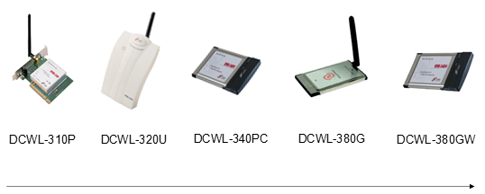
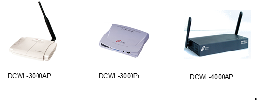
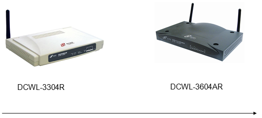
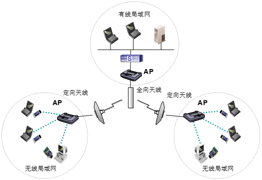
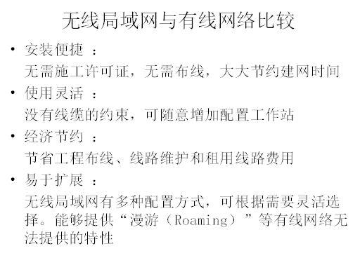
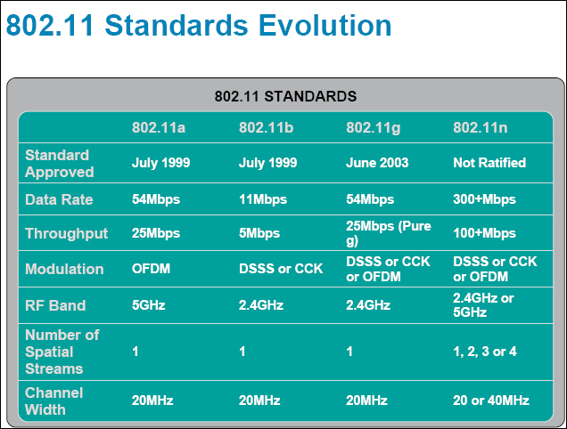
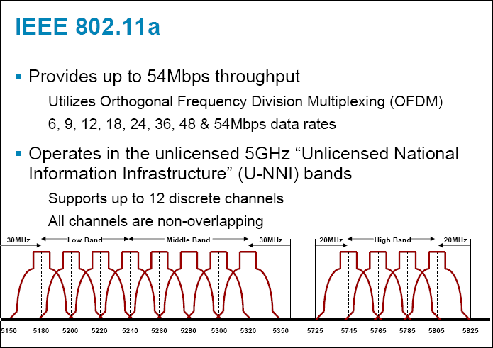
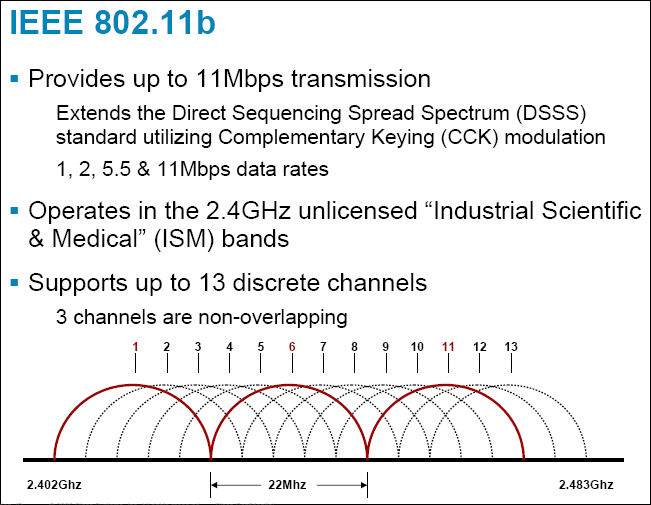
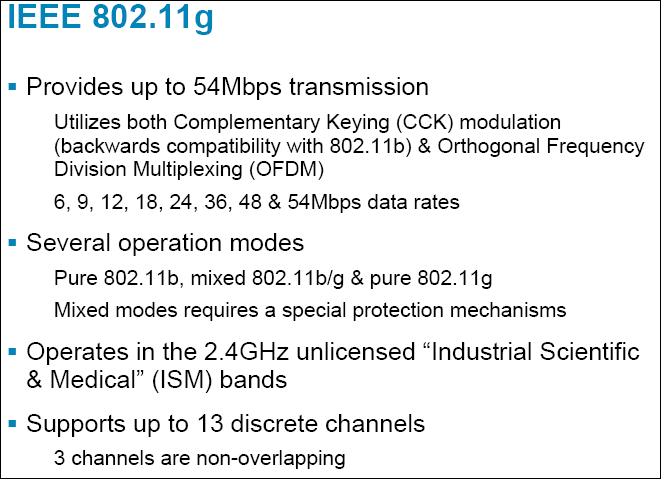

# 无线

无线

2009年9月30日

13:48

> 1、简史
> 
- 1987年，世界上第一个试验性无线局域网诞生，但随后各厂商的无 线局域网不能互联，于是国际电子电器工程师协会（IEEE）开始进 行无线局域网标准的制定。
- 1997年，IEEE802.11标准发布，统一了无线局域网领域。
- 1999年，802.11标准得到了进一步的修订和完善，相继产生了 802.11b 标准（2.4GHz频带）和 802.11a 标准（5GHz频带）。

> 2003年6月， 802.11g标准（2.4GHz频带）产生， 802.11g 能够兼容 802.11b，但不兼容 802.11a
> 
> 
> 2、无线局域网概念
> 
- 无线局域网（Wireless Local Area Network，即WLAN）是指**以无 线信道作为传输媒介的计算机局域网**，是有线联网方式的重要补充 和延伸，并逐渐成为计算机网络中一个至关重要的组成部分，广泛 适用于需要可移动数据处理或无法进行物理传输介质布线的领域。
- 参考模型中位置

> 
> 
- 几种设备

> 无线网络卡
> 
> 
> 
> 
> 无线接入点（Access Point）
> 
> 
> 
> 无线路由器
> 
> 
> 
> 天线（Antenna）
> 
> 指向性（Uni-directional）与全向性（Omni-Directional）两种，前 者较适合于长距离使用，而后者则较适合区域性之应用
> 
> 
> 
> 3、比较
> 
> 
> 
> 缺点：干扰
> 
> 同频干扰：相同频率的信号之间产生的干扰。
> 
> 多径干扰：在一个无线电信号从一个点传输到另一个点时经过几 个不同路径，经过不同物体的反射、绕射和散射造成的。
> 
> 4、信号调制技术
> 
> 三种常用的调制技术：
> 
> 调幅，幅移键控 ASK（Amplitude Shift Keying）
> 
> 调频，频移键控 FSK（Frequency Shift Keying）
> 
> 调相，相移键控 PSK（Phase Shift Keying）
> 
> 
> 
> 多路复用：
> 
> 频分：整个传输频带被划分为若干个频率通道，每个用户占用一个 频率通道。频率通道之间留有防护频带。
> 
> 时分：把时间分割成小的时间片，每个时间片分为若干个通道（时 隙） ，每个用户占用一个通道传输数据。
> 
> 5、CSMA/CA机制
> 
> CSMA/CA协议的工作流程分为两个分别是:
> 
> a、送出数据前，监听媒体状态，等没有人使用媒体，维持一段时 间后，再等待一段随机的时间后依然没有人使用，才送出数据。由 於每个设备采用的随机时间不同，所以可以减少冲突的机会。
> 
> b、送出数据前，先送一段小小的请求传送报文(RTS : Request to Send)给目标端，等待目标端回应 CTS: Clear to Send 报文后，才 开始传送。 利用RTS-CTS握手(handshake)程序，确保接下来传送 资料时，不会被碰撞。 同时由於RTS-CTS封包都很小，让传送的 无效开销变小。
> 
> 6、WLAN几个术语
> 
> SSID（Service Set Identifier）也可以写为ESSID，用来区分不同 的[网络](http://net.it168.com/)
> 
> BSS：基本服务集（basic service set）：一个AP和他的所有终端
> 
> ESS:使用相同身份识别码（ssid）的多个访问点以及一个无线设备 群组，组成一个扩展服务组（extended service set）。
> 
> 7、几种常用标准
> 
> 
> 
> 
> 
> 
> 
> 
> 
> 8、无线安全
> 
> WEP是一种在接入点和客户端之间以“RC4”方式对分组信息进行加密的技术，密码很容易被破解。
> 
> WPA是继承了WEP基本原理而又解决了WEP缺点的一种新技术。 加强了生成加密密钥的算法，[WPA](http://net.zdnet.com.cn/files/list-0-0-210955-1-1.htm)用户认证是使用802.1X和扩展 认证协议(Extensible Authentication Protocol :EAP) 来实现的.
> 
> 配置
> 
> 无线是半双工设备，所以要在连接无线端接口设为半双工
> 
> half-duplex
>