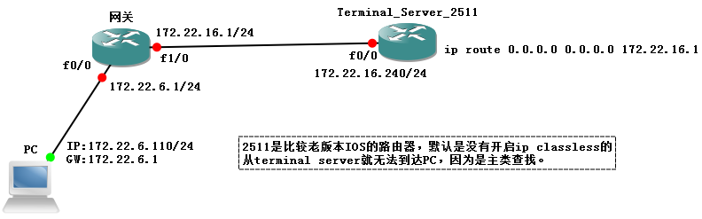

# 路由协议

路由协议

2009年9月19日

23:24

**路由协议的基本原理**

[路由协议原理.pptx](路由协议/路由协议原理.pptx)

1 静态路由基本配置

全局模式

Ip route 目标网段 掩码 下一跳地址/出接口

ip route 2.2.2.0 255.255.255.0 211.1.12.2

ip route 2.2.2.0 255.255.255.0 s1/2

**2 静态路由没有度量值，所以仅支持等价负载均衡**

当有多条路径到达相同的目标网络时，路由器需要一种机制来计算最优路径。度量值由此而产生。

距离矢量的名称的由来是因为路由是以矢量方式被通告出去的。

例如“目标A在下一跳路由器X的方向，距此5跳之远”这个表述隐含了每台路由器向邻接路由器学习它们所观察到的路由信息，然后再向外通告自己观察到的路由信息。因为每台路由器在信息上都依赖于邻接路由器，而邻接路由器又从它们的邻接路由器那里学习路由，依此类推，所以距离矢量路由选择被认为是“依照传闻进行路由选择”。

3 静态路由的优缺点

优点：

1、占用CPU处理时间少

2、便于管理员了解路由

3、易于配置

缺点：

1、配置和维护耗费时间

2、配置对于大型网络容易出错

3、无法适应拓扑变化，扩展性能差

4、需了解整个网络情况才能进行操作

4 什么时候用：

1、网络中仅包含几台路由器

2、接往ISP中

3、在HUB-SPOKE模型中，在spoke端配置

5 默认路由/缺省路由

全局模式

Ip route 0.0.0.0 0.0.0.0 211.1.12.2

Ip route 0.0.0.0 0.0.0.0 s1/2

最少几条命令实现全网全通？

*补充*

*变态小实验：中间长两边短*

*怎样只配置地址使3台路由器全通*

6 动态路由协议

1、当拓扑变化时自动改变

2、决定最佳路径，发现远端网络

3、维护路由更新信息

4、自动选择最佳路径

7 动态路由协议分类

（1）

Distance vector protocol link state protocol

距离矢量路由协议(hop) 链路状态路由协议(cost)

全网周期性更新 触发式增量更新

只有邻居路由信息 有全网拓扑

依据传闻学习路由 通过LSA泛洪学习全网路由

贝尔曼.福特算法 迪杰斯科拉算法

（2）

单播路由协议和组播路由协议

（3）

有类路由和无类路由

**使用有类路由：路由器首先匹配主网络号，如果主网络号存在，就继续匹配子网号，且不考虑缺省路由，如果子网无法匹配，丢弃数据包（在有类路由下，路由器认为知道所有主网络下的全部子网），并使用ICMP返回一个不可达回应。如果主网络号不存在，使用缺省路由（缺省路由存在前提）。**

上述情况出现在某些早期IOS版本里（12.0以前版本），这些早期版本默认没有打开ip classless.

打开ip classless以后将改变路由器的路由行为，此时路由器将进行最长最精确匹配或使用默认路由进行匹配

**使用无类路由，如果没有找到最具体的匹配，就使用缺省路由。**

ip classless命令的作用主要是改变有类路由协议的查找路由表的行为。

例1：某路由器上运行的路由协议为RIP（有类的路由协议），路由表如下：

[Untitled](路由协议/Untitled%20Database%2051e695258da245288d97d80b6068c506.csv)

现在假设有3个IP报文，报文A的目标IP是10.1.1.1、报文B的目标IP是10.3.1.1、报文C的目标IP是11.11.1.1

有类路由协议查找路由表的行为如下：

首先查找目标IP所在的主网络，若路由表中有该主网络的任何一个子网路由的话，就必须精确匹配其中的子网 路由；如果没有找到精确匹配的子网路由，它不会选择最后的缺省路由，而是丢弃报文。若路由表中不存在该主网络的任何一个子网路由，则最终选择缺省路由。

报文A：目标IP为10.1.1.1，所在的主网络为10.0.0.0，目前的路由表中存在10.0.0.0的子网路由，此时路由器要进一步查找子网路由，是否能够精确匹配，我们看到10.1.0.0/16可以匹配我们的目标地址，所以报文A根据这条路由进行转发。

报文B：目标IP为10.3.1.1，所在的主网络为10.0.0.0，目前的路由表中存在10.0.0.0的子网路由，此时路由器要进一步查找子网路由，是否能够精确匹配，我们看到路由表中的两条子网路由10.1.0.0/16和10.2.0.0/16均不能匹配我们的目标地址，根据有类路由协议的原则，它不会选择缺省路由，所以报文B被路由器丢弃。

报文C：目标IP为11.1.1.1，所在的主网络为11.0.0.0，目前的路由表中不存在11.0.0.0的子网路由，此时路由器直接采用缺省路由，所以路由器采用缺省路由对报文C进行转发。

上面的结果是有类路由协议查找路由的行为，而配置ip classless的目的就是改变它的这种行为，配置完该命令后查找路由的行为是根据最长匹配的原则，那上例中的报文B就可以通过缺省路由进行转发了。

实例：

有类路由和无类路由协议 （CIDR VLSM）

有类路由协议：RIP v1、IGRP

无类路由协议：RIP v2 、EIGRP、OSPF、 BGPv4、 IS-IS

ip classless（全局开启命令）