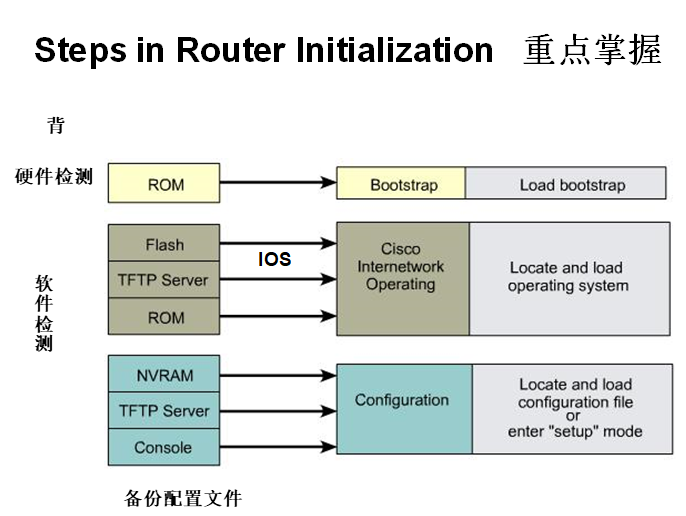
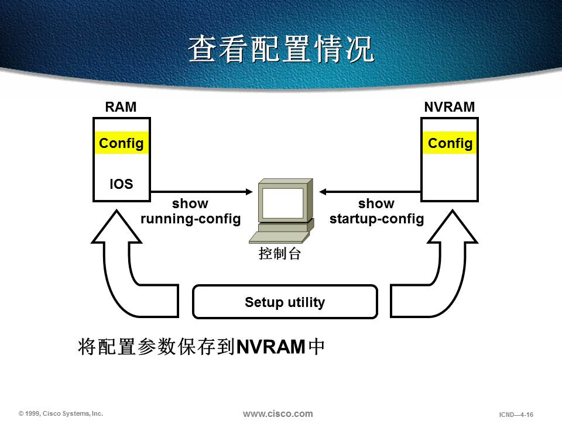
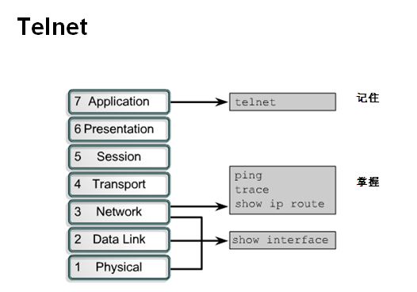
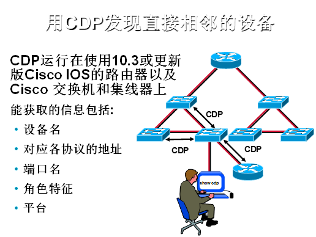
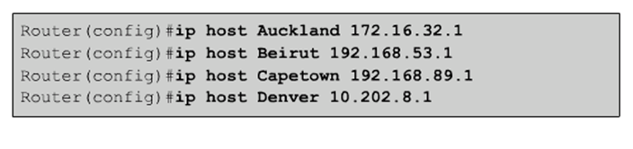

# 路由器管理

路由器管理

2009年9月19日

15:26

路由器硬件构成

路由器是一种连接多个网络或网段的网络设备，它能将不同网络或网段之间的数据信息进行“翻译”，以使它们能够相互“读”懂对方的数据，从而构成一个更大的网络。路由器由硬件和软件组成。硬件主要由中央处理器、内存、接口、控制端口等物理硬件和电路组成；软件主要由路由器的IOS操作系统组成。

**中央处理器**

与计算机一样，路由器也包含了一个中央处理器（CPU）。不同系列和型号的路由器，其中的CPU也不尽相同。Cisco路由器一般采用Motorola 68030和Orion/R4600两种处理器。

路由器的CPU负责路由器的配置管理和数据包的转发工作，如维护路由器所需的各种表格以及路由运算等。路由器对数据包的处理速度很大程度上取决于CPU的类型和性能。

**内存**

路由器采用了以下几种不同类型的内存，每种内存以不同方式协助路由器工作。

**1.只读内存（ROM）**

只读内存（ROM）在Cisco路由器中的功能与计算机中的ROM相似，主要用于系统初始化等功能。ROM中主要包含：

（1）系统加电自检代码（POST），用于检测路由器中各硬件部分是否完好；

（2）系统引导区代码（BootStrap），用于启动路由器并载入IOS操作系统；

（3）备份的IOS操作系统，以便在原有IOS操作系统被删除或破坏时使用。通常，这个IOS比现运行IOS低一些，但却足以使路由器启动和工作的版本.

顾名思义，ROM是只读存储器，不能修改其中存放的代码。如要进行升级，则要替换ROM芯片。

**2.闪存（Flash）**

闪存（Flash）是可读可写的存储器，在系统重新启动或关机之后仍能保存数据。Flash中存放着当前使用中的IOS。事实上，如果Flash容量足够大，甚至可以存放多个操作系统，这在进行IOS升级时十分有用。当不知道新版IOS是否稳定时，可在升级后仍保留旧版IOS，当出现问题时可迅速退回到旧版操作系统，从而避免长时间的网路故障。

**3.非易失性RAM(NVRAM)**

非易失性RAM(Nonvolatile RAM)是可读可写的存储器，在系统重新启动或关机之后仍能保存数据。由于NVRAM仅用于保存启动配置文件（Startup-Config），故其容量较小，通常在路由器上只配置32KB~128KB大小的NVRAM。同时，NVRAM的速度较快，成本也比较高。

**4.随机存储器(RAM)**

RAM也是可读可写的存储器，但它存储的内容在系统重启或关机后将被清除。和计算机中的RAM一样，Cisco路由器中的RAM也是运行期间暂时存放操作系统和数据的存储器，让路由器能迅速访问这些信息。RAM的存取速度优于前面所提到的3种内存的存取速度。

运行期间，RAM中包含路由表项目、ARP缓冲项目、日志项目和队列中排队等待发送的分组。除此之外，还包括运行配置文件（Running-config）、正在执行的代码、IOS操作系统程序和一些临时数据信息。

路由器的类型不同，IOS代码的读取方式也不同。如Cisco 2500系列路由器只在需要时才从Flash中读入部分IOS；而Cisco 4000系列路由器整个IOS必须先全部装入RAM才能运行。因此，前者称为Flash运行设备（Run from Flash），后者称为RAM运行设备（Run from RAM）。

路由器加载过程

路由器加电启动过程：

（1）系统硬件加电自检。运行ROM中的硬件检测程序，检测各组件能否正常工作。完成硬件检测后，开始软件初始化工作。

（2）软件初始化过程。运行ROM中的BootStrap程序，进行初步引导工作。

（3）寻找并载入IOS系统文件。IOS系统文件可以存放在多处，至于到底采用哪一个IOS，是通过命令设置指定的。

（4）IOS装载完毕，系统在NVRAM中搜索保存的Startup-Config文件，进行系统的配置。如果NVRAM中存在Startup-Config文件，则将该文件调入RAM中并逐条执行。否则，系统进入Setup模式，进行路由器初始配置。

路由器几种模式 ：用户、特权、全局、接口

R3> 用户模式

R3>enable 进入特权模式

R3# 特权模式

R3#configure terminal 进入全局模式

R3(config)# 全局模式

R3(config)#interface s1/2 进入接口模式

R3(config-if)# 接口模式

IOS备份

R3#copy flash:c2500-i-l.121-7.bin tftp:

Address or name of remote host []? 12.1.1.1

Destination filename [c2500-i-l.121-7.bin]?

write与copy run start 区别

1。the commands are doing the same but there is a little difference:

copy run start

prompts you to confirm the destination filename, while wr does not.

Which can be used in some scriptes, e.g.

2。The write commands work in IOS versions before 12.0.  Both work in current IOSes.

3。I use whatever has the fewest keystrokes , which is wr mem ,   shorter than doing a copy run start .   The strange one I haven't figured out is saving to a tftp server .  They want you to use some convoluted long  string like copy runn tftp / <address> ,  it is a lot simpler to just use the "write net" command  .

IOS升级

copy tftp:12.1.1.1 flash:c2500-i-l.121-7.bin

**//RAM和NVRAM中的配置区分**

配置的备份

copy running-config startup-config

配置导入

Copy startup-config running-config

保存配置命令

（1）copy running-config startup-config(考试推荐使用命令)

（2）write memory

**路由器的密码恢复：**

<<路由密码恢复.pdf>>

1 关闭路由器的电源并在10秒后重新给路由器加电，在给路由器加电的同时（也可在路由器重启的60秒内）按住键盘上的Ctrl+Break几秒钟，待出现路由器提示符rommon>后，输入confreg 0x2142

2 输入reset命令重新启动路由器。

3 进入特权模式后 输入copy startup-config running-config 命令 将启动配置文件拷贝到运行配置文件中

4 修改密码

5 输入config-register 0x2102 命令 将配置寄存器的值恢复成缺省值

6 输入copy running-config startup-config 命令 将运行配置文件保存到启动配置文件中

7 输入reload 命令 重启启动路由器

做密码恢复设置的寄存器值

Cisco路由器默认的配置设置是0x2102

配置寄存器值更改为0x2142

**Router(config)#config-register 0x2102**

config-register共16位，以4位16进制数表示

格式：0xABCD

赋值范围从0x0到0xFFFF

0x2102 ：标准默认值

0x2142 ：从FLASH中启动，但不使用NVRAM中的配置文件（用于口令恢复）

0x2101 ：从Boot RAM中启动，应用于更新系统文件

0x2141 ：从Boot RAM中启动，但不使用NVRAM中的配置文件

其中C位的第三位为1时表示关闭Break键，反之表示打开Break键。

0x141：表示关闭Break键，不使用NVRAM中的配置 文件，并且从系统默认的ROM中

的系统中启动。

0x0040：表示允许路由器读取NVRAM中的配置文件。

> 
> 

<<思科IOS软件命名规则简单介绍.pdf>>

引擎

实验一：几种常用个show 命令

特权模式下

Show version 查看版本信息

Show ip interface brief 查看接口信息

Show process cpu 查看CPU

Show clock 查看系统时钟

Show running-config 查看正在运行配置

Show startup-config 查看初始配置

Show cdp neighbors 查看邻居

Cisco discovery protocol

Clear cdp table

Write memory //保存

erase startup-config //清除配置

Reload

实验二：方便配置

no ip domain-lookup :关闭回环解析（全局模式）

Line console 0 进入console 0接口下（全局模式）

logging synchronous :防止弹出信息干扰输入

exec-time 0 0 或 no exec-time :设置控制台会话永不超时

no ip domain-lookup 全局模式 关闭域名回环解析

line con 0

No exec-time //控制台EXEC会话超时时间

Loggin syn //在控制台启用同步记录功能

利用logging synchronous命令同步控制台的输入：

Router(config)#line con 0

Router(config-line)#logging syn

在使用logging synchronous之前，控制台不会同步用户输入的命令，出现日志消息后，输入的内容会直接跟在消息后面，这样就给检查命令带来了不便。

使用logging synchronous之后，控制台可以自动同步用户输入的命令。

实验三：改主机名和添加密码

(1)

Router#conf t //进入全局配置模式

Router(config)#hostname R1 //设置主机名为R1

(2)控制台口令（用户模式口令）

@1

Router(config)#Line con 0 //进入console口

Router(config-line)# Password cisco //设置口令

Router(config-line)# Login // **Enable password checking**

**这种配置不进行身份验证，只知道口令就可以登录路由器**。

**@2**

Router#conf t

Router(config)#username ___ password ___ //配置用户名和密码

Router(config)#username ___ password ___

…...

Router(config)#line co 0

Router(config-line)#login local //启用本地身份认证

**这种配置如果要删除分身验证登陆要先删除"login local"，后删除"username"**

(3)特权模式口令

@1

Router(config)#Enable password cisco //设置简单特权密码

Router(config)#Enable secret cisco //设置加密特权密码

@2

Router(config)#Service password //对所有密码加密

(4)虚拟终端口令（远程登录口令）

@1

Router(config)#Line vty 0 4 //开启0-4 一共5个telnet会话，查看show session

Router(config-line)# password cisco //设置口令

Router(config-line) login

//如果不需密码就可远程登录可以no login

@2

Router(config)#username ___ password ____

Router(config-line) login local //启动本地身份认证，提示用户名和密码

实验四：warning message

banner motd c （此处c代表起始字符，意思是从c后开始是显示的内容，也可用其他字符，如再遇见此字符则代表结束后面的字符不会被显示）

输入要输入的内容

C（结束文字内容）

> 
> 

实验五：DNS解析

在本机上将对端主机名和IP地址做绑定，当访问对端是直接ping or telnet 对端主机名即可。

实验六：给接口配置ip address

R1 Interface s1/2

ip add 12.1.1.1 255.255.255.0

No shutdown

R2 Interface s1/3

ip add 12.1.1.2 255.255.255.0

no shutdown

R1 S1/2======S1/3 R2 s1/2 ======S1/3 R3

211.1.12.0/24 211.1.23.0/24

实验七：cdp

Show cdp neighhor

Show cdp neighbor detail

关闭cdp

R1(config)#no cdp run (全局关闭)

R1(config)#interface s1/2

R1(config-if)#no cdp enable （针对某一个接口关闭）

其他实验：

Ping

Telnet