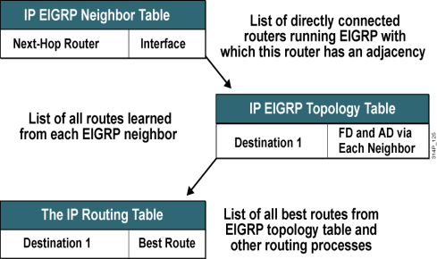
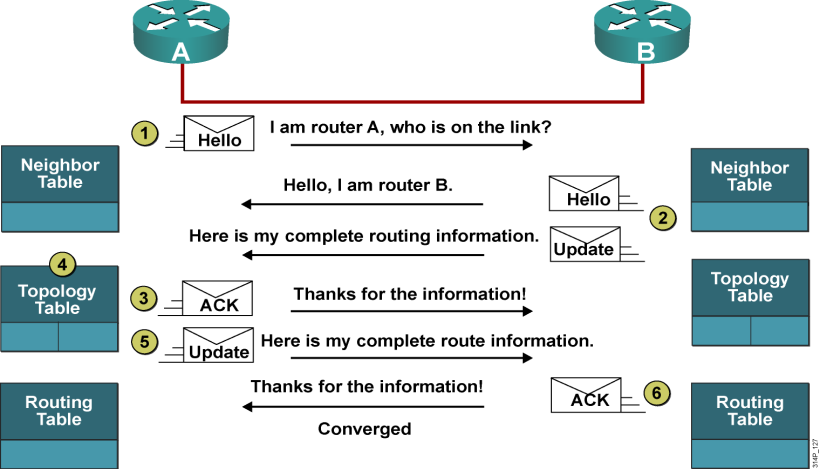
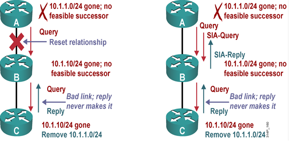
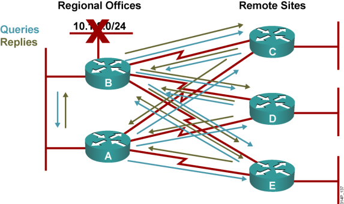
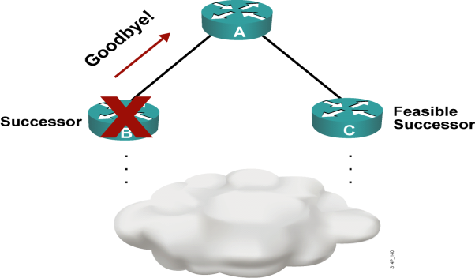

# EIGRP

EIGRP理论

2011年6月21日

15:12

**EIGRP：**

**Enhanced Interior GatewayRouting Protocol**

**关于EIGRP的基本常识**

**1.EIGRP是Cisco私有的路由协议**

**2.EIGRP协议号88**

**3.EIGRP是高级距离矢量路由协议**

**4.EIGRP的管理距离是5，90和170**

**5.EIGRP使用复合Metric值，也就是5个要素：带宽，延迟，可靠性，负载，MTU**

**6.EIGRP使用组播224.0.0.10**

**7.EIGRP是建立邻居关系最快的协议**

**EIGRP的口诀是：2，3，4，5，6**

**关于EIGRP建立邻居的2个条件**

**1.相同的AS号**

**2.相同的K值**

**关于EIGRP的3张表**

**EIGRP为各种协议都维护的3张表：**

**1.Neighbor Table：**

**确保直接邻居之间能够双向通信。**

**2.Topology Table：**

**拓扑表中存放着前往目标地址的所有路由。**

**3.Routing Table：**

**从拓扑表中选择到达目标地址的最佳路由放入路由表。**

**如下图：**

**关于EIGRP的4种关键技术**

**1.邻居的发现和恢复（Neighbor discovery/recovery）----在邻居之间使用hello包**

**2.RTP（Reliable Transport Protocol，可靠传输协议）**

**3.DUAL有限状态机（DUAL finite-state machine）**

**4.PDMs（Protocol-dependent modules，协议相关模块）**

**关于RTP**

**RTP负责确保EIGRP分组按顺序地传给所有邻居，它支持组播和单播分组的混合传输。为了提高效率，只有某些EIGRP分组可以以可靠的方式传输。有3个分组是可靠的包：Update，Query，Reply**

**即：**

**Reliable packets ：Update/Query/Reply**

**Unreliable packets ：Hello/ACK**

**关于DUAL算法**

**EIGRP使用DUAL算法可以选择最近的，无环的路径到达目的地**

**DUAL算法使用的术语如下：**

**1.AD-----邻居通告的到达目的的Metric**

**2.FD-----本路由器到达目的的Metric**

**3.FC(Feasible condition，可行条件)-----AD of Second best Route < FD of Best Route**

**4.S(successor，后继路由器)-----具有最优Metric值的路由**

**5.FS(Feasible successor，可行后继路由器)-----符合可行条件的后备路由**

**ip bandwidth-percent eigrp就是直接应用于EIGRP的，但OSPF的代价并不是直接地应用于OSPF的。**

**关于PDMs**

**EIGRP可以支持IP、IPX、AppleTalk；这些协议都有独立的EIGRP模块，并独立于其他任何模块来运行。**

**关于EIGRP的5个包**

**1.Hello：用于邻居的发现和恢复。（Multicast）不可靠，小于T1的链路60s，大于T1的线路5s，eigrp具有15s内检查邻居丢失的能力**

**2.Update：传递路由更新，仅包含需要的路由条目，当为指定的一台路由器发更新时使用Unicast(P-TO-P) ，当为多台路由器发更新时使用Multicast.(MA)----可靠包**

**3.Query：当找不到Feasible Successor时，发送查询报文（Multicast）----可靠包**

**4.Reply：回应查询报文。（Unicast）----可靠包**

**5.ACK：用来确认Update/Query/Reply (Unicast）不可靠**

**使用224.0.0.10的包是hello，update，query3个包**

**使用单播的包是reply，ack**

**从组播方式切换到单播方式之前等待一个ACK时间可以由组播流计时器（multicast flow timer）.后续单播之间的时间可以由重传超时（retransmission timeout,RTO）指定。对于每一个邻居，组播流计时器和重传超时都可以通过平均回程时间（smooth round-trip time SRTT）来计算。SRTT是一个用来衡量路由器发送EIGRP数据包到邻居和从邻居那里收到该数据包确认所花费的平均时间。**

**在扩散算法的开始，一个活动计时器（active timer）被设置为3min。如果在活动计时器超时后还没有收到希望收到的所有答复，那么这条路由就被“卡”在活动状态，stuck in active**

**关于EIGRP建立邻居的6个过程**

**1.A发Hello包**

**2.B会Hello包和Update包**

**3.A发ACK包**

**4.A将收到的信息放入拓扑数据库**

**5.A发Update包**

**6.B发ACK包**

**关于EIGRP的Metric值**

**1.EIGRP使用32位的Metric值，IGRP使用24位的Metric值**

**两者的关系是：EIGRP Metric = 256 * (IGRP Metric) (256=8bit)**

**2.EIGRP使用带宽，延迟，可靠性，负载，MTU这5个参数来计算Metric值，每个参数都有一个K值，即**

**K1＝带宽bandwidth（源和目的之间的最小带宽）**

**K2＝负载loading（源和目的之间的最大负载）**

**K3＝延迟delay（源和目的之间的延迟总和）**

**K4＝可靠性reliability（源和目的之间的最低可靠性）**

**K5＝MTU（源和目的之间的最小MTU）**

**2.当取默认值时，即K1和K3等于1，K2，K4，K5等于0，此时计算的Metric值其实只和带宽和延迟有关**

**公式是：EIGRP Metric = 256*(107/BW+DLY/10)**

**其中的带宽是指沿途最小的带宽，单位是kbps，延迟是指沿途链路延迟之和（取路由来的方向的入接口的总和），单位是微秒**

**参考：**

**Interface　　BW（kbps）　　DLY（μsec）**

**Ethernet　　　 10000　　　　1000**

**Serial　　　　 1544　　　　 20000**

**Loopback　　8000000　　　5000**

**关于EIGRP中用到的时间**

**1.Hello时间（Hello Timer）：大于等于T1线路，5s；小于T1线路，60s**

**2.保持时间（Hold Timer）：3倍的Hello时间**

**3.SRTT（Smooth Round-Trip Time，平均往返时间）：从发送3种可靠包，到对方回应ACK的时间，单位是ms**

**4.RTO（Retransmission TimeOut，重传超时）：重传超时计时器**

**5.组播流定时器（multicast flow）：指定了从组播切换到单播之前，等待ACK分组的时间**

**注意点**

**1.Hello时间和保持时间不一致，也可以形成邻居关系，但可能会出现问题，如：一边的hello时间大于另一边的保持时间这种情况。**

**2.针对3种可靠包最大重传16次，如果16次还没有ACK，则重置邻居关系，通常情况下，16次超时的时间会持续50到80秒。**

**3.RTO和组播流定时器是通过SRTT算出来的，这种算法是Cisco私有的**

**关于EIGRP的可靠性**

**1.如果multicast flow timer到期后仍未收到ACK分组，EIGRP将重传可靠分组的一个拷贝，直到重传16次或保持定时器到期为止。**

**2.对于可靠包的效率默认是非常高的，然而在拥有多个邻居的多路访问介质上，可能存在延迟，因为仅当所有邻居都确认了前一个组播分组后，才能传输下一个可靠组播分组。如果一个或多个对等邻居体的应答速度较慢，将给所有邻居带来负面影响，即推迟下一个分组的传输。还好，RTP被设计来处理这种异常，如果因某个邻居对组播的应答速度较慢而未确认组播分组，则将以单播方式重传该分组。这样，可靠的组播能继续进行，而不会耽误与其他对等体的通信。**

**关于EIGRP支持的WAN链路**

**在WAN链路中，EIGRP可以高效的运行**

**EIGRP支持不同的WAN链路：**

**1.点到点链路**

**2.NBMA**

**多点链路**

**点到点链路**

**关于认证**

**支持明文认证的路由协议有：IS-IS、OSPF、RIPv2**

**支持密文认证的路由协议有：OSPF、RIPv2、BGP、EIGRP**

**所以**

**仅支持明文认证的路由协议是：IS-IS**

**仅支持密文认证的路由协议是：EIGRP、BGP**

**同时支持明文和密文的路由协议是：OSPF、RIPv2**

**关于路由的主动状态和被动状态**

**路由稳定时，路由处于被动状态，也就是P（查看拓扑表中可以显示）**

**路由器失去路由，且拓扑表中没有FS时，将寻找替代路径，这被称为路由进入主动状态，也就是A**

**问：什么时候查询替代路由？也就是发送Query包**

**答：满足以下两个条件：**

**1.路由不可用**

**2.没有FS**

**在查询的过程中，路由被标志为A**

**问：什么时候路由才会脱离主动状态？**

**答：Query包是可靠的组播，这要求必须收到每个查询的应答，也就是必须收到所有人的Reply包以后才能脱离主动状态。**

**关于SIA**

**SIA：stuck in active，被翻译成卡在主动状态，或者是陷入主动状态**

**如果路由器在3分钟（默认时间）内没有收到对查询的应答，路由将进入SIA状态；更确切的说是：查询时间超过保持时间**

**SIA产生的原因**

**如果本地路由器丢失了某条路由，则会向邻居发出查询，在收到回复之前该路由在拓扑表中一直处于active状态，所谓的SIA状态。**

**为了避免产生SIA状态，所以设置了active-timer计时器，如果在这个计时器超时了还没有收到答复则将发出该路由的邻居从邻居表中删除，该SIA路由以及任何经过这个邻居的路由也会从路由表中删除，即DUAL认为这个邻居答复了个无穷大度量值的消息。**

**注意：如果这个邻居真的有问题，那么在active-timer超时之前就通过hello消息丢失就已经能够把邻居从邻居表中删除掉了。**

**查询会引起扩散计算的增大，答复会引起扩散计算的缩小。**

**所以扩散的直径如果过大，则很容易将有效邻居从邻居表中删除，造成网络不稳定，因为隔一段时间邻居就会发hello包过来了，这时邻居关系就又正常建立起来了，所以容易造成网络一会通一会不通的情况。**

**如果增大active-timer是可以帮助避免SIA路由产生的。（因为所谓的SIA路由就是active-timer超时后失效路由就叫做SIA路由，只不过这时会被删除。）**

**问：陷入SIA将造成什么样的后果？**

**答：路由进入SIA状态后，路由器将重置与未应答邻居之间的邻接关系，这将导致从这些邻居学习到的所有路由都变成主动状态，所以后果还是比较严重的**

**问：导致路由进入SIA的原因有哪些？**

**答：**

**1.路由器太忙无法回复Reply**

**2.链路不好，导致Query分组丢失了，或者Reply分组丢失了等等**

**3.单向链路故障**

**问：如何降低进入SIA的概率？(如何解决)**

**答：IOS的改进方法：在Cisco IOS 12.1(5)和更晚的版本中，新加了两个包，即SIA-Query和SIA-Reply；这个改进措施是IOS自动完成的，不需要进行配置**

**人为的改进方法：**

**1.细分AS**

**2.使用汇总**

**3.设置末节路由器**

**4.将active timer设置的较大**

**一台具有EIGRP末梢邻居的路由器将不会向它的末梢发送查询，因此这就排除了配置末梢的远端站点引起“卡在活动状态”的情形发生的机会，也降低了网络中其余部分路由选择的不稳定。**

**关于SIA-Query和SIA-Reply的实现过程**

**如下图：左面的图是没有这两个包，右面的图是有这两个包参与后**

**如果有了这两个包的参与，路由器A会在主动定时器的时间过去一半（默认为1.5分钟）后，使用SIA-Query包向路由器B查询路由状态；路由器SIA-Reply包回复，指出自己正在查询替代路由。收到SIA-Reply包后，路由器A确定路由器B正常运行，因此不会终止同它的邻居关系。**

**与此同时，路由器B将向路由器C发送SIA-Query。如果没有应答，则终止和路由器C的邻居关系，然后再向路由器A发送一个SIA-Reply，指出网络10.1.1.0/24不可达。路由器A和B将处于主动状态的路由从拓扑表中删除。**

**分析：下图是一企业网的架构图，路由器A和B在公司的总部，路由器C、D、E是3个子公司，网络设计者在总公司与子公司之间使用两条链路来提供冗余，公司使用EIGRP**

**当10网段出现问题以后，将会发生如下过程：**

**1.当10网段出现问题以后，由于没有FS，此时路由器B向A、C、D、E发出查询，由于C，D，E上有FS是通过A，自动将经过路由器A的路径加入到路由选择表中，并对路由器B进行响应，指出有一条经过路由器A的路径。**

**2.路由器B收到对4个查询中的3个应答，还需要等待路由器A的应答**

**3.由于路由器A没有FS，所以将向C、D和E进行查询**

**4.路由器C、D和E收到路由器A的查询以后，知道经过路由器A的路径不可用，此时C、D和E也没有其他的替代路由，他们将向路由器B发送查询**

**5.路由器B收到查询以后，由于本地没有FS，应该向邻居发送查询，但是发现已经查过了，所以路由器B就不再查了，就在那里等路由器A的回复，而路由器A正在等路由器C、D和E的回复，而路由器C、D和E正在等路由器B的回复，所以大家都在等。由于路由器B先发的查询，所以路由器B的SIA定时器先到期，然后路由器B的10网段的路由进入SIA状态。路由器B将重置与路由器A之间的关系，然后路由器B就能够应答路由器C、D和E了，指出自己没有前往10网段的路径。然后路由器C、D和E就可以应答路由器A了，指出自己没有前往10网段的路径**

**6.路由器A和B之间的EIGRP邻居关系被重新建立后，路由器B不再有前往10网段的路径，所以也不会将该网络通告给路由器A了**

**关于汇总对SIA的避免**

**如下图的拓扑：**

**路由器A ------------------路由器B------------------路由器C**

**假设路由器C有一网段10.1.1.0/24**

**路由器B将此网段汇总成10.1.0.0/16**

**当路由器C的网段10.1.1.0/24出现故障的时候，会向路由器B发出查询，而路由器B会向路由器A发出针对于该网络的查询，但路由器A仅收到了一条汇总路由，因此路由器A会对该查询发送应答，告诉路由器B此网段不可达**

**注意：仅当路由表中包含与该网络完全匹配的路由条目时，远程路由器才会进一步传播针对该网络的查询**

**关于设置末节路由器对SIA的避免**

**EIGRP末节特性是在Cisco IOS 12.0(7)T中首次引入的**

**末节路由器通过Hello分组告诉所有的邻接路由器：自己是一台末节路由器。邻居收到指示末节状态的分组后，将不会向末节路由器查询任何路由。**

**命令：eigrp stub [receive-only | connected | static | summary]**

**除了参数receive-only外，可以以任何方式组合使用这些参数**

**如果仅使用eigrp stub，则默认通告直连和汇总路由**

**关于Graceful Shutdown**

**如上图，当路由器B的eigrp进程被关闭时，路由器B通常不会告诉路由器A，所以A会等到保持定时器超时才能发现这中状况，在此期间发送的分组将丢失，后来出现了Graceful Shutdown这个功能。**

**这个功能是使用goodbye消息实现的**

**关于goodbye消息**

**1.goodbye消息是以Hello分组的方式发送的**

**2.在goodbye消息中，所有K值都被设置为255**

**3.在使用命令no router eigrp as-number、no network、或重启eigrp进程的时候会发送，如果是使用no network，则仅在那个接口下发送**

**active timer 默认3min，timers active-time修改**

**在active timer到期后还没有收到相应的答复，则将这条路由置为SIA状态**

**没有答复的邻居所传的路由将从路由表中删除，并认为这个邻居答复了个无穷大的metric值**

**事实上active timer超时前hold-time就先超时了，这时邻居就被认为无效了**

**如果扩散算法所影响到的半径过大则一级一级的应答就会很慢，active timer超时就比较容易发生，这样就容易把有效邻居给刷新掉了**

**show ip eigrp neighbor detail 查看stub路由器邻居**