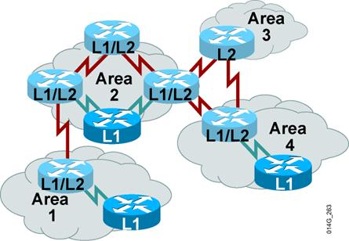
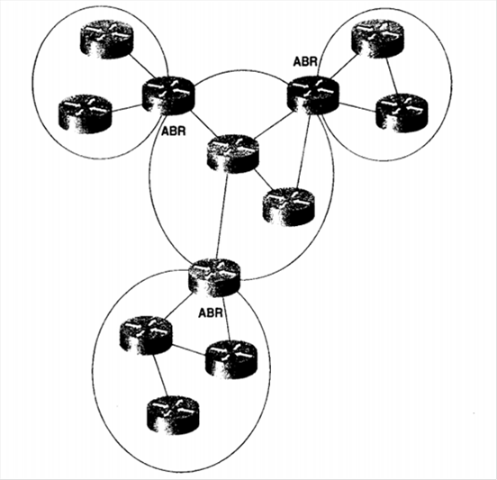
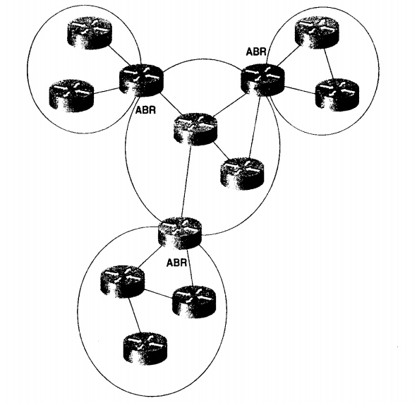

# ISIS

IS-IS

2011年6月21日

15:30

IS-IS是一种链路状态路由协议，它是由ISO定义和发展的，IS-IS支持的是ISO的CLNS（Connectionless Netword Protocol，无连接的网络协议），为了能够支持IP，后来讲IS-IS扩展为可同时支持OSI和TCP/IP的集成IS-IS（Integrated IS-IS）。

在IS-IS 中，路由器被描述为是一个中间系统（Intermediate System，IS），主机被描述为端系统（End System，ES）。因此提供主机和路由器之间的通信协议即为ES-IS，路由器之间的通信即为IS-IS。

IS-IS特点：

> • 做为IGP使用.
> 
> - **收敛快速.**
> - **更加稳定.**
> - **对带宽,CPU和内存等硬件资源的使用更为有效.**
> - **仍然使用区域的概念.**
> - **支持VLSM和CIDR.**
> - **链路状态路由协议的一个代表.**
> - **使用Dijkstra的SPF算法.**
> - **支持两个路由等级(level):**
> 
> – **Level 1(L1):建立本地区域的拓扑信息.**
> 
> – **Level 2(L2):区域间的网络前缀信息的交换.**
> 

**集成IS-IS的LSP操作**

**集成IS-IS中路由器分为L1,L2和L1/L2:**

> • L1路由器使用LSP建立本地区域的拓扑信息.
> 
> - **L2路由器使用LSP建立区域间的拓扑信息.**
> - **L1/L2路由器做为L1和L2路由的边界路由器.**

IS-IS区域

和OSPF区域有区别：OSPF是定义借口属于某一区域，可能出现某些借口在一个区域，另些借口在另一区域（ABR），如下图是OSPF的区域划分。

IS-IS与OSPF共同特性：

都维护一个链路状态数据库，并且这个数据库都是来自一个基于Dijkstra的SPF算法计算的一颗最短路径树

都利用Hello数据包来形成和维护邻接关系

都是用区域概念来构成一个两级层次化得拓扑结构

都具有在区域之间提供地址汇总的能力

都是无类路由协议

都通过选取一个指定路由器来描述广播型网络

都具有认证的能力

IS-IS对可靠性和可扩展性具有很高的要求

一台路由器就是一个中间系统（Intermediate System，IS），一台主机就是一台端系统（End System，ES），因此，提供主机与路由器之间同协议成为ES-IS协议，路由器与路由器之间相互宣告的的协议（路由选择协议）称为IS-IS。

与一个子网相连的接口称为子网连接点（Subnetwork Point of Attachment，SNPA）。

与OSPF等价功能的数据单元称为链路状态PDU（LSP）。

LSP与LSA区别：LSA是封装在OSPF头部之后，且都封装在一个IP包中，LSP本身就是一个数据包。

IS-IS与OSPF都采用区域的概念，但有区别：OSPF区域的边界是路由器，即某些接口处于一个区域，另一些借口处于其他区域。区域边界即ABR。同一台路由器处于同一IS-IS区域，边界是在链路上，而不是在路由器上。IS-IS骨干区域是第2层区域，非骨干区域是第1层区域。

一个中间系统（IS）可以使L1、L2或者L1/L2。

L1路由器类似于OSPF中的非骨干内部路由器

L2路由器类似于OSPF协议中的骨干路由器

L1/L2路由器类似于OSPF的ABR

