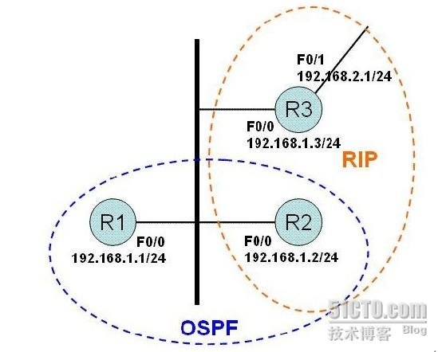

# Forwarding-address

Forwarding-address

2012年12月28日

9:44

FA 是Forwarding Address的简写。FA是ASBR通告的TYPE 5 LSA中的字段，它的作用是告诉OSPF域内的路由器如何能够更快捷地到达LSA 5所通告路由的下一跳地址。以免OSPF 内部路由器在广播网络上以ASBR为下一跳，再由ASBR自己转发到正确的下一跳，而产生额外的路由。简单来说，FA字段的作用类似于BGP协议中的“第三方下一跳”概念，主要在广播共享网络中起作用。FA字段可以为全0或者非0两种选择，有以下几个规则：

1、当与引入路由的下一跳关联（互连）的接口没有启动OSPF时，FA设置为0；

例如在上面图中，R8引入直连接口E1的路由，此接口没有启动OSPF，因此TYPE 5 的LSA中 FA字段为0。

2、当下列所有条件均满足的情况下，TYPE 5 LSA中FA字段设置为非0：

1、在ASBR上，与引入外部路由下一跳关联的接口启动了OSPF，即位于Network

命令范围内。

2、在ASBR上，与引入外部路由下一跳关联的接口不能配置被动接口；

//前两个规则是确保LSA能够被通告。

3、在ASBR上，与引入外部路由下一跳关联的接口配置的OSPF网络类型不能是P2P或P2MP。

//确保网络类型是Broadcast或NBMA 的共享网络。

以上说了FA字段可能设置为非0，那么到底是一个什么值呢？它是数据包应该被路由到的出口的接口地址。并不是loopback接口的IP地址，或者ROUTER ID指示的值什么的？

1 OSPF协议中FA地址是如何影响外部路由选路的？

上面提到TYPE 5 LSA的FA字段要么为0，要么非0。那么对于路由选路有何影响吗？

又有哪些注意点呢？

概括起来讲就是在计算由TYPE 5 LSA描述的某个外部路由时，会查找生成该LSA的ASBR，如果不存在这个ASBR的表项，忽略这个LSA。

否则，检查这个LSA的FA地址，这个地址就是转发数据包应该被发送到的地址。如果FA为0，数据包应该被发送到ASBR；如果FA非0，在OSPF路由表中查找到FA地址的表项，而且该表项必须被域内或者域间路由覆盖，否则不考虑这个LSA。

前面卖了这么多的关子，到底ospf在计算路由时如何参考FA地址？

一句话：如果FA非0，根据计算到FA地址的metric，而不是计算到ASBR的metric进行路由优选。

那么在计算外部路由时又是如何依据它进行选路呢？

1、计算外部路由时，首先检查通告TYPE 5 LSA的ASBR是否存在，否则忽略该LSA；

2、检查TYPE 5 LSA的FA地址是否为0。如为0，说明路由必须经过ASBR转发，那么优选到ASBR metric最短的路径。当有多个最短路径时，**优选从较大area ID学习到的**。

如果FA非0，那么优选到FA地址 metric最短的路径，而且到FA的路由必须时域内或域间的，否则忽略该表项。

注意以上的优选过程都是在比较了OSPF 域内、域间、外部类型1、外部类型2 四种优先级后，以及网络前缀长度都相同的情况下进行的。

一、Type 5 LSA中的FA地址

在查看Type 5的LSA时，注意到其中存在一个FA（Forwarding Address，转发地址）的信息。它的作用是什么呢？

示例：以该网络拓扑为例。

具体配置如下：

R1：

int f0/0

ip address 192.168.1.1 255.255.255.0

router ospf 1

network 192.168.1.0 0.0.0.255 area 0

R2：

int f0/0

ip address 192.168.1.2 255.255.255.0

router ospf 1

network 192.168.1.0 0.0.0.255 area 0

redistribute rip subnets

router rip

network 192.168.1.0

R3：

int f0/0

ip address 192.168.1.3 255.255.255.0

int f0/1

ip address 192.168.2.1 255.255.255.0

router rip

network 192.168.1.0

network 192.168.2.0

在查看R2引入外部路由192.168.2.0/24对应产生的Type 5 LSA时，发现其中的FA为192.168.1.3。

首先我们分析一下OSPF如何计算到达外部路由的？

步骤1：R2引入外部路由192.168.2.0/24，产生Type 5 LSA。

步骤2：R2将LSA在扩散到OSPF域中

步骤3：R1收到该LSA的信息

步骤4：R1计算到达192.168.2.0/24的路由

按照正常的逻辑（即LSA中的FA地址为0.0.0.0时），R1收到的这个LSA是R2产生的，因此R1计算到达192.168.2.0/24路由，应该下一跳地址为R2（即192.168.1.2）。 这样从R1去往192.168.2.0/24将首先到达R2、在经过R3到达目的地，很明显这样的路径不是最优的。

实际上，按照上图的拓扑中进行的配置，R2产生的192.168.2.0/24对应的Type 5 LSA，其FA地址为192.168.1.3。

在OSPF中计算路由时，将首先如何到达该FA地址（192.168.1.3），若能够到达，则将能够到达该FA地址的下一跳地址作为外部路由的下一跳地址。

因此我们在R1上的路由表中看到192.168.2.0/24路由的下一跳为192.168.1.3，这样的路由是不是更优呢！！

结论1：

1）在OSPF引入外部路由时，若产生的Type 5 LSA的FA地址为0.0.0.0，则其他路由器在计算到达该外部网络时，将考虑如何到达ASBR（即产生该Type 5 LSA的路由器）来计算出外部路由的下一跳地址。

2）在OSPF引入外部路由时，若产生的Type 5 LSA的FA地址不为0，则其他路由器在计算到达该外部网络时，将考虑如何到达该FA地址来计算出外部路由的下一跳地址。

那么OSPF中产生Type 5 LSA时，什么时候FA地址不为0.0.0.0呢？

若同时满足以下三个条件：

a）引入的这条外部路由，其对应的出接口启用了OSPF

b）引入的这条外部路由，其对应的出接口未设置为passive-interface

c）引入的这条外部路由，其对应的出接口的OSPF网络类型为broadcast

则产生的Type 5 LSA，其FA地址等于该引入的外部路由的下一条地址。

对照上面的拓扑，判断一下：

在R2上将通过RIP学习到的192.168.2.0/24的路由引入，很明显R2的路由表中192.168.2.0/24的信息如下：

R     192.168.2.0/24     192.168.1.3     f0/0

条件a）——R2的f0/0口启用了OSPF，因为R2的network命令包含192.168.1.0 0.0.0.255——满足

条件b）——在ospf中，R2的f0/0口未被配置为被动接口——满足

条件c）——R2的f0/0口对应的OSPF网络类型为broadcacst——满足

所以R2产生的Type 5 LSA时，其FA地址为192.168.1.3。