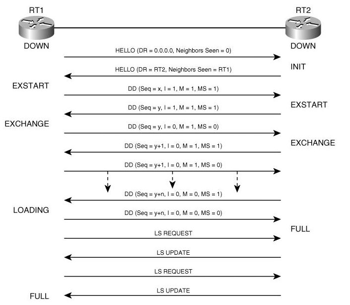
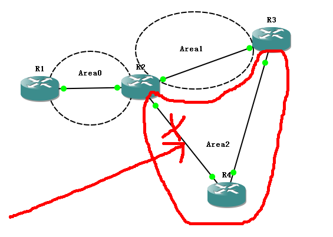
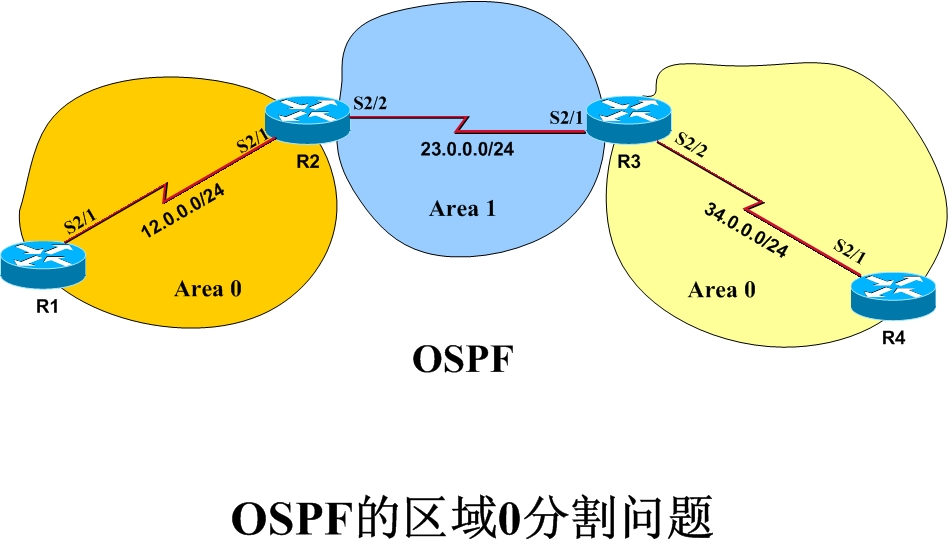
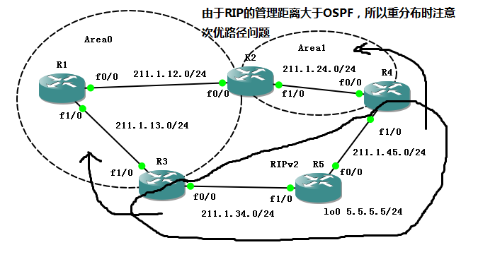
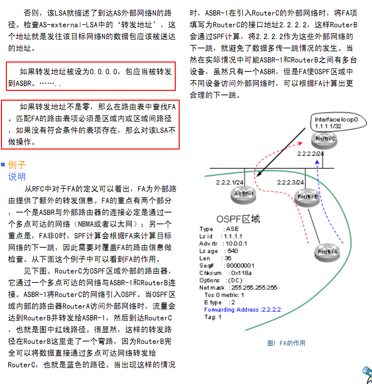

# OSPF

OSPF

2011年6月21日

15:25

OSPF:open shortest path first 开放式最短路径优先

RFC2328

IETF：英特网工程任务组

OSPF的基础知识

1.224.0.0.5 224.0.0.6（串口中只使用224.0.0.5（all spf routers），在多路访问网络中DR使用224.0.0.5，DRother使用224.0.0.6(all DR router)）

在MA网络环境中：

·DRother发送LSA给DR/BDR用224.0.0.6

·DR发送LSA给DRother用224.0.0.5

·在非MA网络（没有DR/BDR）：

路由器都用224.0.0.5

2.链路状态路由协议

3.110

4.现在用的版本v2

5.一般支持1万条路由条目

6.ospf不支持不等价负载均衡

OSPF的3个表

1.邻居表

2.拓扑表，也叫做链路状态数据库LSDB（link-state database）

3.路由表：在LSDB的基础上运行SPF算法产生最优路由放入路由表

OSPF防环机制：

1 区域内SPF算法保证区域内无环

2 区域间：其他区域必须和区域0相连，区域间的通信需要通过区域0来进行通信

关于OSPF的水平分割

<<Jeff关于OSPF水平分割的回信.txt>>

关于backbone

1. backbone-area 0

2. ospf中必须有backbone

3. 所有的区域必须与backbone相连

关于LSDB

LSDB是由LSA构成的

LSDB：link state database

LSA：link state advertise 链路状态通告

在LSDB的基础上运行SPF算法，生成一个SPF树

Dijkstra迪杰斯特拉 ====SPF算法

OSPF建立邻居的7个状态：

Down

Init：发送hello包，但是没有收到对方的hello包

attempt：NBMA特有

two-way：收到hello包，接着发送hello包，选举DR与BDR(这个状态时从邻居处收到的hello包中的邻居ID字段看见了自己的Router-ID)

exstart：使用DBD包选举主从关系(最高的Router_ID)，这里的DBD包只有包头，如果MTU不匹配，就会卡在这个状态

首先，交互DD是互相建立邻接关系的一个过程，其中主路由器来控制这个DD数据包中的信息交换，达到数据库同步，之所以选主从就是为了加快信息交换的速度，不用每个路由器都认为自己的主路由器，那样的话，状态机就会很乱，无序的进行，再说详细点，之所以要选出主从路由器，就是为了要同步它们之间的序列号，这个序列号是由主路由器定的，从路由器也要把自己所用的序列号换成主路由器的序列号，这么做是因为当主路由器发送一个M位是0的描述包，需要从路由器进行单播的确认，并且用一样的序列号，如果要是和主路由器使用的序列号不一样，那么主路由器就不知道从路由器确认的是哪一个包了，所以用主路由器相同序列号确认主路由器发送的数据包，这样当主，从路由器的M位都是0了以后，那么就交互成功了，也就是FULL状态了

在数据库描述数据包（DBD）中有3个标记位用来管理邻接关系的建立：

  I位，初始位（Initial bit），当需要指明发送的是第一个数据库描述数据包时，该位设置为1；

  M位，后继位（More bit），当需要指明所发送还不是最后一个数据库描述数据包时，该位设置为1；

  MS位，主/从位（Master/Slave bit），当数据库描述数据包始发于一个“主”路由器时，该位设置为1。

exchange：使用DBD，LSAck包，此时知道自己缺少什么

loading：使用LSR，LSU，LSAck包，进行LSA的交流，LSU包中包含的就是LSA的信息，真正的数据同步过程

full：完全临接关系，此时LSDB是同步的

注意点：

邻居：物理上毗连

邻接：建立逻辑上关系，two-way

完全邻接：拓扑数据库同步，full

OSPF的5个包

1.Hello

hello包的作用有3个：

（1）发现、建立、维护邻居关系

（2）选举DR与BDR

（3）确保双向通信

2.DBD（Database Description）：LSDB的描述信息，主从关系

3.LSR（Link state request）：用来请求LSA信息

4.LSU（Link state update）：用来回复LSR

5.LSAck：用来确认

区分邻居，邻接，完全邻接

邻接：two-way

完全邻接：full

区分EIGRP的拓扑表和OSPF的LSDB的区别？

OSPF中的hello时间和保持时间（Dead time）间隔？

答：在点到点和广播网络中hello时间是10s，保持时间是40s

在点到多点和非广播多路访问网络中hello时间是30s，保持时间是120s

OSPF建立邻居的条件？

答：

1.相同的时间间隔

2.相同的区域

3.如果有认证，相同的认证

4.相同的区域末节标示

OSPF为什么要在多路访问网络中选举DR与BDR？

多路 广播

广播多路访问网络：以太网（ethernet）

非广播多路访问网络（NBMA）：帧中继

n（n-1）/2 --------> 2n-3

DR:designated router(DR是指接口的特性，而不是路由器的特性)

BDR:non-designated router

如何选举DR与BDR？

答：

1.比较接口优先级（接口优先级的范围0-255，0为不参与选举）

2.比较router-id

如果没有路由器宣称自己是DR，那么选举的BDR会成为DR

router-id？

标示路由器

如何选举router-id？

1.手工指定（推荐）

2.最大的loopback口

3.最大的物理接口（up状态的）不一定要运行OSPF，即使以后这个接口坏了，还会继续使用

ABR(area border routers)，ASBR（autonomous system boundary router）

区域内部路由器也有可能是ASBR

OSPF的设计原则

1.必须要有区域0（区域0=backbone）

2.其他区域必须要直接连接到区域0

3.区域的分界点在路由器上

4.一个路由器最好不要超过3个区域

5.一个区域中的路由器最好不要超过50台

6.同一个区域的LSDB是相同的

ABR：至少有一个接口不是处于区域0的路由器叫做ABR（Area Border Router）

ASBR：至少运行一个除了OSPF以外的路由协议，并且重分发到OSPF中

为什么要划分区域？

可以节省内存，CPU等。其实最主要的原因是，SPF算法比较消耗资源，如果全部网络都同时运行SPF算法，这样开销过于庞大。所以采用划分区域的办法，将这种开销降低到一定范围内，因为只有在域内才会运行SPF算法，域间的路由选择由于是规定非0区域都连接到区域0，所以直接采用路由，不需要计算，由此也防止了域间的环路潜在可能。

分段区域（partitioned area）非骨干区域变为分段区域，有可能不会中断通信，自动产生两个区域，骨干区域分段不行

孤立区域（isolated area）孤立区域没有链路路径和网络相连

非0区域被分割的最可能场景，如图所示，Area2想拿R3做备份，这样当出现图中链路故障的时候，可以通过虚链路连到Area0，当然也可以使用隧道

区域0被分割产生的问题：

**如：R2会收到R3发来的一条类型3的LSA，其中包含了34.0.0.0/24网络的路由信息。由于这条LSA来自于右边的区域0，当R2收到这条LSA时，它发现这是一条来自于区域0的类型3的LSA，而R2本身又是区域0的边界路由器，因此它认为这种情况是不可能发生的。于是它会认为这是SPF算法出错，所以不会接收这条LSA，路由也就无法学习到。**

在本实验中就要观察这种现象，然后找出解决方案。目前可行的方法有三种；分别是：

1 建立虚链路；

2 建立tunnel；

3 不同进程之间的重分布。

下面将逐一进行试验。

―――――――――――――――――――――――――――――――――――――――

1 基本配置

R1

interface Serial2/1

ip address 12.0.0.1 255.255.255.0

router ospf 1

router-id 1.1.1.1

network 12.0.0.0 0.0.0.255 area 0

R2

interface Serial2/1

ip address 12.0.0.2 255.255.255.0

interface Serial2/2

ip address 23.0.0.2 255.255.255.0

router ospf 1

router-id 2.2.2.2

network 12.0.0.0 0.0.0.255 area 0

network 23.0.0.0 0.0.0.255 area 1

R3

interface Serial2/1

ip address 23.0.0.3 255.255.255.0

interface Serial2/2

ip address 34.0.0.3 255.255.255.0

router ospf 1

router-id 3.3.3.3

network 23.0.0.0 0.0.0.255 area 1

network 34.0.0.0 0.0.0.255 area 0

R4

interface Serial2/1

ip address 34.0.0.4 255.255.255.0

router ospf 1

router-id 4.4.4.4

network 34.0.0.0 0.0.0.255 area 0

r2#sh ip os neighbor

Neighbor ID     Pri   State           Dead Time   Address         Interface

1.1.1.1           1   FULL/  -        00:00:31    12.0.0.1        Serial2/1

3.3.3.3           1   FULL/  -        00:00:39    23.0.0.3        Serial2/2

r3#sh ip os neighbor

Neighbor ID     Pri   State           Dead Time   Address         Interface

2.2.2.2           1   FULL/  -        00:00:34    23.0.0.2        Serial2/1

4.4.4.4           1   FULL/  -        00:00:30    34.0.0.4        Serial2/2

OSPF邻居已经建立。

r2#sh ip route

23.0.0.0/24 is subnetted, 1 subnets

C       23.0.0.0 is directly connected, Serial2/2

12.0.0.0/24 is subnetted, 1 subnets

C       12.0.0.0 is directly connected, Serial2/1

但R2无法学习到34.0.0.0/24的路由。原因正如前文所说

现在就前面提到的方法分别进行验证。

- ******************************************************************************

方法一 建立虚链路（最常用的方法）

r2(config)#router os 1

r2(config-router)#area 1 virtual-link 3.3.3.3

r3(config)#router os 1

r3(config-router)#area 1 virtual-link 2.2.2.2

r2#sh ip route

34.0.0.0/24 is subnetted, 1 subnets

O       34.0.0.0 [110/128] via 23.0.0.3, 00:00:33, Serial2/2

23.0.0.0/24 is subnetted, 1 subnets

C       23.0.0.0 is directly connected, Serial2/2

12.0.0.0/24 is subnetted, 1 subnets

C       12.0.0.0 is directly connected, Serial2/1

方法二 建立tunnel

1 建立TUNNEL

r2(config)#int tunnel 0

r2(config-if)#ip add 2.2.2.2 255.255.255.0  /为tunnel接口配一个IP地址

r2(config-if)#tunnel source 23.0.0.2       /为tunnel指定一个源端

r2(config-if)#tunnel destination 23.0.0.3   /为tunnel指定一个目的端

r3(config)#int tunnel 0

r3(config-if)#ip add 2.2.2.3 255.255.255.0

r3(config-if)#tunnel source 23.0.0.3

r3(config-if)#tunnel destination 23.0.0.2

在本例中tunnel是建立在R2,R3之间的串行链路上。并且为tunnel接口配置了IP地址。而且IP地址必须处于同一网段。目的是将这一网段宣告至OSPF的区域0中。让tunnel将区域0连接起来。

――――――――――――――――――――――――――――――――――――――

2 将TUNNEL接口的IP宣告进OSPF的区域 0

r2(config)#router os 1

r2(config-router)#net 2.2.2.0 0.0.0.255 a 0

r3(config)#router os 1

r3(config-router)#net 2.2.2.0 0.0.0.255 a 0

―――――――――――――――――――――――――――――――――――――

r2#sh ip os nei

Neighbor ID     Pri   State           Dead Time   Address         Interface

1.1.1.1           1   FULL/  -        00:00:38    12.0.0.1        Serial2/1

3.3.3.3           1   FULL/  -        00:00:35    23.0.0.3        Serial2/2

3.3.3.3           1   FULL/  -        00:00:36    2.2.2.3         Tunnel0

r3# sh ip os nei

Neighbor ID     Pri   State           Dead Time   Address         Interface

2.2.2.2           1   FULL/  -        00:00:37    23.0.0.2        Serial2/1

4.4.4.4           1   FULL/  -        00:00:33    34.0.0.4        Serial2/2

2.2.2.2           1   FULL/  -        00:00:31    2.2.2.2         Tunnel0

可以看到R2，R3之间通过tunnel接口也建立起了邻居。

――――――――――――――――――――――――――――――――――――

r2#sh ip rou

34.0.0.0/24 is subnetted, 1 subnets

O       34.0.0.0 [110/11175] via 2.2.2.3, 00:03:51, Tunnel0

2.0.0.0/24 is subnetted, 1 subnets

C       2.2.2.0 is directly connected, Tunnel0

23.0.0.0/24 is subnetted, 1 subnets

C       23.0.0.0 is directly connected, Serial2/2

12.0.0.0/24 is subnetted, 1 subnets

C       12.0.0.0 is directly connected, Serial2/1

r3#sh ip rou

34.0.0.0/24 is subnetted, 1 subnets

C       34.0.0.0 is directly connected, Serial2/2

2.0.0.0/24 is subnetted, 1 subnets

C       2.2.2.0 is directly connected, Tunnel0

23.0.0.0/24 is subnetted, 1 subnets

C       23.0.0.0 is directly connected, Serial2/1

12.0.0.0/24 is subnetted, 1 subnets

O       12.0.0.0 [110/11175] via 2.2.2.2, 00:04:13, Tunnel0

inter：之间

intra：之内

OSPF的metric值

metric值在OSPF中也叫做cost值

cost=10^8/bandwidth

如何修改OSPF的cost值

1.接口下修改，使用命令ip ospf cost xxx ----推荐使用

2.接口下修改，改带宽，使用命令bandwidth ---不推荐使用

3.使用进程下命令auto-cost reference-bandwidth ，要在所有的路由器下都改 ----在百兆以上的网络中推荐使用，是改变基准带宽，也就是10的几次幂除以带宽。//是因为在其他厂商的设备上可能计算的基准带宽不一样，所以改变以适应

规则：接口下的命令优于全局命令

选路规则：

intra > inter > E1> E2

OSPF在选择外部路由的时候，遵循的原则是：

[1]O E1优于O E2

[2]在同样的情况下，Cost越小越优先

[3]在cost相同的情况下，选择到达ASBR最优的路径

1.O和O IA的比较

通过这个实验我们可以得出结论O>O IA

2. OIA 与O E的比较

通过这个实验我们可以得出结论O IA>O E

3. O E1与O E2的比较

通过这个实验我们得出结论O E1>O E2

4. O N1与O N2的比较

通过这个实验我们得出结论O N1>O N2

5. O E1与O N2的比较

通过这个实验我们得出结论O E1>O N2

6. O N1与O E2的比较

通过这个实验我们得出结论O N1>O E2

综合3-6几个实验，我们又得出一个很重要的结论，那就是无论是O N还是OE的路由1型的选路永远是优先于2型的。

需要注意的是此时在选路中不同类型（我们这里把每个圈归为一类）的选路是优先于Metric值的。

而在每一种类型的内部关于同一个网络有多个条目时，他是怎么样选路的呢？

这时路由器才会参考Metric值进行选路：

1. 当一台路由器对于同一网段有2条O的路由（或2条O IA的路由）时：

 若Metric值不同，则选择Metric值较低的路径

 若Metric值相同，则负载均衡

2. 当一台路由器对于同一网段收到2条O E1的路由：

 若Metric值不同，则选择Metric值较低的路径

 若Metric值相同，则负载均衡

3. 当一台路由器对于同一网段收到2条O N1的路由：

 若Metric值不同，则选择Metric值较低的路径

 若Metric值相同，则负载均衡

4. 当一台路由器对于同一网段即收到1条O E1,又收到一条O N1

 若Metric值不同，则选择Metric值较低的路径

 若Metric值相同，则选择O E1

5. 当一台路由器对于同一网段收到2条O E2的路由：

 若Metric值不同，则选择Metric值较低的路径

 若Metric值相同，则选择到达ASBR的Metric值较低的路径

 若Metric值相同，到达ASBR的Metric值也相同，则负载均衡

6. 当一台路由器对于同一网段收到2条O N2的路由：

 若Metric值不同，则选择Metric值较低的路径

 若Metric值相同，则选择到达ASBR的Metric值较低的路径

 若Metric值相同，到达ASBR的Metric值也相同，则负载均衡

关于LSA

1.LSA的序列号：0x80000001 到 0x7FFFFFFF

2.LSA的老化时间：最多在LSDB中存放1小时，每30分钟发送一次

3.LSA的工作过程：

（1）如果收到的LSA不存在在LSDB中，做4件事情：第一件，将LSA放入LSDB，第二件，回复LSAck，第三件，泛洪，第四件，运行SPF算法，算出最佳路由条目放入路由表

（2）如果收到的LSA存在在LSDB中，并且序列号与LSDB中的序列号一致，忽略此LSA

（3）如果收到的LSA存在在LSDB中，并且序列号比LSDB中的要大，做4件事情：第一件，将LSA放入LSDB，第二件，回复LSAck，第三件，泛洪，第四件，运行SPF算法，算出最佳路由条目放入路由表

（4）如果收到的LSA存在于LSDB中，并且序列号比LSDB中的要小，此时做两件事：第一件，忽略此LSA，第二件，将LSDB中更新的LSA发送给对方

4.LSA的类型：

LSA1

（1）每个路由器都产生

（2）本区域内有效

LSA2

LSA2:把多路环境下的所有router-ID泛洪到整个区域（一个区域可能有很多种类型的链路，那其他类型链路就需要知道多路访问链路上的）

（1）由DR产生

（2）本区域内有效 O来表示

LSA3

（1）只能由ABR产生 OIA表示

（2）由LSA1，2类型转化而来

LSA4

（1）由ABR产生

（2）用来向其他区域通告本区域有一个ASBR

通过ASBR汇总LSA通告的目的地址总是一个主机地址，因为它是一条到达一台路由器的路由。

LSA4:ASBR发送一个类型一的路由器LSA，里面含有1bit用来标记自己是ASBR的位。当ABR(在路由器LSA中以边界bit标记)收到这个类型一的LSA时，它建立一个类型四LSA，并且洪泛进骨干区域area0。后续的ABRs重新产生一个类型四LSA，洪泛进后面的区域。

其实OSPF计算域间和AS外的路由是依靠矢量叠加的，所以必须有ASBR的信息，才能计算

既然OSPF通过LSA收敛网络，那么解决这个问题必然从各类的LSA携带的信息入手。

我们看一下5类LSA携带的信息：1、掩码。2、OE1/OE2。3、cost。4、forward【这个字段表示**该路由的下一跳为ASBR！！！】

所以其他区域的路由器需要知道ASBR的位置才能成功完成路由。那么其他区域的路由器知不知道ASBR的位置呢？着我们就需要看3类LSA了，因为其他区域的路由都是通过3类LSA学到的。

再看下3类LSA携带的字段：1、Link-ID。2、掩码。3、cost。简单的说，3类LSA里面只有各个区域的汇总信息。路由器根本无法从3类LSA中获取准确的ASBR位置。所以才会产生4类LSA。

我们需要知道，4类LSA由ASBR所在区域的ABR产生，因为在该区域里泛洪1类LSA，该区域里的任何路由器都有彼此的明细信息，所以4类LSA在ASBR所在区域无作用，只由该区域的ABR向其他区域泛洪。

例子

Summary ASB Link States (Area 0)

Link ID ADV Router Age Seq# Checksum

7.7.7.7 3.3.3.3 951 0x80000001 0x00E72B

7.7.7.7 4.4.4.4 939 0x80000001 0x00E724

Type-5 AS External Link States

Link ID ADV Router Age Seq# Checksum Tag

10.10.10.0 7.7.7.7 211 0x80000004 0x00A5BD 0

LSA5

（1）由ASBR产生

（2）整个OSPF域内有效（除了stub totally stub nssa）

LSA7

（1）NSSA区域的ASBR产生的

（2）仅存在于NSSA区域

（3）ABR上有一个“7转5”

LSA6 MOSPF中使用，思科的路由器不支持MOSPF

LSA8 在BGP中作为扩展属性

LSA9-11 在MPLS中使用

什么是泛洪？

从除了收到的接口以外的所有接口发送出去的过程

配置OSPF

将接口加入到OSPF有两种方法：

1.使用network命令，进程下命令

2.使用ip ospf 10 area 0命令，接口下命令

OSPF ------- 四层

Clear ip ospf process

3层的视角，网络的类型：

1.点到点网络：串口

2.广播多路访问：以太网

3.非广播多路访问：帧中继

OSPF的视角，网络的类型：

1.point-to-point

2.broadcast

3.point-to-multipoint

4.nonbroadcast

5.virtual link

虚链路配置规则

1.虚链路必须配置在两台ABR路由器之间

2.配置了虚链路所经过的区域必须拥有全部的路由选择信息，这样的区域又被称为传送区域（transit area）

3.传送区域不能是末梢区域

虚链路属于骨干区域。

虚链路是为了解决非骨干区域和非骨干区域连接的问题和骨干区域被分割的问题。

区域0被分割，可以用虚链路，也可以重分发，还可以用tunnel，借用属于ospf的地址，自己写地址，通告进ospf区域，但是不能是区域0，只能是中间的区域。

GRE 6to4

shame-link

还有一种特别的，叫loopback

group racing

对于串口，默认情况下，OSPF认为是point-to-point网络类型

对于环回口，OSPF认为的网络类型是loopback，说白了就是OSPF认为环回口就是主机

对于以太口，OSPF认为的网络类型是broadcast

对于帧中继，OSPF认为的网络类型是 ------nonbroadcast,即ospf认为帧中继是不支持广播、组播的

而ospf的包的目标地址是224.0.0.5，是组播地址，所以ospf包发不了

OSPF over fram-relay：

第一种方法：

所以解决方式是使用单播建邻居。使用neighbor命令。

配置方法

hub端：

进程下命令：neighbor 123.1.1.2 neighbor 123.1.1.3

spoke端：

接口下命令：ip ospf priority 0

neighbor 命令在老版本IOS中是必要的，还要保证hub端为DR，使用neighbor命令缺省优先级为0（现行IOS版本需要直接在接口下指定接口优先级，用neighbor指优先级没效果），使数据包以单播的形式进行发送。

第二种方法：

改成广播类型

配置方法：

hub端：

接口下命令：

ip ospf network broadcast

spoke端：接口下命令 优先配置spoke端

ip ospf network broadcast

ip ospf priority 0

将接口类型改为广播类型，并且接口下帧中继映射也是允许广播和组播包过去，也就是在静态映射后面加关键字“broadcast”。

第三种方法：

(1)hub端改成点到多点类型，spoke端改成点到点类型

区分：ospf中的点到多点类型和帧中继的多点子接口一点关系都没有

点到多点类型相当于多个点到点类型

配置方法：

hub端：

接口下命令：ip ospf network point-to-multipoint

spoke端：

接口下的命令

ip ospf network point-to-point

ip ospf hello-interval 30

ip ospf dead-interval 120

注意：点到点子接口默认的网络类型是点到点，多点子接口默认的网络类型是NBMA。

(2)hub端 spoke端网络类型都改成点到多点。

注意：hub端不可以使用点到点类型，如果两端接口网络类型不一致则需要更改hello和dead时间保持一致才能正常建立邻居关系。

帧中继中，如果不关闭CEF，则只要在本地帧中继接口下映射地址，则就会使用该DLCI发包！！

OSPF的特殊区域

OSPF特殊区域少接受或不接受LSA可以有效阻止链路故障造成的拓扑重新计算在网络中蔓延，从而控制网络故障传递的范围，防止因个别网络故障造成整个网络不稳定情况的发生。

OSPF有6种区域：

1.骨干区域：backbone：区域0

2.标准区域：标准区域全路由,LSA1,2,3,4,5 什么都不配的除了区域0的就是标准区域

3.stub区域：LSA1,2,3（包含一条LSA3承载的默认路由）

4.Totally stub区域：LSA1,2（包含一条LSA3承载的默认路由）

5.NSSA区域：LSA1,2,3,7

6.Totally NSSA区域：LSA1,2,7（包含一条LSA3承载的默认路由）

凡是带Totally的是思科私有的

如果stub区域向存在ASBR，此时用NSSA区域

LSA7号类型只存在在NSSA区域，所有有个一个“7转5”的过程

关于7转5

1.7转5是在NSSA区域的ABR上实现的

2.绝对没有“5转7”

3 如果在NSSA区域边界有多个ABR则只有最大Router-ID的路由器会执行7转5的过程

NSSA：not so stuby area不完全末节区域

sh ip os database ：用来看LSDB

stub区域的配置：E-bit为0

所有stub区域内的路由器在进程下打：area 1 stub

会产生一个O*IA

Totally stub区域的配置：

在ABR上打：area 1 stub no-summary

其他所有路由器上打：area 1 stub

会产生一个O*IA

NSSA区域的配置：P-bit为1

所有NSSA区域的路由器在进程下打：area 1 nssa

没有产生缺省路由----特别注意

如果想让NSSA区域产生缺省路由，在NSSA区域的ABR上打：

area 1 nssa default-information-originate

此时产生的缺省路由标志为O*N2

Totally NSSA区域的配置：

在ABR上打：area 1 nssa no-summary

其他路由器上打：area 1 nssa

会产生一个O*IA

注意：想要抑制LSA7转换成LSA5，命令：

area area-id nssa translate type7 suppress-fa

或者

高端路由器上：

area 1 filter-list prefix exnet-to-backbone in

ip prefix-list exnet-to-backbone seq 5 deny 0.0.0.0/0

NSSA区域双ABR时，Router-ID大的进行7转5

<<NSSA区域双ABR.docx>>

总结四种特殊区域：E-bit位设置为0

1.凡是带totally的是思科私有的

2.默认情况下，stub，totally stub，totally nssa区域默认会产生O*IA，nssa区域不会产生缺省路由

3.如果想让nssa区域产生缺省路由，在ABR上打：area 1 nssa default-information-originate

4.准则：特殊区域的ASBR不会告诉给其他区域，其他区域的ASBR也不会告诉给特殊区域

关于OSPF的汇总

OSPF只能在ABR上或者ASBR上进行汇总

在ABR上：

进程下命令：area 0 range 10.1.0.0 255.255.252.0

会产生null0

在ASBR上：

进程下命令：summary-address 30.1.64.0 255.255.252.0

会产生null0

OSPF的认证

两大类：明文认证，密文认证

明文认证：接口下明文和全局下明文

密文。。。。。。

1.接口下明文认证

ip os authentication ------开启接口下明文认证

ip os authentication-key cisco -----配置接口的密码

注意点：

（1）密码区分大小写

（2）密码后面不要跟空格

Simple password=clear text 明文

2.接口下密文认证

ip os authentication message-digest -----开启接口下密文认证

ip os message-digest-key 1 md5 cisco -----配置接口的密码

密文认证比明文认证的优点：

（1）安全

（2）换密码方便

既有明文认证又有密文认证的协议：RIP，OSPF

只有密文认证的协议：EIGRP，BGP

只有明文认证的协议：ISIS ----------x

RIP

EIGRP

OSPF

ISIS

BGP

IPv6

组播

O IA 3号LSA

LSA：link stata advertisement链路状态通告

一些注意点

ospf 重分布直连的时候，default-metric 55 不起用作。

rip eigrp更改管理距离是邻居的IP地址。

ospf 更改管理距离的源IP是对方的router ID。

auto reference-bandwidth对loopback不起作用。

在虚链路上，OSPF数据包是单播发送的。

OSPF的接口状态

1.down

2.point-to-point

3.waiting

4.DR

5.BDR

6.backup

7.DRother:跟踪网络上的所有路由器，但只和DR和BDR建立邻居关系。

8.loopback

master slave：主路由器控制数据库数据描述包的数据交换。

在NBMA类型的网络中，路由器是每经过pollinterval的时间给它邻居状态为down的邻居发送一次hello包的，cisco默认的pollinterval是120s。

在attempt状态下，路由器将使用hellointerval的时间代替pollinterval的时间来作为向邻居发送hello数据包的时间间隔。

OSPF使用距离矢量的算法来查找区域之间的路由。

通过ASBR汇总LSA通告的目的地址总是一个主机地址，因为它是一条到达一台路由器的路由。