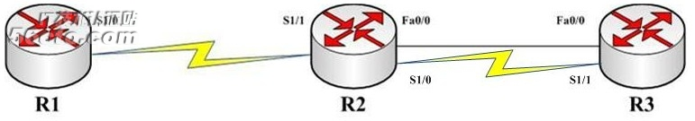

# OSPF其中状态及排错

OSPF七种状态及排错

2012年7月3日

15:44

OSPF路由器在完全邻接之前,所经过的几个状态：

1. Down：此状态还没有与其他路由器交换信息。首先从其ospf接口向外发送hello分组，还并不知道DR(若为广播网络)和任何其他路由器。发送hello分组是，使用组播地址224.0.0.5。

2. Attempt：只适于NBMA网络，在NBMA网络中邻居是手动指定的，在该状态下，路由器将使用HelloInterval取代PollInterval来发送Hello包。

3. Init：在DeadInterval里收到了Hello包，2-Way通信还没有建立起来的状态。

4. two-way：双向会话建立，而RID彼此出现在对方的邻居列表中。(若为广播网络：例如：以太网。在这个时候应该**DR,BDR。)

5. ExStart：信息交换初始状态，在这个状态下，本地路由器和邻居将建立Master/Slave关系，并确定DD Sequence Number，路由器ID大的的成为Master。

6. Exchange：信息交换状态：本地路由器和邻居交换一个或多个DBD分组(也叫DDP) 。DBD包含有关LSDB中LSA条目的摘要信息。

7. Loading：信息加载状态：收到DBD后，使用LSACK分组确认已收到DBD。将收到的信息同LSDB中的信息进行比较。如果DBD中有更新的链路状态条目，则想对方发送一个LSR，用于请求新的LSA 。

8. Full：完全邻接状态，这种邻接出现在Router LSA和Network LSA中。

为了模拟出OSPF的基本网络环境，这里有两种配置，一种为普通p2p加上MA的网络，另一种为NBMA网络。

基本链路配置：

R1：

interface Loopback0

ip address 1.1.1.1 255.255.255.255

!

interface Serial1/0

ip address 12.1.1.1 255.255.255.0

serial restart-delay 0

clock rate 64000

!

R2：

interface Loopback0

ip address 2.2.2.2 255.255.255.255

!

interface FastEthernet0/0

ip address 23.1.1.2 255.255.255.0

speed auto

duplex auto

!

interface Serial1/1

ip address 12.1.1.2 255.255.255.0

serial restart-delay 0

!

R3：

interface Loopback0

ip address 3.3.3.3 255.255.255.255

!

interface FastEthernet0/0

ip address 23.1.1.3 255.255.255.0

speed auto

duplex auto

!

NBMA基本链路配置：

R1：

interface Loopback0

ip address 1.1.1.1 255.255.255.255

!

interface Serial1/0

ip address 13.1.1.1 255.255.255.0

encapsulation frame-relay

no fair-queue

serial restart-delay 0

frame-relay map ip 13.1.1.3 103 broadcast

no frame-relay inverse-arp

!

R2：

frame-relay switching

!

interface Serial1/0

no ip address

encapsulation frame-relay

no fair-queue

serial restart-delay 0

clock rate 64000

frame-relay lmi-type ansi

frame-relay intf-type dce

frame-relay route 301 interface Serial1/1 103

!

interface Serial1/1

no ip address

encapsulation frame-relay

serial restart-delay 0

clock rate 64000

frame-relay lmi-type ansi

frame-relay intf-type dce

frame-relay route 103 interface Serial1/0 301

!

R3：

interface Loopback0

ip address 3.3.3.3 255.255.255.255

!

interface Serial1/1

ip address 13.1.1.3 255.255.255.0

encapsulation frame-relay

serial restart-delay 0

frame-relay map ip 13.1.1.1 301 broadcast

no frame-relay inverse-arp

!

所有路由器上OSPF协议均采用以下配置：

router ospf 10

router-id x.x.x.x（x为路由器编号）

network 0.0.0.0 255.255.255.255 area 0

1. Attempt：

只适于NBMA网络，如果一台路由器的OSPF一直”卡“在Attempt状态：表明该路由器已发送一个Hello报文，但是没有接到邻居的回应。通常，这个问题出现在使用了neighbor命令指定邻居的NBMA网络中。

a. 某一台路由器上（R1）指定一个错误的邻接地址：

R1：

router ospf 10

router-id 1.1.1.1

network 0.0.0.0 255.255.255.255 area 0

neighbor 13.1.1.2

!

R1#show ip os neighbor

Neighbor ID     Pri   State           Dead Time   Address         Interface

N/A               0   ATTEMPT/DROTHER 00:00:46    13.1.1.2        Serial1/0

b. 使用ACL阻止了Hello分组：

R1：

interface Serial1/0

ip access-group 10 in

!

access-list 10 deny   13.1.1.0 0.0.0.255

access-list 10 permit any

!

R1#show ip os neighbor

Neighbor ID     Pri   State           Dead Time   Address         Interface

N/A               0   ATTEMPT/DROTHER 00:01:54    13.1.1.3        Serial1/0

另外，当一端指定了neighbor，另一端没有指定neighbor时，OSPF会经历一个比较长的周期才能建立FULL的邻接关系，这种情况也会与路由器种类及平台有关，并不是统一的结论。

2. INIT：

路由器收到第一个OSPF Hello分组就进入到Init状态：路由器首先发送拥有自身ID信息的Hello报文。与之相邻的路由器如果收到这个Hello报文，就将这个报文内的ID信息加入到自己的Hello报文内。

如果路由器的某端口收到从其他路由器发送的含有自身ID信息的Hello报文，则它根据该端口所在网络类型确定是否可以建立邻接关系。

a. 使用ACL在其中一台路由器（R1）上面阻止OSPF Hello分组：

interface Serial1/0

ip access-group 100 in

!

access-list 100 deny   ip 12.1.1.0 0.0.0.255 host 224.0.0.5

access-list 100 permit ip any any

!

于是，在另一台路由（R2）上查看OSPF neighbor信息

R2#show ip os nei

Neighbor ID     Pri   State           Dead Time   Address         Interface

1.1.1.1           0   INIT/  -        00:00:31    12.1.1.1        Serial1/1

b. NBMA中手动指定ip映射时，没有加入”broadcast”参数

R1：

interface Serial1/0

ip ospf network broadcast

frame-relay map ip 13.1.1.3 103 broadcast

no frame-relay inverse-arp

!

R3：

interface Serial1/1

ip ospf network broadcast

frame-relay map ip 13.1.1.1 301

no frame-relay inverse-arp

!

R3#show ip os neighbor

Neighbor ID     Pri   State           Dead Time   Address         Interface

1.1.1.1           1   INIT/DROTHER    00:00:35    13.1.1.1        Serial1/1

注意：这种情况仅在某些特定的IOS中会出现，现在一些较新的IOS，测试用IOS C7200 12.2(33)SRC一端配置为非broadcast网络，最终仍然能形成FULL邻接关系，但是链接会不太稳定，OSPF neighbor关系抖动。

3. TWO-WAY：

双向会话建立，而RID彼此出现在对方的邻居列表中。

在广播型链路中，两个DROTHER之间停留在two-way状态，DROTHER分别于DR和BDR形成FULL的邻接关系。

停滞在two-way状态的两个路由器，可能是两端均配置了priority为0。

R2：

interface FastEthernet0/0

ip ospf priority 0

!

R3：

interface FastEthernet0/0

ip ospf priority 0

!

R2#show ip os neighbor

Neighbor ID     Pri   State           Dead Time   Address         Interface

3.3.3.3           0   2WAY/DROTHER    00:00:34    23.1.1.3        FastEthernet0/0

R3#show ip os neighbor

Neighbor ID     Pri   State           Dead Time   Address         Interface

2.2.2.2           0   2WAY/DROTHER    00:00:34    23.1.1.2        FastEthernet0/0

4. EXSTART/EXCHANGE：

信息交换初始状态：在这个状态下，本地路由器和邻居将建立Master/Slave关系，并确定DD Sequence Number，路由器ID大的的成为Master。

信息交换状态：本地路由器和邻居交换一个或多个DBD分组(也叫DDP) 。DBD包含有关LSDB中LSA条目的摘要信息。

a. 接口MTU不匹配：

在拓扑中某一路由器上修改其端口MTU

R3：

interface FastEthernet0/0

ip mtu 1499

!

R3#show ip os neighbor

Neighbor ID     Pri   State           Dead Time   Address         Interface

2.2.2.2           1   EXSTART/DR      00:00:39    23.1.1.2        FastEthernet0/0

R2#show ip os neighbor

Neighbor ID     Pri   State           Dead Time   Address         Interface

3.3.3.3           1   EXCHANGE/BDR    00:00:37    23.1.1.3        FastEthernet0/0

解决方案有两种：

I.

R3(config)#int fa0/0

R3(config-if)#ip mtu 1500

II.

R3(config)#int fa0/0

R3(config-if)#ip ospf mtu-ignore

5. LOADING：

信息加载状态：收到DBD后，使用LSACK分组确认已收到DBD。将收到的信息同LSDB中的信息进行比较。如果DBD中有更新的链路状态条目，则想对方发送一个LSR，用于请求新的LSA 。

无法设计实验使OSPF”卡“在该状态。

6. FULL

网上一些说法说的两端认证配置不一样，会使OSPF停留在某些状态，但是实际的测试中并没有实验出现结果。

另外，两台路由器之间的router-id重复也会造成OSPF出现故障，停留在哪种状态因厂商而已，这里不做详细讨论。

以上实验均基于思科IOS平台，其他平台现象暂时不做讨论。