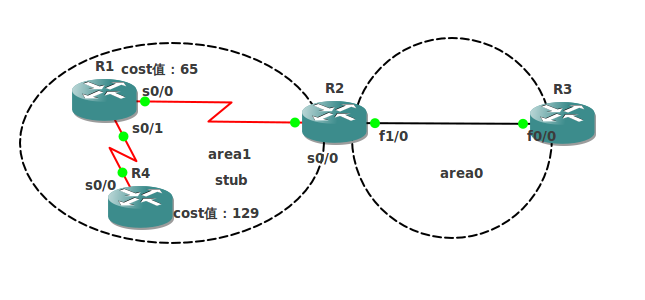
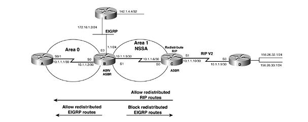

# OSPF命令总结

OSPF命令总结

2011年7月5日

15:06

1 area （area-id） authenticaiton

开启区域的认证，如果想去掉某条链路上的区域认证就用ip ospf authentication null ，并且链路配置优于进程配置，开启后必须在接口上打入密钥：ip ospf authentication-key cisco,或者在虚链路上:area 1 virtual-link 1.1.1.1 authentication-key cisco

service password-encryption 这条命令用于对本地配置的明文密钥加密

2 area （area-id） authenticaiton message-digest

基本注意点同明文区域认证，密钥设置：ip ospf message-digest-key （key-id） md5 （password）

3 area （area-id） default-cost （cost）

是为特殊区域（stub、totally stub、nssa、totally nssa）的缺省路由设置默认cost值，如果这句话不打，则缺省路由的默认cost值为1，所以在区域内显示为1+本地路由器路由入向接口cost值。注意nssa区域的缺省路由需要打入area (area-id) nssa default-information-originate，并且nssa内部看到缺省路由的cost值为area （area-id） default-cost （cost）打入的值。

4 area (area-id) nssa

配置为nssa区域，注意想把某区域配置为nssa区域，必须在有该区域接口的路由器上都打入这句话。

5 area (area-id) nssa default-information-originate

这条命令在ABR或者ASBR上打，用来在nssa区域产生一条缺省路由，注意在ABR上打时本地路由表中可以没有默认路由，如果在ASBR上打本地路由表中必须已经有一条默认路由。

6 area (area-id) nssa no-redistribution

这条命令是使外部路由不要重分布进nssa区域，注意只在一台路由器既是ASBR又连接着另一个nssa区域想让路由能重分布进其他普通区域但是不能进入该nssa区域时才有使用意义。

7 area (area-id) nssa no-summary

这条命令是用在ABR上的，即设置区域为totally nssa，同时这台ABR路由器还会产生一条缺省路由进这个nssa区域。

8 area (area-id) range (ip-address mask) [advertise]

area (area-id) range (ip-address mask) not-advertise

这条命令是汇总区域路由，只在ABR上做才有效果，area-id是被汇总的区域，range后面加的是被汇总区域中要汇总的路由，汇总后会由ABR把汇总过的路由传递给区域0，直接回车和后面加advertise参数意义是一样的，是向区域0广播汇总过的路由，并且ABR本地会产生一条指向null0的汇总用于防环。加了not-advertise 参数后，ABR不会向区域0广播该条汇总的路由，并且被汇总路由中的明细也广播不出去。

9 area (area-id) stub

配置stub区域，注意要在所有stub区域路由器上都打上这句话

10 area （area-id） stub no-summary

配置totally stub区域，注意no-summary这个参数只在ABR路由器上需要加上，其他stub区域路由器只需打入area (area-id) stub，并且这个时候ABR会产生一条LSA3承载的缺省路由向stub区域广播。

11 area (transit-area-id) virtual-link (router-id)

配置虚链路，注意transit-area-id是中间作为传输区域的区域，还有配置虚链路要两台路由器互指。虚链路属于区域0。

12 area (transit-area-id) virtual-link (router-id) authentication authentication-key (password)

配置虚链路认证,虚链路也有明文和密文两种认证。

13 area (transit-area-id) virtual-link (router-id) authentication message-digest

配置虚链路认证类型为MD5

14 area transit-area-id virtual-link router-id authentication null

去掉虚链路密码

15 area (transit-area-id) virtual-link (router-id) authentication-key (password)

设置明文密码

16 area (transit-area-id) virtual-link (router-id) message-digest-key (key-id) md5 (password)

设置MD5认证密码

17 area (transit-area-id) virtual-link (router-id) dead-interval (seconds)

area (transit-area-id) virtual-link (router-id) hello-interval (seconds)

设置虚链路hello和dead时间

18 area (transit-area-id) virtual-link (router-id) retransmit-interval (seconds)

路由器通过虚链路向外广播LSA时，会有一个重传列表，如果没有收到LSA的确认，则每隔retransmit-interval重传一次。

19 area (transit-area-id) virtual-link (router-id) transmit-delay (seconds)

一条LSA被建立后，LS age字段被设置为0，transmit-delay被附加到LSA上，这个值被认为是在虚链路上的延时。（不常用）

20 auto-cost reference-bandwidth (bandwidth)

这条命令是在进程下打的，用于修改参考带宽，即原来是10^8除以带宽，这条命令改变的就是分子的值。

21 default-information originate

进程下命令，用来向外公告一条缺省路由，注意必须本地路由表中存在缺省路由，这条命令才生效，metric-type默认为O*E2。

22 default-information originate always

进程下命令，这条命令也是用来向外公告一条缺省路由，区别是无论本地路由表中是否存在缺省路由，都向外广播缺省路由。

23 default-information originate metric (cost)

更改公告出去缺省路由的cost值

24 default-information originate metric-type (type)

更改公告出去缺省路由的metric-type类型，默认为O*E2。

25 default-information originate route-map (route-map-name)

这条命令的作用是只在route-map所允许的路由条目在本地路由表中存在时，才会向外公告缺省路由。

例： access-list 10 permit 100.1.1.0 0.0.0.255

route-map EXIST permit 10

match ip address 10

router ospf 100

default-information originate route-map EXIST

打入以上命令后，只在本地路由表中存在100.1.1.0 的路由条目时才会向外广播缺省路由。

26 default-metric (cost)

为重分布进OSPF的路由设置种子metric值。

27 distance (administrative-distance)

更改OSPF的默认管理距离，只在本地有效。

28

(1)distance (administrative-distance) (source-ip-address) (Wildcard bits)

(2)distance (administrative-distance) (source-ip-address) (Wildcard bits) (access-list-number)

注意命令集中标识Wildcard bits的是source-ip-mask，这是错误的。

命令(1)是改变源自source-ip-address的所有路由的管理距离，注意source-ip-address是router-id。

命令(2)和(1)的区别是（1）对所有过来的路由都做更改，（2）中是只对ACL所匹配的路由做更改。

29 distance ospf intra-area (administrative-distance)//域内管理距离

distance ospf external (administrative-distance) //外部管理距离

distance ospf inter-area (administrative-distance)//域间管理距离

改变相应的管理。

30 distribute-list (access-list-name) in interface-type (interface-number)

分发列表，后面可以接ACL标号，prefix-list标号，route-map，方向可以是in或者out，还可以加接口

注意：distribute-list 过滤的是路由条目，而不是LSA，所以只能用于in方向，out方向没效果，并且如果是in方向的话，只能过滤掉本地路由器的路由条目，本路由器传给其他邻居的LSA没有影响，所以其他路由器路由条目过滤不掉。

31 distribute-list (access-list-name) out (routing-process)

这条命令是专门指明了专门针对某个重分布进ospf的协议生效的分发列表，也就是说不论是ACL还是prefix-list还是route-map所允许或者拒绝的流量只对该协议生效（该协议可以是另一个ospf进程）。注意：这种针对协议的过滤只能用于out方向，用于对自己ospf邻居做过滤时使用。

例：access-list 10 deny 100.1.1.0 0.0.0.255

router ospf 100

redistribute eigrp 100 subnets

redistribute rip subnets

ditribute 10 out eigrp 100

以上命令，如果在RIP中学习到了100.1.1.0的路由，那么这条分发列表是拒绝不掉的，因为已经指明了只对eigrp 100学习到得路由生效。

32 maximum-paths (number-of-paths)

更改最大支持的等价负载均衡路径数，默认支持4条，最大支持16条。

33 passive-interface (interface-name) (interface-number)

将某接口设置为OSPF被动接口，该接口就不会发送hello消息。

34 passive-interface default

所有接口都设置为被动接口。

35 redistribute （routing-process） （process-id） subnets

重分布进OSPF,subnets参数一定要加，不加的话只有主类网络能被重分布进OSPF。

36 redistribute (routing-process) (process-id) metric (ospf-metric)

更改重分布进OSPF的metric值

37 redistribute (routing-process) (process-id) metric-type (metric-type)

更改重分布进OSPF的metric-type，默认是OE2的。

38 redistribute (routing-process) (process-id) tag (tag-value)

重分布进OSPF的路由打上相应tag值。

39 redistribute (routing-process) (process-id) route-map (route-map-name)

重分布时使用route-map过滤。

40 summary-address (ip-address) (mask)

在ASBR上做，汇总OSPF域外路由。

41 summary-address (ip-address) (mask) not-advertise

不公告该汇总路由。

42 summary-address (ip-address) (mask) tag (value)

汇总时，打上相应tag值。