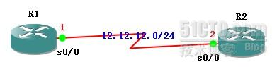
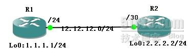
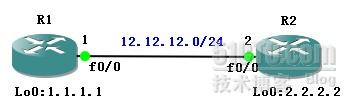
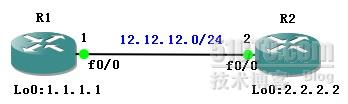
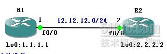

# OSPF无法建立邻居关系的几个案例

OSPF无法建立邻居关系的几个案例

2012年7月3日

16:01

OSPF是一个链路状态路由协议。路由器之间用Hello包来发现并建立完全的邻接关系之后，方能传递各自的链路状态信息，并依靠自己得到的这些信 息来创建Database，用SPF算法来计算出最佳路由。所以，OSPF路由器之间的邻接关系，是最基础的。下面就自己对OSPF实验中的一些无法建立 邻接关系的案例，作出一些解释和讨论，希望各位老师同学指正。

> 一、被动接口：Passive-Interface：（注：passive-interface在各种路由协议中的区别）
> 
> 
> 
> 
> 实验准备：
> 
> 1，R1和R2运行OSPF
> 
> 2，在R2上将S0/0配置为被动接口
> 
> 实验配置：
> 
> R1：
> 
> interface Loopback0
> 
> ip address 1.1.1.1 255.255.255.0
> 
> interface Serial0/0
> 
> ip address 12.12.12.1 255.255.255.0
> 
> router ospf 1
> 
> log-adjacency-changes
> 
> network 1.1.1.0 0.0.0.255 area 0
> 
> network 12.12.12.0 0.0.0.255 area 0
> 
> R2：
> 
> interface Loopback0
> 
> ip address 2.2.2.2 255.255.255.0
> 
> interface Serial0/0
> 
> ip address 12.12.12.2 255.255.255.0
> 
> clockrate 128000
> 
> router ospf 1
> 
> log-adjacency-changes
> 
> passive-interface Serial0/0    //配置被动接口
> 
> network 2.2.2.0 0.0.0.255 area 0
> 
> network 12.12.12.0 0.0.0.255 area 0
> 
> 实验结果:（clear ip ospf process）
> 
> 1，在R1上合R2上sh ip ospf database分别查看OSPF Databse:
> 
> R1#sh ip ospf da
> 
> OSPF Router with ID (1.1.1.1) (Process ID 100)
> 
> Router Link States (Area 0)
> 
> Link ID         ADV Router      Age         Seq#       Checksum Link count
> 
> 1.1.1.1         1.1.1.1         2           0x80000001 0x00228F 2
> 
> R2#sh ip ospf da
> 
> OSPF Router with ID (2.2.2.2) (Process ID 100)
> 
> Router Link States (Area 0)
> 
> Link ID         ADV Router      Age         Seq#       Checksum Link count
> 
> 2.2.2.2         2.2.2.2         12          0x80000001 0x00287D 2
> 
> 2，在R2上查看OSPF端口状态：
> 
> R2#sh ip ospf interface
> 
> Serial0/0 is up, line protocol is up ************************* *****************************No Hellos (Passive interface) //不发送Hello包（被动接口）
> 
> 3，在R2上debug：
> 
> R2#debug ip packet
> 
> - Mar 1 00:04:18.627: IP: s=12.12.12.1 (Serial0/0), d=224.0.0.5, len 80, rcvd 0
> 
> R2可以收到R1发往组播224.0.0.5的信息，但是并不接受，被动接口既不发送任何信息，也不会接受。
> 
> 实验说明：
> 
> R2的S0/0被配置为被动接口(passive-interface)，不发送和接收任何信息。
> 
> Cisco 命令手册：
> 
> For the Open Shortest Path First (OSPF) protocol, OSPF routing information is neither sent nor received through the specified router interface. The specified interface address appears as a stub network in the OSPF domain
> 
> 源文档 <[http://tools.cisco.com/Support/CLILookup/cltSearchAction.do](http://tools.cisco.com/Support/CLILookup/cltSearchAction.do)>
> 
> - ********************************************************************************************************
> 
> 二，广播链路上接口IP掩码不匹配
> 
> 
> 
> 实验配置：
> 
> 1，R1和R2运行OSPF
> 
> 2，两边接口掩码不匹配
> 
> 在R1的F0/0接口配置IP：
> 
> R1(config-if)#int f0/0
> 
> R1(config-if)#ip add 12.12.12.1 255.255.255.0          //掩码24位
> 
> R1(config-if)#no sh
> 
> 在R2的F0/0接口配置IP：
> 
> R2(config)#int f0/0
> 
> R2(config-if)#ip add 12.12.12.2 255.255.255.252    //掩码30位
> 
> 实验结果：
> 
> 1，R1与R2无法建立OSPF邻居关系
> 
> 2，在R1上debug ip ospf hello
> 
> R1#debug ip os hello
> 
> - Mar 1 00:07:57.431: OSPF: Rcv hello from 2.2.2.2 area 0 from FastEthernet0/0 12.12.12.2
> - Mar 1 00:07:57.431: OSPF: Mismatched hello parameters from 12.12.12.2
> - Mar 1 00:07:57.431: OSPF: Dead R 40 C 40, Hello R 10 C 10 Mask R 255.255.255.252 C 255.255.255.0
> 
> 可以发现：R1在收到R2发送来的Hello包后，由于掩码不匹配，所以无法建立邻接关系。
> 
> - *******************************************************************************************************
> 
> 三，Helo时间不匹配
> 
> 
> 
> 实验准备：
> 
> 1，R1与R2运行OSPF
> 
> 2，R2上修改Hello时间
> 
> 实验配置：
> 
> R1：
> 
> R1(config)#int lo 0
> 
> R1(config-if)#ip add 1.1.1.1 255.255.255.0
> 
> R1(config-if)#int f0/0
> 
> R1(config-if)#ip add 12.12.12.1 255.255.255.0
> 
> R1(config-if)#no sh
> 
> R1(config)#router ospf 10
> 
> R1(config-router)#router-id 1.1.1.1
> 
> R1(config-router)#log
> 
> R1(config-router)#net 1.1.1.0 0.0.0.255 area 0
> 
> R1(config-router)#net 12.12.12.0 0.0.0.255 area 0
> 
> R1(config-router)#exit
> 
> R2：
> 
> R2(config)#int lo0
> 
> R2(config-if)#ip add 2.2.2.2 255.255.255.0
> 
> R2(config-if)#int f0/0
> 
> R2(config-if)#ip add 12.12.12.2 255.255.255.0
> 
> R2(config-if)#ip ospf hello-interval 20                  //修改R2的F0/0的OSPF的Hello包间隔时间为20秒
> 
> R2(config-if)#no sh
> 
> R2(config-if)#exit
> 
> R2(config)#router ospf 10
> 
> R2(config-router)#router-id 2.2.2.2
> 
> R2(config-router)#log
> 
> R2(config-router)#net 2.2.2.0 0.0.0.255 area 0
> 
> R2(config-router)#net 12.12.12.0 0.0.0.255 area 0
> 
> R2(config-router)#exit
> 
> 实验结果：
> 
> R1与R2的OSPF邻居关系Down掉。
> 
> 在R1上debug ip ospf hello
> 
> R1#debug ip ospf hello
> 
> - Mar 1 00:09:19.083: OSPF: Rcv hello from 2.2.2.2 area 0 from FastEthernet0/0 12.12.12.2
> - Mar 1 00:09:19.083: OSPF: Mismatched hello parameters from 12.12.12.2
> - Mar 1 00:09:19.087: OSPF: Dead R 80 C 40, Hello R 20 C 10 Mask R 255.255.255.0 C 255.255.255.0
> 
> Hello时间不匹配
> 
> 在R2上查看OSPF接口状态：
> 
> R2#sh ip ospf int f0/0
> 
> FastEthernet0/0 is up, line protocol is up ********************************************
> 
> Timer intervals configured, Hello 20, Dead 80, Wait 80
> 
> 说明：
> 
> 1、如果修改了hello时间，则dead时间和wait时间会自动修改成修改参数的4倍。
> 
> 2、如果修改dead时间或者wait时间， hello时间不发生变化，而wait时间发生变化。
> 
> 3、不能修改wait时间。
> 
> - *******************************************************************************************************
> 
> 四，Secondary地址：
> 
> 
> 
> 实验准备：
> 
> 1，R1与R2运行OSPF协议
> 
> 2，R2的F0/0接口IP：12.12.12.2/24配置为第二地址
> 
> 实验配置：
> 
> R1：
> 
> interface Loopback0
> 
> ip address 1.1.1.1 255.255.255.0
> 
> !
> 
> interface FastEthernet0/0
> 
> ip address 12.12.12.1 255.255.255.0
> 
> duplex auto
> 
> speed auto
> 
> !
> 
> router ospf 100
> 
> router-id 1.1.1.1
> 
> log-adjacency-changes
> 
> network 1.1.1.0 0.0.0.255 area 0
> 
> network 12.12.12.0 0.0.0.255 area 0
> 
> R2:
> 
> interface Loopback0
> 
> ip address 2.2.2.2 255.255.255.0
> 
> !
> 
> interface FastEthernet0/0
> 
> ip address 12.12.12.2 255.255.255.0 secondary     //将12.12.12.2 配置为secondary地址
> 
> ip address 10.10.10.10 255.255.255.0
> 
> duplex auto
> 
> speed auto
> 
> !
> 
> router ospf 100
> 
> router-id 2.2.2.2
> 
> log-adjacency-changes
> 
> network 2.2.2.0 0.0.0.255 area 0
> 
> network 10.10.10.0 0.0.0.255 area 0
> 
> network 12.12.12.0 0.0.0.255 area 0
> 
> 实验结果：
> 
> R1与R2无法建立OSPF邻接关系
> 
> 在R2上debug ip ospf hello
> 
> R2#debug ip ospf hello
> 
> R2#
> 
> - Mar 1 00:19:10.623: OSPF: Send hello to 224.0.0.5 area 0 on FastEthernet0/0 from 10.10.10.10
> 
> R2#
> 
> - Mar 1 00:19:20.623: OSPF: Send hello to 224.0.0.5 area 0 on FastEthernet0/0 from 10.10.10.10
> 
> R2#
> 
> - Mar 1 00:19:30.623: OSPF: Send hello to 224.0.0.5 area 0 on FastEthernet0/0 from 10.10.10.10
> 
> 可以发现：虽然已经将12.12.12.0/24宣告到ospf 100，但是由于12.12.12.2为secondary addreass，所以R2只会从10.10.10.10发送Hello包到224.0.0.5
> 
> 在R1上debug OSPF Hello包和Adj
> 
> R1#debug ip ospf hello
> 
> R1#debug ip ospf adj
> 
> R1#
> 
> - Mar 1 00:22:35.031: OSPF: Send hello to 224.0.0.5 area 0 on FastEthernet0/0 from 12.12.12.1
> 
> R1#
> 
> - Mar 1 00:22:41.015: OSPF: Rcv pkt from 10.10.10.10, FastEthernet0/0, area 0.0.0.0 : src not on the same network
> 
> 可以发现：R1收到了R2发送到224.0.0.5的packet，但是由于not on the same netword，所以无法建立邻接关系。
> 
> - *******************************************************************************************************
> 
> 五，两边Router ID相同：
> 
> 
> 
> 实验准备
> 
> 1，R1与R2运行OSPF
> 
> 2，将R1与R2的router-id均设置为3.3.3.3
> 
> 实验配置：
> 
> R1：
> 
> interface Loopback0
> 
> ip address 1.1.1.1 255.255.255.0
> 
> !
> 
> interface FastEthernet0/0
> 
> ip address 12.12.12.1 255.255.255.0
> 
> duplex auto
> 
> speed auto
> 
> !
> 
> router ospf 100
> 
> router-id 3.3.3.3
> 
> log-adjacency-changes
> 
> network 1.1.1.0 0.0.0.255 area 0
> 
> network 12.12.12.0 0.0.0.255 area 0
> 
> R2:
> 
> interface Loopback0
> 
> ip address 2.2.2.2 255.255.255.0
> 
> !
> 
> interface FastEthernet0/0
> 
> ip address 12.12.12.2 255.255.255.0
> 
> duplex auto
> 
> speed auto
> 
> !
> 
> router ospf 100
> 
> router-id 3.3.3.3
> 
> log-adjacency-changes
> 
> network 2.2.2.0 0.0.0.255 area 0
> 
> network 12.12.12.0 0.0.0.255 area 0
> 
> 实验结果：
> 
> R1与R2无法建立OSPF邻接关系。
> 
> 在R1上debug ip ospf hello；debug ip ospf packet； debug ip ospf adj
> 
> R1#
> 
> - Mar 1 00:33:34.139: %OSPF-4-DUP_RTRID_NBR: OSPF detected duplicate router-id 3.3.3.3 from 12.12.12.2 on interface FastEthernet0/0
> 
> 提示：发现一样的router-id
>