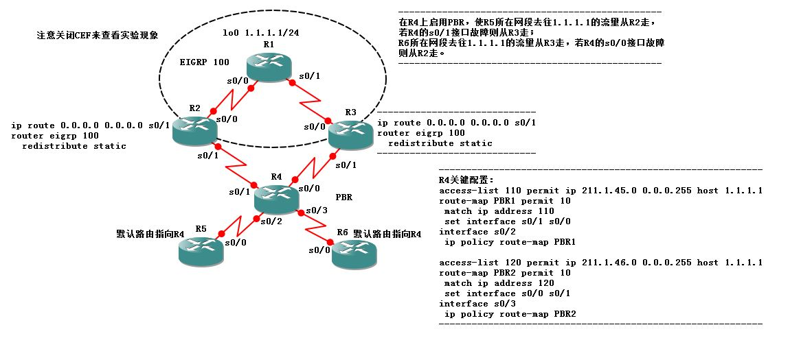
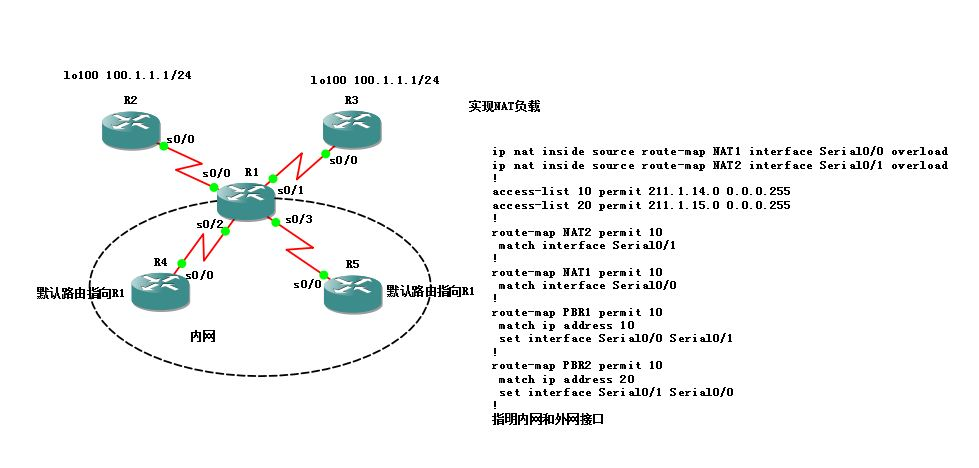

# PBR

PBR

2011年6月21日

15:29

PBR 是配置在接口处的，且只会对入站数据包有影响。

在PBR中，没有被route-map匹配到的流量，会被正常路由出去。

debug ip packet 10 //开启对ACL 10的IP包调试

Debug ip policy

强制检测下一跳是否可达。

set ip next-hop verify-availability //应用于route-map下面

强制本地数据使用策略路由，让策略对本地产生数据包生效

ip local policy route-map

如果是想让本地流量被丢掉的话，就set interface null 0

如果route-map是用标准ACL匹配敏感数据流的话，匹配的是源地址。

如果set interface 命令后面写两个接口的话，则只当第一个接口出现故障才会走第二个接口，否则流量都从第一个接口走。

注意如果ping的时候不指定源接口，本地路由器会先查路由表找出相应路由条目的出接口，然后使用出接口地址作为源地址，然后再执行PBR的策略。

for example：

interface f0/0

> ip add 1.1.1.1 255.255.255.0
> 
> 
> ip policy route-map PBR
> 

ip local policy route-map PBR

access-list 120 permit ip any 172.16.1.0 0.0.0.255

access-list 120 permit ospf any any

Access-list 10 permit 10.1.1.0 0.0.0.255

route-map PBR permit 10

match ip address 10 //基于源地址的路由

set interface s0/0

route-map PBR permit 20

> match ip address 120
> 
> 
> Set interface s0/1 s0/0 //此处写两个接口则当第一个接口没有故障时流量都走第一个接口，第一个接口故障时走第二个接口，即备份作用。
> 

route-map PBR permit 30

> match length 1000 1600
> 
> 
> set ip next-hop 172.16.2.1
> 

route-map PBR permit 40

> match length 0 400
> 
> 
> set ip next-hop 172.16.3.1
> 

多归属ISP问题（多出口负载+备份问题）

<<PBR负载实验.jpg>>

<<PBR负载实验.net>>

NAT多归属问题（NAT多出口负载问题）

<<NAT负载实验.jpg>>

<<NAT负载实验.net>>