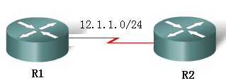
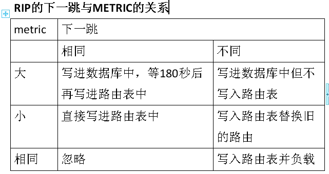
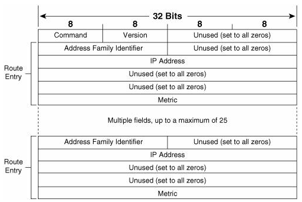
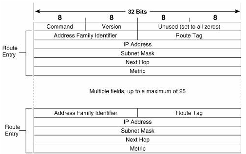
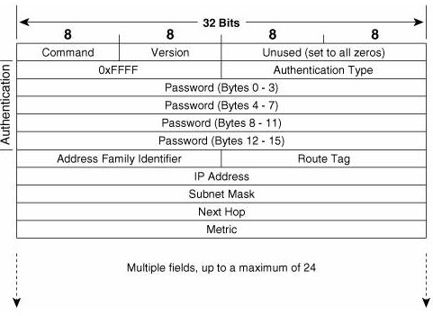
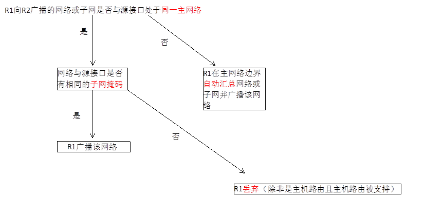
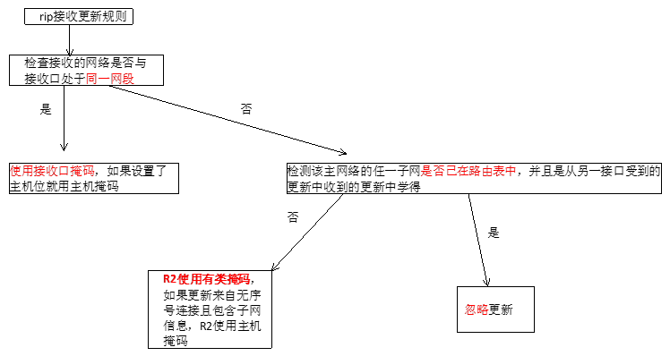
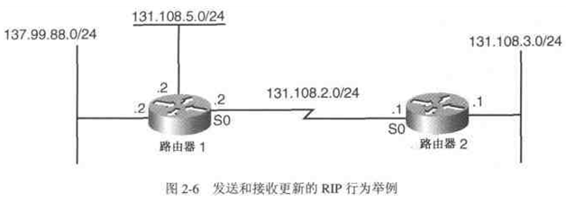

# RIP

RIP理论

2011年6月21日

15:05

**理论部分**

RIP：Routing Information Protocol路由信息协议

RIP工作的基本流程：

1 开始时，RIP从每个启用RIP协议的接口广播出带有request的数据包。接着，RIP进程进入循环状态，不断侦听其他路由器的RIP request和response消息，同时接收到request消息的路由器回应包含其路由表的response消息。

2 当发出request消息的路由器收到response消息后，将开始处理附加在response消息中的路由更新信息：

（1）若路由更新中的条目是新的，则将新的路由连同通告路由器的地址一起加入到自己的路由表中。

（2）若学到的路由已经在路由表中：

#有更小跳数时替换原来存在的路由条目

#如果路由更新通告的跳数大于路由表已记录的跳数，并且更新来自于已记录条目的下一跳路由器，则该路由在holddown period内被标记为不可达。若holddown timer超时后，同一台路由器仍然通告这个较大跳数的路由，则接受该新的度量值。

**RIP的基本常识：**

1.RIP是距离矢量路由协议

2.RIP使用UDP 520：源目端口都是UDP 520

3.RIP的管理距离是120

4.RIP以跳数（hop）作为度量值（metric）

**关于RIP的防环机制**

1.水平分割-----切断两台路由器之间的环路

2.最大跳数----切断网络中的环路

3.抑制计时器

**关于水平分割**

水平分割分为：

1.简单水平分割：从接口收到的路由条目，不再从本接口发出

口诀：你告诉我的，我不告诉你

2.带毒性逆转的水平分割:从接口收到的路由条目，会从本接口发出，但是标记为不可达

口诀：坏消息总比没消息好

带毒性逆转的水平分割的好处：说明我发出的路由条目，对方已经收到了（不然怎么又传回来了）

**关于RIP使用的计时器**

1.更新计时器（update）：30秒。异步更新25-35秒，思科的是25.5-30秒

2.无效计时器（invalid）：180秒

3.抑制计时器（holddown）：180秒

4.刷新计时器（flush）：240秒

Update timer（30S）

随机变量是更新周期的15%，即4.5S　（25.5S-30S)

version 1 broadcast 、version 2 组播地址224.0.0.9

invalid timer（180s）：当有一条新的路由被建立，超时计时器就会被初始化为180s，而每当接收到这条路由的更新消息时，超时计时器又将被重置成计时器的初始化值即180s，如果一条路由的更新在180s（6个更新周期）内还没收到，那么这条路由的跳数变成16，也就是标记为不可达的路由。

flush timer（240s）：从路由条目建立开始计时即与invalid timer同时开使计时，时间为240s。如果flush timer也超时了，则该路由将被通告为一条度量值不可达的路由，同时从路由表中删除。

holddown timer（180s）：在RFC文档中没有定义，在运行RIP的Cisco设备上启用了该计时器，路由器如果在相同的接口上收到某个路由条目的距离比原先收到的距离大，那么将会引起路由进入180s的抑制状态阶段（invalid timer超时后路由跳数为16跳，所以当invalid timer超时后该计时器立即启动）。 在抑制计时器的时间内该目的标记为不可到达，并且向外发送毒性路由，直到计时器超时，路由器才可以接受有关此路由的更新信息。

Holddown timer的原理是引用一个怀疑量，不管是真的还是假的路由消息，路由器先认为是假消息来避免路由环路。如果在抑制计时器超时后还接受到该消息，那么这时路由器就认为该消息时真的。RIP中认为假的消息总是真不了，不长久。hold down 的存在理由就是为了使得全网的毒化路由接收一致,防止路由环路 (holddown time 要保证毒化路由传遍整个网络）

**关于抑制计时器**

口诀：只信好消息，坏消息等等再说（等180秒）

实验：关于无效计时器和刷新计时器

实验目的：看到路由表中的possibly down

实验拓扑：

实验过程：

R1的环回口loopback0：1.1.1.1/24

R2的环回口loopback0：2.2.2.2/24

都加入到RIP中

在R2中配置ACL：access-list 110 deny UDP any eq 520 any eq 520，挂到R2的接口下

将R1的loopback0接口shutdown，然后在R2的路由表中看路由条目

180秒左右将会看到possibly down，240秒左右会消失

还有一种做法：

将R1的s1/1接口passive掉

**关于RIP的消息类型**

1.请求消息（Request Messages）：要求邻居路由器发送更新消息

2.应答消息（Response Messages）：包含更新消息

当RIP刚启动起来的时候，路由器从所有接口发送一个请求消息，其他路由器会发送一个应答消息。当启动以后，RIP定期的发送应答消息

**关于RIP的有2个版本**

关于RIPv1

1.有类路由协议

2.不支持VLSM

3.广播更新（255.255.255.255）

4.自动汇总，不支持手动汇总

5.不支持验证

关于RIPv2

1.无类路由协议

2.支持VLSM

3.组播更新（224.0.0.9,TTL=1）

4.支持手动汇总

5.支持验证

组播发送的意义：

以太网具有广播属性，一个节点发送的数据包会被以太网泛洪，导致每一个以太网网卡接口都会收到这个数据包。接口收到数据包后，并不马上交给节点CPU处理，而是进行MAC地址比较，如果数据包的目的MAC地址和接口的MAC地址一样，它才接受，把数据包交给计算机，否则就把数据包丢弃。组群成员的网卡接口除了硬件MAC地址 (unicast MAC)，还有组播MAC地址 (multicast MAC)。接口收到组播包，会把此包的目的MAC地址 （是个组播MAC）和自己的MAC地址比较，如果组播地址相同，就会接受此包。这样，局网内这个组群的所有成员，都会收到送往该组群的组播包。

RIP：周期性发送整个路由表

关键字：周期性，整个

**RIPv1的包头格式**

Command

1：表示Request

2：表示Response

Version：1

Address Family Identifier：对于IP设置成2

一个例外：就是当此消息是请求全部路由条目的Request消息时

IP Address：表示的是网段

Metric：1-16之间

注意：最多一个消息可以有25个路由条目，因此消息的大小最多为4+25*20=**504**，再加上UDP的8个字节头，此时就有512字节

RIP的包： 帧头 | IP头 | UDP头 | RIP消息 | 帧尾

**对于RIP的请求消息**

1.请求全部路由表-------在进程开启的时候发出

Address Family Identifier设置成0，IP Address设置成0.0.0.0，Metric设置成16

当收到此请求消息后的路由器将使用单播回复

2.请求特定路由条目-------用于一些诊断程序

IP Address设置成要请求的路由条目

当收到此请求消息后的路由器将查询自己的路由表，如果有，Metric设置成路由表中的Metric值，如果没有，就以Metric值16回复

**RIPv2的包头格式**

Command

1：表示Request

2：表示Response

Version：2

Address Family Identifier：对于IP设置成2

一个例外：就是当此消息是请求全部路由条目是的Request消息时

Route Tag：新增的，16个比特

IP Address：表示的是网段

Subnet Mask：新增的，子网掩码

Next Hop：新增的，在多路访问网络中会自动更改，也可以手工设置

Metric：1-16之间

注意：在没有认证的情况下，最多一个消息可以有25个路由条目，因此消息的大小最多为4+25*20=**504**，再加上UDP的8个字节头，此时就有512字节

**RIPv2加认证后的包头格式**

如果是明文认证，会占用第一个路由条目的位置做认证信息，注意此时Address Family Identifier位置设置成了0xFFFF，Authentication Type设置成0x0002。所以此时最大可以包含的路由条目是24

如果是MD5认证，会占用第一个和最后一个路由条目的位置做认证信息，注意此时Address Family Identifier位置设置成了0xFFFF，Authentication Type设置成0x0003。所以此时最大可以包含的路由条目是23

**关于MD5**：MD5是一种单向散列算法，由RSA数据安全公司设计出来。产生的散列128bit。

口诀：不同输入，不同输出；变长输入，定长输出

**关于有类路由协议和无类路由协议**

在发送路由条目时是否发送子网掩码，如果不发送就是有类路由协议，如果发送就是无类路由协议

**关于有类路由查找和无类路由查找**

有类路由查找分两步，首先找主类网络，然后在主类网络中的子网中查找

无类路由查找分一步，就是最长匹配原则，命令ip classless就是使无类路由查找的命令

**关于RIPv1的发送和接收原则**

发送原则：

1.如果两边在同一主类网络，且同一子网掩码，则发送的是子网

2.如果两边在同一主类网络，且不同掩码，则不发

3.如果两边在不同主类网络，则发送主网络

接收原则：

1.如果接收的路由条目和接收的接口在同一主网络，则使用接口的掩码作为路由的掩码

2.如果接收的路由条目和接收的接口不在同一主网络，且该网络的子网在路由表中（从其他接口学习到的），则丢弃该路由

3.如果接收的路由条目和接收的接口不在同一主网络，且该网络的子网不再路由表中，则使用有类掩码

RIPv1发送更新规则：

**RIP接收更新规则**

**案例**：

需求：分析一下路由器一的发送过程和路由器二的接收过程？

分析：路由器一发送： 131.108.5.0 和 137.99.0.0

路由器二接收： 把路由条目131.108.5.0/24和137.99.0.0/16写入路由表