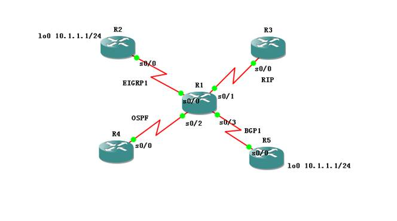
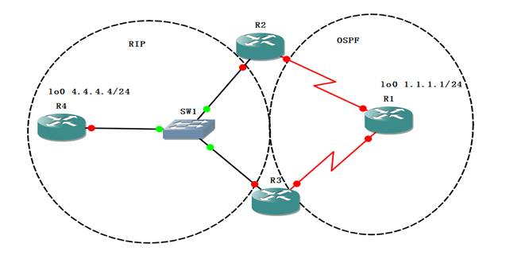

# Redistribute

Redistribute

2011年6月21日

15:26

本课程大纲：

1.为什么要重分发？

2.如何重分发？

3.几个重要的命令：passive-interface，distribute-list，route-map，distance，**D**HCP

路由重分布：将一种路由选择协议获悉的网络告知另一种路由选择协议，以便网络中每台工作站能到达其他的任何一台工作站，这一过程被称为重分布。

**重分布原则：路由必须位于路由选择表中才能被重分发**

**在重分发时设定种子metric**

**协议 Seed Metric**

**RIP 无限大 必须手工指定**

**（直连和静态路由重分布近来默认是1，直连路由不受种子metric设定的影响，静态路由会变成非无限大的种子metric值）**

**EIGRP 无限大 也必须手工指定**

**OSPF 20 如果重分布进来的是BGP的话，Metric是1，这是个特例**

**IS-IS 0**

**BGP 携带原来的Metric值**

**R1(config-router)#default-metric 1 使用此命令来设定种子metric值**

从无类别路由器向有类别路由器重分发协议的时候，仅在掩码相同的接口通告。

为什么要重分发？

1.重分发进RIP

命令：redistribute 【其他路由协议】 metric 1

**R1(config-router)#redistribute static （可不加Metric，默认＝1）**

**重分布进RIP时注意，必须指定度量值，或者用default-metric命令设置种子度量值（RIP默认种子度量值无限大），只有重分布静态时不用制定metric值。如果同时用metric和default-metric命令指定度量值，则metric优先。**

2.重分发进OSPF

默认Metric值为20，默认类型是O E2，默认情况下子网不通告

命令：redistribute 【其他路由协议】 subnets

3.重分发进EIGRP

重分发以后的管理距离是170

命令：redistribute 【其他路由协议】 metric 1000 100 255 1 1500

**R1(config-router)#redistribute connected （不加Metric也可）**

**(根据直连接口的不同计算Metric)**

**R1(config-router)#redistribute static （不加Metric也可）**

**(根据下一跳接口计算Metric）**

4.重分发进IS-IS

默认属于Level 2，默认Metric值为0

命令：redistribute 【其他路由协议】

注意：BGP重分布进IGP时会造成些问题，原则上不推荐这样做。晚些版本的IOS默认只允许EBGP学习到的路由重分布IGP，不允许IBGP学习到的路由重分布，手工允许命令：r1(config-router)#bgp redistribute-internal

1.在 R1上将 EIGRP学习到的路由重分布进 RIP，要求不指定metric值，不能成功

2.修改 RIP重分布时的默认Metric值为8

3.手工指定EIGRP重分布进RIP时的Metric值为2

4.重分布 EIGRP进OSPF，比较不加subnets和加了的区别(不加subnets默认时重分布不进来，因为R1上没有10.0.0.0路由，只有子网路由)

5.将OE 2 改为OE 1

6.重分布BGP进OSPF(bgp redistribute-internal)

7.修改重分布进OSPF时的默认Metric值为30

8.重分布OSPF进 EIGRP，不加metric，能成功吗？不成功的话用一条路由进程下的命令解决。

9.重分布直连路由进EIGRP时使用Route-MAP，且只允许s0/3

10.重分布直连路由进EIGRP时使用Route-MAP，且只不允许s0/3

11.在 R1连接 R3的接口上配置PBR。使任何去往10.1.1.1/32的流量都被强制发送到R5。

12.一条命令配置PBR对 R1自己产生的流量也有效

注意如果ping的时候不指定源接口，本地路由器会先查路由表找出相应路由条目的出接口，然后使用出接口地址作为源地址，然后再执行PBR的策略。

13.R3上开启lo100，100.1.1.1/24,当RIP重分布进OSPF时，分别用distribute-list、route-map过滤该路由

不过滤该路由，但是从R3走时将该路由的AD值改为109。

双点双向重分布的问题解决之道：

1 分发列表过滤

（1）本地过滤，方向in

（2）间接过滤，方向out

2 修改管理距离

OSPF的管理距离可以针对外部、域间、域内分别更改一个值

3 Route-map 过滤

（1）直接过滤(应用于distribute-list)

（2）打tag过滤

关于命令passive-interface

解释：用来禁止接口发送组播

补充：passive-interface default

关于命令distribute-list

解释：传说中的分发列表，用来过滤路由条目，各种路由协议都有

关于命令route-map

解释：传说中的路由图，在IGP的重分发的时候可以挂，在BGP中更加常用

route-map的3个作用：

1.用来做过滤，相当于distribute-list

2.用来做操作，如：修改metric值等

3.用来做选择

关于route-map做过滤的实验：

关于route-map做操作的实验：

关于命令distance

解释：用来更改管理距离，各种协议都有

注意点：

1.距离矢量路由协议和链路状态路由协议的用法不同

2.管理距离的修改只是在本地有效

<<双点双向重分布.net>>

<<重分布小实验.net>>