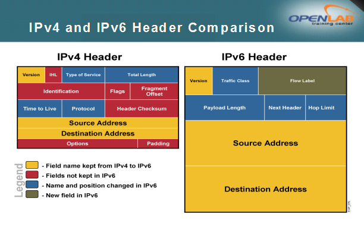
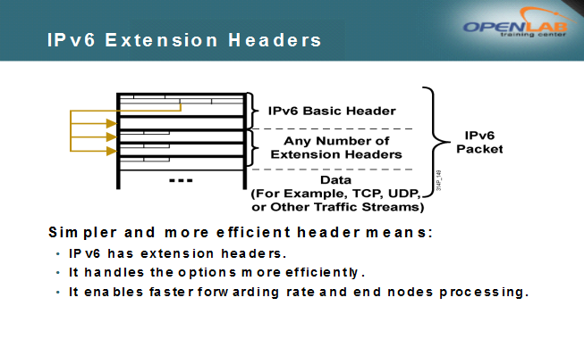
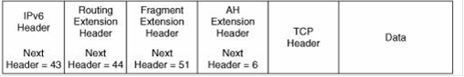

# IPv6基础

IPv6基础

2011年6月27日

15:50

**为什么要部署ipv6？**

**最主要的原因是ipv4地址不够用了，所以开发ipv6**

**ipv4当中用什么技术来解决IP地址不够用的问题，一个是NAT，一个是可变长子网掩码（VLSM）**

**使用NAT等技术破坏了端到端的设计原则**

**长期发展不利，最主要的就是IPv4网络的路由碎片化**

**而开发出的ipv6带来的额外的好处是：**

**1.安全性，因为ipv6自带了AH或ESP（扩展包头）**

**2.移动性**

**3.包头简单，效率高**

**4.自动配置**

**地址充足：IPv6产生的初衷主要是针对IPv4地址短缺问题，即从IPv4的32bit地址，扩展到了IPv6的128bit地址，充分解决了地址匮乏问题。同时是有范围的，包括链路本地地址、站点本地地址和任意传播地址，这也进一步增加了地址应用的扩展性。**

**简单是美：通过简化固定的包头、采用64比特边界定位、取消IP头的校验和域等措施，以提高对IP报文的处理效率。**

**扩展为先：引入灵活的扩展报头，按照不同协议要求增加扩展头种类，按照处理顺序合理安排扩展头的顺序，其中网络设备需要处理的扩展头在报文头的前部，而需要宿端处理的扩展头在报文头的尾部。**

**层次区划：IPv6极大的地址空间使层次性的地址规划成为可能，同时国际标准中已经规定了各个类型地址的层次结构，这样既便于路由的快速查找，也有利于路由聚合，缩减IPv6路由表大小，降低规划的难度。**

**即插即用：IPv6引入自动以及重配置技术，对于等实现自动增删更新配置，提高IPv6的易管理性。**

**贴身安全：IPv6集成了，用于网络层的认证与加密，为用户提供端到端安全，使用起来比IPv4简单、方便，可以在迁移到IPv6时同步发展IPSec。**

**关于ipv6的基础知识：**

**1.长度是128位，ipv4是32位**

**关于IPv4和IPv6包头的对比**

**3.关于IPv6包头**

**Version（版本）：该字段占4位，且是6**

**Traffic Class（流量类别）：该字段占8位，相当于IPv4中的Type of Service(服务类型)，用于做QoS**

**Flow Label（流标签）：该字段占20位，用来标记IPv6数据包的一个流，IETF文档没有定义细节，说白了就是同样的流打相同的标签**

**Payload Length（有效负载长度）：该字段占16位，相当于IPv4中的总长度减去头长度**

**Next Header（下一跳报头）：该字段占8位，相当于IPv4中的Protocol ID字段，表示上层是TCP或者UDP，或者是一个新增的可选项扩展包头**

**Hop Limit（跳数限制）：该字段占8位，相当于IPv4中的TTL字段**

**Source Address（源地址）：该字段占128位**

**Destination Address（目标地址）：该字段占128位**

**注意：**

**IPv6中没有头部校验和字段，原因是数据链路层有校验和（CRC校验），所以不需要了。**

**关于扩展包头**

**1.扩展包头的好处：IPv6提供了能够更有效地处理选项的扩展包头，这有助于提高转发速度，并让终端节点能够更快地处理分组，可以增加各种功能**

**2.6大扩展包头，这6大扩展包头的顺序如下：**

**（1）Hop-By-Hop Options（逐跳选项扩展包头）：Next Header=0，该包头用于路由器提示（router alert）和组播侦听者发现（Multicast Listener Discovery，MLD）。**

**路由器警告选项（选项类型为5），提醒路由器分组内容需要做特殊处理。路由器警告选项用于组播收听者发现和RSVP（资源预定）协议。**

**（2）Destination Options（目标选项扩展包头）：Next Header=60，有两种情况，如果该包头紧跟在逐跳选项包头的后面，那么最终目标节点和路由选择扩展包头中指定的每个目标节点都会查看，如果该包头紧跟在ESP包头的后面，只有最终目标节点对其进行处理。该包头的另一种用途是Mobile IPv6**

**（3）Routing（路由选择扩展包头）：Next Header=43，该包头用于源路由选择和Mobile IPv6。**

**（4）Fragment（分段扩展包头）：Next Header=44，该包头完成IPv4中第二行那三个字段的功能**

**（5）Authentication（认证扩展包头，包括AH和ESP）：Next Header=51或50，用于提供分组的认证，完整性和机密性**

**（6）Upper-Layer（上层扩展包头，包括TCP和UDP）：Next Header=6或17，也就是第4层的东西**

常用Next Header字段值表

[Untitled](IPv6基础/Untitled%20Database%209f20becc56264446a22d6a75e73f5b63.csv)

**例子：**

**注意：**

**只有逐跳选项扩展包头才是每个节点都是必须查看的，其他的包头只有目标节点才会查看**

**关于MTU发现**

**在IPv4中，如果分组过大，由路由器执行分段操作，这非常的不好**

**在IPv6中，有所改进。分组与分段都是有主机来完成，即在一个会话中，发送分组以前，源主机会探测以下路径中最佳MTU，**

**在发现过程中，不断的改变MTU的大小，最终得到最佳的MTU，**

**这个过程就是MTU发现**

**可以说，MTU发现是IPv6的一个特色**