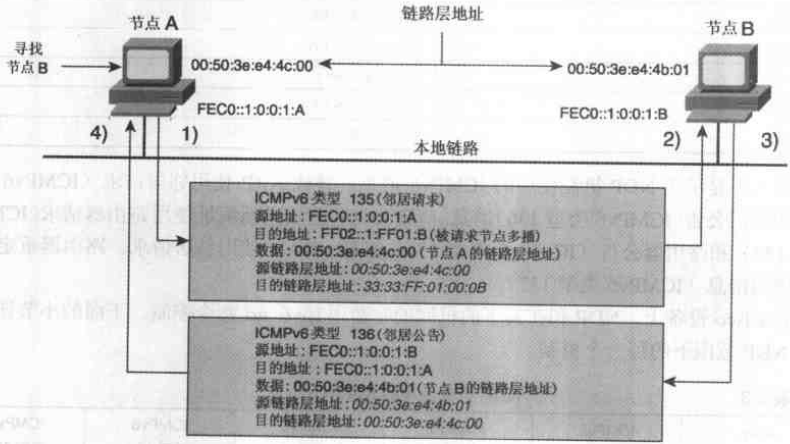

# IPv6笔记

IPv6笔记

2012年12月3日

9:43

IPv6比IPv4的改进：

128bit的地址空间，地址足够

多级层次有助于路由聚合

自动配置过程允许IPv6网络中的节点配置自己的IPv6地址

重新编址机制使得IPv6提供商之间的转换对最终用户是透明的

ARP广播被本地链路的组播替代

IPv6的包头比IPv4的包头更有效率，字段更少，去掉了包头的检验和

流标记字段可以提供流量区分

新的扩展包头替代了IPv4的包头的选项字段，并且提供了更多的灵活性

更安全，更有效处理移动性

设计了许多过渡机制

编址层次等级

多重地址的概念隐含说明一个节点的每个网口可同时有多个全球唯一单播地址。发起数据时源地址选择是一个机制，节点能够选择或者强制选用一个IPv6地址。

自动配置

自动配置在RFC2462中定义，又被称为IPv6无状态地址自动配置。路由器通过RA消息公告一个IPv6路由前缀，然后主机使用EUI-64格式附加在前缀后面以配置成完整的IPv6地址。自动配置即插即用。

注1：配给本地链路的IPv6前缀长度是64bit，低64bit部分是接口的MAC地址。用这个概念，IPv6简化了网络中子网的编址，使用相同长度的前缀而不是像IPv4中使用不同的网络掩码。

注2：由于MAC地址可以被软件修改，所以IPv6的协议栈有检测重复地址的机制，叫做DAD(重复地址检测)

注3：除了手工配置之外的地址配置方式：

（1）有状态的地址自动配置是指由DHCP服务器统一管理，客户端从DHCP服务器的地址池中拿到IPv6地址和其他信息（例如DNS等）

（2）无状态地址自动配置是指不需要DHCP服务器进行管理，客户端根据网络RA（路由通告）并根据自己的MAC地址计算出自己的IPv6地址。他们一般使用DHCP服务器来获取DNS服务器的地址。

（3）还有一种地址配置方式，是允许节点产生一个随机的接口标识，用作地址的低64bit，增加这种方式是为了保护隐私。

重新编址

当企业在遇到需要切换运营商时，对于在IPv4的环境来说，切换换需要很长时间的宕机。因为所有的节点都需要重新编址。并且路由协议和DNS服务器还需要用新的地址进行更新。

在IPv6中重新编址变的稳定，因为单播IPv6提供商之间的转换对最终用户完全透明。无状态自动配置机制让主机改换地址变得很容易。但，和IPv4一样，路由器重新编址为网络运营商带来了负担，可以为公告的前缀赋予一个生存期的值，在当前的前缀到期后允许节点使用最新的前缀。

注1：路由器不能用自动配置机制配置它的网络接口，必须手工指定。而且路由器上接口上还有**link-local地址**，这个**保证了路由器能够在重新编址期间也能够被访问。**

**其实，link-local地址的设计目的就是由于一个网口可以有多个IPv6地址，而唯一不变的就是link-local地址，这样对于指定路由的下一跳，和网络重新编址时都可以不影响本地数据的传输。**

**实际上在IOS上，ipv6 address这个命令可以打多次，同时生效。过个ipv6地址可以在重新编址过程中起到大作用。**

注2：重新编址不能防止TCP/UDP 连接丢失。

~较少的IPv6包头字段和固定的长度意味着路由器转发IPv6数据包耗费较少的CPU周期，有益于网络性能。

~IPv4中，有一个16bit字段用来验证包头的完整性，但是每一个节点都重新计算，很耗损性能。在IPv6中，这个选项被取消了，因为二层和四层都有校验和，足够强壮，这个选项没用。所以在IPv6中，UDP必须使用校验和。

IPv4向IPv6过渡机制

IPv4网络上的双协议栈节点

IPv4网络上的IPv6但协议网络节点孤岛

能与IPv6网络通信的IPv4单协议网络节点

能与IPv4网络通信的IPv6单协议网络节点

包头变化：

（1）去掉的字段：

包头长度/标识/标志/分段偏移/包头校验和/选项和填充

注：IPv6机制中，中间路由器不再处理分段的事情，而只在产生数据包的源节点处理分段。推荐每个IPv6节点使用路径MTU发现机制（PMTUD）以避免分段

（2）新增加的字段：

流标签（20bit），用来标记IPv6数据包的一个流，

（3）IPv4包含12个字段，IPv6包含8个字段，IPv6包头有40字节的固定长度

~虽然在IPv6的包头中，有效载荷长度字段也是16bit，意即最大65535个字节，但是却可以在逐跳选项包头中应用一个32bit字段，举行数据包理论上可以有4294967259个字节的最大长度。

几个扩展包头：

（1）逐跳选项包头（协议0）：所有经过的节点都读取并处理，例子：RSVP

源节点使用扩展包头向目的节点发送IPv6数据包时，发送路径上的中间路由器不能扫描和处理扩展包头。**但**如果数据包发往一个特定的目的地，要求发送路径上的中间路由器进行特殊处理时，可以使用**逐跳选项包**头内的**路由器警报特性**。

（2）目的选项包头（协议60）给移动IPv6使用

（3）路由包头（协议43）：类似于IPv4的松散源路由选项，用来强制数据包经过特定的路由器

（4）分段包头（协议44）：节点将数据包分段，使用分段包头发送每个分段。

注：IPv6不期望使用分段，建议所有阶段使用PMTUD机制。如非要发送分段不可，由源节点执行分段。（IPv4中既可以由源节点执行，也可以由中间路由器执行分段）

（5）认证包头（协议51）：AH，由IPSec使用

（6）封装安全有效载荷包头（协议50）：ESP，由IPSec使用

**注：**IPv6数据包中使用**多个扩展包头**时，必须按照上述**顺序**添加。目的节点在处理包含几个扩展包头的数据包时，必须严格按照它们在IPv6数据包中出现的顺序进行处理。

MTU

IPv4上最小的MTU是68字节

IPv6上最小的MTU是1280字节

最小支持的数据报长度：经IP处理的IP层组装之后的数据报尺寸

IPv6最小支持数据报长度：1500字节

IPv4最小支持数据报长度：576字节

PMTUD

PMTUD由源节点启动，允许它们发现传送路径上的最小MTU值

IPv6地址

8个16bit十六进制数字组成

IPv6地址表示中最多允许出现一次::

注：含有IPv6的URL，IPv6地址必须被**方括号**括起来。

在IPv6中唯一可接受表示掩码的方式，是CIDR表示法，即/xx这样。

注：IPv6**没有广播或者网络保留地址**，即主机位为全0或者全1的地址不是特殊地址。

IPv6地址类型：单播，多播，任意播

单播：本地链路地址，本地站点地址，可聚合全球地址，回环地址，未指定地址，IPv4兼容地址

任意播：可聚合全球地址，本地站点地址，本地链路地址

多播：指定地址，请求节点地址

IPv6寻址结构中的地址类型：

单播地址：

（1）本地链路地址：有效范围是本地链路的节点之间使用，NDP协议就使用到了本地链路地址。每个启动的接口会自动配置一个link-local地址，FE80::/10为前缀，EUI-64格式补全后64位。

注：配置静态路由时，下一跳最好指定本地链路地址，这样在IPv6的重新编址过程中，数据依然可以传输，因为本地链路地址是不会变的。在Cisco设备上下一跳地址指定全局地址和本地链路地址都可以，但是在华三的设备上必须指定本地链路地址。

（2）本地站点地址：仅在一个站点内使用，不是默认有的，必须手工指定。类似于IPv4中的私有地址，可以随意使用，但是不能被公网路由。前缀：FEC0::/10，低64位依然是EUI-64格式补全。除去前10个bit，和后64bit，中间的54个bit可以用来划分足够多的子网。

（3）可聚合全球单播地址：分3部分

~从ISP接收的前缀：最少应该是/48的

~站点：一般IPv6推荐让主机使用自动配置地址方式，而自动配置方式路由器分配的前缀是/64的，

所以从48到64之间最多可以划分65535个子网，足够企业使用。

~主机：主机部分使用自动配置方式，低64位用EUI-64方式补全

多播地址：

前缀：FF00::/8

多播地址格式：

其中，前8个bit全是1，中间4个bit是标志字段，后4个bit是范围字段

注：当节点发送多播数据包到一个多播地址时，数据包中的源地址不能是一个多播地址，而且在任何IPv6扩展路由选择包头中，多播地址不能作为源地址。

多播指定地址

（1）几个保留的组播地址：

（2）**被请求节点多播地址：**

用于两个IPv6机制：

~替代IPv4中的ARP，NDP的一部分

~DAD（重复地址检测）

**对于每个配置了单播和任意播地址的接口，都自动启用一个对应的被请求节点多播地址**

**前缀：FF02::1:FF00:0000/104**

**后24bit：由单播或者任意播的后24bit附加在前缀后面**

任意播地址

~任意播用于一个节点到最近点的通信。

**~IPv4**中其实也有**任意播**，是由**BGP**实现的。

~任意播地址使用可聚合全球单播地址，本地站点地址，本地链路地址，和单播地址无法区分

~保留的任意播地址（子网-路由器任意播地址）：由/64的子网前缀和后面全置0两部分组成。

~任意播例子：移动IPv6是典型范例。当一个移动节点离开其家乡网络，并欲发现其家乡代理的IPv6地址时，它可以使用任意播。移动节点能够向其家乡子网前缀的移动IPv6家乡代理任意播地址发送一条ICMPv6家乡代理地址发现请求消息，然后，移动节点等待一个家乡代理返回一条包含家乡代理列表的ICMPv6家乡代理地址发现应答消息。

回环地址

::1

未指定地址

::

IPv4兼容的IPv6地址

::/96+IPv4地址

节点必需的IPv6地址

路由器必需的IPv6地址

组播MAC地址映射

地址总结：

FF00::/8 => 分配的组播地址

FF02::1:FF00:0000/104 => 被请求节点组播地址（用于请求MAC地址，低24位是单播或者任意播地址的低24位）

FE80::/10 => link-local地址（接口上唯一不变的IPv6地址）

FEC0::/10 => 本地站点地址（可以是单播或者任意播，低64位是EUI-64补全）

::1/128 => 回环地址

:: =>未指定地址

0:0:0:0:0:0::/96 => IPv4兼容地址

ICMPv6

ICMPv6有一些和ICMPv4一样的消息类型

协议号58

数据包格式：

使用到ICMPv6消息的机制：

~替代ARP

~无状态自动配置

~DAD

~前缀重新编址：是当网络的IPv6前缀改变为一个前缀时使用的一种机制。像前缀公告一样，使用ICMPv6消息。

~PMTUD

**PMTUD**

<<关于MTU.txt>>

这个机制本来是设计为IPv4使用的，但是在IPv4上是可选的，一般没人用。

使用ICMPv6类型2

**NDP**

NDP包括：

使用到的消息

**ARP替代机制：**

三个特点：

~使用组播，效率高

~一次请求，互相交换MAC地址，不像ARP需要两次广播

~验证缓存中IPv6地址和MAC地址的可达性

注1：在IPv4中ARP表项如果超时直接删除，但在IPv6中，还会定期**验证**在邻居发现表（邻居缓存）中邻居节点的**可达性**。使用NS消息，**目的**地址是邻居节点的**单播地址**。

注2：节点改变MAC地址可用FF02::1（所有节点的多播地址）发送NA消息，通知本地链路上的节点，其他节点的邻居发现表被新的MAC地址更新。

**无状态自动配置**

包括机制：

~前缀公告：周期性向FF02::1(所有节点组播地址)发送RA消息

~DAD

~前缀重新编址

注1：路由器不能用无状态自动配置为它们的接口分配IPv6地址

注2：IPv6**路由器**是惟一一种允许在本地链路上**公告前缀**的设备类型，无状态自动配置的**前缀是64bit**（其实可配，这个是默认值）

在Cisco设备上只要使用ipv6 address 命令配置了ipv6单播地址，就启用了Cisco路由器上的IPv6前缀公告，如果配置了多个IPv6地址，所有前缀都会公告

包括参数：

~IPv6前缀：/64

~生存期：范围是0-无穷大，节点检查这个值，超时后停止使用该前缀，每个前缀有两种类型生存期值：

有效生存期：节点保持地址有效时间，超时后，节点地址无效

首选生存期：<=有效生存期，超时后不能使用地址建立新连接，但是如果没有超过有效生存期，

可接受新连接

~默认路由器信息：默认路由器的IPv6地址，使用的是link-local地址

~标志/选项：用来指示节点使用有状态自动配置。

前缀公告过程：

注：除了路由器主动向外周期性的公告前缀之外，节点也可以主动发送RS消息，只不过为了防止RS消息泛滥，在节点接口启动后，只能发送3个RS消息。

**DAD**

DAD是无状态自动配置和节点启动时的一个机制，就是节点在使用一个地址之前会先发NS消息检测地址是否在本地链路上是惟一的。

DAD检查是使用NS消息，目的地址是相应的被请求节点组播地址，源地址是:: , 如果收到了回应就不使用该地址，如果没有得到回应就使用

如果本地链路上其他节点收到了这个请求，要回应的话，使用NA消息，目的地址是FF02::1

前缀重新编址

前缀重新编址最好使用无状态自动配置，因为这样过渡最平稳

前缀重新编址由在本地公告前缀的路由器执行，使用RA消息和组播地址

（1）站点中所有路由器继续公告当前的前缀，但有效和首选生存期被减小到接近于0的一个值。

（2）路由器公告新的前缀，这样每个本地链路至少有两个前缀共存

（3）收到消息后，节点发现当前前缀有短的生存期从而被废止使用，从而使用新的前缀，转换期间所有节点使用两个单播地址

（4）当旧的前缀完全被废止时（生存期已经过期），路由器公告消息仅包括新的前缀。

路由器重定向

同IPv4重定向机制