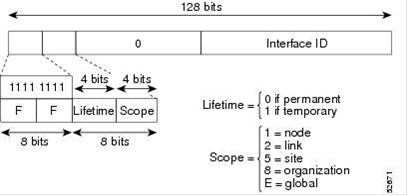
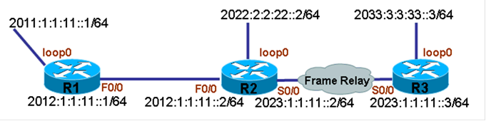

# IPv6组播

IPv6组播

2011年6月27日

17:35

**IPv6组播地址：**

IPv6组播地址的范围是FF00::/8 (1111 1111)。

因为一个正常的IPv6地址包含128位，在IPv6组播地址中，第一段共16位的格式被拆分成三部分：**第一部分共8位**，全部为1，即使用FF来表示。**第二部分共4位**，表示组播地址的存活期，如果为0表示永久，如果为1表示临时。**第三部分共4位**，表示组播地址的范围，分为node, link, site, organization,global分别表示为1, 2, 5, 8,E，除了此五种以外，0和F为保留范围，而其它全部称为未分配，建议使用未分配的地址范围。组播地址的表示格式如下图：

在IPv6中没有广播地址，只有组播，所以使用组播代替广播。

无论是路由器还是主机，所有IPv6接口默认加入FF02::1 ，

而所有路由器的IPv6接口默认加入FF02::2。

**MLD （Multicast Listener Discovery）**

在IPv6组播中，MLD协议与IPv4组播中的IGMP协议功能相同，是用于发现接收者的协议。

路由器发送MLD查询消息来确认接收者，而主机发送MLD报告来加入一个组，主机可以在同一时间属于多个组。

MLD共有两个版本，ver1和ver2，

MLD ver 1是基于IPv4 IGMP v2

MLD ver 2是基于IPv4 IGMP v3

IOS同时使用两个。

**PIM**

> IPv6 PIM的功能同IPv4 PIM，而IPv6 PIM只使用SM（稀疏）模式，所以网络中必须存在RP，而RP的位置可以通过静态配置和BSR通告两种方法确认。
> 

在配置IPv6 PIM时，当开启IPv6组播功能后，所有正常启用IPv6功能的接口自动开启IPv6 PIM，所以IPv6 PIM无须手工配置；并且须明白DR在组播中的作用，详细内容请参见IPv4组播部分。

**配置IPv6组播**

**1.初始配置**

**（1）R1初始配置：**

r1(config)#ipv6 unicast-routing

r1(config)#ipv6 router ospf 10

r1(config-rtr)#router-id 1.1.1.1

r1(config)#int f0/0

r1(config-if)#ipv6 address 2012:1:1:11::1/64

r1(config-if)#ipv6 ospf 10 area 0

r1(config)#int loopback 0

r1(config-if)#ipv6 address 2011:1:1:11::1/64

r1(config-if)#ipv6 ospf network point-to-point

r1(config-if)#ipv6 ospf 10 area 0

**（2）R2初始配置：**

r2(config)#ipv6 unicast-routing

r2(config)#ipv6 router ospf 10

r2(config-rtr)#router-id 2.2.2.2

r2(config)#interface f0/0

r2(config-if)#ipv6 address 2012:1:1:11::2/64

r2(config-if)#ipv6 ospf 10 area 0

r2(config)#int loopback 0

r2(config-if)#ipv6 address 2022:2:2:22::2/64

r2(config-if)#ipv6 ospf network point-to-point

r2(config-if)#ipv6 ospf 10 area 0

r2(config)#int s0/0

r2(config-if)#encapsulation frame-relay

r2(config-if)#no frame-relay inverse-arp

r2(config-if)#no arp frame-relay

r2(config-if)#ipv6 address 2023:1:1:11::2/64

r2(config-if)#frame-relay map ipv6 2023:1:1:11::3 203 broadcast

r2(config-if)#frame-relay map ipv6 FE80::213:1AFF:FE2F:380 203 broadcast

r2(config-if)#ipv6 ospf network point-to-point

r2(config-if)#ipv6 ospf 10 area 0

**（3）R3初始配置：**

r3(config)#ipv6 unicast-routing

r3(config)#ipv6 router ospf 10

r3(config-rtr)#router-id 3.3.3.3

r3(config)#interface loopback 0

r3(config-if)#ipv6 address 2033:3:3:33::3/64

r3(config-if)#ipv6 ospf network point-to-point

r3(config-if)#ipv6 ospf 10 area 0

r3(config)#int s0/0

r3(config-if)#encapsulation frame-relay

r3(config-if)#no frame-relay inverse-arp

r3(config-if)#no arp frame-relay

r3(config-if)#ipv6 address 2023:1:1:11::3/64

r3(config-if)#frame-relay map ipv6 2023:1:1:11::2 302 broadcast

r3(config-if)#frame-relay map ipv6 FE80::213:1AFF:FE2F:1200 302 broadcast

r3(config-if)#ipv6 ospf network point-to-point

r3(config-if)#ipv6 ospf 10 area 0

**2.开启IPv6组播**

**（1）在R1上开启IPv6组播**

r1(config)#ipv6 multicast-routing

**（2）在R2上开启IPv6组播**

r2(config)#ipv6 multicast-routing

**（3）在R3上开启IPv6组播**

r3(config)#ipv6 multicast-routing

**3.配置IPv6 PIM**

**说明：**在配置IPv6 PIM时，当开启IPv6组播功能后，所有正常启用IPv6功能的接口自动开启IPv6 PIM，所以IPv6 PIM无须手工配置。

**（1）查看R1上的PIM状态**

r1#show ipv6 pim neighbor

Neighbor Address           Interface          Uptime    Expires DR pri Bidir

FE80::213:1AFF:FE2F:1200   FastEthernet0/0    00:00:43  00:01:31 1 (DR) B

r1#

**说明：**由于IPv6单播和IPv6组播已正常开启，所以IPv6 PIM邻居也已经正常建立。

**（2）查看R2上的PIM状态**

r2#show ipv6 pim neighbor

Neighbor Address           Interface          Uptime    Expires DR pri Bidir

FE80::212:D9FF:FEF9:C8A0   FastEthernet0/0    00:00:56  00:01:18 1      B

FE80::213:1AFF:FE2F:380    Serial0/0          00:00:55  00:01:28 10 (DR) B

r2#

**说明：**由于IPv6单播和IPv6组播已正常开启，所以IPv6 PIM邻居也已经正常建立。

**（3）查看R3上的PIM状态**

r3#show ipv6 pim neighbor

Neighbor Address           Interface          Uptime    Expires DR pri Bidir

FE80::213:1AFF:FE2F:1200   Serial0/0          00:01:09  00:01:37 1      B

r3#

**说明：**由于IPv6单播和IPv6组播已正常开启，所以IPv6 PIM邻居也已经正常建立。

**4.配置MLD**

**说明：**因为MLD的功能同IGMP，所以配置的目的为加入某个组。

**（1）在R1上配置加入组ff04::1**

**说明：**建议使用未分配的组播地址范围。

r1(config)#interface loopback 0

r1(config-if)#ipv6 mld join-group ff04::1

**5.配置静态RP**

**说明：**静态配置所有设备的RP为R1的loopback 0

**（1）在R1上配置静态RP**

r1(config)#ipv6 pim rp-address 2011:1:1:11::1

**（2）在R2上配置静态RP**

r2(config)#ipv6 pim rp-address 2011:1:1:11::1

**（3）在R3上配置静态RP**

r3(config)#ipv6 pim rp-address 2011:1:1:11::1

**6.查看结果**

**（1）查看R1上的RP情况**

r1#show ipv6 pim group-map ff04::

FF00::/8*

SM, RP: 2011:1:1:11::1

RPF: Tu2,2011:1:1:11::1 (us)

Info source: Static

Uptime: 00:01:15, Groups: 1

r1#

**说明：**由于已手工配置RP，所以RP正常。

**（2）查看R2上的RP情况**

r2#show ipv6 pim group-map ff04::

FF00::/8*

SM, RP: 2011:1:1:11::1

RPF: Fa0/0,FE80::212:D9FF:FEF9:C8A0

Info source: Static

Uptime: 00:01:40, Groups: 0

r2#

**说明：**由于已手工配置RP，所以RP正常。

**（3）查看R3上的RP情况**

r3#show ipv6 pim group-map ff04::

FF00::/8*

SM, RP: 2011:1:1:11::1

RPF: Se0/0,FE80::213:1AFF:FE2F:1200

Info source: Static

Uptime: 00:01:41, Groups: 0

r3

**说明：**由于已手工配置RP，所以RP正常。

**7.测试组播通信情况**

**（1）测试R1的组播通信情况**

r1#ping ff04::1

Output Interface: Loopback0

Type escape sequence to abort.

Sending 5, 100-byte ICMP Echos to FF04::1, timeout is 2 seconds:

Packet sent with a source address of 2011:1:1:11::1

Reply to request 0 received from 2011:1:1:11::1, 16 ms

Reply to request 1 received from 2011:1:1:11::1, 0 ms

Reply to request 2 received from 2011:1:1:11::1, 0 ms

Reply to request 3 received from 2011:1:1:11::1, 0 ms

Reply to request 4 received from 2011:1:1:11::1, 0 ms

Success rate is 100 percent (5/5), round-trip min/avg/max = 0/3/16 ms

5 multicast replies and 0 errors.

r1#

**说明：**在测试组播时，出口必须全部写出。从结果中可以看出，由于PIM已成功建立，RP已正确学到，所以组播通信正常。

**（2）测试R2的组播通信情况**

r2#ping ff04::1

Output Interface: FastEthernet0/0

Type escape sequence to abort.

Sending 5, 100-byte ICMP Echos to FF04::1, timeout is 2 seconds:

Packet sent with a source address of 2012:1:1:11::2

Reply to request 0 received from 2011:1:1:11::1, 4 ms

Reply to request 1 received from 2011:1:1:11::1, 0 ms

Reply to request 2 received from 2011:1:1:11::1, 0 ms

Reply to request 3 received from 2011:1:1:11::1, 0 ms

Reply to request 4 received from 2011:1:1:11::1, 0 ms

Success rate is 100 percent (5/5), round-trip min/avg/max = 0/0/4 ms

5 multicast replies and 0 errors.

r2#

**说明：**从结果中可以看出，由于PIM已成功建立，RP已正确学到，所以组播通信正常。

**（3）测试R3的组播通信情况**

r3#ping ff04::1

Output Interface: Serial0/0

Type escape sequence to abort.

Sending 5, 100-byte ICMP Echos to FF04::1, timeout is 2 seconds:

Packet sent with a source address of 2023:1:1:11::3

Request 0 timed out

Request 1 timed out

Request 2 timed out

Request 3 timed out

Request 4 timed out

Success rate is 0 percent (0/5)

0 multicast replies and 0 errors.

r3#

**说明：**R3的组播无法ping通，由于PIM的DR选举问题。原因请参见IPv4组播部分。

**8.解决组播通信问题**

**说明：**由于R3与R2之间为多路访问，DR位置错误，所以组播无法通信，切换DR位置以解决组播通信问题。

**（1）改R2为网络中的DR**

r2(config)#interface s0/0

r2(config-if)#ipv6 pim dr-priority 100

**（2）查看当前网络中DR情况**

r3#show ipv6 pim neighbor

Neighbor Address           Interface          Uptime    Expires DR pri Bidir

FE80::213:1AFF:FE2F:1200   Serial0/0          00:10:02  00:01:24 100 (DR) B

r3#

**说明：**DR已成功变为R2。

**（3）测试R3的组播通信情况**

r3#ping ff04::1

Output Interface: Serial0/0

Type escape sequence to abort.

Sending 5, 100-byte ICMP Echos to FF04::1, timeout is 2 seconds:

Packet sent with a source address of 2023:1:1:11::3

Reply to request 0 received from 2011:1:1:11::1, 68 ms

Reply to request 0 received from 2011:1:1:11::1, 80 ms

Reply to request 1 received from 2011:1:1:11::1, 64 ms

Reply to request 1 received from 2011:1:1:11::1, 76 ms

Reply to request 2 received from 2011:1:1:11::1, 65 ms

Reply to request 2 received from 2011:1:1:11::1, 77 ms

Reply to request 3 received from 2011:1:1:11::1, 68 ms

Reply to request 3 received from 2011:1:1:11::1, 80 ms

Reply to request 4 received from 2011:1:1:11::1, 124 ms

Reply to request 4 received from 2011:1:1:11::1, 168 ms

Success rate is 100 percent (5/5), round-trip min/avg/max = 64/87/168 ms

10 multicast replies and 0 errors.

r3#

**说明：**修改DR后，R3的组播通信正常。

**配置BSR**

**说明：**前面通过手工静态配置RP来使组播正常通信，下面通过配置BSR来自动选举RP。

配置R1的loopback0为C-BSR和C-RP。

**1.配置C-BSR**

**（1）配置R1的loopback0为C-BSR**

r1(config)#ipv6 pim bsr candidate bsr 2011:1:1:11::1

**2.配置C-RP**

**（1）配置R1的loopback0为C-RP**

r1(config)#ipv6 pim bsr candidate rp 2011:1:1:11::1

**3.查看结果**

**（1）查看R1上的RP情况**

r1#show ipv6 pim group-map ff04::

FF00::/8*

SM, RP: 2011:1:1:11::1

RPF: Tu2,2011:1:1:11::1 (us)

Info source: BSR From: 2011:1:1:11::1(00:01:31), Priority: 192

Uptime: 00:00:58, Groups: 1

r1#

**说明：**由于BSR配置正确，所以RP正常。

**（2）查看R2上的RP情况**

r2#show ipv6 pim group-map ff04::

FF00::/8*

SM, RP: 2011:1:1:11::1

RPF: Fa0/0,FE80::212:D9FF:FEF9:C8A0

Info source: BSR From: 2011:1:1:11::1(00:02:20), Priority: 192

Uptime: 00:01:09, Groups: 1

r2#

**说明：**由于BSR配置正确，所以RP正常。

**（3）查看R3上的RP情况**

r3#show ipv6 pim group-map ff04::

FF00::/8*

SM, RP: 2011:1:1:11::1

RPF: Se0/0,FE80::213:1AFF:FE2F:1200

Info source: BSR From: 2011:1:1:11::1(00:02:09), Priority: 192

Uptime: 00:01:20, Groups: 0

r3#

**说明：**由于BSR配置正确，所以RP正常。

**4.测试组播通信情况**

**（1）测试R1的组播通信情况**

r1#ping ff04::1

Output Interface: Loopback0

Type escape sequence to abort.

Sending 5, 100-byte ICMP Echos to FF04::1, timeout is 2 seconds:

Packet sent with a source address of 2011:1:1:11::1

Reply to request 0 received from 2011:1:1:11::1, 8 ms

Reply to request 1 received from 2011:1:1:11::1, 0 ms

Reply to request 2 received from 2011:1:1:11::1, 0 ms

Reply to request 3 received from 2011:1:1:11::1, 0 ms

Reply to request 4 received from 2011:1:1:11::1, 0 ms

Success rate is 100 percent (5/5), round-trip min/avg/max = 0/1/8 ms

5 multicast replies and 0 errors.

r1#

**说明：** RP已正确学到，所以组播通信正常。

**（2）测试R2的组播通信情况**

r2#ping ff04::1

Output Interface: FastEthernet0/0

Type escape sequence to abort.

Sending 5, 100-byte ICMP Echos to FF04::1, timeout is 2 seconds:

Packet sent with a source address of 2012:1:1:11::2

Reply to request 0 received from 2011:1:1:11::1, 12 ms

Reply to request 1 received from 2011:1:1:11::1, 0 ms

Reply to request 2 received from 2011:1:1:11::1, 8 ms

Reply to request 3 received from 2011:1:1:11::1, 0 ms

Reply to request 4 received from 2011:1:1:11::1, 0 ms

Success rate is 100 percent (5/5), round-trip min/avg/max = 0/4/12 ms

5 multicast replies and 0 errors.

r2#

**说明：** RP已正确学到，所以组播通信正常。

**（3）测试R3的组播通信情况**

r3#ping ff04::1

Output Interface: Serial0/0

Type escape sequence to abort.

Sending 5, 100-byte ICMP Echos to FF04::1, timeout is 2 seconds:

Packet sent with a source address of 2023:1:1:11::3

Reply to request 0 received from 2011:1:1:11::1, 120 ms

Reply to request 0 received from 2011:1:1:11::1, 132 ms

Reply to request 1 received from 2011:1:1:11::1, 100 ms

Reply to request 1 received from 2011:1:1:11::1, 116 ms

Reply to request 1 received from 2011:1:1:11::1, 128 ms

Reply to request 2 received from 2011:1:1:11::1, 100 ms

Reply to request 2 received from 2011:1:1:11::1, 116 ms

Reply to request 3 received from 2011:1:1:11::1, 100 ms

Reply to request 3 received from 2011:1:1:11::1, 116 ms

Reply to request 4 received from 2011:1:1:11::1, 101 ms

Reply to request 4 received from 2011:1:1:11::1, 117 ms

Success rate is 100 percent (5/5), round-trip min/avg/max = 100/113/132 ms

11 multicast replies and 0 errors.

r3#

**说明：** RP已正确学到，所以组播通信正常。